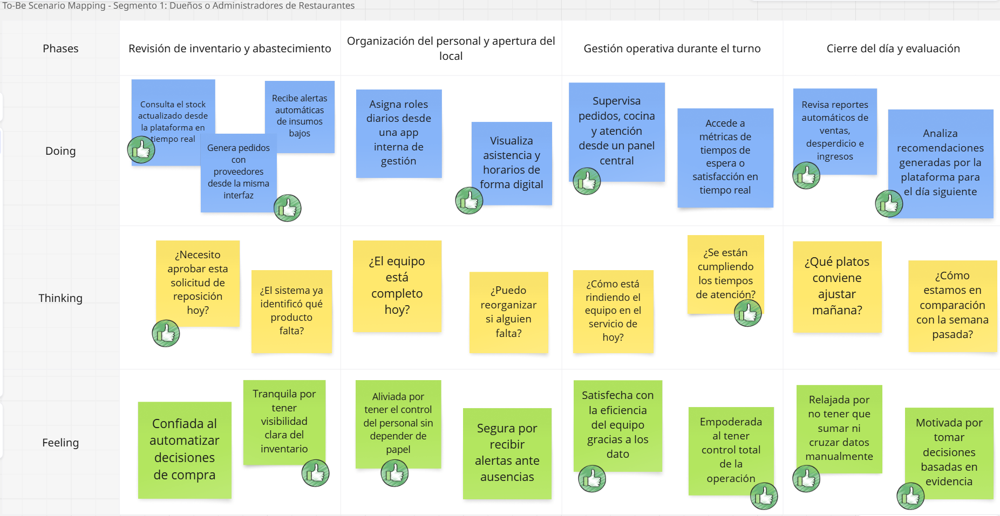
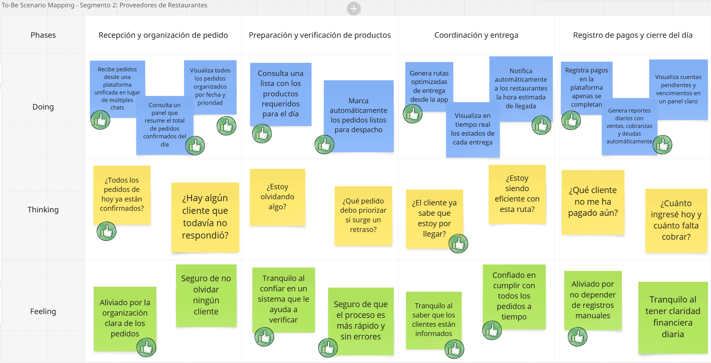
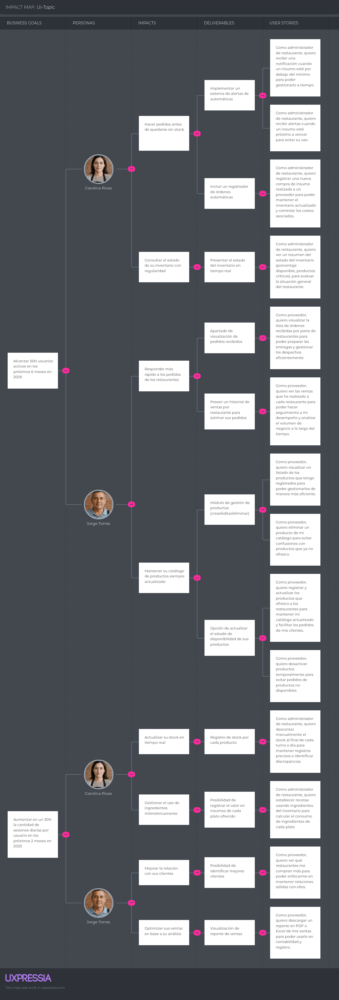

# Capítulo III: Requirements Specification

## 3.1. To-Be Scenario Mapping.

**Segmento Objetivo 1:** Dueños o Administradores de Restaurantes

Este escenario To-Be fue construido tras una revisión detallada del escenario As-Is de Carolina Rivas y de las oportunidades de mejora identificadas a partir de las entrevistas. Se definieron las fases del proceso y se contrastaron con las actuales. Se priorizaron mejoras en eficiencia, control, automatización y reducción de frustraciones operativas.

**Segmento objetivo 2:** Proveedores de Restaurantes

Este escenario To-Be fue construido a partir del análisis del escenario As-Is de Jorge Torres. se incorporaron mejoras basadas en las necesidades y frustraciones. El equipo propuso una experiencia futura donde Jorge cuenta con una plataforma digital para gestionar pedidos, organizar rutas, registrar pagos y comunicarse con los restaurantes

## 3.2. User Stories

Para el presente proyecto, se definieron historias de usuario a partir de las epics principales identificadas durante la fase de análisis. Estas historias permiten describir, de forma concreta y centrada en el usuario, las funcionalidades clave del sistema, sirviendo como base para su diseño, desarrollo y validación.

<table border="1" cellpadding="8" cellspacing="0" width="100%" style="margin-bottom:18px;">
  <thead>
    <tr>
      <th>Epic ID</th>
      <th>User</th>
      <th>Priority</th>
      <th>Epic</th>
    </tr>
    <tr>
      <td>EP-01</td>
      <td>Visitante</td>
      <td>High</td>
      <td>EP-01</td>
    </tr>
  </thead>
  <tbody>
    <tr>
      <td><strong>Title</strong></td>
      <td colspan="3">Comunicación de Valor y Conversión en la Página de Inicio</td>
    </tr>
    <tr>
      <td colspan="4" align="left"><strong>Description</strong> 
      Como visitante, quiero entender claramente el valor de la plataforma y ser guiado mediante acciones concretas, para sentirme motivado a registrarme o descargar la aplicación.</td>
    </tr>
  </tbody>
</table>

<table border="1" cellpadding="8" cellspacing="0" width="100%" style="margin-bottom:18px;">
  <thead>
    <tr>
      <th>Epic ID</th>
      <th>User</th>
      <th>Priority</th>
      <th>Epic</th>
    </tr>
    <tr>
      <td>EP-02</td>
      <td>Visitante (todos los segmentos)</td>
      <td>High</td>
      <td>EP-02</td>
    </tr>
  </thead>
  <tbody>
    <tr>
      <td><strong>Title</strong></td>
      <td colspan="3">Accesibilidad de la plataforma</td>
    </tr>
    <tr>
      <td colspan="4" align="left"><strong>Description</strong> 
      Como visitante con cualquier tipo de dispositivo o capacidad, quiero que la página de inicio sea clara, rápida y accesible, para navegar sin dificultades y tener una buena primera impresión de la plataforma.</td>
    </tr>
  </tbody>
</table>

<table border="1" cellpadding="8" cellspacing="0" width="100%" style="margin-bottom:18px;">
  <thead>
    <tr>
      <th>Epic ID</th>
      <th>User</th>
      <th>Priority</th>
      <th>Epic</th>
    </tr>
    <tr>
      <td>EP-03</td>
      <td>Visitante / Usuario</td>
      <td>High</td>
      <td>EP-03</td>
    </tr>
  </thead>
  <tbody>
    <tr>
      <td><strong>Title</strong></td>
      <td colspan="3">Gestión de autenticación y acceso de usuarios</td>
    </tr>
    <tr>
      <td colspan="4" align="left"><strong>Description</strong> 
      Como usuario de la plataforma, quiero poder registrarme, iniciar sesión y recuperar mi contraseña, para acceder a mis funcionalidades de forma segura y sin inconvenientes, incluso si olvido mis credenciales.</td>
    </tr>
  </tbody>
</table>

<table border="1" cellpadding="8" cellspacing="0" width="100%" style="margin-bottom:18px;">
  <thead>
    <tr>
      <th>Epic ID</th>
      <th>User</th>
      <th>Priority</th>
      <th>Epic</th>
    </tr>
    <tr>
      <td>EP-04</td>
      <td>Usuario</td>
      <td>Medium</td>
      <td>EP-04</td>
    </tr>
  </thead>
  <tbody>
    <tr>
      <td><strong>Title</strong></td>
      <td colspan="3">Gestión de Suscripción y Acceso al Dashboard</td>
    </tr>
    <tr>
      <td colspan="4" align="left"><strong>Description</strong> 
      Como usuario, quiero gestionar mi suscripción desde el dashboard, para poder renovar, ver el estado de mi plan y saber cuándo expira.</td>
    </tr>
  </tbody>
</table>

<table border="1" cellpadding="8" cellspacing="0" width="100%" style="margin-bottom:18px;">
  <thead>
    <tr>
      <th>Epic ID</th>
      <th>User</th>
      <th>Priority</th>
      <th>Epic</th>
    </tr>
    <tr>
      <td>EP-05</td>
      <td>Usuario</td>
      <td>Medium</td>
      <td>EP-05</td>
    </tr>
  </thead>
  <tbody>
    <tr>
      <td><strong>Title</strong></td>
      <td colspan="3">Gestión de perfil</td>
    </tr>
    <tr>
      <td colspan="4" align="left"><strong>Description</strong> 
      Como usuario, quiero poder visualizar y actualizar mi información personal o comercial, para mantener mis datos actualizados, generar confianza y facilitar la comunicación dentro de la plataforma.</td>
    </tr>
  </tbody>
</table>

<table border="1" cellpadding="8" cellspacing="0" width="100%" style="margin-bottom:18px;">
  <thead>
    <tr>
      <th>Epic ID</th>
      <th>User</th>
      <th>Priority</th>
      <th>Epic</th>
    </tr>
    <tr>
      <td>EP-06</td>
      <td>Usuario (admin restaurante / proveedor)</td>
      <td>High</td>
      <td>EP-06</td>
    </tr>
  </thead>
  <tbody>
    <tr>
      <td><strong>Title</strong></td>
      <td colspan="3">Gestión de Stock de Inventario</td>
    </tr>
    <tr>
      <td colspan="4" align="left"><strong>Description</strong> 
      Como usuario, quiero gestionar los niveles de inventario de todos los insumos, para asegurar la continuidad operativa, reducir el desperdicio y mantener el control del stock en todo momento.</td>
    </tr>
  </tbody>
</table>

<table border="1" cellpadding="8" cellspacing="0" width="100%" style="margin-bottom:18px;">
  <thead>
    <tr>
      <th>Epic ID</th>
      <th>User</th>
      <th>Priority</th>
      <th>Epic</th>
    </tr>
    <tr>
      <td>EP-07</td>
      <td>Administrador de restaurante</td>
      <td>High</td>
      <td>EP-07</td>
    </tr>
  </thead>
  <tbody>
    <tr>
      <td><strong>Title</strong></td>
      <td colspan="3">Gestión de Compras de Insumos</td>
    </tr>
    <tr>
      <td colspan="4" align="left"><strong>Description</strong> 
      Como administrador de restaurante, quiero registrar y consultar las compras de insumos realizadas, para tener control del abastecimiento, reducir pérdidas y mantener actualizado el inventario.</td>
    </tr>
  </tbody>
</table>

<table border="1" cellpadding="8" cellspacing="0" width="100%" style="margin-bottom:18px;">
  <thead>
    <tr>
      <th>Epic ID</th>
      <th>User</th>
      <th>Priority</th>
      <th>Epic</th>
    </tr>
    <tr>
      <td>EP-08</td>
      <td>Administrador de restaurante</td>
      <td>Medium</td>
      <td>EP-08</td>
    </tr>
  </thead>
  <tbody>
    <tr>
      <td><strong>Title</strong></td>
      <td colspan="3">Gestión de recetas para pedidos</td>
    </tr>
    <tr>
      <td colspan="4" align="left"><strong>Description</strong> 
      Como administrador de restaurante, quiero gestionar recetas vinculadas a insumos del inventario, para controlar mejor el consumo y tener trazabilidad en la preparación de platos.</td>
    </tr>
  </tbody>
</table>

<table border="1" cellpadding="8" cellspacing="0" width="100%" style="margin-bottom:18px;">
  <thead>
    <tr>
      <th>Epic ID</th>
      <th>User</th>
      <th>Priority</th>
      <th>Epic</th>
    </tr>
    <tr>
      <td>EP-09</td>
      <td>Administrador de restaurante</td>
      <td>Medium</td>
      <td>EP-09</td>
    </tr>
  </thead>
  <tbody>
    <tr>
      <td><strong>Title</strong></td>
      <td colspan="3">Panel de control y estadísticas</td>
    </tr>
    <tr>
      <td colspan="4" align="left"><strong>Description</strong> 
      Como administrador del restaurante, quiero visualizar un panel con métricas clave, para tomar decisiones estratégicas.</td>
    </tr>
  </tbody>
</table>

<table border="1" cellpadding="8" cellspacing="0" width="100%" style="margin-bottom:18px;">
  <thead>
    <tr>
      <th>Epic ID</th>
      <th>User</th>
      <th>Priority</th>
      <th>Epic</th>
    </tr>
    <tr>
      <td>EP-10</td>
      <td>Administrador de restaurante</td>
      <td>Medium</td>
      <td>EP-10</td>
    </tr>
  </thead>
  <tbody>
    <tr>
      <td><strong>Title</strong></td>
      <td colspan="3">Notificaciones inteligentes</td>
    </tr>
    <tr>
      <td colspan="4" align="left"><strong>Description</strong> 
      Como administrador de restaurante, quiero recibir notificaciones automáticas sobre el estado del inventario y eventos importantes, para tomar decisiones oportunas que eviten la escasez de insumos o el exceso de stock.</td>
    </tr>
  </tbody>
</table>

<table border="1" cellpadding="8" cellspacing="0" width="100%" style="margin-bottom:18px;">
  <thead>
    <tr>
      <th>Epic ID</th>
      <th>User</th>
      <th>Priority</th>
      <th>Epic</th>
    </tr>
    <tr>
      <td>EP-11</td>
      <td>Administrador de restaurante / Proveedor</td>
      <td>Medium</td>
      <td>EP-11</td>
    </tr>
  </thead>
  <tbody>
    <tr>
      <td><strong>Title</strong></td>
      <td colspan="3">Seguimiento de entregas</td>
    </tr>
    <tr>
      <td colspan="4" align="left"><strong>Description</strong> 
      Como administrador de restaurante, quiero consultar el estado actual de mis pedidos, para tener visibilidad en tiempo real del progreso de cada entrega y planificar mejor mi operación interna. Y como proveedor, quiero actualizar el estado de las órdenes, para mantener informados a los restaurantes y organizar mis despachos de forma eficiente.</td>
    </tr>
  </tbody>
</table>

<table border="1" cellpadding="8" cellspacing="0" width="100%" style="margin-bottom:18px;">
  <thead>
    <tr>
      <th>Epic ID</th>
      <th>User</th>
      <th>Priority</th>
      <th>Epic</th>
    </tr>
    <tr>
      <td>EP-12</td>
      <td>Administrador de restaurante</td>
      <td>Low</td>
      <td>EP-12</td>
    </tr>
  </thead>
  <tbody>
    <tr>
      <td><strong>Title</strong></td>
      <td colspan="3">Calificaciones y feedback a proveedores</td>
    </tr>
    <tr>
      <td colspan="4" align="left"><strong>Description</strong> 
      Como administrador de restaurante, quiero calificar y dejar comentarios sobre los proveedores con los que trabajo, para compartir mi experiencia, ayudar a otros restaurantes a tomar decisiones informadas y brindar retroalimentación útil a los proveedores.</td>
    </tr>
  </tbody>
</table>

<table border="1" cellpadding="8" cellspacing="0" width="100%" style="margin-bottom:18px;">
  <thead>
    <tr>
      <th>Epic ID</th>
      <th>User</th>
      <th>Priority</th>
      <th>Epic</th>
    </tr>
    <tr>
      <td>EP-13</td>
      <td>Proveedor</td>
      <td>Medium</td>
      <td>EP-13</td>
    </tr>
  </thead>
  <tbody>
    <tr>
      <td><strong>Title</strong></td>
      <td colspan="3">Gestión de Productos Ofrecidos</td>
    </tr>
    <tr>
      <td colspan="4" align="left"><strong>Description</strong> 
      Como proveedor, quiero registrar, editar y eliminar los productos que ofrezco a los restaurantes, para asegurar que mi catálogo esté siempre actualizado y facilitar la gestión de pedidos.</td>
    </tr>
  </tbody>
</table>

<table border="1" cellpadding="8" cellspacing="0" width="100%" style="margin-bottom:18px;">
  <thead>
    <tr>
      <th>Epic ID</th>
      <th>User</th>
      <th>Priority</th>
      <th>Epic</th>
    </tr>
    <tr>
      <td>EP-14</td>
      <td>Proveedor</td>
      <td>Medium</td>
      <td>EP-14</td>
    </tr>
  </thead>
  <tbody>
    <tr>
      <td><strong>Title</strong></td>
      <td colspan="3">Recepción y Gestión de Órdenes</td>
    </tr>
    <tr>
      <td colspan="4" align="left"><strong>Description</strong> 
      Como proveedor, quiero recibir, visualizar y actualizar el estado de las órdenes realizadas por restaurantes, para organizar mis entregas, garantizar puntualidad y mantener una buena comunicación con mis clientes.</td>
    </tr>
  </tbody>
</table>

<table border="1" cellpadding="8" cellspacing="0" width="100%" style="margin-bottom:18px;">
  <thead>
    <tr>
      <th>Epic ID</th>
      <th>User</th>
      <th>Priority</th>
      <th>Epic</th>
    </tr>
    <tr>
      <td>EP-15</td>
      <td>Proveedor</td>
      <td>Low</td>
      <td>EP-15</td>
    </tr>
  </thead>
  <tbody>
    <tr>
      <td><strong>Title</strong></td>
      <td colspan="3">Historial de Ventas, para Proveedores</td>
    </tr>
    <tr>
      <td colspan="4" align="left"><strong>Description</strong> 
      Como proveedor, quiero acceder a un historial detallado de mis ventas a cada restaurante, para poder descargar reportes e identificar a mis mejores clientes.</td>
    </tr>
  </tbody>
</table>

<table border="1" cellpadding="8" cellspacing="0" width="100%" style="margin-bottom:18px;">
  <thead>
    <tr>
      <th>Epic ID</th>
      <th>User</th>
      <th>Priority</th>
      <th>Epic</th>
    </tr>
    <tr>
      <td>EP-16</td>
      <td>Administrador de restaurante</td>
      <td>Medium</td>
      <td>EP-16</td>
    </tr>
  </thead>
  <tbody>
    <tr>
      <td><strong>Title</strong></td>
      <td colspan="3">Gestión de Proveedores</td>
    </tr>
    <tr>
      <td colspan="4" align="left"><strong>Description</strong> 
      Como administrador de restaurante, quiero poder agregar, editar, visualizar y eliminar proveedores desde la plataforma, para tener un control eficiente de quiénes suministran los insumos y facilitar la comunicación.</td>
    </tr>
  </tbody>
</table>

<table border="1" cellpadding="8" cellspacing="0" width="100%" style="margin-bottom:18px;"> <thead> <tr> <th>Story ID</th> <th>User</th> <th>Priority</th> <th>Epic</th> </tr> <tr> <td>US-01</td> <td>Visitante o usuario</td> <td>High</td> <td>EP-03</td> </tr> </thead> <tbody> <tr> <td><strong>Title</strong></td> <td colspan="3">Acceso a la plataforma</td> </tr> <tr> <td colspan="4" align="left"><strong>Description</strong>  Como visitante o usuario, quiero tener la posibilidad de registrarme si no tengo una cuenta o iniciar sesión si ya la tengo, para poder acceder a los servicios de la plataforma.</td> </tr> <tr> <td colspan="4" align="left"><strong>Acceptance Criteria</strong> <ul> <li><strong>Escenario 1: Registro de nuevo usuario</strong>   Dado que el visitante no posee una cuenta registrada,   cuando solicita iniciar el registro como nuevo usuario,   entonces el sistema debe permitir el ingreso de datos personales requeridos   y registrar al visitante como nuevo usuario de la plataforma</li> <li><strong>Escenario 2: Inicio de sesión de usuario existente</strong>   Dado que el usuario ya cuenta con una cuenta registrada,   cuando proporciona sus credenciales para iniciar sesión,   entonces el sistema debe validarlas   y permitir el acceso a la plataforma.</li> </ul> </td> </tr> </tbody> </table>

<table border="1" cellpadding="8" cellspacing="0" width="100%" style="margin-bottom:18px;"> <thead> <tr> <th>Story ID</th> <th>User</th> <th>Priority</th> <th>Epic</th> </tr> <tr> <td>US-02</td> <td>Visitante</td> <td>Low</td> <td>EP-01</td> </tr> </thead> <tbody> <tr> <td><strong>Title</strong></td> <td colspan="3">Inclusión de videos explicativos en el sitio web</td> </tr> <tr> <td colspan="4" align="left"><strong>Description</strong>  Como visitante, quiero visualizar videos sobre el equipo de Restock y sobre el funcionamiento del producto para conocer quiénes están detrás del proyecto y entender mejor cómo funciona antes de usarlo.</td> </tr> <tr> <td colspan="4" align="left"><strong>Acceptance Criteria</strong> <ul> <li><strong>Escenario 1: Visualización del video sobre el equipo.</strong> Dado que el visitante ha interactuado hasta la sección “Sobre nosotros”  cuando llega al final de dicha sección  entonces debe visualizarse un video incrustado con una breve presentación del equipo  y este debe estar embebido, ser responsivo y reproducible desde diferentes dispositivos.</li> <li><strong>Escenario 2: Visualización del video sobre el producto.</strong>  Dado que el visitante ha interactuado hasta la sección “Tutorial”  cuando llega al final de dicha sección  entonces debe visualizar un video incrustado que explique brevemente cómo funciona la plataforma  y este debe mostrarse con diseño limpio, accesibilidad adecuada y compatibilidad móvil y de escritorio.</li> </ul> </td> </tr> </tbody> </table>

<table border="1" cellpadding="8" cellspacing="0" width="100%" style="margin-bottom:18px;"> <thead> <tr> <th>Story ID</th> <th>User</th> <th>Priority</th> <th>Epic</th> </tr> <tr> <td>US-03</td> <td>Usuario</td> <td>Medium</td> <td>EP-04</td> </tr> </thead> <tbody> <tr> <td><strong>Title</strong></td> <td colspan="3">Soporte de acceso según estado de suscripción</td> </tr> <tr> <td colspan="4" align="left"><strong>Description</strong>  Como usuario, quiero poder usar todas las funcionalidades del sistema solo mientras mi suscripción esté activa, para tener control sobre mi acceso y asegurarme de que no se me cobre ni se me brinde el servicio si ya no quiero continuar con el plan.</td> </tr> <tr> <td colspan="4" align="left"><strong>Acceptance Criteria</strong> <ul> <li><strong>Escenario 1: Acceso completo con suscripción activa</strong>   Dado que el usuario posee una suscripción vigente,  cuando inicia sesión en la plataforma,   entonces el sistema permite el uso completo de las funcionalidades habilitadas por su plan</li> <li><strong>Escenario 2: Acceso restringido con suscripción inactiva</strong>   Dado que el usuario tiene una suscripción vencida o inactiva,  cuando intenta acceder a funcionalidades del sistema,  entonces el sistema restringe su acceso, muestra un mensaje que informa sobre el estado de la suscripción   y ofrece la opción de renovar o actualizar su plan.</li> <li><strong>Escenario 3: Restauración del acceso tras renovación.</strong>   Dado que el usuario ha renovado su suscripción de forma exitosa,   cuando vuelve a ingresar al sistema,  entonces el sistema actualiza su estado  y permite nuevamente el uso de todas las funcionalidades correspondientes a su plan.</li> </ul> </td> </tr> </tbody> </table>

<table border="1" cellpadding="8" cellspacing="0" width="100%" style="margin-bottom:18px;"> <thead> <tr> <th>Story ID</th> <th>User</th> <th>Priority</th> <th>Epic</th> </tr> <tr> <td>US-04</td> <td>Administrador de restaurante</td> <td>High</td> <td>EP-06</td> </tr> </thead> <tbody> <tr> <td><strong>Title</strong></td> <td colspan="3">Gestión manual de stock e insumos</td> </tr> <tr> <td colspan="4" align="left"><strong>Description</strong>  Como administrador de restaurante, quiero gestionar manualmente el stock de los insumos en el inventario, para asegurar una gestión precisa de existencias y evitar errores en la disponibilidad de productos.</td> </tr> <tr> <td colspan="4" align="left"><strong>Acceptance Criteria</strong> <ul> <li><strong>Escenario 1: Registro de insumo</strong>  Dado que el administrador de restaurante se encuentra en la sección de inventario,   cuando agrega un insumo al catalogo de insumos y registra el stock mínimo y máximo,   entonces el sistema actualiza el inventario y muestra un mensaje de éxito.</li> <li><strong>Escenario 2: Registro manual de stock</strong>   Dado que el administrador de restaurante está en la sección de inventario,   cuando agrega un insumo del catálogo, registra el stock actual y, si es perecible, la fecha de expiración,   entonces, el sistema actualiza el inventario y muestra un mensaje de éxito</li> <li><strong>Escenario 3: Validación de datos de stock</strong>   Dado que el administrador ingresa datos para el stock,   cuando los datos son negativos o no numéricos,  entonces el sistema muestra un mensaje de error y evita la actualización   </li> </ul> </td> </tr> </tbody> </table>

<table border="1" cellpadding="8" cellspacing="0" width="100%" style="margin-bottom:18px;"> <thead> <tr> <th>Story ID</th> <th>User</th> <th>Priority</th> <th>Epic</th> </tr> <tr> <td>US-05</td> <td>Administrador de restaurante</td> <td>Medium</td> <td>EP-10</td> </tr> </thead> <tbody> <tr> <td><strong>Title</strong></td> <td colspan="3">Gestión integral de notificaciones de inventario</td> </tr> <tr> <td colspan="4" align="left"><strong>Description</strong>  Como administrador de restaurante, quiero recibir notificaciones automáticas por vencimiento próximo, exceso o escasez de stock en los insumos, para tomar decisiones logísticas y oportunas, y evitar pérdidas, desperdicios o quiebres de stock.</td> </tr> <tr> <td colspan="4" align="left"><strong>Acceptance Criteria</strong> <ul> <li><strong>Escenario 1: Notificación del sistema por vencimiento próximo.</strong> Dado que un insumo tiene una fecha de vencimiento registrada  cuando faltan 5 días o menos para su vencimiento  entonces el sistema marca el insumo en la lista de inventario.</li> <li><strong>Escenario 2: Notificación del sistema por exceso de stock.</strong>  Dado que un insumo tiene definido un stock máximo permitido  cuando el stock actual es igual o mayor a ese valor  entonces el sistema resalta el insumo como excedente en el listado de inventario.</li> <li><strong>Escenario 3: Notificación del sistema por bajo stock.</strong>  Dado que un insumo tiene un stock mínimo de referencia  cuando el stock actual es menor o igual al mínimo establecido  entonces el sistema resalta el insumo como escaso en el listado de inventario.</li> </ul> </td> </tr> </tbody> </table>

<table border="1" cellpadding="8" cellspacing="0" width="100%" style="margin-bottom:18px;"> <thead> <tr> <th>Story ID</th> <th>User</th> <th>Priority</th> <th>Epic</th> </tr> <tr> <td>US-06</td> <td>Administrador de restaurante</td> <td>Low</td> <td>EP-12</td> </tr> </thead> <tbody> <tr> <td><strong>Title</strong></td> <td colspan="3">Enviar comentarios y calificaciones sobre pedidos</td> </tr> <tr> <td colspan="4" align="left"><strong>Description</strong>  Como administrador de restaurante, quiero calificar y dejar comentarios sobre los pedidos recibidos de los proveedores, para dar retroalimentación sobre la calidad del servicio y los productos.</td> </tr> <tr> <td colspan="4" align="left"><strong>Acceptance Criteria</strong> <ul> <li><strong>Escenario 1: Registro exitoso de retroalimentación.</strong> Dado que el pedido ha sido entregado,  cuando el administrador de restaurante proporciona una calificación válida y un comentario  entonces el sistema registra la retroalimentación y la asocia al pedido y proveedor correspondiente.</li> <li><strong>Escenario 2: Intento de calificación de pedido no entregado.</strong>  Dado que el pedido aún no ha sido marcado como entregado  cuando el administrador de restaurante intenta registrar una calificación  entonces el sistema rechaza la operación e informa que solo se pueden calificar pedidos entregados.</li> <li><strong>Escenario 3: Datos inválidos en la retroalimentación.</strong>  Dado que el administrador de restaurante proporciona un comentario vacío,  cuando intenta registrar la retroalimentación  entonces el sistema muestra un mensaje de error indicando los datos inválidos.</li> </ul> </td> </tr> </tbody> </table>

<table border="1" cellpadding="8" cellspacing="0" width="100%" style="margin-bottom:18px;"> <thead> <tr> <th>Story ID</th> <th>User</th> <th>Priority</th> <th>Epic</th> </tr> <tr> <td>US-07</td> <td>Proveedor de restaurante</td> <td>High</td> <td>EP-06</td> </tr> </thead> <tbody> <tr> <td><strong>Title</strong></td> <td colspan="3">Gestionar productos en el inventario</td> </tr> <tr> <td colspan="4" align="left"><strong>Description</strong>  Como proveedor, quiero gestionar la información de los productos que ofrezco a los restaurantes, para mantener mi catálogo de productos actualizado y facilitar los pedidos de mis clientes.</td> </tr> <tr> <td colspan="4" align="left"><strong>Acceptance Criteria</strong> <ul> <li><strong>Escenario 1: Visualizar listado de productos</strong> Dado que el proveedor ha iniciado sesión  cuando accede a la sección de inventario,  entonces el sistema muestra todos los productos que tiene registrados y que están actualmente ofrecidos.</li> <li><strong>Escenario 2: Registrar un nuevo producto.</strong>  Dado que el proveedor selecciona un insumo, proporciona descripción y proporciona precio unitario del producto,  cuando confirma el registro del nuevo producto,  entonces el sistema agrega el producto en el inventario.</li> <li><strong>Escenario 3: Editar un producto existente.</strong>  Dado que un producto ya existe en el inventario del proveedor,  cuando actualiza uno o más de sus datos,  entonces el sistema guarda los cambios y los refleja en el inventario actualizado.</li> <li><strong>Escenario 4: Eliminar un producto.</strong>  Dado que un producto existe en el inventario del proveedor  cuando el proveedor decide eliminarlo y confirma la acción,  entonces el sistema remueve el producto del inventario.</li> <li><strong>Escenario 5: Intento de gestión con datos incompletos o inválidos.</strong>  Dado que el proveedor omite uno o más campos obligatorios al crear o actualizar un producto,  cuando intenta completar la acción  entonces el sistema muestra un mensaje de error indicando que faltan datos o son incorrectos.</li> </ul> </td> </tr> </tbody> </table>

<table border="1" cellpadding="8" cellspacing="0" width="100%" style="margin-bottom:18px;"> <thead> <tr> <th>Story ID</th> <th>User</th> <th>Priority</th> <th>Epic</th> </tr> <tr> <td>US-08</td> <td>Visitante</td> <td>Medium</td> <td>EP-02</td> </tr> </thead> <tbody> <tr> <td><strong>Title</strong></td> <td colspan="3">Navegación fluida entre secciones</td> </tr> <tr> <td colspan="4" align="left"><strong>Description</strong>  Como visitante, quiero que cada sección del sitio esté claramente diferenciada, para comprender fácilmente la estructura del contenido y recorrerlo sin perderme.</td> </tr> <tr> <td colspan="4" align="left"><strong>Acceptance Criteria</strong> <ul> <li><strong>Escenario 1: Identificación clara de secciones.</strong> Dado que un visitante accede al sitio web desde cualquier dispositivo  cuando se desplaza por el contenido  entonces identifica cada sección como una unidad separada  y comprende el flujo natural de lectura sin necesidad de interacción adicional.</li> <li><strong>Escenario 2: Separación visual consistente de secciones.</strong> 
Dado que un visitante accede al sitio web desde cualquier dispositivo  
cuando recorre el contenido  
entonces cada sección presenta un encabezado visible y un espaciado que delimita su inicio y fin, permitiendo distinguirla sin confusiones.</li>
</ul> </td> </tr> </tbody> </table>

<table border="1" cellpadding="8" cellspacing="0" width="100%" style="margin-bottom:18px;"> <thead> <tr> <th>Story ID</th> <th>User</th> <th>Priority</th> <th>Epic</th> </tr> <tr> <td>US-09</td> <td>Administrador de restaurante</td> <td>Medium</td> <td>EP-08</td> </tr> </thead> <tbody> <tr> <td><strong>Title</strong></td> <td colspan="3">Gestión de receta</td> </tr> <tr> <td colspan="4" align="left"><strong>Description</strong>  Como administrador de restaurante, quiero mantener actualizadas las recetas del menú según las necesidades del negocio, para asegurar que solo estén disponibles las preparaciones activas y relevantes.</td> </tr> <tr> <td colspan="4" align="left"><strong>Acceptance Criteria</strong> <ul> <li><strong>Escenario 1: Agregar una nueva receta.</strong> Dado que el administrador necesita incluir una nueva preparación en el menú,  cuando indica su nombre, ingredientes e insumos adicionales,  entonces el sistema registra la receta.</li> <li><strong>Escenario 2: Ajustar una receta existente.</strong>  Dado que una receta contiene información desactualizada o requiere cambios,  cuando el administrador actualiza sus detalles,   entonces el sistema almacena los cambios.</li> <li><strong>Escenario 3: Retirar una receta no vigente.</strong>  Dado que una receta ya no forma parte del menú actual,   cuando el administrador solicita su retiro, entonces el sistema la remueve de sus recetas.</li> </ul> </td> </tr> </tbody> </table>

<table border="1" cellpadding="8" cellspacing="0" width="100%" style="margin-bottom:18px;"> <thead> <tr> <th>Story ID</th> <th>User</th> <th>Priority</th> <th>Epic</th> </tr> <tr> <td>US-10</td> <td>Administrador de restaurante</td> <td>Medium</td> <td>EP-08</td> </tr> </thead> <tbody> <tr> <td><strong>Title</strong></td> <td colspan="3">Consultar detalles de una receta registrada</td> </tr> <tr> <td colspan="4" align="left"><strong>Description</strong>  Como administrador de restaurante, quiero consultar la información detallada de una receta, para revisar los ingredientes utilizados y sus cantidades por porción.</td> </tr> <tr> <td colspan="4" align="left"><strong>Acceptance Criteria</strong> <ul> <li><strong>Escenario 1: Consulta general.</strong> Dado que existen recetas registradas,  cuando el administrador de restaurante accede a una receta específica,  entonces el sistema muestra el nombre porciones insumos y cantidades asociadas.</li> <li><strong>Escenario 2: Receta inexistente.</strong>  Dado que el administrador de restaurante busca una receta eliminada o inexistente,   cuando el administrador de restaurante la busca por nombre,  entonces el sistema muestra un mensaje indicando que no se encontraron resultados.</li> </ul> </td> </tr> </tbody> </table>

<table border="1" cellpadding="8" cellspacing="0" width="100%" style="margin-bottom:18px;"> <thead> <tr> <th>Story ID</th> <th>User</th> <th>Priority</th> <th>Epic</th> </tr> <tr> <td>US-11</td> <td>Usuario</td> <td>Low</td> <td>EP-05</td> </tr> </thead> <tbody> <tr> <td><strong>Title</strong></td> <td colspan="3">Gestión de perfil</td> </tr> <tr> <td colspan="4" align="left"><strong>Description</strong>  Como usuario quiero actualizar mi perfil para mantener mi información al día y asegurar que sea correctamente mostrada a otros usuarios en la plataforma.</td> </tr> <tr> <td colspan="4" align="left"><strong>Acceptance Criteria</strong> <ul> <li><strong>Escenario 1: Edición de datos básicos.</strong> Dado que el usuario ha accedido a su sección de perfil,  cuando actualiza datos como nombre, correo electrónico, teléfono, dirección o descripción del negocio,   entonces el sistema guarda los cambios y los refleja en su perfil.</li> <li><strong>Escenario 2: Carga de imagen de perfil o logo.</strong>  Dado que el usuario desea personalizar la imagen de su perfil,  cuando selecciona una imagen válida y la carga,  entonces el sistema la almacena y la muestra correctamente en el panel de perfil.</li> <li><strong>Escenario 3: Validación de campos obligatorios.</strong>  Dado que el usuario está editando su perfil,  cuando deja campos obligatorios en blanco o introduce datos inválidos como un correo con formato incorrecto,  entonces el sistema muestra mensajes de error claros  y no permite guardar los cambios hasta que los datos sean válidos.</li> </ul> </td> </tr> </tbody> </table>

<table border="1" cellpadding="8" cellspacing="0" width="100%" style="margin-bottom:18px;"> <thead> <tr> <th>Story ID</th> <th>User</th> <th>Priority</th> <th>Epic</th> </tr> <tr> <td>US-12</td> <td>Visitante</td> <td>Low</td> <td>EP-02</td> </tr> </thead> <tbody> <tr> <td><strong>Title</strong></td> <td colspan="3">Optimización para dispositivos móviles</td> </tr> <tr> <td colspan="4" align="left"><strong>Description</strong>  Como visitante del sitio web que accede desde un dispositivo móvil, quiero que el contenido de inicio se ajuste adecuadamente al tamaño de pantalla, para poder leer la información sin dificultad e interactuar por el contenido de forma cómoda.</td> </tr> <tr> <td colspan="4" align="left"><strong>Acceptance Criteria</strong> <ul> <li><strong>Escenario 1: Visualización optimizada en pantallas móviles.</strong> Dado que el visitante accede al sitio web desde un dispositivo con resolución menor a 768px  cuando se carga el sitio  entonces el contenido debe reorganizarse en una disposición vertical con bloques apilados  y los textos e imágenes deben escalarse correctamente para garantizar legibilidad  y evitar desbordes o desplazamiento horizontal innecesario.</li> <li><strong>Escenario 2: Navegación y gestos táctiles accesibles.</strong> 
Dado que el visitante navega desde un dispositivo móvil  
cuando interactúa con menús, botones y campos de formulario mediante toque  
entonces los objetivos táctiles tienen un tamaño adecuado, el foco es visible y no se producen superposiciones ni desplazamiento horizontal; además los formularios muestran teclados apropiados según el tipo de campo</li>
</ul> </td> </tr> </tbody> </table>

<table border="1" cellpadding="8" cellspacing="0" width="100%" style="margin-bottom:18px;"> <thead> <tr> <th>Story ID</th> <th>User</th> <th>Priority</th> <th>Epic</th> </tr> <tr> <td>US-13</td> <td>Administrador de restaurante</td> <td>Low</td> <td>EP-10</td> </tr> </thead> <tbody> <tr> <td><strong>Title</strong></td> <td colspan="3">Ver notificaciones recientes</td> </tr> <tr> <td colspan="4" align="left"><strong>Description</strong>  Como administrador, quiero ver notificaciones importantes (productos por vencer, bajo stock, etc.), para tomar acciones correctivas a tiempo.</td> </tr> <tr> <td colspan="4" align="left"><strong>Acceptance Criteria</strong> <ul> <li><strong>Escenario 1: Visualización de notificaciones.</strong> Dado que el administrador accede al panel de control,  cuando el sistema detecta productos por vencer o con bajo stock  entonces se muestran notificaciones clasificadas por tipo (vencimiento, stock, etc.).</li> <li><strong>Escenario 2: Filtro de notificaciones por tipo</strong>  Dado que el administrador accede a la sección de notificaciones,  cuando selecciona un panel de un tipo de notificaciones,  entonces el sistema muestra únicamente las notificaciones de ese tipo.</li> </ul> </td> </tr> </tbody> </table>

<table border="1" cellpadding="8" cellspacing="0" width="100%" style="margin-bottom:18px;"> <thead> <tr> <th>Story ID</th> <th>User</th> <th>Priority</th> <th>Epic</th> </tr> <tr> <td>US-14</td> <td>Usuario o visitante</td> <td>Low</td> <td>EP-02</td> </tr> </thead> <tbody> <tr> <td><strong>Title</strong></td> <td colspan="3">Optimización para pantallas de tablet</td> </tr> <tr> <td colspan="4" align="left"><strong>Description</strong>  Como usuario o visitante que accede desde una tablet u otro dispositivo con pantalla intermedia, quiero que el contenido de la plataforma se reorganice para ese formato,, para acceder a las funcionalidades sin esfuerzo adicional y con la información claramente presentada.</td> </tr> <tr> <td colspan="4" align="left"><strong>Acceptance Criteria</strong> <ul> <li><strong>Escenario 1: Visualización optimizada en pantallas intermedias.</strong> Dado que el usuario o visitante accede a la plataforma desde un dispositivo con resolución entre 768px y 1024px  cuando se carga la interfaz principal  entonces el contenido debe presentarse con una estructura ajustada a ese ancho  y la información clave debe estar organizada de forma que sea legible  y accesible sin acciones adicionales</li> <li><strong>Escenario 2: Disposición y componentes adaptados a pantallas intermedias.</strong> 
Dado que el usuario o visitante accede desde un dispositivo con resolución entre 768px y 1024px  
cuando visualiza listados, tarjetas o formularios  
entonces el contenido se organiza en dos columnas con espaciado adecuado, los formularios se muestran en una sola columna con agrupación clara de campos y no se produce desplazamiento horizontal</li>
 </ul> </td> </tr> </tbody> </table>

<table border="1" cellpadding="8" cellspacing="0" width="100%" style="margin-bottom:18px;">
  <thead>
    <tr>
      <th>Story ID</th>
      <th>User</th>
      <th>Priority</th>
      <th>Epic</th>
    </tr>
    <tr>
      <td>US-15</td>
      <td>Administrador de restaurante</td>
      <td>High</td>
      <td>EP-06</td>
    </tr>
  </thead>
  <tbody>
    <tr>
      <td><strong>Title</strong></td>
      <td colspan="3">Actualización manual de estado del inventario</td>
    </tr>
    <tr>
      <td colspan="4" align="left"><strong>Description</strong> 
      Como administrador de restaurante, quiero actualizar manualmente el estado del inventario, para asegurar que los insumos sean descontados correctamente y el inventario refleje información actualizada.</td>
    </tr>
    <tr>
      <td colspan="4" align="left"><strong>Acceptance Criteria</strong>
        <ul>
          <li><strong>Escenario 1 - Visualización previa a la actualización del inventario:</strong> Dado que existen ventas registradas pendientes de aplicar al inventario cuando el administrador de restaurante accede a la sección de actualización manual del inventario entonces el sistema muestra una lista con información completa de cada venta pendiente a registrar en el inventario.</li>
          <li><strong>Escenario 2 - Actualización manual del estado del inventario:</strong> Dado que existen ventas registradas pendientes de aplicar al inventario cuando el administrador de restaurante confirma la acción entonces el sistema descuenta los insumos correspondientes y actualiza el stock del inventario.</li>
        </ul>
      </td>
    </tr>
  </tbody>
</table>

<table border="1" cellpadding="8" cellspacing="0" width="100%" style="margin-bottom:18px;">
  <thead>
    <tr>
      <th>Story ID</th>
      <th>User</th>
      <th>Priority</th>
      <th>Epic</th>
    </tr>
    <tr>
      <td>US-16</td>
      <td>Empleado del restaurante</td>
      <td>Medium</td>
      <td>EP-15</td>
    </tr>
  </thead>
  <tbody>
    <tr>
      <td><strong>Title</strong></td>
      <td colspan="3">Gestión de ventas</td>
    </tr>
    <tr>
      <td colspan="4" align="left"><strong>Description</strong> 
      Como empleado del restaurante, quiero registrar y gestionar las ventas del restaurante según las recetas e insumos disponibles, para para mantener un registro preciso del consumo.</td>
    </tr>
    <tr>
      <td colspan="4" align="left"><strong>Acceptance Criteria</strong>
        <ul>
          <li><strong>Escenario 1 - Selección de platos e insumos adicionales:</strong> Dado que el cliente del restaurante realiza una compra cuando el empleado indica los platos e insumos adicionales vendidos entonces el sistema registra la venta incluyendo fecha, hora y los elementos seleccionados.</li>
          <li><strong>Escenario 2 - Registro de venta pendiente de actualización en el inventario:</strong> Dado que la venta incluye platos con recetas registradas e insumos adicionales cuando se confirma la venta entonces el sistema marca la venta como pendiente de descontar del inventario y la registra en el sistema para futuras actualizaciones de stock.</li>
          <li><strong>Escenario 3 - Edición previa a la actualización de inventario:</strong> Dado que el administrador de restaurante visualiza ventas aún no aplicadas al inventario cuando edita o elimina una venta entonces el sistema ajusta el estado de las ventas pendientes antes de que se confirme su aplicación al inventario.</li>
        </ul>
      </td>
    </tr>
  </tbody>
</table>

<table border="1" cellpadding="8" cellspacing="0" width="100%" style="margin-bottom:18px;">
  <thead>
    <tr>
      <th>Story ID</th>
      <th>User</th>
      <th>Priority</th>
      <th>Epic</th>
    </tr>
    <tr>
      <td>US-17</td>
      <td>Proveedor</td>
      <td>High</td>
      <td>EP-14</td>
    </tr>
  </thead>
  <tbody>
    <tr>
      <td><strong>Title</strong></td>
      <td colspan="3">Seguimiento de una orden</td>
    </tr>
    <tr>
      <td colspan="4" align="left"><strong>Description</strong> 
      Como proveedor, quiero establecer el estado de una orden, para que el restaurante conozca la etapa actual de la orden.</td>
    </tr>
    <tr>
      <td colspan="4" align="left"><strong>Acceptance Criteria</strong>
        <ul>
          <li><strong>Escenario 1 - Cambio exitoso de estado de una orden:</strong> Dado que el proveedor visualiza una orden pendiente de actualización cuando establece el nuevo estado de la orden con “Preparando”, “En camino” o “Entregado” entonces el sistema actualiza el estado y notifica al restaurante sobre el cambio.</li>
          <li><strong>Escenario 2 - Fallo al cambiar el estado por falta de permisos:</strong> Dado que el proveedor intenta modificar una orden ya finalizada cuando intenta establecer un nuevo estado entonces el sistema muestra un mensaje de error indicando que no se puede modificar una orden finalizada.</li>
        </ul>
      </td>
    </tr>
  </tbody>
</table>

<table border="1" cellpadding="8" cellspacing="0" width="100%" style="margin-bottom:18px;">
  <thead>
    <tr>
      <th>Story ID</th>
      <th>User</th>
      <th>Priority</th>
      <th>Epic</th>
    </tr>
    <tr>
      <td>US-18</td>
      <td>Proveedor</td>
      <td>Low</td>
      <td>EP-12</td>
    </tr>
  </thead>
  <tbody>
    <tr>
      <td><strong>Title</strong></td>
      <td colspan="3">Visualización de calificaciones recibidas</td>
    </tr>
    <tr>
      <td colspan="4" align="left"><strong>Description</strong> 
      Como proveedor, quiero ver los comentarios y calificaciones de mis órdenes completadas, para evaluar mi desempeño y mejorar la calidad de mis servicios.</td>
    </tr>
    <tr>
      <td colspan="4" align="left"><strong>Acceptance Criteria</strong>
        <ul>
          <li><strong>Escenario 1 - Consulta general de feedback:</strong> Dado que el proveedor desea revisar su desempeño cuando accede a la sección de calificaciones entonces el sistema muestra los puntajes y comentarios asociados a sus servicios.</li>
          <li><strong>Escenario 2 - Visualizar promedio total de calificaciones:</strong> Dado que el proveedor accede a la sección de calificaciones cuando el sistema carga todos los comentarios y puntajes de las órdenes completadas entonces muestra un valor numérico con el promedio total de las calificaciones recibidas.</li>
        </ul>
      </td>
    </tr>
  </tbody>
</table>

<table border="1" cellpadding="8" cellspacing="0" width="100%" style="margin-bottom:18px;">
  <thead>
    <tr>
      <th>Story ID</th>
      <th>User</th>
      <th>Priority</th>
      <th>Epic</th>
    </tr>
    <tr>
      <td>US-19</td>
      <td>Proveedor</td>
      <td>High</td>
      <td>EP-14</td>
    </tr>
  </thead>
  <tbody>
    <tr>
      <td><strong>Title</strong></td>
      <td colspan="3">Visualizar y gestionar ordenes recibidas</td>
    </tr>
    <tr>
      <td colspan="4" align="left"><strong>Description</strong> 
      Como proveedor, quiero visualizar la lista de órdenes solicitadas por los restaurantes, para preparar las entregas y gestionar los despachos eficientemente.</td>
    </tr>
    <tr>
      <td colspan="4" align="left"><strong>Acceptance Criteria</strong>
        <ul>
          <li><strong>Escenario 1 - Visualizar todas las órdenes entrantes:</strong> Dado que hay órdenes pendientes asignadas al proveedor cuando accede a la sección de órdenes entonces el sistema muestra una lista con el nombre del restaurante los ítems solicitados las cantidades y la fecha de entrega requerida.</li>
          <li><strong>Escenario 2 - Confirmar una orden para despacho:</strong> Dado que una orden está en situación “pendiente” cuando el proveedor la confirma entonces el sistema cambia su estado a “aprobada” y notifica al restaurante.</li>
          <li><strong>Escenario 3 - Rechazar una orden:</strong> Dado que una orden no es viable cuando el proveedor la rechaza entonces el sistema marca la orden como “rechazada” y notifica al restaurante con el motivo.</li>
        </ul>
      </td>
    </tr>
  </tbody>
</table>

<table border="1" cellpadding="8" cellspacing="0" width="100%" style="margin-bottom:18px;">
  <thead>
    <tr>
      <th>Story ID</th>
      <th>User</th>
      <th>Priority</th>
      <th>Epic</th>
    </tr>
    <tr>
      <td>US-20</td>
      <td>Proveedor</td>
      <td>Medium</td>
      <td>EP-14</td>
    </tr>
  </thead>
  <tbody>
    <tr>
      <td><strong>Title</strong></td>
      <td colspan="3">Visualizar información específica de una orden</td>
    </tr>
    <tr>
      <td colspan="4" align="left"><strong>Description</strong> 
      Como proveedor, quiero ver todos los datos asociados a una orden específica, para prepararla correctamente.</td>
    </tr>
    <tr>
      <td colspan="4" align="left"><strong>Acceptance Criteria</strong>
        <ul>
          <li><strong>Escenario 1 - Seleccionar una orden desde el listado:</strong> Dado que el proveedor ha seleccionado una orden desde el listado, cuando se presenta la vista de detalle de la orden entonces el sistema muestra todos los productos incluidos, sus cantidades, precios y descripción de la orden.</li>
        </ul>
      </td>
    </tr>
  </tbody>
</table>

<table border="1" cellpadding="8" cellspacing="0" width="100%" style="margin-bottom:18px;">
  <thead>
    <tr>
      <th>Story ID</th>
      <th>User</th>
      <th>Priority</th>
      <th>Epic</th>
    </tr>
    <tr>
      <td>US-21</td>
      <td>Administrador de restaurante</td>
      <td>Low</td>
      <td>EP-12</td>
    </tr>
  </thead>
  <tbody>
    <tr>
      <td><strong>Title</strong></td>
      <td colspan="3">Registrar calificación a proveedor</td>
    </tr>
    <tr>
      <td colspan="4" align="left"><strong>Description</strong> 
      Como administrador de restaurante, quiero registrar una calificación y comentario sobre un proveedor después de recibir una orden, para evaluar la calidad de su servicio y productos.</td>
    </tr>
    <tr>
      <td colspan="4" align="left"><strong>Acceptance Criteria</strong>
        <ul>
          <li><strong>Escenario 1 - Calificación exitosa tras una orden completada:</strong> Dado que una orden ha sido entregada correctamente cuando el administrador accede a la opción de calificar al proveedor entonces el sistema permite asignar un puntaje y un comentario que quedan registrados.</li>
          <li><strong>Escenario 2 - Intento de calificación sin orden completada:</strong> Dado que el administrador intenta calificar a un proveedor sin órdenes finalizadas cuando realiza la acción entonces el sistema muestra un mensaje de error indicando que no hay órdenes completadas para evaluar.</li>
        </ul>
      </td>
    </tr>
  </tbody>
</table>

<table border="1" cellpadding="8" cellspacing="0" width="100%" style="margin-bottom:18px;">
  <thead>
    <tr>
      <th>Story ID</th>
      <th>User</th>
      <th>Priority</th>
      <th>Epic</th>
    </tr>
    <tr>
      <td>US-22</td>
      <td>Administrador de restaurante</td>
      <td>Medium</td>
      <td>EP-11</td>
    </tr>
  </thead>
  <tbody>
    <tr>
      <td><strong>Title</strong></td>
      <td colspan="3">Gestión de proveedores registrados</td>
    </tr>
    <tr>
      <td colspan="4" align="left"><strong>Description</strong> 
      Como administrador de restaurante, quiero visualizar y gestionar a los proveedores registrados, para elegir con cuál trabajar y realizar pedidos de insumos.</td>
    </tr>
    <tr>
      <td colspan="4" align="left"><strong>Acceptance Criteria</strong>
        <ul>
          <li><strong>Escenario 1 - Listado de proveedores disponibles:</strong> Dado que existen proveedores registrados cuando el administrador de restaurante accede a la sección de proveedores entonces el sistema muestra una lista con nombre, productos ofrecidos, calificación y datos de contacto de cada proveedor.</li>
          <li><strong>Escenario 2 - Selección de un proveedor específico:</strong> Dado que el administrador visualiza la lista de proveedores cuando selecciona uno en específico entonces el sistema muestra la información detallada del proveedor y los insumos que ofrece.</li>
          <li><strong>Escenario 3 - Eliminación de un proveedor:</strong> Dado que el administrador desea dejar de trabajar con un proveedor cuando selecciona la opción de eliminarlo entonces el sistema lo quita de su lista de proveedores registrados.</li>
        </ul>
      </td>
    </tr>
  </tbody>
</table>

<table border="1" cellpadding="8" cellspacing="0" width="100%" style="margin-bottom:18px;">
  <thead>
    <tr>
      <th>Story ID</th>
      <th>User</th>
      <th>Priority</th>
      <th>Epic</th>
    </tr>
    <tr>
      <td>US-23</td>
      <td>Administrador de restaurante</td>
      <td>Medium</td>
      <td>EP-11</td>
    </tr>
  </thead>
  <tbody>
    <tr>
      <td><strong>Title</strong></td>
      <td colspan="3">Visualizar información específica de proveedor</td>
    </tr>
    <tr>
      <td colspan="4" align="left"><strong>Description</strong> 
      Como administrador de restaurante, quiero visualizar toda la información de un proveedor específico, para revisar sus insumos, calificación y detalles de contacto antes de realizar pedidos.</td>
    </tr>
    <tr>
      <td colspan="4" align="left"><strong>Acceptance Criteria</strong>
        <ul>
          <li><strong>Escenario 1 - Acceso al detalle de un proveedor:</strong> Dado que el administrador de restaurante selecciona un proveedor de la lista cuando ingresa a la vista de detalles entonces el sistema muestra nombre, productos disponibles, calificaciones, contacto y condiciones de entrega del proveedor.</li>
        </ul>
      </td>
    </tr>
  </tbody>
</table>

<table border="1" cellpadding="8" cellspacing="0" width="100%" style="margin-bottom:18px;">
  <thead>
    <tr>
      <th>Story ID</th>
      <th>User</th>
      <th>Priority</th>
      <th>Epic</th>
    </tr>
    <tr>
      <td>US-24</td>
      <td>Administrador de restaurante</td>
      <td>High</td>
      <td>EP-11</td>
    </tr>
  </thead>
  <tbody>
    <tr>
      <td><strong>Title</strong></td>
      <td colspan="3">Gestión de pedidos de insumos a proveedor</td>
    </tr>
    <tr>
      <td colspan="4" align="left"><strong>Description</strong> 
      Como administrador de restaurante, quiero realizar pedidos de insumos a un proveedor, para mantener el stock del inventario abastecido.</td>
    </tr>
    <tr>
      <td colspan="4" align="left"><strong>Acceptance Criteria</strong>
        <ul>
          <li><strong>Escenario 1 - Creación de un nuevo pedido:</strong> Dado que el administrador necesita insumos cuando selecciona un proveedor y genera un pedido entonces el sistema permite indicar los productos, cantidades y fecha de entrega requerida.</li>
          <li><strong>Escenario 2 - Registro exitoso del pedido:</strong> Dado que el administrador completa la información requerida cuando confirma el pedido entonces el sistema registra la orden con estado “pendiente” y la notifica al proveedor.</li>
        </ul>
      </td>
    </tr>
  </tbody>
</table>

<table border="1" cellpadding="8" cellspacing="0" width="100%" style="margin-bottom:18px;">
  <thead>
    <tr>
      <th>Story ID</th>
      <th>User</th>
      <th>Priority</th>
      <th>Epic</th>
    </tr>
    <tr>
      <td>US-25</td>
      <td>Administrador de restaurante</td>
      <td>High</td>
      <td>EP-11</td>
    </tr>
  </thead>
  <tbody>
    <tr>
      <td><strong>Title</strong></td>
      <td colspan="3">Visualización de órdenes enviadas a proveedores</td>
    </tr>
    <tr>
      <td colspan="4" align="left"><strong>Description</strong> 
      Como administrador de restaurante, quiero visualizar la lista de órdenes enviadas a los proveedores, para hacer seguimiento de su estado y entrega.</td>
    </tr>
    <tr>
      <td colspan="4" align="left"><strong>Acceptance Criteria</strong>
        <ul>
          <li><strong>Escenario 1 - Listado de órdenes creadas:</strong> Dado que el administrador de restaurante tiene pedidos generados cuando accede a la sección de órdenes enviadas entonces el sistema muestra una lista con proveedor, insumos solicitados, fecha y estado de cada pedido.</li>
          <li><strong>Escenario 2 - Filtro por estado de orden:</strong> Dado que el administrador accede a la lista de órdenes enviadas cuando selecciona un estado específico como “pendiente” o “en camino” entonces el sistema muestra únicamente las órdenes con dicho estado.</li>
        </ul>
      </td>
    </tr>
  </tbody>
</table>

<table border="1" cellpadding="8" cellspacing="0" width="100%" style="margin-bottom:18px;">
  <thead>
    <tr>
      <th>Story ID</th>
      <th>User</th>
      <th>Priority</th>
      <th>Epic</th>
    </tr>
    <tr>
      <td>US-26</td>
      <td>Administrador de restaurante</td>
      <td>Medium</td>
      <td>EP-11</td>
    </tr>
  </thead>
  <tbody>
    <tr>
      <td><strong>Title</strong></td>
      <td colspan="3">Visualizar información específica de una orden enviada</td>
    </tr>
    <tr>
      <td colspan="4" align="left"><strong>Description</strong> 
      Como administrador de restaurante, quiero visualizar toda la información de una orden enviada a proveedor, para verificar detalles de los insumos solicitados y el estado actual de la orden.</td>
    </tr>
    <tr>
      <td colspan="4" align="left"><strong>Acceptance Criteria</strong>
        <ul>
          <li><strong>Escenario 1 - Selección de una orden enviada:</strong> Dado que el administrador de restaurante selecciona una orden de la lista cuando ingresa a la vista de detalles entonces el sistema muestra proveedor, insumos, cantidades, fecha de entrega, estado actual y situación de la orden.</li>
        </ul>
      </td>
    </tr>
  </tbody>
</table>

<table border="1" cellpadding="8" cellspacing="0" width="100%" style="margin-bottom:18px;">
  <thead>
    <tr>
      <th>Story ID</th>
      <th>User</th>
      <th>Priority</th>
      <th>Epic</th>
    </tr>
    <tr>
      <td>US-27</td>
      <td>Administrador de restaurante</td>
      <td>High</td>
      <td>EP-11</td>
    </tr>
  </thead>
  <tbody>
    <tr>
      <td><strong>Title</strong></td>
      <td colspan="3">Actualizar estado de una orden enviada a proveedor</td>
    </tr>
    <tr>
      <td colspan="4" align="left"><strong>Description</strong> 
      Como administrador de restaurante, quiero actualizar el estado de una orden enviada, para registrar correctamente el avance de su procesamiento y recepción de insumos.</td>
    </tr>
    <tr>
      <td colspan="4" align="left"><strong>Acceptance Criteria</strong>
        <ul>
          <li><strong>Escenario 1 - Actualización de estado a “recibido”:</strong> Dado que una orden ha sido entregada cuando el administrador de restaurante actualiza el estado a “recibido” entonces el sistema marca la orden como finalizada y actualiza el historial de órdenes.</li>
          <li><strong>Escenario 2 - Estado intermedio “en espera”:</strong> Dado que la orden aún no ha sido despachada completamente cuando el administrador de restaurante lo indica entonces el sistema registra la orden como “en espera” manteniendo su seguimiento activo.</li>
        </ul>
      </td>
    </tr>
  </tbody>
</table>

<table border="1" cellpadding="8" cellspacing="0" width="100%" style="margin-bottom:18px;">
  <thead>
    <tr>
      <th>Story ID</th>
      <th>User</th>
      <th>Priority</th>
      <th>Epic</th>
    </tr>
    <tr>
      <td>US-28</td>
      <td>Administrador de restaurante</td>
      <td>Medium</td>
      <td>EP-06</td>
    </tr>
  </thead>
  <tbody>
    <tr>
      <td><strong>Title</strong></td>
      <td colspan="3">Visualización del historial de inventario</td>
    </tr>
    <tr>
      <td colspan="4" align="left"><strong>Description</strong> 
      Como administrador de restaurante, quiero visualizar el historial de movimientos del inventario, para revisar los cambios realizados en stock por ventas, compras o ajustes manuales.</td>
    </tr>
    <tr>
      <td colspan="4" align="left"><strong>Acceptance Criteria</strong>
        <ul>
          <li><strong>Escenario 1 - Acceso al historial completo:</strong> Dado que existen movimientos registrados cuando el administrador de restaurante accede a la sección de historial entonces el sistema muestra una lista con fecha, tipo de movimiento, insumos afectados y cantidades.</li>
          <li><strong>Escenario 2 - Filtro por rango de fechas:</strong> Dado que el administrador necesita revisar un período específico cuando aplica un rango de fechas al historial entonces el sistema muestra solo los movimientos comprendidos en dicho rango.</li>
        </ul>
      </td>
    </tr>
  </tbody>
</table>

<table border="1" cellpadding="8" cellspacing="0" width="100%" style="margin-bottom:18px;"> <thead> <tr> <th>Story ID</th> <th>User</th> <th>Priority</th> <th>Epic</th> </tr> <tr> <td>US-29</td> <td>Visitante del sitio web</td> <td>Medium</td> <td>EP-01</td> </tr> </thead> <tbody> <tr> <td><strong>Title</strong></td> <td colspan="3">Acceso a secciones principales del sitio</td> </tr> <tr> <td colspan="4" align="left"><strong>Description</strong>  Como visitante del sitio web, quiero acceder fácilmente a las distintas secciones del sitio desde la página principal, para orientarme y navegar sin dificultad.</td> </tr> <tr> <td colspan="4" align="left"><strong>Acceptance Criteria</strong> <ul> <li><strong>Escenario 1 - Acceso a secciones clave:</strong> Dado que el visitante accede al sitio web cuando el contenido inicial está disponible entonces puede acceder a las secciones principales del sitio tales como Inicio, Beneficios, Cómo funciona y Contacto.</li> </ul> </td> </tr> </tbody> </table>
<table border="1" cellpadding="8" cellspacing="0" width="100%" style="margin-bottom:18px;"> <thead> <tr> <th>Story ID</th> <th>User</th> <th>Priority</th> <th>Epic</th> </tr> <tr> <td>US-30</td> <td>Visitante del sitio web</td> <td>Medium</td> <td>EP-01</td> </tr> </thead> <tbody> <tr> <td><strong>Title</strong></td> <td colspan="3">Conocer el funcionamiento general de la plataforma</td> </tr> <tr> <td colspan="4" align="left"><strong>Description</strong>  Como visitante del sitio web, quiero que se presenten de forma clara y estructurada las etapas para usar la plataforma, para comprender rápidamente el flujo general de funcionamiento.</td> </tr> <tr> <td colspan="4" align="left"><strong>Acceptance Criteria</strong> <ul> <li><strong>Escenario 1 - Presentación estructurada:</strong> Dado que el visitante accede al sitio web cuando revisa la información sobre el funcionamiento de la plataforma entonces puede ver hasta cuatro etapas claramente definidas que explican el proceso de uso.</li> </ul> </td> </tr> </tbody> </table>
<table border="1" cellpadding="8" cellspacing="0" width="100%" style="margin-bottom:18px;"> <thead> <tr> <th>Story ID</th> <th>User</th> <th>Priority</th> <th>Epic</th> </tr> <tr> <td>US-31</td> <td>Visitante del sitio web</td> <td>Medium</td> <td>EP-01</td> </tr> </thead> <tbody> <tr> <td><strong>Title</strong></td> <td colspan="3">Opción de comprender el funcionamiento mediante recurso audiovisual</td> </tr> <tr> <td colspan="4" align="left"><strong>Description</strong>  Como visitante del sitio web, quiero tener la opción de acceder a un video explicativo acerca del funcionamiento de la plataforma, para entender su uso de forma visual y dinámica.</td> </tr> <tr> <td colspan="4" align="left"><strong>Acceptance Criteria</strong> <ul> <li><strong>Escenario 1 - Visualización de video:</strong> Dado que un visitante se encuentra en la sección “¿Cómo funciona?” cuando se le muestra la opción de ver el video explicativo entonces el visitante puede reproducir un video embebido directamente en la página.</li> </ul> </td> </tr> </tbody> </table>
<table border="1" cellpadding="8" cellspacing="0" width="100%" style="margin-bottom:18px;"> <thead> <tr> <th>Story ID</th> <th>User</th> <th>Priority</th> <th>Epic</th> </tr> <tr> <td>US-32</td> <td>Visitante del sitio web</td> <td>High</td> <td>EP-01</td> </tr> </thead> <tbody> <tr> <td><strong>Title</strong></td> <td colspan="3">Comprensión del propósito y valor desde el inicio</td> </tr> <tr> <td colspan="4" align="left"><strong>Description</strong>  Como visitante del sitio web, quiero entender de inmediato el propósito y los beneficios de la plataforma, para decidir si es relevante para mis necesidades.</td> </tr> <tr> <td colspan="4" align="left"><strong>Acceptance Criteria</strong> <ul> <li><strong>Escenario 1 - Claridad del mensaje principal:</strong> Dado que un visitante accede al sitio web cuando la página ha cargado completamente entonces comprende claramente el propósito y los beneficios de la plataforma.</li> <li><strong>Escenario 2 - Accesibilidad del mensaje:</strong> Dado que un visitante accede al sitio desde un dispositivo móvil o de escritorio cuando se muestra la sección principal entonces percibe el mensaje de valor de forma legible y comprensible sin importar el dispositivo.</li> </ul> </td> </tr> </tbody> </table>
<table border="1" cellpadding="8" cellspacing="0" width="100%" style="margin-bottom:18px;"> <thead> <tr> <th>Story ID</th> <th>User</th> <th>Priority</th> <th>Epic</th> </tr> <tr> <td>US-33</td> <td>Visitante del sitio web</td> <td>High</td> <td>EP-01</td> </tr> </thead> <tbody> <tr> <td><strong>Title</strong></td> <td colspan="3">Visualización de beneficios según perfil de usuario</td> </tr> <tr> <td colspan="4" align="left"><strong>Description</strong>  Como visitante del sitio web, quiero ver beneficios adaptados a mi perfil (dueño o administrador de restaurante, o proveedor), para entender cómo la plataforma me ayuda específicamente.</td> </tr> <tr> <td colspan="4" align="left"><strong>Acceptance Criteria</strong> <ul> <li><strong>Escenario 1 - Segmentación por perfil:</strong> Dado que un visitante se desplaza hasta la sección de beneficios cuando visualiza el contenido de dicha sección entonces encuentra información diferenciada según el perfil.</li> <li><strong>Escenario 2 - Accesibilidad móvil:</strong> Dado que un visitante accede desde un dispositivo móvil cuando se desplaza hasta la sección de beneficios entonces el contenido segmentado se presenta de forma legible y comprensible desde pantallas pequeñas.</li> </ul> </td> </tr> </tbody> </table>
<table border="1" cellpadding="8" cellspacing="0" width="100%" style="margin-bottom:18px;"> <thead> <tr> <th>Story ID</th> <th>User</th> <th>Priority</th> <th>Epic</th> </tr> <tr> <td>US-34</td> <td>Visitante o usuario</td> <td>High</td> <td>EP-02</td> </tr> </thead> <tbody> <tr> <td><strong>Title</strong></td> <td colspan="3">Selección de idioma para una experiencia personalizada</td> </tr> <tr> <td colspan="4" align="left"><strong>Description</strong>  Como visitante o usuario, quiero cambiar entre los idiomas inglés y español fácilmente, para interactuar con la plataforma en el idioma que me resulte más cómodo.</td> </tr> <tr> <td colspan="4" align="left"><strong>Acceptance Criteria</strong> <ul> <li><strong>Escenario 1 - Cambio de idioma:</strong> Dado que el idioma actual de la plataforma está en inglés cuando el visitante solicita el español entonces el sistema actualiza todo el contenido textual visible a español.</li> <li><strong>Escenario 2 - Persistencia del idioma:</strong> Dado que el visitante ha cambiado el idioma predeterminado cuando se produce una nueva solicitud dentro de la misma sesión entonces el idioma previamente seleccionado se mantiene sin reconfiguración.</li> </ul> </td> </tr> </tbody> </table>
<table border="1" cellpadding="8" cellspacing="0" width="100%" style="margin-bottom:18px;"> <thead> <tr> <th>Story ID</th> <th>User</th> <th>Priority</th> <th>Epic</th> </tr> <tr> <td>US-35</td> <td>Visitante o usuario con discapacidad visual</td> <td>High</td> <td>EP-02</td> </tr> </thead> <tbody> <tr> <td><strong>Title</strong></td> <td colspan="3">Navegación accesible para personas con discapacidad visual</td> </tr> <tr> <td colspan="4" align="left"><strong>Description</strong>  Como visitante o usuario con discapacidad visual, quiero utilizar un lector de pantalla para acceder al contenido del sitio, para comprender toda la información disponible sin barreras.</td> </tr> <tr> <td colspan="4" align="left"><strong>Acceptance Criteria</strong> <ul> <li><strong>Escenario 1 - Accesibilidad con lector:</strong> Dado que un visitante accede al sitio usando un lector de pantalla cuando interactúa con las secciones entonces el lector interpreta y vocaliza contenido textual, enlaces y botones de forma comprensible y en orden lógico.</li> <li><strong>Escenario 2 - Alternativas textuales:</strong> Dado que el sitio incluye imágenes o íconos relevantes cuando un visitante usa el lector de pantalla entonces el sistema proporciona alternativas textuales descriptivas mediante alt, aria-label o etiquetas semánticas.</li> </ul> </td> </tr> </tbody> </table>
<table border="1" cellpadding="8" cellspacing="0" width="100%" style="margin-bottom:18px;"> <thead> <tr> <th>Story ID</th> <th>User</th> <th>Priority</th> <th>Epic</th> </tr> <tr> <td>US-36</td> <td>Proveedor</td> <td>High</td> <td>EP-02</td> </tr> </thead> <tbody> <tr> <td><strong>Title</strong></td> <td colspan="3">Optimización para pantallas de escritorio</td> </tr> <tr> <td colspan="4" align="left"><strong>Description</strong>  Como proveedor, quiero marcar el estado de una entrega, para que el restaurante sepa en qué etapa va.</td> </tr> <tr> <td colspan="4" align="left"><strong>Acceptance Criteria</strong> <ul> <li><strong>Escenario 1 - Visualización en escritorio:</strong> Dado que el usuario accede desde un navegador ≥1280px cuando se carga la interfaz principal entonces el contenido se organiza para que la información relevante esté visible sin interacción adicional y los elementos estén distribuidos claramente.</li> </ul> </td> </tr> </tbody> </table>

<table border="1" cellpadding="8" cellspacing="0" width="100%" style="margin-bottom:18px;">
  <thead>
    <tr>
      <th>Story ID</th>
      <th>User</th>
      <th>Priority</th>
      <th>Epic</th>
    </tr>
    <tr>
      <td>TS-01</td>
      <td>Desarrollador</td>
      <td>Medium</td>
      <td>EP-03</td>
    </tr>
  </thead>
  <tbody>
    <tr>
      <td><strong>Title</strong></td>
      <td colspan="3">Registro y autenticación de usuarios mediante API RESTful	</td>
    </tr>
    <tr>
      <td colspan="4" align="left"><strong>Description</strong> 
      Como desarrollador, quiero enviar enlaces de recuperación de contraseña a través del servicio de correo Resend, para que los usuarios puedan restablecer su contraseña de forma segura desde la aplicación web.</td>
    </tr>
    <tr>
      <td colspan="4" align="left"><strong>Acceptance Criteria</strong>
        <ul>
          <li><strong>Escenario 1 - Solicitud de recuperación exitosa:</strong> Dado que el endpoint /api/v1/auth/forgot-password está disponible Y existe un usuario registrado con el correo proporcionado Cuando se envía una solicitud POST con un email válido Entonces el sistema responde con estado 200 OK Y se envía un correo electrónico con un enlace único de recuperación Y el enlace contiene un token de restablecimiento con expiración temporal</li>
          <li><strong>Escenario 2 - Correo no registrado:</strong> Dado que el endpoint /api/v1/auth/forgot-password está disponible Y el correo enviado no pertenece a ningún usuario registrado Cuando se envía la solicitud POST con ese email Entonces el sistema responde con estado 404 Not Found Y se incluye un mensaje indicando que el correo no está asociado a ninguna cuenta</li>
          <li><strong>Escenario 3 - Campo de email faltante o inválido:</strong> Dado que se envía una solicitud POST sin el campo email o con un formato inválido Cuando el sistema intenta procesarla Entonces responde con estado 422 Unprocessable Entity Y se incluye un mensaje de error describiendo la validación fallida</li>
           <li><strong>Escenario 4 - Falla al enviar el correo con Resend:</strong> Dado que se envía una solicitud POST sin el campo email o con un formato inválido Cuando el sistema intenta procesarla Entonces responde con estado 422 Unprocessable Entity Y se incluye un mensaje de error describiendo la validación fallida</li>
        </ul>
      </td>
    </tr>
  </tbody>
</table>

<table border="1" cellpadding="8" cellspacing="0" width="100%" style="margin-bottom:18px;">
  <thead>
    <tr>
      <th>Story ID</th>
      <th>User</th>
      <th>Priority</th>
      <th>Epic</th>
    </tr>
    <tr>
      <td>TS-02</td>
      <td>Desarrollador</td>
      <td>Medium</td>
      <td>EP-04</td>
    </tr>
  </thead>
  <tbody>
    <tr>
      <td><strong>Title</strong></td>
      <td colspan="3">Gestión del estado de suscripción mediante API RESTful</td>
    </tr>
    <tr>
      <td colspan="4" align="left"><strong>Description</strong> 
      Como desarrollador, quiero consultar el estado de suscripción de un usuario mediante una API, para que el sistema pueda determinar su nivel de acceso según su vigencia y ofrecer opciones de renovación.</td>
    </tr>
    <tr>
      <td colspan="4" align="left"><strong>Acceptance Criteria</strong>
        <ul>
          <li><strong>Escenario 1: Obtener estado actual de suscripción:</strong> Dado que el endpoint /api/v1/subscription/status/:id está disponible Y el usuario está autenticado correctamente Cuando se realiza una solicitud GET Entonces el sistema responde con estado 200 OK Y retorna un objeto JSON con el estado de la suscripción: active, expired, expiring_soon o none, Y también incluye campos como start_date, end_date y days_remaining si aplica</li>
          <li><strong>Escenario 2: Renovación de suscripción:</strong> Dado que el endpoint /api/v1/subscription/renew está disponible Y el usuario tiene una suscripción expired o expiring_soon Cuando se envía una solicitud POST con los datos de pago o plan Entonces el sistema responde con estado 200 OK Y la suscripción se reactiva con una nueva start_date y end_date</li>
        </ul>
      </td>
    </tr>
  </tbody>
</table>

<table border="1" cellpadding="8" cellspacing="0" width="100%" style="margin-bottom:18px;">
  <thead>
    <tr>
      <th>Story ID</th>
      <th>User</th>
      <th>Priority</th>
      <th>Epic</th>
    </tr>
    <tr>
      <td>TS-03</td>
      <td>Desarrollador</td>
      <td>High</td>
      <td>EP-10</td>
    </tr>
  </thead>
  <tbody>
    <tr>
      <td><strong>Title</strong></td>
      <td colspan="3">Sistema de notificaciones de inventario mediante API RESTful Y One Signal</td>
    </tr>
    <tr>
      <td colspan="4" align="left"><strong>Description</strong> 
      Como desarrollador, quiero integrar los endpoints de notificaciones de inventario (vencimiento próximo y exceso de stock) con OneSignal, para que los administradores de restaurante reciban notificaciones automáticas en sus dispositivos y puedan actuar de inmediato.</td>
    </tr>
    <tr>
      <td colspan="4" align="left"><strong>Acceptance Criteria</strong>
        <ul>
          <li><strong>Escenario: Obtener insumos con vencimiento próximo:</strong> Dado que el endpoint /api/v1/notifications/expiring-supplies está disponible, cuando se hace una solicitud GET, entonces se recibe una lista JSON de insumos con vencimiento en 5 días o menos, incluyendo nombre, fecha de vencimiento y días restantes.</li>
          <li><strong>Escenario: Obtener insumos con exceso de stock:</strong> Dado que el endpoint /api/v1/notifications/exceeding-stock está disponible, cuando se hace una solicitud GET, entonces se recibe una lista JSON de insumos que superan su stock máximo, incluyendo nombre, stock actual y stock máximo permitido.</li>
        </ul>
      </td>
    </tr>
  </tbody>
</table>

<table border="1" cellpadding="8" cellspacing="0" width="100%" style="margin-bottom:18px;">
  <thead>
    <tr>
      <th>Story ID</th>
      <th>User</th>
      <th>Priority</th>
      <th>Epic</th>
    </tr>
    <tr>
      <td>TS-04</td>
      <td>Desarrollador</td>
      <td>High</td>
      <td>EP-16</td>
    </tr>
  </thead>
  <tbody>
    <tr>
      <td><strong>Title</strong></td>
      <td colspan="3">Gestión de proveedores mediante API RESTful</td>
    </tr>
    <tr>
      <td colspan="4" align="left"><strong>Description</strong> 
      Como desarrollador, quiero gestionar proveedores (crear, editar, eliminar, buscar y filtrar) mediante una API REST, para que pueda construir funcionalidades de gestión de proveedores en la aplicación del administrador de restaurante.</td>
    </tr>
    <tr>
      <td colspan="4" align="left"><strong>Acceptance Criteria</strong>
        <ul>
          <li><strong>Escenario: Agregar nuevo proveedor:</strong> Dado que el endpoint /api/v1/proveedores está disponible, cuando se envía una solicitud POST con datos válidos (nombre, contacto, tipo de insumo), entonces se recibe una respuesta 201 con el proveedor creado.</li>
          <li><strong>Escenario: Visualizar lista de proveedores:</strong> Dado que el endpoint /api/v1/proveedores está disponible, cuando se hace una solicitud GET, entonces se recibe una lista JSON con nombre, contacto y estado de cada proveedor.</li>
          <li><strong>Escenario: Editar información de proveedor:</strong> Dado que el endpoint /api/v1/proveedores/{id} está disponible, cuando se envía una solicitud PUT con nueva información, entonces el sistema actualiza los datos y devuelve el proveedor actualizado.</li>
          <li><strong>Escenario: Eliminar proveedor:</strong> Dado que el endpoint /api/v1/proveedores/{id} está disponible, cuando se envía una solicitud DELETE y se confirma la operación, entonces el proveedor es eliminado y se recibe una respuesta 204.</li>
          <li><strong>Escenario: Búsqueda por nombre:</strong> Dado que el endpoint /api/v1/proveedores?nombre=valor está disponible, cuando se envía un parámetro de búsqueda por nombre, entonces la respuesta incluye solo proveedores cuyo nombre coincide parcial o totalmente.</li>
          <li><strong>Escenario: Filtrado por estado:</strong> Dado que existen proveedores con estados distintos, cuando se usa el parámetro estado=activo inactivo, entonces la lista devuelta corresponde a proveedores en ese estado.</li>
          <li><strong>Escenario: Combinación de filtros:</strong> Dado que se usa una consulta como /api/v1/proveedores?nombre=agua&estado=activo, cuando se hace la solicitud, entonces solo se retornan proveedores activos cuyo nombre coincide.</li>
        </ul>
      </td>
    </tr>
  </tbody>
</table>

<table border="1" cellpadding="8" cellspacing="0" width="100%" style="margin-bottom:18px;">
  <thead>
    <tr>
      <th>Story ID</th>
      <th>User</th>
      <th>Priority</th>
      <th>Epic</th>
    </tr>
    <tr>
      <td>TS-05</td>
      <td>Desarrollador</td>
      <td>High</td>
      <td>EP-06</td>
    </tr>
  </thead>
  <tbody>
    <tr>
      <td><strong>Title</strong></td>
      <td colspan="3">Gestionar insumos mediante API RESTful</td>
    </tr>
    <tr>
      <td colspan="4" align="left"><strong>Description</strong> 
      Como desarrollador, quiero gestionar productos (listar, crear, actualizar, eliminar, activar y desactivar) a través de una API REST, para  o en la plataforma.</td>
    </tr>
    <tr>
      <td colspan="4" align="left"><strong>Acceptance Criteria</strong>
        <ul>
          <li><strong>Escenario: Visualizar listado de productos:</strong> Dado que el endpoint /api/v1/supplies está disponible, cuando se hace una solicitud GET con el token del proveedor, entonces se recibe una lista JSON con todos los productos registrados.</li>
          <li><strong>Escenario: Registrar un nuevo producto:</strong> Dado que el endpoint /api/v1/supplies está disponible, cuando se envía una solicitud POST con name, description, category y price, entonces se recibe una respuesta 201 y el producto es creado con un ID único y visible en el catálogo del proveedor.</li>
          <li><strong>Escenario: Editar un producto existente:</strong> Dado que el endpoint /api/v1/supplies/{id} está disponible, cuando se envía una solicitud PUT con nuevos valores para uno o más atributos, entonces se recibe una respuesta 200 y el producto es actualizado correctamente.</li>
          <li><strong>Escenario: Eliminar un producto:</strong> Dado que el endpoint /api/v1/supplies/{id} está disponible, cuando se envía una solicitud DELETE con un producto válido, entonces se recibe una respuesta 204 y el producto deja de estar disponible para los restaurantes.</li>
          <li><strong>Escenario: Desactivar un producto temporalmente:</strong> Dado que el endpoint /api/v1/supplies/{id}/estado está disponible, cuando se envía una solicitud PATCH con el estado "inactivo", entonces el sistema actualiza el estado y deja de mostrar el producto en el catálogo.</li>
          <li><strong>Escenario: Reactivar un producto:</strong> Dado que el producto está inactivo, cuando se envía una solicitud PATCH a /api/v1/supplies/{id}/status con estado "active", entonces el producto vuelve a mostrarse en el catálogo disponible.</li>
          <li><strong>Escenario: Gestión con datos incompletos o inválidos:</strong> Dado que el endpoint /api/v1/supplies está disponible, cuando se envía una solicitud POST o PUT con datos faltantes o inválidos, entonces se recibe una respuesta 400 o 422 Y un mensaje de error detallado en el cuerpo de la respuesta.</li>
        </ul>
      </td>
    </tr>
  </tbody>
</table>

<table border="1" cellpadding="8" cellspacing="0" width="100%" style="margin-bottom:18px;">
  <thead>
    <tr>
      <th>Story ID</th>
      <th>User</th>
      <th>Priority</th>
      <th>Epic</th>
    </tr>
    <tr>
      <td>TS-06</td>
      <td>Desarrollador</td>
      <td>Medium</td>
      <td>EP-12</td>
    </tr>
  </thead>
  <tbody>
    <tr>
      <td><strong>Title</strong></td>
      <td colspan="3">Registrar comentarios y calificaciones sobre pedidos mediante API RESTful</td>
    </tr>
    <tr>
      <td colspan="4" align="left"><strong>Description</strong> 
      Como desarrollador, quiero registrar comentarios y calificaciones sobre pedidos mediante una API REST, para que pueda construir funcionalidades que permitan a los administradores de restaurante dejar retroalimentación útil sobre los proveedores.</td>
    </tr>
    <tr>
      <td colspan="4" align="left"><strong>Acceptance Criteria</strong>
        <ul>
          <li><strong>Escenario: Registro exitoso de retroalimentación:</strong> Dado que el endpoint /api/v1/feedback está disponible, cuando se envía una solicitud POST con un pedidoId, calificación válida y comentario, entonces se recibe una respuesta con estado 201 y el cuerpo contiene la retroalimentación registrada con su respectivo ID, pedido asociado y proveedor correspondiente.</li>
          <li><strong>Escenario: Intento de calificación de pedido no entregado:</strong> Dado que el endpoint /api/v1/feedback está disponible, cuando se envía una solicitud POST con pedidoId no entregado, entonces se recibe una respuesta con estado 400 y el cuerpo contiene el mensaje: "No se puede registrar calificación: el pedido aún no ha sido entregado."</li>
          <li><strong>Escenario: Datos inválidos en la retroalimentación:</strong> Dado que el endpoint /api/v1/feedback está disponible, cuando se envía una solicitud POST con una calificación fuera del rango permitido o un comentario vacío, entonces se recibe una respuesta con estado 422 y el cuerpo contiene un mensaje de error indicando los campos inválidos.</li>
        </ul>
      </td>
    </tr>
  </tbody>
</table>

<table border="1" cellpadding="8" cellspacing="0" width="100%" style="margin-bottom:18px;">
  <thead>
    <tr>
      <th>Story ID</th>
      <th>User</th>
      <th>Priority</th>
      <th>Epic</th>
    </tr>
    <tr>
      <td>TS-07</td>
      <td>Desarrollador</td>
      <td>Medium</td>
      <td>EP-10</td>
    </tr>
  </thead>
  <tbody>
    <tr>
      <td><strong>Title</strong></td>
      <td colspan="3">Registro histórico de eventos críticos de insumos</td>
    </tr>
    <tr>
      <td colspan="4" align="left"><strong>Description</strong> 
      Como desarrollador, quiero implementar un sistema de registro automático de eventos críticos (vencimientos, bajo stock, sobre stock) en una colección de historial, para que el administrador de restaurante pueda auditar cuándo y por qué ocurrieron problemas con insumos.</td>
    </tr>
    <tr>
      <td colspan="4" align="left"><strong>Acceptance Criteria</strong>
        <ul>
          <li><strong>Escenario: Registro de vencimiento próximo:</strong> Dado que un insumo se encuentra a 5 días o menos de su fecha de vencimiento, cuando se detecta esta condición en el proceso automático, entonces se guarda un evento en la colección supply_event_logs con el tipo "EXPIRATION_SOON" y los datos del insumo afectado.</li>
          <li><strong>Escenario: Registro de exceso de stock:</strong> Dado que el stock actual supera el stock máximo, cuando se detecta esta condición, entonces se guarda un evento "OVERSTOCKED" con los valores relevantes en supply_event_logs.</li>
          <li><strong>Escenario: Registro de bajo stock:</strong> Dado que el stock actual está por debajo del stock mínimo, cuando se detecta esta condición, entonces se guarda un evento "LOW_STOCK" con los valores relevantes en supply_event_logs.</li>
          <li><strong>Escenario: Consulta del historial de eventos:</strong> Dado que el endpoint /api/v1/supplies/events permite consultar registros, cuando se hace una petición GET, entonces se devuelve una lista paginada de eventos filtrables por fecha, tipo y código de insumo.</li>
        </ul>
      </td>
    </tr>
  </tbody>
</table>

<table border="1" cellpadding="8" cellspacing="0" width="100%" style="margin-bottom:18px;">
  <thead>
    <tr>
      <th>Story ID</th>
      <th>User</th>
      <th>Priority</th>
      <th>Epic</th>
    </tr>
    <tr>
      <td>TS-08</td>
      <td>Desarrollador</td>
      <td>High</td>
      <td>EP-08</td>
    </tr>
  </thead>
  <tbody>
    <tr>
      <td><strong>Title</strong></td>
      <td colspan="3">Crear recetas mediante API RESTful</td>
    </tr>
    <tr>
      <td colspan="4" align="left"><strong>Description</strong> 
      Como desarrollador, quiero crear una receta mediante un API REST, para registrar nuevas recetas y permitir su integración con el módulo de gestión de platos e inventario.</td>
    </tr>
    <tr>
      <td colspan="4" align="left"><strong>Acceptance Criteria</strong>
        <ul>
          <li><strong>Escenario 1: Creación exitosa de una receta:</strong> Dado que se recibe una solicitud POST con nombre y lista de ingredientes válidos Cuando se envía la solicitud al recurso /api/v1/recipes Entonces el sistema responde con estado 201 Created Y retorna en el cuerpo de la respuesta el identificador único de la receta creada.</li>
          <li><strong>Escenario 2: Solicitud rechazada por datos inválidos:</strong> Dado que se recibe una solicitud POST con información faltante o inválida Cuando se intenta registrar una receta mediante el recurso /api/v1/recipes Entonces el sistema responde con estado 422 Unprocessable Entity Y retorna en el cuerpo de la respuesta un mensaje de error detallando los campos inválidos o ausentes.</li>
        </ul>
      </td>
    </tr>
  </tbody>
</table>

<table border="1" cellpadding="8" cellspacing="0" width="100%" style="margin-bottom:18px;">
  <thead>
    <tr>
      <th>Story ID</th>
      <th>User</th>
      <th>Priority</th>
      <th>Epic</th>
    </tr>
    <tr>
      <td>TS-09</td>
      <td>Desarrollador</td>
      <td>Medium</td>
      <td>EP-08</td>
    </tr>
  </thead>
  <tbody>
    <tr>
      <td><strong>Title</strong></td>
      <td colspan="3">Consultar recetas mediante API RESTful</td>
    </tr>
    <tr>
      <td colspan="4" align="left"><strong>Description</strong> 
      Como desarrollador, quiero consultar recetas mediante una API REST, para permitir la obtención de la lista completa de recetas registradas y facilitar su visualización o integración con otros módulos del sistema.</td>
    </tr>
    <tr>
      <td colspan="4" align="left"><strong>Acceptance Criteria</strong>
        <ul>
          <li><strong>Escenario 1: Consulta exitosa de recetas registradas:</strong> Dado que existen recetas previamente registradas en el sistema Cuando se envía una solicitud GET al recurso /api/v1/recipes Entonces el sistema responde con estado 200 OK Y retorna en el cuerpo de la respuesta un arreglo JSON con los datos de las recetas registradas.</li>
          <li><strong>Escenario 2: Consulta sin resultados:</strong> Dado que no existen recetas registradas en el sistema Cuando se envía una solicitud GET al recurso /api/v1/recipes Entonces el sistema responde con estado 200 OK Y retorna en el cuerpo de la respuesta un arreglo JSON vacío.</li>
        </ul>
      </td>
    </tr>
  </tbody>
</table>

<table border="1" cellpadding="8" cellspacing="0" width="100%" style="margin-bottom:18px;">
  <thead>
    <tr>
      <th>Story ID</th>
      <th>User</th>
      <th>Priority</th>
      <th>Epic</th>
    </tr>
    <tr>
      <td>TS-10</td>
      <td>Desarrollador</td>
      <td>Medium</td>
      <td>EP-08</td>
    </tr>
  </thead>
  <tbody>
    <tr>
      <td><strong>Title</strong></td>
      <td colspan="3">Actualizar recetas mediante API RESTful</td>
    </tr>
    <tr>
      <td colspan="4" align="left"><strong>Description</strong> 
      Como desarrollador, quiero actualizar recetas mediante una API REST, para permitir la actualización de recetas existentes, corrigiendo o ajustando sus ingredientes y otros detalles relevantes.</td>
    </tr>
    <tr>
      <td colspan="4" align="left"><strong>Acceptance Criteria</strong>
        <ul>
          <li><strong>Escenario 1: Actualización exitosa de receta existente:</strong> Dado que existe una receta registrada con identificador 10 Cuando se envía una solicitud PUT al recurso /api/v1/recipes/10 con datos válidos, incluyendo una nueva lista de ingredientes Entonces el sistema actualiza la receta correspondiente Y responde con estado 200 OK Y retorna en el cuerpo de la respuesta la receta actualizada o un mensaje confirmando la modificación.</li>
          <li><strong>Escenario 2: Solicitud rechazada por errores de validación:</strong> Dado que se prepara una solicitud PUT con datos incompletos o inválidos Cuando se intenta actualizar la receta con identificador 10 mediante el recurso /api/v1/recipes/10 Entonces el sistema responde con estado 422 Unprocessable Entity Y retorna un mensaje de error detallando los campos que no cumplen con las reglas de validación.</li>
        </ul>
      </td>
    </tr>
  </tbody>
</table>

<table border="1" cellpadding="8" cellspacing="0" width="100%" style="margin-bottom:18px;">
  <thead>
    <tr>
      <th>Story ID</th>
      <th>User</th>
      <th>Priority</th>
      <th>Epic</th>
    </tr>
    <tr>
      <td>TS-11</td>
      <td>Desarrollador</td>
      <td>Low</td>
      <td>EP-08</td>
    </tr>
  </thead>
  <tbody>
    <tr>
      <td><strong>Title</strong></td>
      <td colspan="3">Eliminar una receta mediante API RESTful</td>
    </tr>
    <tr>
      <td colspan="4" align="left"><strong>Description</strong> 
      Como desarrollador, quiero eliminar una receta mediante una API REST, para permitir la eliminación de recetas que ya no se utilizan o fueron creadas por error.</td>
    </tr>
    <tr>
      <td colspan="4" align="left"><strong>Acceptance Criteria</strong>
        <ul>
          <li><strong>Escenario 1: Eliminación exitosa de receta existente:</strong> Dado que existe una receta registrada con identificador 7 Cuando se envía una solicitud DELETE al recurso /api/v1/recipes/7 Entonces el sistema elimina la receta correspondiente Y responde con estado 204 No Content.</li>
          <li><strong>Escenario 2: Eliminación de receta inexistente:</strong> Dado que no existe una receta registrada con identificador 999 Cuando se envía una solicitud DELETE al recurso /api/v1/recipes/999 Entonces el sistema responde con estado 404 Not Found Y retorna en el cuerpo de la respuesta un mensaje indicando que la receta no fue encontrada.</li>
        </ul>
      </td>
    </tr>
  </tbody>
</table>

<table border="1" cellpadding="8" cellspacing="0" width="100%" style="margin-bottom:18px;">
  <thead>
    <tr>
      <th>Story ID</th>
      <th>User</th>
      <th>Priority</th>
      <th>Epic</th>
    </tr>
    <tr>
      <td>TS-12</td>
      <td>Desarollador</td>
      <td>Low</td>
      <td>EP-05</td>
    </tr>
  </thead>
  <tbody>
    <tr>
      <td><strong>Title</strong></td>
      <td colspan="3">Obtener perfil mediante API RESTful</td>
    </tr>
    <tr>
      <td colspan="4" align="left"><strong>Description</strong> 
      Como desarrollador, quiero acceder a los datos del perfil del usuario autenticado mediante una API REST, para que el sistema pueda utilizarlos en funcionalidades que dependan de la identidad y atributos del usuario.</td>
    </tr>
    <tr>
      <td colspan="4" align="left"><strong>Acceptance Criteria</strong>
        <ul>
          <li><strong>Escenario 1: Obtener perfil exitosamente:</strong> Dado que el endpoint "api/v1/profile/:id" está disponible Y que se proporciona un token JWT válido en la solicitud Cuando se realiza una petición GET al endpoint Entonces se recibe una respuesta con código 200 Y el cuerpo de la respuesta incluye el id, nombre, email, rol, URL de imagen y estado (activo/inactivo) del usuario.</li>
          <li><strong>Escenario 2: Solicitud no autorizada:</strong> Dado que el endpoint "api/v1/profile/:id" está disponible Y no se proporciona un token válido o el token ha expirado Cuando se realiza una petición GET al endpoint Entonces se recibe una respuesta con código 401 Y el cuerpo de la respuesta indica que el acceso no está autorizado.</li>
        </ul>
      </td>
    </tr>
  </tbody>
</table>

<table border="1" cellpadding="8" cellspacing="0" width="100%" style="margin-bottom:18px;">
  <thead>
    <tr>
      <th>Story ID</th>
      <th>User</th>
      <th>Priority</th>
      <th>Epic</th>
    </tr>
    <tr>
      <td>TS-13</td>
      <td>Desarrollador</td>
      <td>Low</td>
      <td>EP-05</td>
    </tr>
  </thead>
  <tbody>
    <tr>
      <td><strong>Title</strong></td>
      <td colspan="3">Actualizar perfil mediante API RESTful</td>
    </tr>
    <tr>
      <td colspan="4" align="left"><strong>Description</strong> 
      Como desarrollador, quiero permitir la actualización del perfil del usuario autenticado mediante una API REST, para asegurar que la información personal pueda mantenerse actualizada.</td>
    </tr>
    <tr>
      <td colspan="4" align="left"><strong>Acceptance Criteria</strong>
        <ul>
          <li><strong>Escenario 1: Actualización exitosa:</strong> Dado que el endpoint "api/v1/profile/:id" está disponible Y que se incluye un token JWT válido y un cuerpo con campos válidos (nombre, descripción, teléfono) Cuando se realiza una solicitud PUT al endpoint Entonces se recibe una respuesta con código 200 Y el cuerpo de la respuesta contiene los datos actualizados junto con el id del usuario.</li>
          <li><strong>Escenario 2: Datos inválidos:</strong> Dado que el endpoint "api/v1/profile/:id" está disponible Y que el cuerpo de la solicitud contiene al menos un campo con formato inválido (por ejemplo, un teléfono con letras) Cuando se realiza una solicitud PUT al endpoint Entonces se recibe una respuesta con código 400 Y el cuerpo de la respuesta contiene detalles de los errores de validación.</li>
        </ul>
      </td>
    </tr>
  </tbody>
</table>

<table border="1" cellpadding="8" cellspacing="0" width="100%" style="margin-bottom:18px;">
  <thead>
    <tr>
      <th>Story ID</th>
      <th>User</th>
      <th>Priority</th>
      <th>Epic</th>
    </tr>
    <tr>
      <td>TS-14</td>
      <td>Desarrollador</td>
      <td>High</td>
      <td>EP-05</td>
    </tr>
  </thead>
  <tbody>
    <tr>
      <td><strong>Title</strong></td>
      <td colspan="3">Subir imagen de perfil mediante API RESTful usando Cloudinary</td>
    </tr>
    <tr>
      <td colspan="4" align="left"><strong>Description</strong> 
      Como desarrollador, quiero subir una imagen al servicio Cloudinary desde una API REST, para almacenarla de forma centralizada y referenciarla mediante una URL, permitiendo su uso tanto en el perfil como en la sección de recetas.</td>
    </tr>
    <tr>
      <td colspan="4" align="left"><strong>Acceptance Criteria</strong>
        <ul>
          <li><strong>Escenario 1: Imagen válida:</strong> Dado que el endpoint "api/v1/profile/images/:id" está disponible Y que se recibe un archivo de imagen válido (JPG, PNG o WEBP) junto con un id de usuario Cuando se realiza una solicitud POST al endpoint Entonces se recibe una respuesta con código 200 Y el sistema sube la imagen a Cloudinary, guarda la URL y la asocia al usuario correspondiente.</li>
          <li><strong>Escenario 2: Imagen no válida:</strong> Dado que el endpoint "api/v1/profile/images/:id" está disponible Y que el archivo recibido no corresponde a un formato soportado Cuando se realiza una solicitud POST al endpoint Entonces se recibe una respuesta con código 415 Y el cuerpo de la respuesta indica que el tipo de archivo no es soportado.</li>
          <li><strong>Escenario 3: Imagen faltante en la solicitud:</strong> Dado que se realiza una solicitud POST al endpoint "api/v1/profile/images/:id" Y que no se incluye ningún archivo de imagen en el cuerpo de la solicitud Cuando se procesa la solicitud Entonces se recibe una respuesta con un código 400 Bad Request.</li>
        </ul>
      </td>
    </tr>
  </tbody>
</table>

<table border="1" cellpadding="8" cellspacing="0" width="100%" style="margin-bottom:18px;">
  <thead>
    <tr>
      <th>Story ID</th>
      <th>User</th>
      <th>Priority</th>
      <th>Epic</th>
    </tr>
    <tr>
      <td>TS015</td>
      <td>Desarrollador</td>
      <td>Medium</td>
      <td>EP-09</td>
    </tr>
  </thead>
  <tbody>
    <tr>
      <td><strong>Title</strong></td>
      <td colspan="3">Obtener lista para ingredientes más usados mediante API RESTful</td>
    </tr>
    <tr>
      <td colspan="4" align="left">
        <strong>Description</strong> 
        Como desarrollador, quiero consultar los ingredientes más utilizados en un período determinado mediante una API REST, para permitir el análisis de su frecuencia de uso y facilitar decisiones sobre abastecimiento.
      </td>
    </tr>
    <tr>
      <td colspan="4" align="left">
        <strong>Acceptance Criteria</strong>
        <ul>
          <li>Escenario 1: Obtener ingredientes más usados por periodo. 
          Dado que el endpoint <code>/api/v1/ingredients/most-used</code> está disponible y se especifica un parámetro de período como <code>?period=7d</code>, cuando se realiza una petición GET al endpoint, entonces se recibe una respuesta con código 200 OK y el cuerpo de la respuesta incluye una lista de ingredientes con los campos id, nombre y cantidad_utilizada.</li>
          <li>Escenario 2: Periodo no especificado. 
          Dado que el endpoint <code>/api/v1/ingredients/most-used</code> está disponible y no se especifica el parámetro period, cuando se realiza una petición GET al endpoint, entonces se recibe una respuesta con código 400 Bad Request y un mensaje que indique que el parámetro period es obligatorio.</li>
        </ul>
      </td>
    </tr>
  </tbody>
</table>

<table border="1" cellpadding="8" cellspacing="0" width="100%" style="margin-bottom:18px;">
  <thead>
    <tr>
      <th>Story ID</th>
      <th>User</th>
      <th>Priority</th>
      <th>Epic</th>
    </tr>
    <tr>
      <td>TS016</td>
      <td>Desarrollador</td>
      <td>Medium</td>
      <td>EP-10</td>
    </tr>
  </thead>
  <tbody>
    <tr>
      <td><strong>Title</strong></td>
      <td colspan="3">Obtener lista de alertas recientes  mediante API RESTful</td>
    </tr>
    <tr>
      <td colspan="4" align="left">
        <strong>Description</strong> 
        Como desarrollador, quiero consultar las alertas recientes generadas por el sistema mediante una API REST, para integrarlas en paneles de monitoreo o activar respuestas automatizadas.
      </td>
    </tr>
    <tr>
      <td colspan="4" align="left">
        <strong>Acceptance Criteria</strong>
        <ul>
          <li>Escenario 1: Obtener alertas recientes. 
          Dado que el endpoint <code>/api/v1/alerts</code> está disponible y existen productos con bajo stock o próximos a vencer, cuando se realiza una petición GET, entonces se recibe una respuesta con código 200 OK y el cuerpo de la respuesta incluye una lista de alertas con los campos id, tipo, mensaje, fecha y producto.</li>
        </ul>
      </td>
    </tr>
  </tbody>
</table>

<table border="1" cellpadding="8" cellspacing="0" width="100%" style="margin-bottom:18px;">
  <thead>
    <tr>
      <th>Story ID</th>
      <th>User</th>
      <th>Priority</th>
      <th>Epic</th>
    </tr>
    <tr>
      <td>TS017</td>
      <td>Desarrollador</td>
      <td>Medium</td>
      <td>EP-09</td>
    </tr>
  </thead>
  <tbody>
    <tr>
      <td><strong>Title</strong></td>
      <td colspan="3">Obtener lista de mejores clientes mediante API RESTful</td>
    </tr>
    <tr>
      <td colspan="4" align="left">
        <strong>Description</strong> 
        Como desarrollador, quiero consultar los restaurantes con mayor volumen de compras a un proveedor mediante una API REST, para mostrar un ranking de clientes prioritarios por período definido.
      </td>
    </tr>
    <tr>
      <td colspan="4" align="left">
        <strong>Acceptance Criteria</strong>
        <ul>
          <li>Escenario: Obtener ranking de mejores clientes. 
          Dado que el endpoint <code>/api/v1/supplier/top-clients</code> está disponible y se proporcionan los parámetros <code>startDate</code> y <code>endDate</code> en la consulta, cuando se realiza una petición GET al endpoint, entonces se recibe una respuesta con código 200 OK y el cuerpo de la respuesta incluye una lista ordenada de clientes con los campos id, nombre y monto_total.</li>
        </ul>
      </td>
    </tr>
  </tbody>
</table>

<table border="1" cellpadding="8" cellspacing="0" width="100%" style="margin-bottom:18px;">
  <thead>
    <tr>
      <th>Story ID</th>
      <th>User</th>
      <th>Priority</th>
      <th>Epic</th>
    </tr>
    <tr>
      <td>TS018</td>
      <td>Desarrollador</td>
      <td>Medium</td>
      <td>EP-14</td>
    </tr>
  </thead>
  <tbody>
    <tr>
      <td><strong>Title</strong></td>
      <td colspan="3">Actualizar estado de orden mediante API RESTful</td>
    </tr>
    <tr>
      <td colspan="4" align="left">
        <strong>Description</strong> 
        Como desarrollador, quiero actualizar el estado de una orden mediante una API RESTful, para que pueda integrarse fácilmente con otros módulos del sistema y automatizar flujos relacionados.
      </td>
    </tr>
    <tr>
      <td colspan="4" align="left">
        <strong>Acceptance Criteria</strong>
        <ul>
          <li>Escenario 1: Estado actualizado correctamente. 
          Dado que el endpoint <code>/api/v1/orders/:id/status</code> está disponible, cuando el método PATCH es enviado con el campo <code>estado</code> en el cuerpo, entonces la orden debe actualizar su estado correctamente y responder con código 200 OK y la orden actualizada.</li>
        </ul>
      </td>
    </tr>
  </tbody>
</table>

<table border="1" cellpadding="8" cellspacing="0" width="100%" style="margin-bottom:18px;">
  <thead>
    <tr>
      <th>Story ID</th>
      <th>User</th>
      <th>Priority</th>
      <th>Epic</th>
    </tr>
    <tr>
      <td>TS019</td>
      <td>Desarrollador</td>
      <td>Medium</td>
      <td>EP-11</td>
    </tr>
  </thead>
  <tbody>
    <tr>
      <td><strong>Title</strong></td>
      <td colspan="3">Consultar estado de entrega mediante API RESTful</td>
    </tr>
    <tr>
      <td colspan="4" align="left">
        <strong>Description</strong> 
        Como desarrollador, quiero consultar el estado de una orden mediante una API RESTful, para monitorear el progreso de la entrega.
      </td>
    </tr>
    <tr>
      <td colspan="4" align="left">
        <strong>Acceptance Criteria</strong>
        <ul>
          <li>Escenario 1: Recuperación exitosa del estado. 
          Dado que el endpoint <code>/api/v1/orders/:id/status</code> está disponible, el desarrollador está autenticado y el id de orden existe, cuando se realiza una petición GET, entonces se recibe una respuesta con código 200 OK y el cuerpo incluye el estado actual de la orden.</li>
        </ul>
      </td>
    </tr>
  </tbody>
</table>

<table border="1" cellpadding="8" cellspacing="0" width="100%" style="margin-bottom:18px;">
  <thead>
    <tr>
      <th>Story ID</th>
      <th>User</th>
      <th>Priority</th>
      <th>Epic</th>
    </tr>
    <tr>
      <td>TS020</td>
      <td>Desarrollador</td>
      <td>Low</td>
      <td>EP-12</td>
    </tr>
  </thead>
  <tbody>
    <tr>
      <td><strong>Title</strong></td>
      <td colspan="3">Obtener calificaciones de servicios de proveedores mediante API RESTful</td>
    </tr>
    <tr>
      <td colspan="4" align="left">
        <strong>Description</strong> 
        Como desarrollador, quiero obtener las calificaciones relacionadas a las ordenes completadas de un proveedor, para integrarlas en servicios analíticos que respalden decisiones automatizadas.
      </td>
    </tr>
    <tr>
      <td colspan="4" align="left">
        <strong>Acceptance Criteria</strong>
        <ul>
          <li>Escenario 1: Calificaciones disponibles. 
          Dado que el endpoint <code>/api/v1/ratings/supplierId</code> está disponible y el proveedor tiene ratings registrados, cuando se realiza una petición GET, entonces se recibe una respuesta con código 200 OK y un arreglo con las calificaciones y comentarios asociados.</li>
        </ul>
      </td>
    </tr>
  </tbody>
</table>

<table border="1" cellpadding="8" cellspacing="0" width="100%" style="margin-bottom:18px;">
  <thead>
    <tr>
      <th>Story ID</th>
      <th>User</th>
      <th>Priority</th>
      <th>Epic</th>
    </tr>
    <tr>
      <td>TS021</td>
      <td>Desarrollador</td>
      <td>Medium</td>
      <td>EP-14</td>
    </tr>
  </thead>
  <tbody>
    <tr>
      <td><strong>Title</strong></td>
      <td colspan="3">Gestionar órdenes recibidas mediante API RESTful</td>
    </tr>
    <tr>
      <td colspan="4" align="left">
        <strong>Description</strong> 
        Como desarrollador, quiero visualizar y gestionar órdenes recibidas, para consultar y actualizar el estado de órdenes recibidas, de forma que se pueda coordinar correctamente el despacho de productos y la comunicación entre proveedor y restaurante.
      </td>
    </tr>
    <tr>
      <td colspan="4" align="left">
        <strong>Acceptance Criteria</strong>
        <ul>
          <li>Escenario 1: Obtener órdenes recibidas. 
          Dado que el endpoint <code>/api/v1/orders/supplierId</code> está disponible, cuando se realiza una petición GET con el ID del proveedor, entonces se recibe una respuesta con código 200 OK y una lista de órdenes asignadas al proveedor.</li>
        </ul>
      </td>
    </tr>
  </tbody>
</table>

<table border="1" cellpadding="8" cellspacing="0" width="100%" style="margin-bottom:18px;">
  <thead>
    <tr>
      <th>Story ID</th>
      <th>User</th>
      <th>Priority</th>
      <th>Epic</th>
    </tr>
    <tr>
      <td>TS022</td>
      <td>Desarrollador</td>
      <td>Medium</td>
      <td>EP-14</td>
    </tr>
  </thead>
  <tbody>
    <tr>
      <td><strong>Title</strong></td>
      <td colspan="3">Consultar detalles de una orden mediante API RESTful</td>
    </tr>
    <tr>
      <td colspan="4" align="left">
        <strong>Description</strong> 
        Como desarrollador, quiero consultar detalles de una orden específica mediante API RESTful, para obtener los detalles de una orden específica por su ID y visualizar toda la información relevante.
      </td>
    </tr>
    <tr>
      <td colspan="4" align="left">
        <strong>Acceptance Criteria</strong>
        <ul>
          <li>Escenario 1: ID válido de orden. 
          Dado que el endpoint <code>/api/v1/orders/supplierId/id</code> está disponible, cuando se realiza una petición GET con un ID válido de orden, entonces se recibe una respuesta con código 200 OK y los detalles completos de la orden.</li>
        </ul>
      </td>
    </tr>
  </tbody>
</table>

<table border="1" cellpadding="8" cellspacing="0" width="100%" style="margin-bottom:18px;">
  <thead>
    <tr>
      <th>Story ID</th>
      <th>User</th>
      <th>Priority</th>
      <th>Epic</th>
    </tr>
    <tr>
      <td>TS023</td>
      <td>Desarrollador</td>
      <td>Medium</td>
      <td>EP-14</td>
    </tr>
  </thead>
  <tbody>
    <tr>
      <td><strong>Title</strong></td>
      <td colspan="3">Obtener historial de ordenes mediante API RESTful</td>
    </tr>
    <tr>
      <td colspan="4" align="left">
        <strong>Description</strong> 
        Como desarrollador, quiero obtener todas las órdenes que un proveedor realizó a un restaurante, ordenadas por fecha, para construir funcionalidades que permitan visualizar cronológicamente el historial de pedidos y facilitar análisis de desempeño.
      </td>
    </tr>
    <tr>
      <td colspan="4" align="left">
        <strong>Acceptance Criteria</strong>
        <ul>
          <li>Escenario 1: Recuperación cronológica de órdenes. 
          Dado que el endpoint <code>/api/v1/supplier/orders/restaurantId</code> está disponible y se proporciona un restaurantId válido, cuando se realiza una petición GET, entonces se recibe una respuesta con código 200 OK y una lista ordenada de órdenes por fecha.</li>
        </ul>
      </td>
    </tr>
  </tbody>
</table>

<table border="1" cellpadding="8" cellspacing="0" width="100%" style="margin-bottom:18px;">
  <thead>
    <tr>
      <th>Story ID</th>
      <th>User</th>
      <th>Priority</th>
      <th>Epic</th>
    </tr>
    <tr>
      <td>TS024</td>
      <td>Desarrollador</td>
      <td>Medium</td>
      <td>EP-14</td>
    </tr>
  </thead>
  <tbody>
    <tr>
      <td><strong>Title</strong></td>
      <td colspan="3">Exportar reporte de historial de órdenes completados mediante API RESTful</td>
    </tr>
    <tr>
      <td colspan="4" align="left">
        <strong>Description</strong> 
        Como desarrollador, quiero generar un reporte en Excel de las órdenes completadas de un proveedor, para facilitar el análisis, la contabilidad y la toma de decisiones mediante la exportación de datos.
      </td>
    </tr>
    <tr>
      <td colspan="4" align="left">
        <strong>Acceptance Criteria</strong>
        <ul>
          <li>Escenario 1: Exportación exitosa del reporte en Excel. 
          Dado que el endpoint <code>/api/v1/supplier/orders/supplierId/export</code> está disponible y el proveedor tiene órdenes completadas, cuando se solicita el reporte, entonces el sistema genera y responde con un archivo Excel descargable con el historial de órdenes completadas.</li>
        </ul>
      </td>
    </tr>
  </tbody>
</table>

<table border="1" cellpadding="8" cellspacing="0" width="100%" style="margin-bottom:18px;">
  <thead>
    <tr>
      <th>Story ID</th>
      <th>User</th>
      <th>Priority</th>
      <th>Epic</th>
    </tr>
    <tr>
      <td>TS025</td>
      <td>Desarrollador</td>
      <td>Medium</td>
      <td>EP-15</td>
    </tr>
  </thead>
  <tbody>
    <tr>
      <td><strong>Title</strong></td>
      <td colspan="3">Gestionar ventas e inventario mediante API RESTful</td>
    </tr>
    <tr>
      <td colspan="4" align="left">
        <strong>Description</strong> 
        Como desarrollador, quiero implementar funcionalidades, para registrar y gestionar ventas, así como actualizar manualmente el estado del inventario mediante APIs RESTful.
      </td>
    </tr>
    <tr>
      <td colspan="4" align="left">
        <strong>Acceptance Criteria</strong>
        <ul>
          <li>Escenario 1: Registro de venta con platos e insumos adicionales. 
          Dado que el endpoint <code>/api/v1/restaurant/sales</code> está disponible para registrar ventas, cuando se recibe una solicitud POST con los datos de la venta, entonces el sistema registra la venta y responde con un identificador único.</li>
          <li>Escenario 2: Actualización manual del estado del inventario. 
          Dado que el endpoint <code>/api/v1/restaurant/inventory/update</code> está disponible, cuando se recibe una solicitud PATCH con los datos de actualización, entonces el sistema ajusta los niveles de inventario y responde con los datos actualizados.</li>
        </ul>
      </td>
    </tr>
  </tbody>
</table>

<table border="1" cellpadding="8" cellspacing="0" width="100%" style="margin-bottom:18px;">
  <thead>
    <tr>
      <th>Story ID</th>
      <th>User</th>
      <th>Priority</th>
      <th>Epic</th>
    </tr>
    <tr>
      <td>TS026</td>
      <td>Desarrollador</td>
      <td>Medium</td>
      <td>EP-03</td>
    </tr>
  </thead>
  <tbody>
    <tr>
      <td><strong>Title</strong></td>
      <td colspan="3">Cambio de contraseña mediante API RESTful</td>
    </tr>
    <tr>
      <td colspan="4" align="left">
        <strong>Description</strong> 
        Como desarrollador, quiero permitir el cambio de contraseña mediante un endpoint REST, para que los usuarios puedan mantener su cuenta segura actualizando sus credenciales cuando lo deseen.
      </td>
    </tr>
    <tr>
      <td colspan="4" align="left">
        <strong>Acceptance Criteria</strong>
        <ul>
          <li>Escenario 1: Cambio de contraseña exitoso. 
          Dado que el recurso <code>/api/v1/auth/change-password</code> está disponible y el usuario está autenticado correctamente y proporciona la contraseña actual junto con la nueva, cuando realiza la petición PATCH, entonces el sistema actualiza la contraseña y responde con código 200 OK.</li>
        </ul>
      </td>
    </tr>
  </tbody>
</table>

<table border="1" cellpadding="8" cellspacing="0" width="100%" style="margin-bottom:18px;">
  <thead>
    <tr>
      <th>Story ID</th>
      <th>User</th>
      <th>Priority</th>
      <th>Epic</th>
    </tr>
    <tr>
      <td>TS027</td>
      <td>Desarrollador</td>
      <td>Medium</td>
      <td>EP-03</td>
    </tr>
  </thead>
  <tbody>
    <tr>
      <td><strong>Title</strong></td>
      <td colspan="3">Eliminar cuenta mediante API RESTful</td>
    </tr>
    <tr>
      <td colspan="4" align="left">
        <strong>Description</strong> 
        Como desarrollador, quiero permitir que los usuarios eliminen su cuenta a través de un endpoint REST, para que puedan ejercer control sobre su información personal y cerrar su cuenta cuando lo deseen.
      </td>
    </tr>
    <tr>
      <td colspan="4" align="left">
        <strong>Acceptance Criteria</strong>
        <ul>
          <li>Escenario 1: Eliminación exitosa de cuenta. 
          Dado que el recurso <code>/api/v1/auth/delete-account</code> está disponible y el usuario está autenticado correctamente y confirma la eliminación, cuando realiza la petición DELETE, entonces el sistema elimina la cuenta y responde con código 204 No Content.</li>
        </ul>
      </td>
    </tr>
  </tbody>
</table>

<table border="1" cellpadding="8" cellspacing="0" width="100%" style="margin-bottom:18px;">
  <thead>
    <tr>
      <th>Story ID</th>
      <th>User</th>
      <th>Priority</th>
      <th>Epic</th>
    </tr>
    <tr>
      <td>SP-01</td>
      <td>Equipo de desarollo</td>
      <td>High</td>
      <td>EP-07</td>
    </tr>
  </thead>
  <tbody>
    <tr>
      <td><strong>Title</strong></td>
      <td colspan="3">Evaluación de Pagos con Stripe</td>
    </tr>
    <tr>
      <td colspan="4" align="left"><strong>Description</strong> 
      Como equipo de desarrollo (móvil y backend) quiero investigar y prototipar la integración de Stripe en nuestra aplicación móvil Kotlin y Flutter. Y backend Spring Boot Java para la plataforma Restock, para que podamos entender las aplicaciones técnicas, riesgos potenciales y esfuerzo requerido para la implementación completa en los componentes móvil y backend.</td>
    </tr>
    <tr>
      <td colspan="4" align="left"><strong>Acceptance Criteria</strong>
        <ul>
          <li><strong>Escenario 1: Revisa la Documentación de la API de Stripe:</strong> Dado que el equipo de desarrollo necesita entender las capacidades de Stripe para el procesamiento de pagos en web y móvil, cuando el desarrollador revisa la documentación de la API de Stripe. Entonces el desarrollador identifica y documenta el producto o flujo de Stripe más adecuado para la plataforma Restock en un informe compartido.</li>
          <li><strong>Escenario 2: Evalúa la Compatibilidad Móvil con Kotlin:</strong> Dado la arquitectura Kotlin para android e iOS, cuando el desarrollador evalúa la compatibilidad con los Mobile SDKs de Stripe, Entonces el desarrollador documenta los requisitos de integración móvil en el informe compartido.</li>
          <li><strong>Escenario 3: Evalúa la Compatibilidad del Backend:</strong> Dado el backend Spring Boot 3.5.5 usando Java 24 para servicios RESTful, cuando el desarrollador evalúa la compatibilidad con la librería Java de Stripe, entonces el desarrollador documenta los requisitos de integración del backend en el informe compartido.</li>
          <li><strong>Escenario 4: Identifica Implicaciones de Seguridad:</strong> Dado la necesidad de garantizar un procesamiento de pagos seguro en móvil y backend, Cuando el desarrollador analiza los riesgos de seguridad potenciales, Entonces el desarrollador incluye un resumen de riesgos y las características de mitigación de Stripe en el informe.</li>
        </ul>
      </td>
    </tr>
  </tbody>
</table>

<table border="1" cellpadding="8" cellspacing="0" width="100%" style="margin-bottom:18px;">
  <thead>
    <tr>
      <th>Story ID</th>
      <th>User</th>
      <th>Priority</th>
      <th>Epic</th>
    </tr>
    <tr>
      <td>SP-02</td>
      <td>Equipo de desarollo</td>
      <td>High</td>
      <td>EP08</td>
    </tr>
  </thead>
  <tbody>
    <tr>
      <td><strong>Title</strong></td>
      <td colspan="3">Evaluación de Gestión de imágenes con Cloudinary</td>
    </tr>
    <tr>
      <td colspan="4" align="left"><strong>Description</strong> 
      Como equipo de desarrollo (móvil y backend), quiero investigar y prototipar la integración de Cloudinary en la app móvil (Kotlin y Flutter) y en el backend (Spring Boot), para entender cómo almacenar, optimizar y servir imágenes de manera eficiente y segura en la plataforma Restock.</td>
    </tr>
    <tr>
      <td colspan="4" align="left"><strong>Acceptance Criteria</strong>
        <ul>
          <li><strong>Escenario 1: Revisión de la API de Cloudinary:</strong> Dado que el equipo necesita conocer las capacidad de Cloudinary, Cuando se revisa la documentación oficial de la API, Entonces se identifican y documenta los endpoints clave para subida y entrega de imágenes.</li>
          <li><strong>Escenario 2: Compatibilidad móvil (Kotlin/Flutter):</strong> Dado que la aplicación móvil requiere gestión de imágenes, Cuando se integran los SDKs de Cloudinary en Kotlin y Flutter, Entonces se valida la compatibilidad y se documentan los requisitos de integración.</li>
          <li><strong>Escenario 3: Compatibilidad Backend (Spring Boot):</strong> Dado que el backend usa Spring Boot con Java, Cuando se prueba la librería de Cloudinary para Java, Entonces se documentan los pasos de integración y los resultados de la prueba.</li>
        </ul>
      </td>
    </tr>
  </tbody>
</table>

<table border="1" cellpadding="8" cellspacing="0" width="100%" style="margin-bottom:18px;">
  <thead>
    <tr>
      <th>Story ID</th>
      <th>User</th>
      <th>Priority</th>
      <th>Epic</th>
    </tr>
    <tr>
      <td>SP-03</td>
      <td>Equipo de desarrollo</td>
      <td>Medium</td>
      <td>EP10</td>
    </tr>
  </thead>
  <tbody>
    <tr>
      <td><strong>Title</strong></td>
      <td colspan="3">Evaluación de Notificaciones Push con OneSignal</td>
    </tr>
    <tr>
      <td colspan="4" align="left"><strong>Description</strong> 
      Como equipo de desarrollo (móvil y backend), quiero investigar y prototipar la integración de OneSignal en la app móvil (Kotlin y Flutter) y en el backend (Spring Boot), para habilitar notificaciones push confiables que permitan alertar a los usuarios sobre eventos relevantes en Restock.</td>
    </tr>
    <tr>
      <td colspan="4" align="left"><strong>Acceptance Criteria</strong>
        <ul>
          <li><strong>Escenario 1: Revisión de la API de OneSignal:</strong> Dado que el equipo necesita entender el flujo de integración, Cuando se revisa la documentación de la API y el panel de OneSignal, Entonces se documentan los pasos o el flujo de OneSignal requeridos para móvil y backend.</li>
          <li><strong>Escenario 2: Compatibilidad móvil (Kotlin/Flutter):</strong> Dado que el equipo necesita una automatización de mensaje y/o notificaciones, Cuando se integra el SDK de OneSignal en Kotlin y Flutter, Entonces el desarrollador documenta los requisitos de integración móvil en el informe.</li>
          <li><strong>Escenario 3: Integración backend (Spring Boot):</strong> Dado que el backend maneja servicios RESTful, Cuando se implementa un endpoint para enviar notificaciones vía OneSignal, Entonces el backend logra enviar una notificación de prueba a la aplicación móvil.</li>
          <li><strong>Escenario 4: Identificación de limitaciones:</strong> Dado que se requiere garantizar la escalabilidad, Cuando se analizan las restricciones del plan gratuito y compatibilidad con iOS y Android, Entonces se documentan limitaciones y consideraciones para la implementación final.</li>
        </ul>
      </td>
    </tr>
  </tbody>
</table>

### 2.4.2 Impact Mapping

A continuación se presenta el Impact Map de Restock , el cual permite visualizar de manera clara cómo las funcionalidades clave de la aplicación se alinean con los objetivos de negocio, considerando a los actores involucrados y los impactos esperados en su comportamiento.

### 2.4.3 Product Backlog

En esta sección se presenta el Product Backlog de Restock, que contiene las historias de usuario priorizadas y sus respectivas estimaciones de esfuerzo en puntos de historia. Este backlog es una herramienta clave para la planificación y gestión del desarrollo del producto, permitiendo al equipo enfocarse en las funcionalidades más importantes y valiosas para los usuarios.

<table>
    <tr>
        <td># Order</td>
        <td>User Story ID</td>
        <td>Título</td>
        <td>Descripcion</td>
        <td>Story Points</td>
    </tr>
    <tr>
        <td>1</td>
        <td>US-01</td>
        <td>Acceso a la plataforma</td>
        <td>Como visitante o usuario, quiero tener la posibilidad de registrarme si no tengo una cuenta o iniciar sesión si ya la tengo, para poder acceder a los servicios de la plataforma.</td>
        <td>1</td>
    </tr>
    <tr>
        <td>2</td>
        <td>US-02</td>
        <td>Inclusión de videos explicativos en el sitio web</td>
        <td>Como visitante, quiero visualizar videos sobre el equipo de Restock y sobre el funcionamiento del producto para conocer quiénes están detrás del proyecto y entender mejor cómo funciona antes de usarlo.</td>
        <td>1</td>
    </tr>
    <tr>
        <td>3</td>
        <td>US-03</td>
        <td>Soporte de acceso según estado de suscripción</td>
        <td>Como usuario, quiero poder usar todas las funcionalidades del sistema solo mientras mi suscripción esté activa, para tener control sobre mi acceso y asegurarme de que no se me cobre ni se me brinde el servicio si ya no quiero continuar con el plan.</td>
        <td>2</td>
    </tr>
    <tr>
        <td>4</td>
        <td>US-04</td>
        <td>Gestión manual de stock e insumos</td>
        <td>Como administrador de restaurante, quiero gestionar manualmente el stock de los insumos en el inventario, para asegurar una gestión precisa de existencias y evitar errores en la disponibilidad de productos.</td>
        <td>3</td>
    </tr>
    <tr>
        <td>5</td>
        <td>US-05</td>
        <td>Gestión integral de notificaciones de inventario</td>
        <td>Como administrador de restaurante, quiero recibir notificaciones automáticas por vencimiento próximo, exceso o escasez de stock en los insumos, para tomar decisiones logísticas y oportunas, y evitar pérdidas, desperdicios o quiebres de stock.</td>
        <td>1</td>
    </tr>
    <tr>
        <td>6</td>
        <td>US-06</td>
        <td>Enviar comentarios y calificaciones sobre pedidos</td>
        <td>Como administrador de restaurante, quiero calificar y dejar comentarios sobre los pedidos recibidos de los proveedores, para dar retroalimentación sobre la calidad del servicio y los productos.</td>
        <td>1</td>
    </tr>
    <tr>
        <td>7</td>
        <td>US-07</td>
        <td>Gestionar productos en el inventario</td>
        <td>Como proveedor, quiero gestionar la información de los productos que ofrezco a los restaurantes, para mantener mi catálogo de productos actualizado y facilitar los pedidos de mis clientes.</td>
        <td>2</td>
    </tr>
    <tr>
        <td>8</td>
        <td>US-08</td>
        <td>Navegación fluida entre secciones</td>
        <td>Como visitante, quiero que cada sección del sitio esté claramente diferenciada, para comprender fácilmente la estructura del contenido y recorrerlo sin perderme.</td>
        <td>2</td>
    </tr>
    <tr>
        <td>9</td>
        <td>US-09</td>
        <td>Gestión de receta</td>
        <td>Como administrador de restaurante, quiero mantener actualizadas las recetas del menú según las necesidades del negocio, para asegurar que solo estén disponibles las preparaciones activas y relevantes.</td>
        <td>2</td>
    </tr>
    <tr>
        <td>10</td>
        <td>US-10</td>
        <td>Consultar detalles de una receta registrada</td>
        <td>Como administrador de restaurante, quiero consultar la información detallada de una receta, para revisar los ingredientes utilizados y sus cantidades por porción.</td>
        <td>3</td>
    </tr>
    <tr>
        <td>11</td>
        <td>US-11</td>
        <td>Gestión de perfil</td>
        <td>Como usuario quiero actualizar mi perfil para mantener mi información al día y asegurar que sea correctamente mostrada a otros usuarios en la plataforma.</td>
        <td>1</td>
    </tr>
    <tr>
        <td>12</td>
        <td>US-12</td>
        <td>Optimización para dispositivos móviles</td>
        <td>Como visitante del sitio web que accede desde un dispositivo móvil, quiero que el contenido de inicio se ajuste adecuadamente al tamaño de pantalla, para poder leer la información sin dificultad e interactuar por el contenido de forma cómoda.</td>
        <td>1</td>
    </tr>
    <tr>
        <td>13</td>
        <td>US-13</td>
        <td>Ver notificaciones recientes</td>
        <td>Como administrador, quiero ver notificaciones importantes (productos por vencer, bajo stock, etc.), para tomar acciones correctivas a tiempo.</td>
        <td>1</td>
    </tr>
    <tr>
        <td>14</td>
        <td>US-14</td>
        <td>Optimización para pantallas de tablet</td>
        <td>Como usuario o visitante que accede desde una tablet u otro dispositivo con pantalla intermedia, quiero que el contenido de la plataforma se reorganice para ese formato,, para acceder a las funcionalidades sin esfuerzo adicional y con la información claramente presentada.</td>
        <td>1</td>
    </tr>
    <tr>
        <td>15</td>
        <td>US-15</td>
        <td>Actualización manual de estado del inventario</td>
        <td>Como administrador de restaurante, quiero actualizar manualmente el estado de una orden enviada, para registrar correctamente el avance de su procesamiento y recepción de insumos.</td>
        <td>2</td>
    </tr>
    <tr>
        <td>16</td>
        <td>US-16</td>
        <td>Gestión de ventas</td>
        <td>Como empleado del restaurante, quiero registrar y gestionar las ventas del restaurante según las recetas e insumos disponibles, para para mantener un registro preciso del consumo.</td>
        <td>3</td>
    </tr>
    <tr>
        <td>17</td>
        <td>US-17</td>
        <td>Seguimiento de una orden</td>
        <td>Como proveedor, quiero establecer el estado de una orden, para que el restaurante conozca la etapa actual de la orden.</td>
        <td>3</td>
    </tr>
    <tr>
        <td>18</td>
        <td>US-18</td>
        <td>Visualización de calificaciones recibidas</td>
        <td>Como proveedor, quiero ver los comentarios y calificaciones de mis órdenes completadas, para evaluar mi desempeño y mejorar la calidad de mis servicios.</td>
        <td>2</td>
    </tr>
    <tr>
        <td>19</td>
        <td>US-19</td>
        <td>Visualizar y gestionar ordenes recibidas</td>
        <td>Como proveedor, quiero visualizar la lista de órdenes solicitadas por los restaurantes, para preparar las entregas y gestionar los despachos eficientemente.</td>
        <td>3</td>
    </tr>
    <tr>
        <td>20</td>
        <td>US-20</td>
        <td>Visualizar información específica de una orden</td>
        <td>Como proveedor, quiero ver todos los datos asociados a una orden específica, para prepararla correctamente.</td>
        <td>3</td>
    </tr>
    <tr>
        <td>21</td>
        <td>US-21</td>
        <td>Registrar calificación a proveedor</td>
        <td>Como administrador de restaurante, quiero registrar una calificación y comentario sobre un proveedor después de recibir una orden, para evaluar la calidad de su servicio y productos.</td>
        <td>3</td>
    </tr>
    <tr>
        <td>22</td>
        <td>US-22</td>
        <td>Gestión de proveedores registrados</td>
        <td>Como administrador de restaurante, quiero visualizar y gestionar a los proveedores registrados, para elegir con cuál trabajar y realizar pedidos de insumos.</td>
        <td>3</td>
    </tr>
    <tr>
        <td>23</td>
        <td>US-23</td>
        <td>Visualizar información específica de proveedor</td>
        <td>Como administrador de restaurante, quiero visualizar toda la información de un proveedor específico, para revisar sus insumos, calificación y detalles de contacto antes de realizar pedidos.</td>
        <td>2</td>
    </tr>
    <tr>
        <td>24</td>
        <td>US-24</td>
        <td>Gestión de pedidos de insumos a proveedor</td>
        <td>Como administrador de restaurante, quiero realizar pedidos de insumos a un proveedor, para mantener el stock del inventario abastecido.</td>
        <td>2</td>
    </tr>
    <tr>
        <td>25</td>
        <td>US-25</td>
        <td>Visualización de órdenes enviadas a proveedores</td>
        <td>Como administrador de restaurante, quiero visualizar la lista de órdenes enviadas a los proveedores, para hacer seguimiento de su estado y entrega.</td>
        <td>3</td>
    </tr>
    <tr>
        <td>26</td>
        <td>US-26</td>
        <td>Visualizar información específica de una orden enviada</td>
        <td>Como administrador de restaurante, quiero visualizar toda la información de una orden enviada a proveedor, para verificar detalles de los insumos solicitados y el estado actual de la orden.</td>
        <td>2</td>
    </tr>
    <tr>
        <td>27</td>
        <td>US-27</td>
        <td>Actualizar estado de una orden enviada a proveedor</td>
        <td>Como administrador de restaurante, quiero actualizar el estado de una orden enviada, para registrar correctamente el avance de su procesamiento y recepción de insumos.</td>
        <td>2</td>
    </tr>
    <tr>
        <td>28</td>
        <td>US-28</td>
        <td>Visualización del historial de inventario</td>
        <td>Como administrador de restaurante, quiero visualizar el historial de movimientos del inventario, para revisar los cambios realizados en stock por ventas, compras o ajustes manuales.</td>
        <td>2</td>
    </tr>
    <tr>
        <td>29</td>
        <td>US-29</td>
        <td>Acceso a secciones principales del sitio</td>
        <td>Como visitante del sitio web, quiero acceder fácilmente a las distintas secciones del sitio desde la página principal, para orientarme y navegar sin dificultad.</td>
        <td>1</td>
    </tr>
    <tr>
        <td>30</td>
        <td>US-30</td>
        <td>Conocer el funcionamiento general de la plataforma</td>
        <td>Como visitante del sitio web, quiero que se presenten de forma clara y estructurada las etapas para usar la plataforma, para comprender rápidamente el flujo general de funcionamiento.</td>
        <td>1</td>
    </tr>
    <tr>
        <td>31</td>
        <td>US-31</td>
        <td>Opción de comprender el funcionamiento mediante recurso audiovisual</td>
        <td>Como visitante del sitio web, quiero tener la opción de acceder a un video explicativo acerca del funcionamiento de la plataforma, para entender su uso de forma visual y dinámica.</td>
        <td>1</td>
    </tr>
    <tr>
        <td>32</td>
        <td>US-32</td>
        <td>Comprensión del propósito y valor desde el inicio</td>
        <td>Como visitante del sitio web, quiero entender de inmediato el propósito y los beneficios de la plataforma, para decidir si es relevante para mis necesidades.</td>
        <td>2</td>
    </tr>
    <tr>
        <td>33</td>
        <td>US-33</td>
        <td>Visualización de beneficios según perfil de usuario</td>
        <td>Como visitante del sitio web, quiero ver beneficios adaptados a mi perfil (dueño o administrador de restaurante, o proveedor), para entender cómo la plataforma me ayuda específicamente.</td>
        <td>2</td>
    </tr>
    <tr>
        <td>34</td>
        <td>US-34</td>
        <td>Selección de idioma para una experiencia personalizada</td>
        <td>Como visitante o usuario, quiero cambiar entre los idiomas inglés y español fácilmente, para interactuar con la plataforma en el idioma que me resulte más cómodo.</td>
        <td>2</td>
    </tr>
    <tr>
        <td>35</td>
        <td>US-35</td>
        <td>Navegación accesible para personas con discapacidad visual</td>
        <td>Como visitante o usuario con discapacidad visual, quiero utilizar un lector de pantalla para acceder al contenido del sitio, para comprender toda la información disponible en la plataforma sin barreras.</td>
        <td>3</td>
    </tr>
    <tr>
        <td>36</td>
        <td>US-36</td>
        <td>Optimización para pantallas de escritorio</td>
        <td>Como proveedor, quiero marcar el estado de una entrega, para que el restaurante sepa en qué etapa va.</td>
        <td>2</td>
    </tr>
    <tr>
        <td>37</td>
        <td>TS-01</td>
        <td>Registro y autenticación de usuarios mediante API RESTful </td>
        <td>Como desarrollador, quiero enviar enlaces de recuperación de contraseña a través del servicio de correo Resend, para que los usuarios puedan restablecer su contraseña de forma segura desde la aplicación web.</td>
        <td>2</td>
    </tr>
    <tr>
        <td>38</td>
        <td>TS-02</td>
        <td>Gestión del estado de suscripción mediante API RESTful</td>
        <td>Como desarrollador, quiero consultar el estado de suscripción de un usuario mediante una API, para que el sistema pueda determinar su nivel de acceso según su vigencia y ofrecer opciones de renovación.</td>
        <td>1</td>
    </tr>
    <tr>
        <td>39</td>
        <td>TS-03</td>
        <td>Sistema de notificaciones de inventario mediante API RESTful Y One Signal</td>
        <td>Como desarrollador, quiero integrar los endpoints de notificaciones de inventario (vencimiento próximo y exceso de stock) con OneSignal, para que los administradores de restaurante reciban notificaciones automáticas en sus dispositivos y puedan actuar de inmediato.</td>
        <td>1</td>
    </tr>
    <tr>
        <td>40</td>
        <td>TS-04</td>
        <td>Gestión de proveedores mediante API RESTful</td>
        <td>Como desarrollador, quiero gestionar proveedores (crear, editar, eliminar, buscar y filtrar) mediante una API REST, para que pueda construir funcionalidades de gestión de proveedores en la aplicación del administrador de restaurante.</td>
        <td>2</td>
    </tr>
    <tr>
        <td>41</td>
        <td>TS-05</td>
        <td>Gestionar insumos mediante API RESTful</td>
        <td>Como desarrollador, quiero gestionar productos (listar, crear, actualizar, eliminar, activar y desactivar) a través de una API REST, para o en la plataforma.</td>
        <td>2</td>
    </tr>
    <tr>
        <td>42</td>
        <td>TS-06</td>
        <td>Registrar comentarios y calificaciones sobre pedidos mediante API RESTful</td>
        <td>Como desarrollador, quiero registrar comentarios y calificaciones sobre pedidos mediante una API REST, para que pueda construir funcionalidades que permitan a los administradores de restaurante dejar retroalimentación útil sobre los proveedores.</td>
        <td>1</td>
    </tr>
    <tr>
        <td>43</td>
        <td>TS-07</td>
        <td>Registro histórico de eventos críticos de insumos</td>
        <td>Como desarrollador, quiero implementar un sistema de registro automático de eventos críticos (vencimientos, bajo stock, sobre stock) en una colección de historial, para que el administrador de restaurante pueda auditar cuándo y por qué ocurrieron problemas con insumos.</td>
        <td>1</td>
    </tr>
    <tr>
        <td>44</td>
        <td>TS-08</td>
        <td>Crear recetas mediante API RESTful</td>
        <td>Como desarrollador, quiero crear una receta mediante un API REST, para registrar nuevas recetas y permitir su integración con el módulo de gestión de platos e inventario.</td>
        <td>1</td>
    </tr>
    <tr>
        <td>45</td>
        <td>TS-09</td>
        <td>Consultar recetas mediante API RESTful</td>
        <td>Como desarrollador, quiero consultar recetas mediante una API REST, para permitir la obtención de la lista completa de recetas registradas y facilitar su visualización o integración con otros módulos del sistema.</td>
        <td>1</td>
    </tr>
    <tr>
        <td>46</td>
        <td>TS-10</td>
        <td>Actualizar recetas mediante API RESTful</td>
        <td>Como desarrollador, quiero actualizar recetas mediante una API REST, para permitir la actualización de recetas existentes, corrigiendo o ajustando sus ingredientes y otros detalles relevantes.</td>
        <td>1</td>
    </tr>
    <tr>
        <td>47</td>
        <td>TS-11</td>
        <td>Eliminar una receta mediante API RESTful</td>
        <td>Como desarrollador, quiero eliminar una receta mediante una API REST, para permitir la eliminación de recetas que ya no se utilizan o fueron creadas por error.</td>
        <td>1</td>
    </tr>
    <tr>
        <td>48</td>
        <td>TS-12</td>
        <td>Obtener perfil mediante API RESTful</td>
        <td>Como desarrollador, quiero acceder a los datos del perfil del usuario autenticado mediante una API REST, para que el sistema pueda utilizarlos en funcionalidades que dependan de la identidad y atributos del usuario.</td>
        <td>1</td>
    </tr>
    <tr>
        <td>49</td>
        <td>TS-13</td>
        <td>Actualizar perfil mediante API RESTful</td>
        <td>Como desarrollador, quiero permitir la actualización del perfil del usuario autenticado mediante una API REST, para asegurar que la información personal pueda mantenerse actualizada.</td>
        <td>1</td>
    </tr>
    <tr>
        <td>50</td>
        <td>TS-14</td>
        <td>Subir imagen de perfil mediante API RESTful usando Cloudinary</td>
        <td>Como desarrollador, quiero subir una imagen al servicio Cloudinary desde una API REST, para almacenarla de forma centralizada y referenciarla mediante una URL, permitiendo su uso tanto en el perfil como en la sección de recetas.</td>
        <td>1</td>
    </tr>
    <tr>
        <td>51</td>
        <td>TS015</td>
        <td>Obtener lista para ingredientes más usados mediante API RESTful</td>
        <td>Como desarrollador, quiero consultar los ingredientes más utilizados en un período determinado mediante una API REST, para permitir el análisis de su frecuencia de uso y facilitar decisiones sobre abastecimiento.</td>
        <td>1</td>
    </tr>
    <tr>
        <td>52</td>
        <td>TS016</td>
        <td>Obtener lista de alertas recientes mediante API RESTful</td>
        <td>Como desarrollador, quiero consultar las alertas recientes generadas por el sistema mediante una API REST, para integrarlas en paneles de monitoreo o activar respuestas automatizadas.</td>
        <td>1</td>
    </tr>
    <tr>
        <td>53</td>
        <td>TS017</td>
        <td>Obtener lista de mejores clientes mediante API RESTful</td>
        <td>Como desarrollador, quiero consultar los restaurantes con mayor volumen de compras a un proveedor mediante una API REST, para mostrar un ranking de clientes prioritarios por período definido.</td>
        <td>2</td>
    </tr>
    <tr>
        <td>54</td>
        <td>TS018</td>
        <td>Actualizar estado de orden mediante API RESTful</td>
        <td>Como desarrollador, quiero actualizar el estado de una orden mediante una API RESTful, para que pueda integrarse fácilmente con otros módulos del sistema y automatizar flujos relacionados.</td>
        <td>2</td>
    </tr>
    <tr>
        <td>55</td>
        <td>TS019</td>
        <td>Consultar estado de entrega mediante API RESTful</td>
        <td>Como desarrollador, quiero consultar el estado de una orden mediante una API RESTful, para monitorear el progreso de la entrega.</td>
        <td>3</td>
    </tr>
    <tr>
        <td>56</td>
        <td>TS020</td>
        <td>Obtener calificaciones de servicios de proveedores mediante API RESTful</td>
        <td>Como desarrollador, quiero obtener las calificaciones relacionadas a las ordenes completadas de un proveedor, para integrarlas en servicios analíticos que respalden decisiones automatizadas.</td>
        <td>1</td>
    </tr>
    <tr>
        <td>57</td>
        <td>TS021</td>
        <td>Gestionar órdenes recibidas mediante API RESTful</td>
        <td>Como desarrollador, quiero visualizar y gestionar órdenes recibidas, para consultar y actualizar el estado de órdenes recibidas, de forma que se pueda coordinar correctamente el despacho de productos y la comunicación entre proveedor y restaurante.</td>
        <td>2</td>
    </tr>
    <tr>
        <td>58</td>
        <td>TS022</td>
        <td>Consultar detalles de una orden mediante API RESTful</td>
        <td>Como desarrollador, quiero consultar detalles de una orden específica mediante API RESTful, para obtener los detalles de una orden específica por su ID y visualizar toda la información relevante.</td>
        <td>1</td>
    </tr>
    <tr>
        <td>59</td>
        <td>TS023</td>
        <td>Obtener historial de ordenes mediante API RESTful</td>
        <td>Como desarrollador, quiero obtener todas las órdenes que un proveedor realizó a un restaurante, ordenadas por fecha, para construir funcionalidades que permitan visualizar cronológicamente el historial de pedidos y facilitar análisis de desempeño.</td>
        <td>1</td>
    </tr>
    <tr>
        <td>60</td>
        <td>TS024</td>
        <td>Exportar reporte de historial de órdenes completados mediante API RESTful</td>
        <td>Como desarrollador, quiero generar un reporte en Excel de las órdenes completadas de un proveedor, para facilitar el análisis, la contabilidad y la toma de decisiones mediante la exportación de datos.</td>
        <td>2</td>
    </tr>
    <tr>
        <td>61</td>
        <td>TS025</td>
        <td>Gestionar ventas e inventario mediante API RESTful</td>
        <td>Como desarrollador, quiero implementar funcionalidades, para registrar y gestionar ventas, así como actualizar manualmente el estado del inventario mediante APIs RESTful.</td>
        <td>3</td>
    </tr>
    <tr>
        <td>62</td>
        <td>TS026</td>
        <td>Cambio de contraseña mediante API RESTful</td>
        <td>Como desarrollador, quiero permitir el cambio de contraseña mediante un endpoint REST, para que los usuarios puedan mantener su cuenta segura actualizando sus credenciales cuando lo deseen.</td>
        <td>3</td>
    </tr>
    <tr>
        <td>63</td>
        <td>TS027</td>
        <td>Eliminar cuenta mediante API RESTful</td>
        <td>Como desarrollador, quiero permitir que los usuarios eliminen su cuenta a través de un endpoint REST, para que puedan ejercer control sobre su información personal y cerrar su cuenta cuando lo deseen.</td>
        <td>3</td>
    </tr>
    <tr>
        <td>64</td>
        <td>TS023</td>
        <td>Obtener historial de ordenes mediante API RESTful</td>
        <td>Como desarrollador, quiero obtener todas las órdenes que un proveedor realizó a un restaurante, ordenadas por fecha, para construir funcionalidades que permitan visualizar cronológicamente el historial de pedidos y facilitar análisis de desempeño.</td>
        <td>1</td>
    </tr>
    <tr>
        <td>65</td>
        <td>TS024</td>
        <td>Exportar reporte de historial de órdenes completados mediante API RESTful</td>
        <td>Como desarrollador, quiero generar un reporte en Excel de las órdenes completadas de un proveedor, para facilitar el análisis, la contabilidad y la toma de decisiones mediante la exportación de datos.</td>
        <td>2</td>
    </tr>
    <tr>
        <td>66</td>
        <td>TS025</td>
        <td>Gestionar ventas e inventario mediante API RESTful</td>
        <td>Como desarrollador, quiero implementar funcionalidades, para registrar y gestionar ventas, así como actualizar manualmente el estado del inventario mediante APIs RESTful.</td>
        <td>3</td>
    </tr>
    <tr>
        <td>67</td>
        <td>TS026</td>
        <td>Cambio de contraseña mediante API RESTful</td>
        <td>Como desarrollador, quiero permitir el cambio de contraseña mediante un endpoint REST, para que los usuarios puedan mantener su cuenta segura actualizando sus credenciales cuando lo deseen.</td>
        <td>3</td>
    </tr>
    <tr>
        <td>68</td>
        <td>TS027</td>
        <td>Eliminar cuenta mediante API RESTful</td>
        <td>Como desarrollador, quiero permitir que los usuarios eliminen su cuenta a través de un endpoint REST, para que puedan ejercer control sobre su información personal y cerrar su cuenta cuando lo deseen.</td>
        <td>3</td>
    </tr>
</table>
## 3.3. Product Backlog

## 3.4. Impact Mapping
