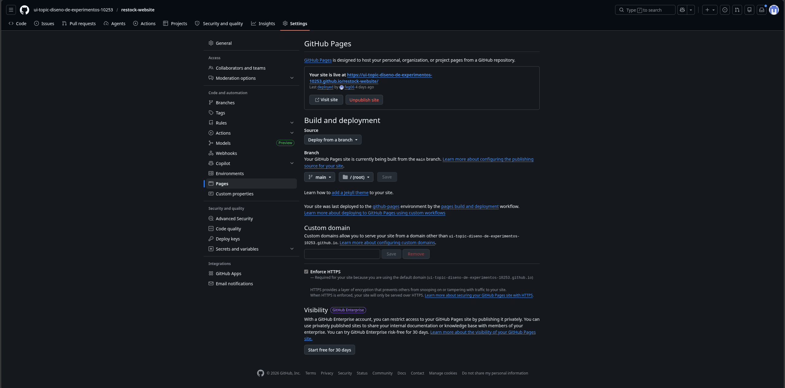

# Capítulo V: Product Implementation

## 5.1. Software Configuration Management

### 5.1.1. Software Development Environment Configuration

A continuación, se listan las herramientas y estándares adoptados por el equipo para el desarrollo colaborativo del sistema:

| Actividad               | Herramienta / Guía                                    | Propósito                                                     | Tipo de acceso / Ruta                                                                                                                 |
| ----------------------- | ------------------------------------------------------ | -------------------------------------------------------------- | ------------------------------------------------------------------------------------------------------------------------------------- |
| Project Management      | Trello                                                 | Seguimiento de backlog, tareas y sprints.                      | [https://trello.com/](https://trello.com/)                                                                                               |
| Requirements Management | Gherkin Conventions                                    | Escritura legible de requisitos con formato Given/When/Then.   | [https://cucumber.io/docs/gherkin/](https://cucumber.io/docs/gherkin/)                                                                   |
| Product UX/UI Design    | Figma                                                  | Prototipos y diseño responsive.                               | SaaS –[https://figma.com](https://figma.com)                                                                                            |
| Frontend Dev            | Kotlin, Flutter, Dart                                  | Construcción del frontend del sistema.                        | https://kotlinlang.org/ / https://flutter.dev/   /   https://dart.dev/                                                               |
| Backend Dev             | Java + Spring Boot                                     | Lógica de negocio y servicios REST.                           | [https://spring.io/projects/spring-boot](https://spring.io/projects/spring-boot)                                                         |
| IDE                     | IntelliJ IDEA + Android Studio                         | Desarrollo, depuración y pruebas.                             | [https://www.jetbrains.com/idea](https://www.jetbrains.com/idea) / [https://www.jetbrains.com/webstorm](https://www.jetbrains.com/webstorm) |
| Code Standards          | Google Java Style Guide, Google TypeScript Style Guide | Mantener un código consistente y legible.                     | [https://google.github.io/styleguide](https://google.github.io/styleguide)                                                               |
| Version Control         | Git + GitHub                                           | Gestión colaborativa del código fuente.                      | SaaS –[https://github.com](https://github.com)                                                                                          |
| Software Deployment     | Github pages                                           | Despliegue continuo del sistema en ambientes de testing.       | SaaS –[https://railway.app](https://railway.app) / [https://render.com](https://render.com)                                                |
| Software Documentation  | Swagger                                                | Documentación de APIs, funcionalidades y criterios técnicos. | SaaS –[https://swagger.io/](https://swagger.io/)                                                                                                 |

### 5.1.2. Source Code Management

#### Landing Page (HTML, CSS, JavaScript)

##### Convenciones generales:

- **Idioma**: Todo el código, incluyendo nombres de variables, funciones y clases, está escrito en **inglés**.
- **Indentación**: 2 espacios.
- **Formato de archivos**: `.html`, `.css`, `.js`
- **Estilo de código adoptado**:
  - [W3Schools HTML Style Guide](https://www.w3schools.com/html/html5_syntax.asp)
  - [Google HTML/CSS Style Guide](https://google.github.io/styleguide/htmlcssguide.html)

##### Nomenclatura:

- **Clases CSS**: `kebab-case` (ej. `main-container`)
- **IDs HTML**: `camelCase` (ej. `mainContent`)
- **Variables JS**: `camelCase` (ej. `userName`)
- **Funciones JS**: `camelCase` (ej. `handleClick()`)

#### Backend (Java + Spring Boot)

##### Convenciones generales:

- **Idioma**: Código y documentación interna en **inglés**.
- **Indentación**: 4 espacios.
- **Formato de archivos**: `.java`

##### Estilo de código adoptado:

- [Google Java Style Guide](https://google.github.io/styleguide/javaguide.html)
- [Spring Boot Features &amp; Best Practices](https://docs.spring.io/spring-boot/docs/current/reference/html/features.html)

##### Nomenclatura:

- **Clases**: `PascalCase` (ej. `UserService`)
- **Variables**: `camelCase` (ej. `userRepository`)
- **Constantes**: `UPPER_SNAKE_CASE` (ej. `MAX_USERS`)
- **Endpoints**: `kebab-case` para URLs (ej. `/api/user-profile`)
- **Paquetes**: Todo en minúsculas y separados por punto (ej. `com.project.backend.controller`)

#### Frontend Web Application (Angular + TypeScript)

##### Convenciones generales:

- **Idioma**: Todo el código fuente, nombres de componentes, servicios, interfaces y variables se desarrolla en **inglés**.
- **Indentación**: 2 espacios.
- **Formato de archivos**: `.ts`, `.html`, `.css`, `.scss`, `angular.json`, `package.json`.
- **Estilo de código adoptado**:
  - [Angular Style Guide](https://angular.io/guide/styleguide)
  - [Google TypeScript Style Guide](https://google.github.io/styleguide/tsguide.html)
- **Formateo**: uso de herramientas como `Prettier` y validación estática con `ESLint`.

##### Nomenclatura:

- **Componentes**: `PascalCase` para clases (ej. `InventoryListComponent`) y `kebab-case` para archivos (ej. `inventory-list.component.ts`).
- **Servicios**: nombre en `PascalCase` con sufijo `Service` (ej. `AuthService`, `InventoryService`).
- **Interfaces**: `PascalCase` (ej. `User`, `Product`, `OrderDetail`).
- **Variables y funciones**: `camelCase` (ej. `currentUser`, `loadProducts()`).
- **Selectores de componentes**: prefijo del proyecto en `kebab-case` (ej. `app-product-card`).
- **Módulos**: `PascalCase` con sufijo `Module` (ej. `InventoryModule`).

##### Archivos y estructura recomendada (ejemplo mínimo):

- `/src`
- `/app`
- `/core`
- `/shared`
- `/features`
- `/services`
- `/models`
- `/guards`
- `/interceptors`
- `/pages`
- `/components`
- `main.ts`
- `app.config.ts` o `app.module.ts`
- `angular.json`
- `package.json`

##### Patrones y arquitectura:

- **Arquitectura**: organización modular por funcionalidades, separando componentes, servicios, modelos y utilitarios.
- **Reutilización**: los componentes compartidos deben ubicarse en una carpeta `shared`.
- **Separación de responsabilidades**: la lógica de negocio se concentra en servicios y la lógica de presentación en componentes.
- **Inyección de dependencias**: uso del sistema nativo de Angular para desacoplar servicios y facilitar pruebas.

##### Consumo de API y manejo de datos:

- **Comunicación HTTP**: uso de `HttpClient` para consumir la API REST del backend.
- **Manejo de errores**: implementación de interceptores y operadores de RxJS para capturar y procesar errores.
- **Modelado de datos**: uso de interfaces y clases TypeScript para tipado fuerte.
- **Autenticación**: gestión de tokens y cabeceras de autorización mediante interceptores.

##### State & UI:

- **Componentización**: construcción de interfaces a partir de componentes reutilizables.
- **Gestión de estado**: manejo local con servicios y observables; en módulos complejos se puede escalar con patrones reactivos.
- **Formularios**: uso de `Reactive Forms` para validación, control de errores y manejo robusto de entradas.
- **Navegación**: uso de `Angular Router` para estructurar rutas protegidas y públicas.

##### Testing:

- **Tipos**: pruebas unitarias para componentes y servicios, y pruebas de integración para flujos clave.
- **Herramientas**: `Karma`, `Jasmine` y `TestBed`.
- **Objetivo**: validar comportamiento de interfaces, consumo de servicios y reglas de validación de formularios.

##### Linting y calidad:

- **Linters**: `ESLint` para TypeScript y plantillas Angular.
- **Formateo automático**: `Prettier`.
- **Buenas prácticas**: mantener componentes pequeños, evitar lógica extensa en plantillas y centralizar reglas de negocio en servicios.

##### Buenas prácticas y recomendaciones específicas:

- **Modularidad**: agrupar el sistema por features funcionales.
- **Escalabilidad**: aislar componentes reutilizables en `shared` y servicios globales en `core`.
- **Mantenibilidad**: evitar duplicación de código y documentar las interfaces principales.
- **Seguridad**: no exponer credenciales ni URLs sensibles directamente en el código; usar archivos de entorno.
- **Performance**: aplicar lazy loading en módulos cuando sea necesario.

##### Herramientas / utilidades recomendadas:

- **Angular CLI** (`ng serve`, `ng build`, `ng test`)
- **RxJS**
- **ESLint**
- **Prettier**
- **Angular DevTools**
- **Postman** o **Swagger UI** para validación de endpoints

#### Mobile Frontend (Android Studio + Kotlin)

##### Convenciones generales:

- **Idioma**: Todo el código (nombres de paquetes, clases, variables, funciones, recursos) en **inglés**.
- **Indentación**: 4 espacios.
- **Formato de archivos**: `.kt` para Kotlin, `.xml` para layouts/resources, `build.gradle` / `build.gradle.kts` para scripts de Gradle.
- **Estilo de código adoptado**:
  - [Kotlin Coding Conventions](https://kotlinlang.org/docs/coding-conventions.html)
  - [Android Kotlin Style Guide (Google)](https://developer.android.com/kotlin/style-guide)
- **Comportamiento asíncrono**: Usar **Kotlin Coroutines** y `suspend` functions para llamadas de red/IO; preferir **StateFlow** / **SharedFlow** o `LiveData` para exponer estados desde ViewModels.

##### Nomenclatura:

- **Packages**: todo en minúsculas y con puntos (`com.project.restock.admin`).
- **Clases / Activities / ViewModels / Repositories**: `PascalCase` (ej. `InventoryViewModel`, `SuppliesRepository`).
- **Funciones y propiedades**: `camelCase` (ej. `fetchSupplies()` , `userId`).
- **Constantes**: `UPPER_SNAKE_CASE` (ej. `API_TIMEOUT_SECONDS`).
- **Composables (Jetpack Compose)**: `PascalCase` preferible y con sufijos claros cuando aplique (ej. `LoginScreen`, `SupplyItem`).
- **Archivos Kotlin**: `PascalCase` para clases (ej. `InventoryViewModel.kt`) o `snake_case` para ficheros que agrupen múltiples composables/pantallas (ej. `login_screen.kt`) según convención del equipo.
- **IDs y recursos (drawable, layout, string, color, dimens)**: `lowercase_snake_case` (ej. `activity_main.xml` → `@+id/btn_login`, `ic_supply_placeholder`, `color_primary`).
- **Nombres de layouts XML**: `lowercase_snake_case` con prefijos si aplica (ej. `activity_main.xml`, `fragment_recipe_list.xml`, `item_supply.xml`).
- **Nombres de pruebas**: sufijo `Test` para unit/instrumented tests (ej. `InventoryViewModelTest`).

##### Archivos y recursos:

- **Kotlin**: `.kt` (packages, ViewModels, Repositories, UseCases, Mappers).
- **Layouts**: `.xml` (si no se usa Compose) en `res/layout/`.
- **Drawables**: `res/drawable/` → `lowercase_snake_case`.
- **Strings**: `res/values/strings.xml` → keys en `lowercase_snake_case`.
- **Colors / Dimens / Styles**: `res/values/colors.xml`, `dimens.xml`, `styles.xml` → variables en `lowercase_snake_case`.
- **Build scripts**: `build.gradle` o `build.gradle.kts` (módulo/app) con dependencias centralizadas.

##### Arquitectura y patrones recomendados:

- **Arquitectura**: MVVM (View — ViewModel — Repository) o MVI/Unidirectional UI (usando StateFlow) según preferencia del equipo.
- **Repository pattern**: separar acceso a datos (remote/local) y exponer modelos de dominio al ViewModel.
- **Use Cases / Interactors**: opcionalmente encapsular la lógica de negocio en casos de uso reutilizables.
- **Networking**: usar Retrofit + OkHttp + Moshi/Gson para serialización. Utilizar interceptors para auth/token.
- **Persistencia local**: Room para almacenamiento local (caches, offline support).
- **Asincronía**: Kotlin Coroutines + Flow / StateFlow para streams y estados reactivos.
- **State handling**: usar sealed classes o data classes para representar estados UI (Loading / Success / Error / Empty).
- **Navigation**: Jetpack Navigation Component (Fragments) o Navigation for Compose según stack elegido.

##### Buenas prácticas y recomendaciones:

- **Código en inglés**: mensajes de commit, comentarios y nombres en inglés.
- **Suspension naming**: `suspend` functions con nombres verbales claros (`suspend fun fetchSupplies()`).
- **Error handling**: envolver llamadas de red en `Result`/`Either` o usar patrones claros para propagar errores al UI.
- **UI/UX**: manejar estados (loading, empty, error) en cada pantalla; mostrar mensajes claros para usuarios de restaurantes.
- **Testing**: escribir unit tests para ViewModels y repositorios; usar instrumented tests para flujos críticos.
- **Linting & formatting**: integrar `ktlint` y `detekt` en el pipeline; configurar `editorconfig` y `pre-commit hooks`.
- **Seguridad**: no guardar tokens en texto plano; usar `EncryptedSharedPreferences` o soluciones seguras.
- **Accesibilidad**: labels de contentDescription en imágenes, contrastes adecuados y soporte para tamaños de texto.

##### Herramientas / linters / utilidades:

- **Ktlint** (formato y reglas de estilo).
- **Detekt** (análisis estático).
- **Android Lint** (recomendaciones Android).
- **Retrofit + OkHttp + Moshi/Gson** (networking).
- **Room** (persistencia local).
- **Jetpack Compose** (opcional para UI moderna) o XML + ViewBinding/Databinding.
- **Coroutines + Lifecycle (ViewModelScope)**.
- **Navigation Component** (navegación entre pantallas).

#### Mobile Frontend (Flutter)

##### Convenciones generales:

- **Idioma**: Todo el código y los recursos con nombres y mensajes en **inglés**.
- **Indentación**: 2 espacios (estándar Dart/Flutter).
- **Formato de archivos**: `.dart`, `pubspec.yaml`, carpetas `android/`, `ios/`, `lib/`, `test/`.
- **Estilo de código adoptado**:
  - [Effective Dart / Style Guide](https://dart.dev/guides/language/effective-dart/style)
  - [Flutter Style Guide (community)](https://flutter.dev/docs/development/tools/formatting)
- **Formateo**: usar `dart format` (o `flutter format`) automáticamente en pre-commit.

##### Nomenclatura:

- **Clases / Widgets**: `PascalCase` (ej. `LoginScreen`, `SupplyItemWidget`).
- **Funciones y variables**: `lowerCamelCase` (ej. `fetchSupplies`, `userId`).
- **Constantes**: `lowerCamelCase` o `kUpperCamelCase` prefijo `k` para constantes (ej. `kPrimaryColor`) — seguir la guía del equipo, preferible `lowerCamelCase` por la guía oficial.
- **Archivos**: `snake_case` (ej. `login_screen.dart`, `supply_item.dart`).
- **Rutas / Keys**: `kebab-case` o `snake_case` según convención del proyecto (ej. `/home`, `supply_item_key`).

##### Archivos y estructura recomendada (ejemplo mínimo):

- /lib
- /src
- /models
- /services
- /repositories
- /ui
- /screens
- /widgets
- /state (bloc/riverpod/providers)
- /utils
- main.dart
- pubspec.yaml

##### Patrones y arquitectura:

- **Arquitectura**: Clean Architecture (Data — Domain — Presentation) o MVVM/BLoC según preferencia.
- **State management recomendada**: **Riverpod** o **Bloc**. *Provider* es aceptable para proyectos pequeños.
- **Dependencias recomendadas**:
  - Estado: `flutter_riverpod` o `flutter_bloc`
  - Networking: `dio` o `http`
  - Serialización: `json_serializable` + `build_runner` o `freezed` para data classes/union types
  - Persistencia: `hive` o `sqflite` según necesidad; `shared_preferences` para settings simples
  - Seguridad: `flutter_secure_storage` para tokens
  - Otros: `connectivity_plus`, `flutter_local_notifications`, `firebase_core` / `cloud_firestore` (si aplica)
- **Manejo de errores**: usar tipos `Result`/`Either` (con `dartz` / `sealed_unions` o `freezed`) y propagación clara al UI.

##### Networking y serialización:

- **Configuración**: manejar interceptors (auth, logging) en `dio` u `OkHttp`-like middlewares.
- **Modelos**: generar modelos con `json_serializable` o `freezed` para evitar mapeos manuales.
- **Timeouts y retries**: configurar políticas de reintentos/exponenciales si es necesario.

##### State & UI:

- **Patterns**: separar UI (Widgets) de la lógica de estado (Providers / Blocs / Notifiers).
- **Widgets**: componentes reutilizables y composables; mantener Screens ligeras y delegar lógica a controllers/providers.
- **Form handling**: usar validadores y providers para manejar estados de formulario.

##### Plataforma y deploy:

- **Builds**: `flutter build apk`, `flutter build appbundle`, `flutter build ios` (iOS requiere Xcode/macOS).
- **CI/CD**: GitHub Actions / Codemagic / Bitrise para automatizar builds, pruebas y deploy.
- **Code signing**: manejar certificados/keystores en secrets del CI.
- **Publicación**: Play Store / App Store (según ruta); testar App Bundle para Android.

##### Testing:

- **Tipos**: unit tests (modelos, utilidades), widget tests (UI components), integration tests (`integration_test` package).
- **Herramientas**: `flutter_test`, `mockito` o `mocktail` para mocks, `integration_test` para flujos E2E.

##### Linting y calidad:

- **Linters**: `flutter_lints` o `effective_dart` + reglas adicionales.
- **Formateo**: `dart format` en pre-commit.
- **Analyzer**: configurar `analysis_options.yaml` con reglas adaptadas al equipo.
- **Codemods & refactors**: usar `dart fix` y herramientas IDE.

##### Buenas prácticas y recomendaciones específicas:

- **Separación clara** entre UI y lógica (no lógica en build methods).
- **Minimizar rebuilds**: usar const widgets donde aplique, selectors/consumers para updates puntuales.
- **Gestión de recursos**: assets en `pubspec.yaml`, imágenes optimizadas y responsive.
- **Internacionalización (i18n)**: preparar `arb`/`intl` si aplica.
- **Accesibilidad**: labels, roles y navegación por teclado/gestos cuando aplique.
- **Seguridad**: no exponer claves en `pubspec.yaml` o repos remotos; usar variables de entorno/CI secrets.
- **Plataforma channels**: documentar cualquier uso de canales nativos (Android/iOS) y aislarlo detrás de un servicio.

##### Herramientas / linters / utilidades recomendadas:

- **Dart & Flutter format/analyze** (`dart format`, `flutter analyze`).
- **Linters**: `flutter_lints`, `effective_dart`.
- **Code generation**: `freezed`, `json_serializable`, `build_runner`.
- **State**: `flutter_riverpod`, `flutter_bloc`, `provider` (si aplica).
- **Networking**: `dio`.
- **Storage**: `hive`, `flutter_secure_storage`.
- **Testing**: `flutter_test`, `integration_test`, `mocktail`/`mockito`.
- **CI/CD**: GitHub Actions / Codemagic / Bitrise.

### 5.1.3. Source Code Style Guide & Conventions

#### Frontend Web App (Angular + TypeScript)

##### Convenciones generales:

- **Idioma**: Código completamente en **inglés**.
- **Estructura de carpetas**: Segregación por módulos y componentes.
- **Indentación**: 2 espacios.
- **Formato de archivos**: `.ts`, `.html`, `.css`

##### Estilo de código adoptado:

- Angular Style Guide (Oficial): https://angular.io/guide/styleguide
- Google TypeScript Style Guide: https://google.github.io/styleguide/tsguide.html

##### Nomenclatura:

- **Componentes**: `PascalCase` (ej. `UserProfileComponent`)
- **Servicios**: `camelCase` + sufijo `Service` (ej. `authService`)
- **Interfaces**: `PascalCase`, prefijo `I` opcional (ej. `User`, `IUser`)
- **Archivos**: `kebab-case` (ej. `user-profile.component.ts`)
- **Variables y funciones**: `camelCase`

#### Mobile Frontend (Kotlin + Android Studio + Jetpack Compose)

##### Convenciones generales:

- **Idioma**: Todo el código, nombres de clases, funciones y variables en **inglés**.
- **Indentación**: 4 espacios (convención oficial de Kotlin/Android).
- **Formato de archivos**: `.kt` (Kotlin).
- **Estilo de código adoptado**:
  - [Kotlin Coding Conventions](https://kotlinlang.org/docs/coding-conventions.html)
  - [Android Kotlin Style Guide](https://developer.android.com/kotlin/style-guide)

##### Nomenclatura:

- **Clases y objetos**: `PascalCase` (ej. `UserProfileActivity`, `RestockApp`).
- **Funciones y variables**: `camelCase` (ej. `getUserName()`, `userList`).
- **Constantes**: `UPPER_SNAKE_CASE` (ej. `MAX_USERS`).
- **Paquetes**: Todo en minúsculas y separados por punto (ej. `com.restockmobile.ui.profile`).
- **Layouts y recursos XML**: `snake_case` (ej. `activity_main.xml`, `user_profile_item.xml`).
- **IDs en layouts**: `camelCase` (ej. `btnSubmit`, `txtUserName`).

#### Mobile Frontend (Flutter + Dart)

##### Convenciones generales:

- **Idioma**: Todo el código, nombres de clases, funciones y variables en **inglés**.
- **Indentación**: 2 espacios (convención oficial de Dart).
- **Formato de archivos**: `.dart` (Dart).
- **Estilo de código adoptado**:
  - [Effective Dart Style Guide](https://dart.dev/guides/language/effective-dart/style)
  - [Flutter Style Guide](https://github.com/flutter/flutter/wiki/Style-guide-for-Flutter-repo)
  - [Dart Code Linter (flutter_lints)](https://pub.dev/packages/flutter_lints)

##### Nomenclatura:

- **Clases y tipos**: `PascalCase` (ej. `UserProfileScreen`, `ProductRepository`).
- **Funciones y variables**: `lowerCamelCase` (ej. `getUserName()`, `userList`).
- **Constantes**: `lowerCamelCase` (ej. `defaultTimeout`, `maxRetries`).
- **Archivos**: `snake_case` (ej. `user_profile_screen.dart`, `product_repository.dart`).
- **Directorios**: `snake_case` (ej. `lib/features/auth/`, `lib/core/utils/`).
- **Widgets**: `PascalCase` con sufijo descriptivo (ej. `CustomButton`, `ProductCard`).
- **Enums**: `PascalCase` para el tipo, `lowerCamelCase` para valores (ej. `enum Status { loading, success, error }`).

##### Buenas prácticas:

- Uso de `const` constructors donde sea posible para optimización.
- Organización de código por features/módulos.
- Separación de lógica de negocio (BLoC/Provider/Riverpod) de la UI.
- Uso de trailing commas para mejor formateo automático.
- Documentación con `///` para elementos públicos.

#### Backend (Java + Spring Boot + MongoDB)

##### Convenciones generales:

- **Idioma**: Código y documentación interna en **inglés**.
- **Indentación**: 4 espacios.
- **Formato de archivos**: `.java`
- **Estilo de código adoptado**:
  - [Google Java Style Guide](https://google.github.io/styleguide/javaguide.html)
  - [Spring Boot Best Practices](https://docs.spring.io/spring-boot/docs/current/reference/html/best-practices.html)

##### Nomenclatura:

- **Clases**: `PascalCase` (ej. `UserService`, `UserController`).
- **Variables**: `camelCase` (ej. `userRepository`).
- **Constantes**: `UPPER_SNAKE_CASE` (ej. `MAX_USERS`).
- **Endpoints REST**: `kebab-case` (ej. `/api/user-profile`).
- **Paquetes**: Todo en minúsculas y separados por punto (ej. `com.restock.backend.service`).
- **Colecciones MongoDB**: `snake_case` en plural (ej. `users`, `product_items`).

#### Database (MongoDB – NoSQL)

##### Convenciones generales:

- **Formato**: Documentos en JSON.
- **Indentación**: 2 espacios para JSON.
- **Estilo de modelado**:
  - Documentos denormalizados (referencias mínimas).
  - Uso de `ObjectId` como clave primaria.

##### Nomenclatura:

- **Colecciones**: plural, `snake_case` (ej. `users`, `order_items`).
- **Campos**: `camelCase` (ej. `userName`, `createdAt`).
- **Índices**: nombrados con campos concatenados en `snake_case` (ej. `user_name_index`).

### 5.1.4. Software Deployment Configuration

Esta sección detalla los pasos necesarios para desplegar satisfactoriamente los componentes digitales de la solución Restock: la Landing Page, la aplicación móvil (frontend) y los Web Services (backend), partiendo desde sus respectivos repositorios de código fuente.

#### 1. Landing Page - HTML, CSS y JavaScript

**Tecnología Base:**

- Lenguajes: HTML5, CSS3, JavaScript
- Hosting: GitHub Pages

**Configuración y Despliegue:**

- El código fuente se aloja en un repositorio público de GitHub.
- El archivo `index.html` debe encontrarse en la raíz del repositorio para que GitHub Pages lo detecte como punto de entrada.
- Para desplegar la Landing Page, se siguen los siguientes pasos:
  1. Acceder al repositorio en GitHub.
  2. Continuar con la sección **Settings** > **Pages**.
  3. En **Source**, se selecciona la rama principal (`main`) y la carpeta raíz (`/`).
  4. Se procede a guardar los cambios realizados.
- GitHub Pages genera automáticamente una URL pública con el formato `https://<organizacion>.github.io/<repositorio>/` donde el sitio estará disponible.
- Cada vez que se realiza un commit en la rama `main`, GitHub Pages actualiza de forma automática la versión publicada.

#### 2. Frontend Web Application – Angular

**Tecnología Base**

* Framework: Angular
* Build Tool: Angular CLI (ng build)
* Hosting: GitHub Pages
* Configuración y Despliegue
  Repositorio vinculado:
  El proyecto frontend está alojado en GitHub y conectado directamente a GitHub Pages. Cada push en la rama principal dispara un nuevo despliegue automático.
* Build:
  GitHub Pages ejecuta automáticamente el comando ng build utilizando Angular CLI. El resultado (/dist) se utiliza como carpeta de salida para servir la aplicación web.
* Variables de entorno:
  Las URLs de los servicios REST del backend se configuran mediante variables de entorno en GitHub Pages y no están hardcodeadas.

**Entornos diferenciados:**

* Desarrollo: Angular se ejecuta localmente (ng serve) apuntando a un entorno de backend local o staging.
* Producción: El entorno de producción utiliza las variables configuradas en GitHub Pages, que apuntan al backend desplegado en Render.

**Integración con backend:**
El frontend se comunica con el backend a través de HTTP consumiendo la API REST pública expuesta desde Render. Se realiza control de errores y carga de recursos asincrónicos desde los endpoints definidos.

#### 3. Backend - Java + MongoDB

**Tecnología Base:**

- Framework: Spring Boot
- Lenguaje: Java 21
- Base de datos: MongoDB
- Contenedorización: Docker
- Hosting: Render o servicio equivalente

**Configuración y Despliegue:**

- El backend está estructurado según el enfoque de Domain-Driven Design (DDD), dividiendo el sistema en bounded contexts independientes.
- El código fuente se mantiene en un repositorio de GitHub.
- Para el despliegue, el repositorio incluye un archivo `Dockerfile` que define la imagen de la aplicación.
- El proveedor de hosting detecta automáticamente el Dockerfile y construye la imagen en cada actualización del repositorio.
- La base de datos MongoDB se configura mediante variables de entorno (por ejemplo, `MONGO_URI`), las cuales se gestionan en el panel de administración del hosting y nunca se almacenan en el código fuente.
- La API REST expuesta por el backend sigue la convención RESTful y sus endpoints están documentados mediante OpenAPI (Swagger). La interfaz Swagger UI está disponible para consulta y prueba.
- Los servicios protegidos requieren autorización mediante JWT, implementada con Spring Security, y los roles de usuario definen el nivel de acceso a cada funcionalidad.
- El despliegue es automático: cada push a la rama principal activa la reconstrucción y publicación en el servicio de hosting, sin necesidad de configurar pipelines de CI/CD adicionales.
- La aplicación móvil consume la API pública del backend utilizando HTTP para acceder a los servicios.

#### 4. Aplicación Móvil - Android (Kotlin + Android Studio)

**Tecnología Base:**

- Lenguaje: Kotlin
- Framework: Android Studio + Jetpack Compose
- Distribución: APK (Android Package)
- Hosting de pruebas: Firebase App Distribution

**Configuración y Despliegue:**

- El código fuente se gestiona en un repositorio de GitHub.
- Para la generación de versiones de prueba, se debe compilo el proyecto en Android Studio (`Build > Generate Signed APK`) y se verifico el funcionamiento de la aplicación en dispositivos físicos o emuladores Android.
- El archivo APK generado se sube a Firebase App Distribution, permitiendo el testeo con usuarios internos y externos seleccionados antes de su publicación oficial.
- El enlace de descarga puede ser compartido con los testers a través de correo electrónico, Google Drive o mediante un acceso en la Landing Page.
- Cada nueva versión de la aplicación para testeo se publica y gestiona mediante la plataforma Firebase, facilitando la retroalimentación y el control de versiones.

#### 5. Aplicación Móvil (Dart + Flutter)

**Tecnología Base:**

- Lenguaje: Dart
- Framework: Flutter
- Distribución: APK para Android, IPA para iOS
- Hosting de pruebas: Firebase App Distribution

**Configuración y Despliegue:**

- El código fuente se gestiona en un repositorio de GitHub.
- Requisitos previos para construir:
  - Instalar Flutter SDK (versión estable usada por el proyecto).
  - Android: Android Studio + Android SDK (platforms y build-tools adecuados).
  - iOS: macOS con Xcode instalado (para compilación y firma).
- Para generar versiones de prueba (Android):
  - APK: ejecutar `flutter build apk --release`
- Para generar versiones de prueba (iOS, en macOS):
  - IPA: usar `flutter build ipa --export-options-plist=<ruta>` o exportar desde Xcode (`Runner.xcworkspace`) y subir a TestFlight.
- El artefacto generado (APK / IPA) se sube a Firebase App Distribution, Google Play (internal/closed track) o TestFlight para distribuir a testers.
- El enlace de descarga se comparte con testers a través de correo, drive o la Landing Page, según el flujo del equipo.
- Cada nueva versión para prueba se publica y gestiona mediante la plataforma de distribución elegida (Firebase / Play Console / App Store Connect).

#### Referencias adicionales

- Documentación oficial de [Spring Boot](https://spring.io/projects/spring-boot), [Spring Data MongoDB](https://spring.io/projects/spring-data-mongodb), [Docker](https://docs.docker.com/), [Android Studio](https://developer.android.com/studio), [Firebase App Distribution](https://firebase.google.com/products/app-distribution), [Flutter](https://docs.flutter.dev/) y [GitHub Pages](https://pages.github.com/).
- Para la gestión de variables de entorno y credenciales, se consulto las guías de los proveedores de hosting utilizados.

## 5.2. Product Implementation & Deployment

### 5.2.1. Sprint Backlogs

#### Sprint 1 

[Landing page] [Sprint Planning + Sprint backlog]

#### Sprint 2

[Backend] [Sprint Planning + Sprint backlog]

#### Sprint 3

[Web application] [Sprint Planning + Sprint backlog]

#### Sprint 4

[Mobile Application] [Sprint Planning + Sprint backlog]

### 5.2.2. Implemented Landing Page Evidence

El repositorio fue reinicializado como parte de la transición del proyecto desde la fase de prototipo a desarrollo de producción. Esta decisión se tomó para establecer un historial limpio que refleje únicamente la arquitectura final del sistema, tras múltiples iteraciones de reestructuración técnica y consolidación de funcionalidades core.

| Repository | Branch | Commit Id | Commit Message | Commit Message Body | Committed on (Date) |
| :--- | :--- | :--- | :--- | :--- | :--- |
| restock-website | main | 732099d96c19104dd87599fdd058848e45439b4c | feat: initial landing page deployment. | initial commit | 22/04/2026 |

#### Despliegue de Landing Page

**Configuración de GitHub Pages:**

- **Paso 1: Acceder a la Configuración**
    - Navega a tu repositorio en GitHub.
    - Haz clic en la pestaña "Settings" (Configuración).
    - Desplázate hacia abajo hasta la sección "Pages" en el menú lateral.

- **Paso 2: Seleccionar la Fuente**
    - En la sección "Source" (Fuente): **Opción A: Deploy from a branch**.
    - **Branch:** Selecciona la rama `main`. **Folder:** Elige `/ (root)`. Es la opción más común y sencilla.

**Link de despliegue de landing page:** [https://ui-topic-diseno-de-experimentos-10253.github.io/restock-website/](https://ui-topic-diseno-de-experimentos-10253.github.io/restock-website/)

### 5.2.3. Implemented Frontend-Web Application Evidence

### 5.2.4. Acuerdo de Servicio - SaaS

### 5.2.5. Implemented Native-Mobile Application Evidence

### 5.2.6. Implemented RESTful API and/or Serverless Backend Evidence

### 5.2.7. RESTful API documentation

### 5.2.8. Team Collaboration Insights

## 5.3. Video About-the-Product
