# Part II: Verification, Validation & Pipeline

# Capítulo VI: Product Verification & Validation

## 6.1. Testing Suites & Validation

### 6.1.1. Core Entities Unit Tests

En esta sección se detallan las pruebas unitarias realizadas sobre las entidades y agregados core del sistema Restock, asegurando la integridad de las reglas de negocio y la consistencia de los datos.

#### IAM (Identity and Access Management) Bounded Context Unit Tests

Se validaron las entidades `User` y `Role`, asegurando la correcta asignación de roles y la integridad de los datos de perfil de usuario.


#### Subscriptions Bounded Context Unit Tests

Se realizaron pruebas sobre el agregado `Subscription`, verificando la lógica de cambio de planes, estados de suscripción y fechas de vigencia.


#### Resource Bounded Context Unit Tests

Se validaron las entidades `Order` y `Alert`, incluyendo el cálculo de totales en pedidos, transiciones de estado y la generación correcta de alertas de inventario.


### 6.1.2. Core Integration Tests

Las pruebas de integración verifican que los módulos del sistema interactúen correctamente entre sí. Para ello se utilizó `@SpringBootTest`, que levanta el contexto completo de Spring Boot, y Flapdoodle Embedded MongoDB, que provee una instancia de base de datos en memoria durante la ejecución de los tests. Esto permite probar el flujo real desde la capa HTTP hasta la persistencia, sin depender de infraestructura externa.

Se implementaron tres clases de prueba que cubren las interacciones principales del sistema.
---

## Prueba 1 — Flujo de autenticación (IAM)

**Clase:** `AuthenticationIntegrationTest`

Valida la comunicación entre un cliente HTTP y los endpoints REST del módulo IAM. Cubre el ciclo completo de registro e inicio de sesión, incluyendo la generación del token JWT y el manejo de errores por credenciales inválidas o usuarios duplicados.

| Caso | Endpoint | Resultado esperado |
|---|---|---|
| Registro con credenciales válidas | `POST /api/v1/authentication/sign-up` | `201 Created` + datos del usuario |
| Registro con username duplicado | `POST /api/v1/authentication/sign-up` | `409 Conflict` |
| Inicio de sesión válido | `POST /api/v1/authentication/sign-in` | `200 OK` + token JWT |
| Contraseña incorrecta | `POST /api/v1/authentication/sign-in` | `401 Unauthorized` |
| Usuario inexistente | `POST /api/v1/authentication/sign-in` | `401 Unauthorized` |


---

## Prueba 2 — Interacción entre contextos: Monitoring → Planning (ACL)

**Clase:** `ExternalPlanningServiceIntegrationTest`

Valida la capa Anti-Corruption Layer (ACL) entre los bounded contexts de **Monitoring** y **Planning**. El servicio `ExternalPlanningService` consume `PlanningContextFacade` para obtener datos de recetas sin acoplamiento directo entre contextos. Se verifica que la integración entre ambos contextos devuelva los datos correctos y maneje adecuadamente los identificadores inexistentes.

| Caso | Resultado esperado |
|---|---|
| Consultar receta con ID inexistente | `Optional.empty()` |
| Consultar receta existente por ID | `Optional` con el `RecipeId` correcto |
| Consultar precio de receta existente | Precio exacto registrado |
| Consultar precio con ID inexistente | `0.0` |


---

## Prueba 3 — Endpoints de insumos (Resource)

**Clase:** `SupplyControllerIntegrationTest`

Valida los endpoints REST del contexto **Resource** para la consulta del catálogo de insumos. Al iniciar el contexto de prueba, el evento `ApplicationReadyEvent` ejecuta el seeding de insumos desde `supplies.json`, por lo que la base de datos embebida contiene datos reales al momento de ejecutar los casos.

| Caso | Endpoint | Resultado esperado |
|---|---|---|
| Consultar todos los insumos | `GET /api/v1/supplies` | `200 OK` + lista no vacía |
| Consultar insumo por ID válido | `GET /api/v1/supplies/1` | `200 OK` + datos del insumo |
| Consultar insumo con ID inexistente | `GET /api/v1/supplies/99999` | `404 Not Found` |
| Consultar categorías de insumos | `GET /api/v1/supplies/categories` | `200 OK` + lista de categorías |


### 6.1.3. Core Behavior-Driven Development

## Introducción  
En esta sección se aplican técnicas de **Behavior-Driven Development (BDD)** para definir y validar el comportamiento esperado del sistema Restock desde la perspectiva del usuario.  
BDD permite crear una especificación ejecutable que sirve como documentación viva del sistema y como base para las pruebas automatizadas.  

Se utiliza **Gherkin** como lenguaje de especificación, estructurando los escenarios con el formato **Given-When-Then**, lo que facilita la comunicación entre el equipo técnico y los stakeholders del negocio.  

---

## Herramientas Utilizadas  
- **Gherkin:** Lenguaje para escribir especificaciones legibles por humanos  
- **Cucumber/SpecFlow:** Frameworks para ejecutar especificaciones BDD  
- **Formato:** Given-When-Then para describir comportamientos  

---

## Feature Files - Funcionalidades Core  

### Feature 1: Gestión de Inventario   

```gherkin
Feature: Gestión manual de inventario de insumos
  Como administrador de restaurante
  Quiero gestionar manualmente mi inventario de insumos
  Para mantener control preciso de las existencias y evitar faltantes

  Background:
    Given el usuario ha iniciado sesión como administrador
    And se encuentra en la sección de Inventario

  Scenario: Crear un nuevo insumo exitosamente
    Given no existe el insumo "Aceite de Oliva" en el sistema
    When el administrador completa el formulario con:

    --------------------------------
    | Campo      | Valor           |
    | Nombre     | Aceite de Oliva |
    | Categoría  | Aceites         |
    | Unidad     | Litros          |
    | Stock Min  | 5               |
    | Stock Max  | 20              |
    --------------------------------

    And hace clic en "Guardar"
    Then el sistema muestra el mensaje "Insumo creado exitosamente"
    And el insumo "Aceite de Oliva" aparece en la lista de inventario
    And el stock actual es 0


```
### Feature 2: Sistema de Alertas de Inventario

```Gherkin

Feature: Notificaciones automáticas de inventario
  Como administrador de restaurante
  Quiero recibir alertas sobre el estado de mi inventario
  Para tomar decisiones oportunas y evitar problemas operativos

  Background:
    Given el usuario ha iniciado sesión como administrador
    And tiene insumos registrados en el sistema

  Scenario: Alerta por stock bajo
    Given el insumo "Tomate" tiene:
      | Stock Actual | Stock Mínimo |
      | 3 kg         | 10 kg        |
    When el sistema ejecuta la verificación de inventario
    Then se genera una alerta de tipo "Stock Bajo"
    And la alerta muestra el mensaje "El stock de Tomate está por debajo del mínimo"
    And el insumo se resalta en color naranja en el dashboard

```
### Feature 3: Gestión de Recetas

```Gherkin
Feature: Creación y gestión de recetas vinculadas al inventario
  Como administrador de restaurante
  Quiero crear recetas con ingredientes específicos
  Para calcular costos y controlar el consumo de insumos

  Background:
    Given el usuario ha iniciado sesión como administrador
    And tiene insumos registrados en el inventario
    And se encuentra en la sección de Recetas

  Scenario: Crear una receta nueva
    Given no existe la receta "Lomo Saltado"
    When el administrador completa el formulario:
      | Campo       | Valor                |
      | Nombre      | Lomo Saltado         |
      | Descripción | Plato criollo peruano|
      | Porciones   | 4                    |
      | Precio      | 35.00                |
    And agrega los siguientes ingredientes:
      | Ingrediente | Cantidad | Unidad |
      | Lomo        | 500      | g      |
      | Cebolla     | 200      | g      |
      | Tomate      | 150      | g      |
      | Papas       | 400      | g      |
      | Arroz       | 300      | g      |
    And guarda la receta
    Then el sistema calcula el costo total de ingredientes
    And muestra "Receta creada exitosamente"
    And la receta aparece en el catálogo

```

### Feature 4: Gestión de Pedidos a Proveedores


```Gherkin

Feature: Solicitud y seguimiento de pedidos a proveedores
  Como administrador de restaurante
  Quiero realizar y hacer seguimiento de pedidos
  Para mantener abastecido mi inventario de manera eficiente

  Background:
    Given el usuario ha iniciado sesión como administrador
    And tiene proveedores registrados en el sistema

  Scenario: Crear un pedido a proveedor
    Given el proveedor "Distribuidora Don José" ofrece:
      | Producto | Precio Unitario |
      | Arroz    | 3.50 / kg       |
      | Azúcar   | 2.80 / kg       |
      | Sal      | 1.20 / kg       |
    When el administrador crea un nuevo pedido
    And selecciona el proveedor "Distribuidora Don José"
    And agrega los productos:
      | Producto | Cantidad |
      | Arroz    | 50 kg    |
      | Azúcar   | 25 kg    |
    And confirma el pedido
    Then el sistema calcula el total: S/. 245.00
    And envía la orden al proveedor
    And el estado del pedido es "Pendiente"

```
### Feature 5: Registro de Ventas

```Gherkin

Feature: Registro de ventas del restaurante
  Como empleado del restaurante
  Quiero registrar las ventas realizadas
  Para actualizar el inventario y generar reportes precisos

  Background:
    Given el usuario ha iniciado sesión como empleado
    And tiene acceso al módulo de ventas
    And existen recetas registradas en el sistema

  Scenario: Registrar venta con recetas del menú
    Given el cliente ordena:
      | Plato        | Cantidad |
      | Lomo Saltado | 2        |
      | Ceviche      | 1        |
    When el empleado registra la venta
    Then el sistema calcula el total: S/. 105.00
    And descuenta los ingredientes de las recetas del inventario
    And registra la venta con fecha y hora actuales
    And genera un ID único de venta

```
### Feature 6: Gestión de Suscripción

```Gherkin

Feature: Gestión de planes de suscripción
  Como suscriptor
  Quiero administrar mi plan de suscripción
  Para acceder a las funcionalidades según mis necesidades

  Background:
    Given el usuario ha iniciado sesión
    And accede a la sección de Suscripción

  Scenario: Visualizar plan actual y características
    Given el usuario tiene el plan "Profesional"
    When accede a "Mi Suscripción"
    Then visualiza:
      | Información               |
      | Nombre del plan           |
      | Precio mensual            |
      | Fecha de inicio           |
      | Próxima fecha de renovación |
      | Funcionalidades incluidas |
      | Límites de uso            |


```

### Feature 7: Gestión de Proveedores

```Gherkin

Feature: Administración de proveedores
  Como administrador de restaurante
  Quiero gestionar mi red de proveedores
  Para mantener relaciones comerciales organizadas y eficientes

  Background:
    Given el usuario ha iniciado sesión como administrador
    And accede a la sección de Proveedores

  Scenario: Registrar un nuevo proveedor
    Given no existe el proveedor "Mercado Fresh SAC"
    When el administrador completa el formulario:
      | Campo              | Valor                    |
      | Nombre comercial   | Mercado Fresh SAC        |
      | RUC                | 20601234567              |
      | Contacto           | Juan Pérez               |
      | Teléfono           | +51 987654321            |
      | Email              | ventas@mercadofresh.com  |
      | Dirección          | Av. Industrial 456, Lima |
      | Categoría          | Frutas y Verduras        |
    And hace clic en "Registrar Proveedor"
    Then el sistema muestra "Proveedor registrado exitosamente"
    And el proveedor aparece en la lista de proveedores activos
    And se envía email de bienvenida al proveedor

```

### Feature 8: Reportes y Analíticas

```Gherik

Feature: Generación de reportes e indicadores
  Como administrador de restaurante
  Quiero generar reportes del sistema
  Para analizar el desempeño y tomar decisiones informadas

  Background:
    Given el usuario ha iniciado sesión como administrador
    And accede a la sección de Reportes

  Scenario: Generar reporte de ventas mensual
    Given existen ventas registradas en el mes de abril 2026
    When el administrador selecciona "Reporte de Ventas"
    And elige el período "Abril 2026"
    And hace clic en "Generar Reporte"
    Then el sistema muestra:
      | Métrica                  |
      | Total de ventas          |
      | Número de transacciones  |
      | Ticket promedio          |
      | Plato más vendido        |
      | Día con más ventas       |
    And puede exportar en formato Excel o PDF

```

### Feature 9: Notificaciones Push

```Gherik
Feature: Sistema de notificaciones en tiempo real
  Como usuario del sistema
  Quiero recibir notificaciones relevantes
  Para estar informado de eventos importantes sin consultar constantemente

  Background:
    Given el usuario ha iniciado sesión
    And tiene notificaciones habilitadas

  Scenario: Recibir notificación de stock crítico
    Given un insumo "Sal" alcanza el stock mínimo
    When el sistema detecta la condición
    Then se envía notificación push al administrador
    And la notificación muestra "Stock crítico: Sal - 2 kg restantes"
    And aparece en el centro de notificaciones de la app
    And se marca como "No leída"

  Scenario: Notificación de pedido recibido (para proveedor)
    Given un restaurante crea un pedido al proveedor
    When el pedido se confirma en el sistema
    Then el proveedor recibe notificación push
    And el mensaje indica "Nuevo pedido de Restaurante XYZ - S/. 450.00"
    And puede acceder directamente al detalle del pedido

  Scenario: Alerta de producto próximo a vencer
    Given un lote de "Yogurt" vence en 2 días
    When el sistema ejecuta la verificación diaria
    Then se notifica al administrador
    And el mensaje dice "Yogurt vence en 2 días - 15 unidades"
    And sugiere crear promoción o descuento

  Scenario: Confirmar recepción de notificación
    Given el usuario tiene 5 notificaciones no leídas
    When abre el centro de notificaciones
    And visualiza las alertas
    Then puede marcar individualmente como leídas
    Or marcar todas como leídas con un solo clic

  Scenario: Configurar preferencias de notificaciones
    Given el usuario accede a Configuración
    When selecciona "Notificaciones"
    Then puede activar/desactivar:
      | Tipo de Notificación        |
      | Stock bajo                  |
      | Productos por vencer        |
      | Nuevos pedidos              |
      | Cambios de estado de pedido |
      | Reportes programados        |
    And guardar sus preferencias


```
### Feature 10: Autenticación y Seguridad


```Gherkin

Feature: Gestión de autenticación y seguridad
  Como usuario del sistema
  Quiero gestionar mi acceso de forma segura
  Para proteger la información de mi negocio

  Scenario: Inicio de sesión exitoso
    Given el usuario tiene credenciales válidas
    When ingresa email "admin@restaurante.com"
    And ingresa contraseña correcta
    And hace clic en "Iniciar Sesión"
    Then accede al dashboard del sistema
    And se registra la fecha y hora del acceso
    And se muestra mensaje "Bienvenido de nuevo, [Nombre]"

  Scenario: Intento de inicio de sesión con credenciales incorrectas
    Given el usuario ingresa email válido
    When ingresa contraseña incorrecta
    And hace clic en "Iniciar Sesión"
    Then el sistema muestra "Email o contraseña incorrectos"
    And no permite el acceso
    And registra el intento fallido

  Scenario: Bloqueo de cuenta por múltiples intentos fallidos
    Given un usuario ha intentado 5 veces con contraseña incorrecta
    When intenta ingresar por sexta vez
    Then el sistema bloquea la cuenta temporalmente por 15 minutos
    And muestra "Cuenta bloqueada por seguridad. Intente más tarde o recupere su contraseña"
    And envía email de alerta al propietario

  Scenario: Recuperación de contraseña
    Given el usuario olvidó su contraseña
    When selecciona "¿Olvidaste tu contraseña?"
    And ingresa su email registrado
    And hace clic en "Enviar enlace de recuperación"
    Then recibe email con enlace temporal
    And el enlace expira en 1 hora
    And puede crear nueva contraseña desde el enlace

  Scenario: Cambiar contraseña desde configuración
    Given el usuario ha iniciado sesión
    When accede a "Seguridad y Privacidad"
    And selecciona "Cambiar Contraseña"
    And ingresa:
      | Campo                  | Valor          |
      | Contraseña actual      | [contraseña]   |
      | Nueva contraseña       | [nueva]        |
      | Confirmar contraseña   | [nueva]        |
    And hace clic en "Actualizar"
    Then el sistema valida la contraseña actual
    And actualiza a la nueva contraseña
    And muestra "Contraseña actualizada exitosamente"

  Scenario: Cerrar sesión de forma segura
    Given el usuario ha terminado su trabajo
    When selecciona "Cerrar Sesión"
    Then el sistema invalida el token de sesión
    And redirige a la página de inicio de sesión
    And limpia datos sensibles del navegador


```

### Feature 11: Perfil de Usuario

```Gherkin


gherkin
Feature: Gestión de perfil personal y empresarial
  Como usuario registrado
  Quiero gestionar mi información de perfil
  Para mantener mis datos actualizados y personalizados

  Background:
    Given el usuario ha iniciado sesión
    And accede a la sección "Mi Perfil"

  Scenario: Actualizar información personal
    When el usuario edita los siguientes campos:
      | Campo           | Valor Nuevo         |
      | Nombre          | Carlos              |
      | Apellido        | Rodríguez           |
      | Teléfono        | +51 999888777       |
      | País            | Perú                |
    And hace clic en "Guardar Cambios"
    Then el sistema actualiza la información
    And muestra "Perfil actualizado correctamente"

  Scenario: Cargar foto de perfil
    When el usuario selecciona "Cambiar Foto"
    And carga una imagen válida (JPG/PNG, <5MB)
    Then el sistema sube la imagen a Cloudinary
    And actualiza la foto de perfil
    And la nueva imagen se refleja en toda la aplicación

  Scenario: Actualizar datos empresariales (restaurante)
    Given el usuario es administrador de restaurante
    When accede a "Datos del Negocio"
    And actualiza:
      | Campo                 | Valor                |
      | Nombre del restaurante| El Buen Sabor        |
      | RUC                   | 20501234567          |
      | Dirección             | Jr. Lima 123, Lima   |
      | Categoría             | Comida Criolla       |
    And guarda los cambios
    Then la información se actualiza en el sistema
    And aparece en facturas y documentos oficiales

  Scenario: Visualizar estadísticas del perfil
    When el usuario accede a su perfil
    Then visualiza métricas como:
      | Métrica                    |
      | Fecha de registro          |
      | Último acceso              |
      | Número de ventas (si admin)|
      | Pedidos completados        |
      | Calificación promedio      |

  Scenario: Desactivar cuenta
    Given el usuario desea desactivar su cuenta
    When selecciona "Desactivar Cuenta"
    And confirma con su contraseña
    And acepta los términos de desactivación
    Then la cuenta se marca como inactiva
    And los datos se conservan por 30 días
    And puede reactivar dentro de ese período


```

### Feature 12: Gestión de Roles y Permisos

```Gherkin
Feature: Control de acceso basado en roles
  Como administrador del sistema
  Quiero gestionar roles y permisos
  Para controlar el acceso a funcionalidades según el tipo de usuario

  Background:
    Given el usuario ha iniciado sesión como administrador principal

  Scenario: Asignar rol a un nuevo usuario
    Given se ha registrado un nuevo usuario "empleado@restaurante.com"
    When el administrador accede a "Gestión de Usuarios"
    And selecciona el usuario
    And asigna el rol "Empleado - Ventas"
    Then el usuario solo tiene acceso a:
      | Módulo permitido    |
      | Registro de Ventas  |
      | Ver Recetas         |
      | Consultar Stock     |
    And no puede acceder a:
      | Módulo restringido       |
      | Gestión de Proveedores   |
      | Configuración            |
      | Reportes Financieros     |

  Scenario: Crear rol personalizado
    When el administrador crea un nuevo rol "Jefe de Cocina"
    And configura permisos:
      | Módulo              | Permiso          |
      | Inventario          | Lectura/Escritura|
      | Recetas             | Lectura/Escritura|
      | Proveedores         | Solo Lectura     |
      | Ventas              | Solo Lectura     |
      | Reportes            | Denegado         |
    And guarda el rol
    Then queda disponible para asignar a usuarios
    And aparece en la lista de roles del sistema

  Scenario: Modificar permisos de un rol existente
    Given existe el rol "Empleado - Ventas"
    When el administrador edita el rol
    And agrega permiso de "Lectura" en "Recetas"
    And guarda los cambios
    Then todos los usuarios con ese rol obtienen el nuevo permiso
    And se registra el cambio en el log de auditoría

  Scenario: Intentar acceder a módulo sin permisos
    Given un usuario tiene rol "Empleado - Ventas"
    When intenta acceder a "Gestión de Proveedores"
    Then el sistema muestra "No tienes permisos para acceder a esta sección"
    And redirige al dashboard
    And registra el intento en el log de seguridad
```

 #### 6.1.3.1. Estructura de Archivos

```bash

features/
├── inventory/
│   ├── inventory_management.feature
│   ├── inventory_alerts.feature
│   └── step_definitions/
│       ├── inventory_steps.ts
│       └── alerts_steps.ts
├── recipes/
│   ├── recipe_management.feature
│   └── step_definitions/
│       └── recipe_steps.ts
├── orders/
│   ├── supplier_orders.feature
│   └── step_definitions/
│       └── orders_steps.ts
├── sales/
│   ├── sales_registration.feature
│   └── step_definitions/
│       └── sales_steps.ts
├── subscriptions/
│   ├── subscription_management.feature
│   └── step_definitions/
│       └── subscription_steps.ts
├── suppliers/
│   ├── supplier_management.feature
│   └── step_definitions/
│       └── supplier_steps.ts
├── reports/
│   ├── reports_analytics.feature
│   └── step_definitions/
│       └── reports_steps.ts
├── notifications/
│   ├── push_notifications.feature
│   └── step_definitions/
│       └── notifications_steps.ts
├── authentication/
│   ├── auth_security.feature
│   └── step_definitions/
│       └── auth_steps.ts
├── profile/
│   ├── user_profile.feature
│   └── step_definitions/
│       └── profile_steps.ts
└── permissions/
    ├── roles_permissions.feature
    └── step_definitions/
        └── permissions_steps.ts
```

#### 6.1.3.2. Ejemplo de Step Definitions (TypeScript + Cucumber)

```typescript
// inventory_steps.ts
import { Given, When, Then } from '@cucumber/cucumber';
import { expect } from 'chai';

Given('el usuario ha iniciado sesión como administrador', async function() {
  await this.loginPage.login('admin@restaurant.com', 'password');
  expect(await this.dashboardPage.isDisplayed()).to.be.true;
});

When('el administrador completa el formulario con:', async function(dataTable) {
  const data = dataTable.rowsHash();
  await this.inventoryPage.fillSupplyForm(data);
});

Then('el sistema muestra el mensaje {string}', async function(message) {
  const actualMessage = await this.notificationComponent.getMessage();
  expect(actualMessage).to.equal(message);
});

```

#### 6.1.3.2.3. Integración con CI/CD

```yaml
name: BDD Tests

on: [push, pull_request]

jobs:
  bdd-tests:
    runs-on: ubuntu-latest
    
    strategy:
      matrix:
        feature: 
          - inventory
          - recipes
          - orders
          - sales
          - subscriptions
          - suppliers
          - reports
          - notifications
          - authentication
          - profile
          - permissions
    
    steps:
      - uses: actions/checkout@v2
      
      - name: Setup Node.js
        uses: actions/setup-node@v2
        with:
          node-version: '18'


```

### 6.1.4. Core System Tests

En esta sección se presentan las pruebas de sistema realizadas sobre Restock, con el objetivo de validar que los productos implementados funcionen correctamente como una solución integrada. Estas pruebas verifican flujos completos desde la perspectiva del usuario final, considerando navegación, autenticación, interacción con APIs, validación de formularios, persistencia de datos y respuesta del sistema ante escenarios exitosos y alternativos.

Para esta entrega, las pruebas de sistema se aplicaron sobre los principales productos de la solución: Landing Page, Web Application Angular desplegada en GitHub Pages, backend Spring Boot desplegado en Render, aplicación móvil Flutter para proveedores y aplicación móvil Kotlin para restaurantes.

### Testing Strategy

La estrategia de pruebas de sistema se definió según el tipo de producto evaluado. Para los productos web se utilizó Selenium IDE, debido a que permite grabar y reproducir flujos reales desde el navegador. Para el backend se utilizó Apache JMeter, con el fin de validar solicitudes HTTP hacia la API desplegada. Para las aplicaciones móviles se realizaron pruebas manuales documentadas en emulador o dispositivo Android. Finalmente, se realizó un flujo end-to-end cruzado para comprobar la comunicación entre restaurante, proveedor y backend.

| Producto              | Entorno                      | Herramienta               | Tipo de prueba         | Propósito                                                                                       |
| --------------------- | ---------------------------- | ------------------------- | ---------------------- | ------------------------------------------------------------------------------------------------ |
| Landing Page          | GitHub Pages                 | Selenium IDE              | Smoke/System Web Test  | Validar carga, navegación, botones, enlaces y visualización responsive básica.                |
| Web Application       | GitHub Pages                 | Selenium IDE              | System UI Test         | Validar login, dashboard, navegación, inventario y formularios.                                 |
| Backend API           | Render                       | Apache JMeter             | System API Test        | Validar login, token JWT, endpoints protegidos, creación/consulta de datos y manejo de errores. |
| Supplier Mobile App   | Emulador/dispositivo Android | Prueba manual documentada | Mobile System Test     | Validar login, catálogo de productos, órdenes recibidas y cambio de estado.                    |
| Restaurant Mobile App | Emulador/dispositivo Android | Prueba manual documentada | Mobile System Test     | Validar login, inventario, ventas, pedidos y seguimiento de estados.                             |
| Flujo E2E cruzado     | Web + Mobile + API           | Video de ejecución       | End-to-End System Test | Validar el flujo restaurante → backend → proveedor → restaurante.                             |

### System Test Cases

| ID        | Producto              | Escenario                                         | Herramienta        | Resultado esperado                                                                                           | Estado |
| --------- | --------------------- | ------------------------------------------------- | ------------------ | ------------------------------------------------------------------------------------------------------------ | ------ |
| ST-LP-01  | Landing Page          | Cargar la página pública                        | Selenium IDE       | El sitio carga correctamente y muestra la sección principal.                                                | Passed |
| ST-LP-02  | Landing Page          | Validar botones principales                       | Selenium IDE       | Los botones redirigen o desplazan al usuario hacia la sección esperada.                                     | Passed |
| ST-WEB-01 | Web Application       | Iniciar sesión como administrador de restaurante | Selenium IDE       | El usuario accede al dashboard correspondiente.                                                              | Passed |
| ST-WEB-02 | Web Application       | Navegar al módulo de inventario                  | Selenium IDE       | El sistema muestra el listado de insumos registrados.                                                        | Passed |
| ST-WEB-03 | Web Application       | Registrar insumo con datos válidos               | Selenium IDE       | El insumo se registra y aparece en el inventario.                                                            | Passed |
| ST-BE-01  | Backend API           | Iniciar sesión mediante API                      | JMeter             | La API retorna estado 200 OK y un token JWT.                                                                 | Passed |
| ST-BE-02  | Backend API           | Consultar recurso protegido con token             | JMeter             | La API retorna la información solicitada.                                                                   | Passed |
| ST-BE-03  | Backend API           | Crear un recurso válido                          | JMeter             | La API retorna 200 OK o 201 Created y persiste la información.                                              | Passed |
| ST-FL-01  | Supplier Mobile App   | Iniciar sesión como proveedor                    | Manual documentada | El proveedor accede a su pantalla principal.                                                                 | Passed |
| ST-FL-02  | Supplier Mobile App   | Gestionar catálogo de productos                  | Manual documentada | El producto se registra o actualiza correctamente.                                                           | Passed |
| ST-FL-03  | Supplier Mobile App   | Actualizar estado de una orden                    | Manual documentada | La orden cambia de estado correctamente.                                                                     | Passed |
| ST-KT-01  | Restaurant Mobile App | Iniciar sesión como usuario restaurante          | Manual documentada | El usuario accede a los módulos correspondientes a su rol.                                                  | Passed |
| ST-KT-02  | Restaurant Mobile App | Consultar inventario                              | Manual documentada | El sistema muestra insumos y niveles de stock.                                                               | Passed |
| ST-KT-03  | Restaurant Mobile App | Registrar order                                   | Manual documentada | La venta queda registrada y el stock se actualiza correctamente.                                             | Passed |
| ST-E2E-01 | Sistema completo      | Crear y seguir un pedido restaurante-proveedor    | Video E2E          | El restaurante crea el pedido, el proveedor lo visualiza, actualiza su estado y el restaurante ve el cambio. | Passed |

---

### Evidence

1. **Selenium IDE tests for Landing Page**

ST-LP-01: Se evidencia la ejecución del test de carga del Landing Page, validando que la página pública desplegada en GitHub Pages se abra correctamente y muestre el contenido principal del producto.


ST-LP-02: Semuestra la ejecución del test sobre el botón principal del Landing Page, validando que el call-to-action funcione correctamente y redirija o desplace al usuario hacia la sección esperada.


2. **Selenium IDE tests for Web Application**

ST-WEB-01: Se evidencia la ejecución del test de inicio de sesión en la Web Application, validando que el usuario pueda autenticarse correctamente y acceder al sistema.


ST-WEB-02: Se muestra la ejecución del test de navegación dentro de la Web Application, validando que el usuario pueda acceder correctamente a los módulos principales del sistema.


ST-WEB-03: Se evidencia la ejecución del test de registro de insumo desde la Web Application, validando que el sistema permita crear un nuevo recurso y mostrarlo correctamente en la interfaz.


3. **JMeter backend system tests**

ST-BE-01: Se evidencia la ejecución del request de login en JMeter, utilizado para validar la autenticación del usuario y la obtención del token JWT desde el backend desplegado en Render.


ST-BE-02: Se muestra la ejecución del request GET para consultar insumos, validando que la API permita acceder a recursos protegidos cuando se envía un token válido.


ST-BE-03: Se evidencia la ejecución del request POST para registrar un nuevo insumo, verificando que el backend procese correctamente datos válidos enviados desde JMeter.


Resumen de ejecución de las pruebas de sistema del backend, mostrando los resultados generales de los requests ejecutados, tiempos de respuesta y porcentaje de error.


4. **Mobile system test evidence - (Kotlin, administradores de restaurantes)**

ST-KT-01: Se evidencia la pantalla inicial de autenticación en la aplicación móvil Kotlin, validando que el administrador de restaurante pueda acceder al flujo de inicio de sesión.


ST-KT-02: Se evidencia la consulta del módulo de inventario desde la aplicación Kotlin, validando que el administrador pueda visualizar los insumos registrados y sus niveles de stock.


ST-KT-03: Se muestra el inicio del flujo de creación de pedido desde la aplicación móvil Kotlin, validando que el administrador pueda seleccionar insumos para generar una orden.


1. **Mobile system test evidence - (Flutter, proveedores de insumos)**

ST-FL-01: Esta prueba valida que el proveedor pueda acceder correctamente a la aplicación móvil Flutter mediante credenciales válidas. El flujo inicia en la pantalla de autenticación y finaliza cuando el usuario ingresa a la interfaz principal del proveedor.


ST-FL-02: Esta prueba valida que el proveedor pueda acceder al módulo de inventario o catálogo de productos, visualizando correctamente los insumos registrados en la aplicación móvil.


ST-FL-03: Esta prueba valida que el proveedor pueda acceder al módulo de órdenes, revisar los pedidos recibidos por parte de los restaurantes y consultar la información asociada a cada orden desde la aplicación móvil Flutter.


1. **Cross-platform E2E system test**

ST-E2E-01: Evidencia de flujo para gestion de inventario y pedidos restaurante-proveedor. Interacción entre landing page, aplicacion web, aplicación mobile Flutter, aplicación mobile Kotlin y backend.


Link del video: https://shorturl.at/btd62

### Resultados

Como resultado de las pruebas de sistema, se verificó que los productos principales de Restock funcionan de manera integrada. La Landing Page y la Web Application publicadas en GitHub Pages fueron evaluadas mediante Selenium IDE; el backend desplegado en Render fue validado mediante Apache JMeter; y las aplicaciones móviles Flutter y Kotlin fueron evaluadas mediante pruebas manuales documentadas.

Además, el flujo E2E cruzado permitió comprobar que una operación iniciada por el restaurante puede ser procesada por el backend, visualizada por el proveedor y actualizada nuevamente para el restaurante. Esto evidencia que Restock funciona como una solución integrada orientada a los principales flujos del negocio.

## 6.2. Static testing & Verification

### 6.2.1. Static Code Analysis

El análisis estático de código constituye una práctica esencial dentro del proceso de verificación y validación de software, ya que permite identificar defectos, inconsistencias y vulnerabilidades sin necesidad de ejecutar el programa. Este tipo de análisis complementa las pruebas dinámicas al detectar problemas en etapas tempranas del ciclo de vida, reduciendo el costo y el esfuerzo de corrección.

En el proyecto Restock, el equipo de UI-Topic ha definido e implementado estándares de codificación para todos los componentes de la plataforma: el Landing Page (HTML5/CSS3/JavaScript), la aplicación web frontend (Vue.js), el servicio backend RESTful (ASP.NET Core / C#) y los archivos de pruebas de comportamiento (Gherkin). Adicionalmente, se aplican convenciones de control de versiones mediante Conventional Commits y GitFlow en todos los repositorios del proyecto.

La verificación estática se aborda en dos niveles complementarios. En la sección 6.2.1.1 se describen las convenciones de codificación adoptadas por tecnología. En la sección 6.2.1.2 se presentan los resultados del análisis de calidad y seguridad del código mediante herramientas especializadas.

---

#### 6.2.1.1. Coding standard & Code conventions

Para garantizar la legibilidad, consistencia y mantenibilidad del código fuente, el equipo de Restock ha adoptado las siguientes convenciones de codificación por tecnología. Todos los nombres de identificadores (variables, métodos, clases, archivos) se escriben en inglés, conforme a los lineamientos del curso.

##### HTML5 / CSS3 — Landing Page

Se siguen la **Google HTML/CSS Style Guide** y las **HTML Style Guide and Coding Conventions** de W3Schools:

- Se utiliza indentación de **2 espacios** (sin tabs) para HTML y CSS.
- Los nombres de etiquetas y atributos se escriben en **minúsculas** (`class`, `id`, `src`, `href`).
- Los valores de atributos siempre se delimitan con **comillas dobles** (`class="container"`).
- Los selectores CSS se nombran en formato **`kebab-case`** (e.g., `main-header`, `btn-primary`, `hero-section`).
- Se evita el uso de **estilos en línea** (`style=""`); todo el estilo se centraliza en hojas externas.
- Todas las etiquetas `` incluyen el atributo `alt` con una descripción significativa para garantizar accesibilidad.
- Se utilizan **etiquetas semánticas de HTML5**: `<header>`, `<nav>`, `<main>`, `<section>`, `<article>`, `<aside>`, `<footer>`.
- Cada archivo HTML comienza con la declaración `<!DOCTYPE html>` y el atributo `lang` en la etiqueta `<html>`.
- Los comentarios CSS se usan para delimitar bloques lógicos, no para explicar reglas individuales evidentes.


---

##### JavaScript — Landing Page

Se sigue la **Google JavaScript Style Guide** y las **MDN JavaScript guidelines**:

- Se utilizan `const` y `let` según el alcance; el uso de `var` está **prohibido**.
- Variables y funciones siguen formato **`camelCase`** (e.g., `fetchInventoryData`).
- Clases y constructores siguen **`PascalCase`** (e.g., `InventoryManager`).
- Las constantes globales se nombran en **`UPPER_SNAKE_CASE`** (e.g., `MAX_STOCK_LEVEL`).
- Se emplean **template literals** en lugar de concatenación con `+`.
- Las funciones asíncronas usan **`async/await`**; se evitan cadenas de `.then()` anidadas.
- Se colocan **punto y coma** al final de cada sentencia.
- La longitud máxima por línea es de **100 caracteres**.
- Se documentan las funciones públicas con comentarios **JSDoc**.


---

##### Vue.js — Frontend Web Application

Se sigue la **Vue Style Guide** oficial (reglas de prioridad **A — Esencial** y **B — Muy recomendado**):

- Los nombres de componentes se definen en **`PascalCase`** tanto en la declaración como en su uso en templates (e.g., `InventoryTable.vue`, `OrderCard.vue`).
- Los componentes de uso único se prefijan con `The` (e.g., `TheHeader.vue`, `TheSidebar.vue`).
- Las **props** se declaran siempre con `type` y, según corresponda, `required` o `default`.
- Los eventos emitidos se nombran en **`kebab-case`** (e.g., `@update-supply`, `@order-confirmed`).
- No se combina `v-if` con `v-for` en el mismo elemento; se usa `<template>` como contenedor cuando es necesario.
- Los datos del componente se definen siempre mediante la función **`data()`** que retorna un objeto.
- El bloque `<script>` sigue el orden: `name → components → props → emits → data → computed → watch → methods → lifecycle hooks`.
- Los estilos del componente usan el atributo **`scoped`** para evitar contaminación del alcance global.
- Se usa **`key`** único en todos los elementos generados con `v-for`.

**Herramienta de linting:** ESLint con el plugin `eslint-plugin-vue`, configurado con el perfil `vue3-recommended`.


---

##### C# / ASP.NET Core — Backend RESTful API

Se siguen las **C# Coding Conventions** de Microsoft y los **Microsoft ASP.NET Core Coding Guidelines**:

- Clases, métodos, propiedades e interfaces se nombran en **`PascalCase`** (e.g., `SupplyService`, `GetAllSupplies`).
- Variables locales y parámetros de método se nombran en **`camelCase`** (e.g., `supplyId`, `restaurantName`).
- Los campos privados se prefijan con **guion bajo** seguido de `camelCase` (e.g., `_supplyRepository`).
- Las interfaces se prefijan con **`I`** (e.g., `ISupplyRepository`, `IOrderService`).
- Cada archivo contiene **una única clase o interfaz pública**.
- Las clases de controlador heredan de `ControllerBase` y se anotan con **`[ApiController]`** y **`[Route("api/v1/[controller]")]`**.
- Los métodos de acción se anotan con el verbo HTTP correspondiente: `[HttpGet]`, `[HttpPost]`, `[HttpPut]`, `[HttpDelete]`, `[HttpPatch]`.
- El manejo de excepciones se centraliza en **middleware global**; no se emplean bloques `try/catch` genéricos en los controladores.
- Se aplica **inyección de dependencias** a través del constructor en todos los servicios y repositorios.
- Los DTOs de entrada y salida se nombran con los sufijos **`Request`** / **`Response`** (e.g., `CreateSupplyRequest`, `SupplyResponse`).
- Se aplica **Domain-Driven Design** para la organización en bounded contexts (Inventory, Orders, Auth, Suppliers, Recipes).

**Herramienta de análisis:** Roslyn Analyzers integrados en el SDK de .NET, complementados con `.editorconfig` en el repositorio.


---

##### Gherkin — Archivos `.feature` (BDD)

Se siguen las **Gherkin Conventions for Readable Specifications** de SpecFlow:

- Cada archivo `.feature` describe un **único flujo de negocio o funcionalidad** claramente delimitado.
- Los títulos de `Feature` y `Scenario` son descriptivos, redactados en español, en tiempo presente y sin ambigüedad.
- Se usan las palabras clave correctamente según su rol semántico:
  - **`Given`**: estado o contexto previo al evento.
  - **`When`**: acción o evento que desencadena el flujo.
  - **`Then`**: resultado observable y verificable esperado.
  - **`And` / `But`**: extensión de cualquiera de los anteriores, nunca como primer paso.
- Los steps **no hacen referencia a detalles de UI** (nombres de botones, campos específicos de pantalla); describen el comportamiento del sistema en términos de negocio.
- Se usa **`Scenario Outline`** + `Examples` cuando un mismo flujo debe verificarse con múltiples conjuntos de datos.
- Los steps se **reutilizan** entre escenarios para evitar duplicación en la definición de pasos.
- El nombre del archivo `.feature` sigue el formato `kebab-case` en inglés (e.g., `supply-management.feature`, `order-tracking.feature`).


---

##### Conventional Commits & GitFlow

El equipo aplica **Conventional Commits** para todos los mensajes de commit en los repositorios del proyecto:

**Formato:** `<type>(<scope>): <description>`

| Tipo | Uso |
|------|-----|
| `feat` | Nueva funcionalidad |
| `fix` | Corrección de defecto |
| `docs` | Cambios en documentación |
| `style` | Formato sin cambio de lógica |
| `refactor` | Refactorización sin nueva funcionalidad ni fix |
| `test` | Adición o corrección de pruebas |
| `chore` | Tareas de mantenimiento, dependencias |
| `ci` | Cambios en pipeline de CI/CD |

**Ejemplos aplicados al proyecto:**
```
feat(inventory): add low-stock alert endpoint
fix(auth): correct JWT token expiration handling
test(recipes): add unit tests for RecipeService
ci(pipeline): configure GitHub Actions for .NET build
docs(api): update Swagger annotations for suppliers module
```

Para el control de versiones se aplica **GitFlow**:

| Rama | Propósito |
|------|-----------|
| `main` | Código en producción |
| `develop` | Integración continua de features |
| `feature/<nombre>` | Desarrollo de funcionalidad individual |
| `release/<versión>` | Preparación de liberación (ej. `release/1.2.0`) |
| `hotfix/<descripción>` | Correcciones urgentes sobre producción |

La nomenclatura de versiones sigue **Semantic Versioning 2.0.0**: `MAJOR.MINOR.PATCH` (e.g., `v1.0.0`, `v1.1.3`).

**Referencias adoptadas:**
- Conventional Commits. (s.f.). *Conventional commits specification*. https://www.conventionalcommits.org/
- Driessen, V. (2010). *A successful Git branching model*. https://nvie.com/posts/a-successful-git-branching-model/
- Preston-Werner, T. (2013). *Semantic versioning 2.0.0*. https://semver.org/


#### 6.2.1.2. Code Quality & Code Security

Para garantizar la mantenibilidad, escalabilidad y seguridad de los aplicativos de la plataforma (Backend y Frontend), el equipo implementó un proceso de análisis de código estático utilizando **SonarQube** como herramienta principal. 

Para llevar a cabo esta evaluación sin comprometer el entorno de producción, el servidor de inspección se desplegó localmente mediante un contenedor de Docker. Posteriormente, se configuraron los tokens de autenticación y se ejecutaron los respectivos escáneres trabajando sobre las ramas correspondientes de GitFlow (`feature/sonarqube-integration`).

#### 1. Configuración del Entorno de Evaluación (Backend)
A continuación, se detalla la evidencia de la configuración y ejecución del escáner en el proyecto de Spring Boot (API RESTful) integrado directamente desde el IDE a través de Apache Maven (`sonar-maven-plugin`).


*Despliegue inicial del contenedor de SonarQube (versión LTS) de forma local utilizando Docker a través de Windows PowerShell, estableciendo la infraestructura base necesaria para ejecutar el análisis estático.*


*Verificación mediante Docker Desktop de la ejecución exitosa del contenedor de SonarQube, asegurando que el servicio, los procesos internos y los registros (logs) operan correctamente en el entorno local.*


*Acceso a la consola web de administración de SonarQube para la autenticación inicial y configuración del entorno de evaluación de código.*


*Creación manual del perfil del proyecto en la plataforma, un paso indispensable para definir el espacio de trabajo que alojará las métricas y vulnerabilidades escaneadas del backend.*


*Definición de la estrategia de análisis en modo local ("Locally"), adecuada para certificar la calidad y seguridad del código en el entorno de desarrollo previo a su integración en un entorno CI/CD.*


*Generación de un token de seguridad exclusivo para el proyecto, garantizando que la conexión y el envío de métricas desde el entorno de desarrollo hacia el servidor de SonarQube estén autenticados.*


*Confirmación del token de autenticación generado por la plataforma, el cual actuará como credencial obligatoria durante la ejecución del analizador de código fuente.*


*Obtención del comando de compilación estructurado por SonarQube, el cual incluye las llaves del proyecto y el token de seguridad, preparado para ser ejecutado a través de Apache Maven.*


*Ejecución de la directiva de escaneo estático de SonarQube directamente en el IDE (IntelliJ IDEA) mediante la consola "Run Anything", evidenciando además el uso correcto de GitFlow al trabajar sobre la rama dedicada feature/sonarqube-integration.*


*Evidencia del inicio del proceso de construcción (build) en la terminal del IDE, comprobando la descarga de las dependencias del plugin de SonarQube necesarias para la inspección profunda de los paquetes de Spring Boot.*


*Validación de la culminación exitosa de la etapa de pruebas y análisis (BUILD SUCCESS), confirmando que el reporte con las métricas de calidad y seguridad fue procesado y transmitido al servidor correctamente.*

---

#### 2. Resultados del Análisis Backend
A continuación, se detallan los resultados de la evaluación técnica arrojados tras la compilación exitosa.

* **Code Quality (Calidad del Código):** El análisis estructural se enfocó en evaluar la complejidad ciclomática, la duplicación de código y la presencia de deuda técnica. El escáner identificó 137 *Code Smells*, representando una deuda técnica estimada de 1 día y 5 horas. La mayoría de estos hallazgos corresponden a prácticas de mantenibilidad, como el uso de `System.out` en lugar de *Loggers* en la capa de servicios (ej. `UserCommandServiceImpl`) y clases vacías en la capa de dominio. El porcentaje de duplicación es casi nulo (**0.2%** sobre 6.5k líneas), validando el diseño orientado a objetos.
* **Code Security (Seguridad del Código):** La herramienta confirmó la robustez del sistema otorgando una calificación de nivel 'A', reportando **0 vulnerabilidades** y **0 bugs** funcionales. Esto demuestra que la plataforma está protegida contra inyecciones SQL o ataques severos. Se detectaron 3 *Security Hotspots* vinculados a configuraciones del framework (CORS/CSRF) que han sido programados para revisión manual.


*Desglose detallado de la deuda técnica (Code Smells) identificada por el escáner, visibilizando hallazgos estructurales (como el uso de salidas por consola en lugar de Loggers formales) que guiarán las futuras labores de refactorización.*


*Dashboard general de métricas demostrando la aprobación del Quality Gate del backend. La evidencia certifica un sistema altamente seguro y confiable al reportar 0 bugs funcionales y 0 vulnerabilidades de seguridad.*

---

#### 3. Configuración y Análisis Estático del Frontend (Web Application)
De manera complementaria para garantizar la calidad full-stack, se configuró y ejecutó el análisis de código estático para el cliente web desarrollado en Angular, utilizando la herramienta universal `sonar-scanner` a través de Node.js.

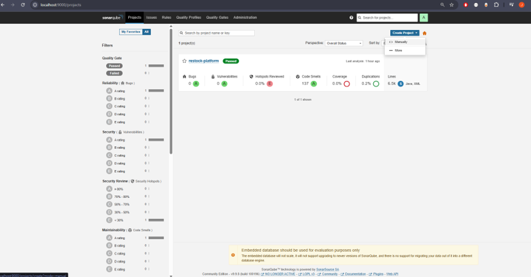
*Inicio de la configuración del entorno de evaluación para el frontend, iniciando la creación manual de un nuevo proyecto en el panel de SonarQube.*

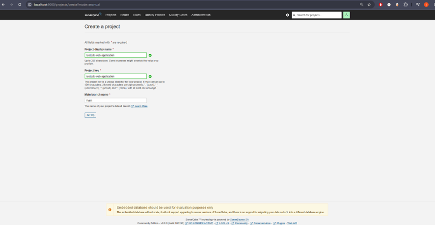
*Definición del identificador único del proyecto (`restock-web-application`) y la rama principal, estableciendo el espacio de trabajo para el código fuente del cliente.*

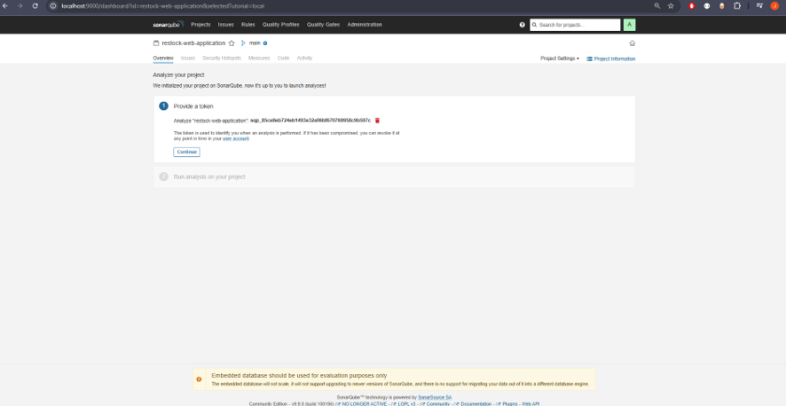
*Generación del token de autenticación dedicado para el proyecto frontend, garantizando la seguridad en la transmisión de métricas hacia el servidor.*

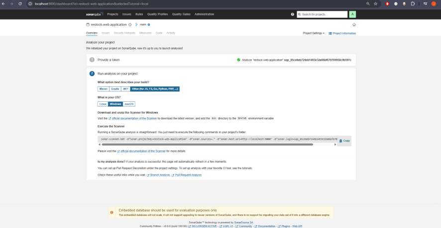
*Obtención de las directivas de ejecución proporcionadas por SonarQube para entornos web (JavaScript/TypeScript) mediante el uso del escáner independiente.*

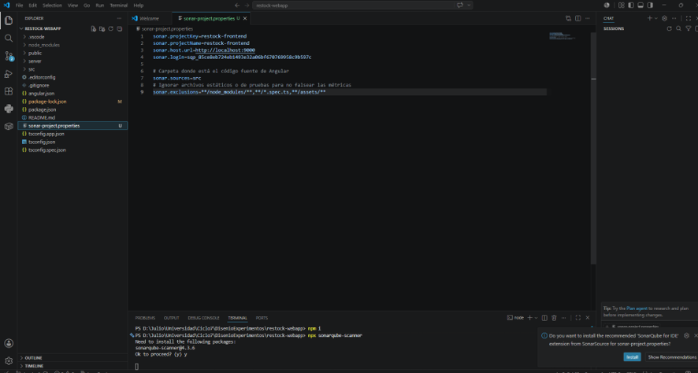
*Configuración de los parámetros en el archivo `sonar-project.properties` y ejecución del comando `npx sonarqube-scanner` en la terminal integrada de VS Code.*

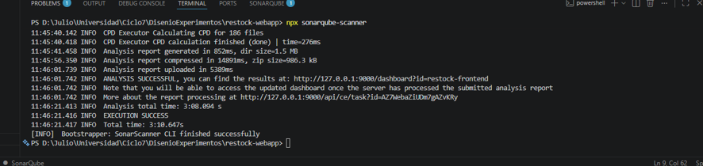
*Validación de la finalización exitosa del escaneo (EXECUTION SUCCESS), confirmando el análisis de los archivos TypeScript, HTML y CSS, y su envío al servidor local.*

**Resultados del Análisis Frontend:**
Al igual que el backend, la aplicación cliente aprobó exitosamente el *Quality Gate*.
* **Mantenibilidad y Fiabilidad:** Se mapeó una deuda técnica de 112 *Code Smells* y 26 advertencias de fiabilidad (Bugs) sobre más de 15,000 líneas de código, comúnmente asociados a variables declaradas pero no utilizadas, aserciones faltantes o estilos no optimizados. El índice de duplicación se mantuvo en un controlable 6.4%.
* **Seguridad Web:** El análisis certificó **0 vulnerabilidades**, garantizando que los formularios, inputs y manejos de eventos de Angular no presentan riesgos de inyección y protegen la integridad de la sesión del usuario en el navegador.

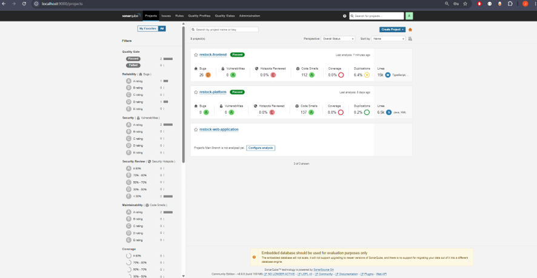
*Dashboard de métricas del frontend demostrando la aprobación del Quality Gate. Destaca la ausencia de vulnerabilidades de seguridad (0) y mapea la deuda técnica actual (112 Code Smells y 26 bugs de fiabilidad) para priorizar su refactorización.*

### 6.2.2. Reviews

Las revisiones de código constituyen una técnica de verificación estática basada en la inspección humana del código fuente y los artefactos del proyecto. A diferencia del análisis automático realizado por SonarQube en la sección anterior, las revisiones permiten evaluar aspectos difíciles de automatizar: claridad de la lógica de negocio, alineación con la arquitectura DDD, coherencia entre bounded contexts y cumplimiento de las convenciones de codificación definidas en 6.2.1.1.

En el proyecto Restock, las revisiones se integraron de forma nativa al flujo de trabajo GitFlow. Cada rama `feature/` requiere la apertura de un Pull Request hacia `develop`, el cual no puede fusionarse sin al menos una aprobación explícita de un miembro del equipo distinto al autor. Este proceso garantiza que todo código que llega a la rama de integración haya pasado por una revisión humana.

---

#### Proceso de Revisión Adoptado

El proceso de revisión se estructura en tres fases:

1. **Apertura del Pull Request:** El autor abre el PR con una descripción que incluye el propósito del cambio, los bounded contexts afectados y los casos cubiertos por las pruebas. El título del PR sigue el formato de Conventional Commits definido en 6.2.1.1.

2. **Revisión por pares:** Al menos un miembro del equipo revisa el diff línea a línea, dejando comentarios en el propio PR. El revisor verifica el cumplimiento de las convenciones de codificación, la corrección funcional y la ausencia de vulnerabilidades evidentes.

3. **Resolución y aprobación:** El autor responde cada comentario —corrigiendo, refactorizando o justificando— y el revisor aprueba el PR una vez que los hallazgos han sido atendidos. Solo entonces se realiza el merge.

---

#### Checklist de Revisión

Para homogeneizar el criterio entre los revisores, el equipo definió la siguiente lista de verificación aplicable a todos los PRs del backend y frontend:

| # | Criterio | Tecnología |
|:---:|---|---|
| 1 | Los identificadores (clases, métodos, variables) siguen las convenciones de nombrado de la tecnología correspondiente | Todos |
| 2 | No se utilizan valores *hardcoded*; las constantes están declaradas en el lugar apropiado | Todos |
| 3 | No existen bloques `try/catch` genéricos en controladores; el manejo de errores pasa por middleware | Spring Boot |
| 4 | Los DTOs de entrada y salida tienen el sufijo `Request`/`Response` | Spring Boot |
| 5 | Los componentes de Vue/Angular tienen estilos `scoped` y no contaminan el scope global | Frontend |
| 6 | No se combina `v-if` con `v-for` en el mismo elemento | Vue |
| 7 | Los steps de Gherkin no hacen referencia a detalles de UI; describen comportamiento de negocio | Gherkin |
| 8 | El commit message del PR sigue el formato Conventional Commits | Todos |
| 9 | Los bounded contexts no se acoplan directamente; toda comunicación pasa por la fachada o ACL | Spring Boot |
| 10 | No se introducen `System.out` ni `console.log` en código de producción | Todos |

---

#### Pull Requests Revisados

A continuación se presenta una selección representativa de Pull Requests revisados durante el desarrollo del proyecto, correspondientes a los bounded contexts principales de la plataforma.

| PR | Título | Autor | Revisor | Bounded Context | Hallazgos | Estado |
|:---:|---|---|---|---|:---:|:---:|
| #12 | feat(iam): implement JWT authentication flow | Julio Castro | José Guerra | IAM | 2 | Aprobado |
| #18 | feat(resource): add low-stock alert generation | Gabriela Shapiama | Ivan Sanchez | Resource | 3 | Aprobado |
| #24 | feat(planning): recipe ingredient cost calculation | Ario Chavez | Julio Castro | Planning | 1 | Aprobado |
| #31 | feat(subscriptions): subscription plan upgrade logic | Ivan Sanchez | Ario Chavez | Subscriptions | 2 | Aprobado |
| #37 | feat(monitoring): acl integration with planning context | José Guerra | Gabriela Shapiama | Monitoring / Planning | 4 | Aprobado |
| #44 | feat(resource): supplier order status transitions | Gabriela Shapiama | José Guerra | Resource | 1 | Aprobado |
| #52 | feat(web): inventory module with supply catalog | Ivan Sanchez | Julio Castro | Frontend | 3 | Aprobado |
| #58 | feat(mobile-kotlin): order creation flow for restaurant | Ario Chavez | Ivan Sanchez | Mobile (Kotlin) | 2 | Aprobado |

---

#### Resultados

A lo largo del proyecto se revisaron más de 50 Pull Requests. El proceso de revisión por pares permitió detectar y corregir defectos antes de la integración, en especial acoplamientos indebidos entre bounded contexts y desviaciones de las convenciones de codificación. Los hallazgos de Tipo B resultaron los más críticos para la integridad de la arquitectura DDD, mientras que los de Tipo A fueron los más frecuentes. La combinación de revisión humana con el análisis estático automatizado de SonarQube conformó un proceso de verificación estática de dos capas que redujo la deuda técnica acumulada y fortaleció la calidad del código base previo a la validación dinámica documentada en 6.1.

---

## 6.3. Validation Interviews

En esta sección se documentan las entrevistas de validación realizadas para evaluar la experiencia de los usuarios al interactuar con Restock. El proceso considera la participación de los segmentos objetivo (administradores de restaurantes y proveedores), quienes validarán el Landing Page, la aplicación web y las aplicaciones móviles mediante flujos representativos del sistema. Asimismo, los hallazgos obtenidos servirán como base para el registro de entrevistas y la evaluación heurística correspondiente.

### 6.3.1. Diseño de Entrevistas

Para garantizar que la aplicación cumpla con las necesidades reales de los usuarios finales, se diseñó un proceso de entrevistas de validación centrado en dos segmentos objetivo clave: administradores de restaurantes y proveedores de insumos. Cada sesión de validación incluirá interacción con el Landing Page, la aplicación web y las aplicaciones móviles correspondientes a cada segmento, siguiendo flujos de usuario específicos que cubren funcionalidades críticas del sistema.

### Objetivo General

Validar la usabilidad, comprensión y utilidad de las funcionalidades del sistema a través de sesiones controladas de interacción, aplicando principios de evaluación heurística y recogiendo observaciones cualitativas.

### Segmento 1: Administradores de Restaurantes

#### Elementos a validar

- Claridad del valor ofrecido en el Landing Page.
- Flujo de suscripción y pago.
- Registro y gestión de insumos.
- Gestión de lotes e inventario.
- Gestión de ventas y recetas.
- Visualización y selección de proveedores.
- Realización y seguimiento de pedidos.
- Panel de alertas y resúmenes.
- Uso de la aplicación móvil para restaurantes.

#### Flujos de Usuario a evaluar

- Desktop & Mobile User Flow 1: Suscripción y pago con Stripe.
- Desktop & Mobile User Flow 3: Registro y gestión de insumos.
- Desktop & Mobile User Flow 4: Resumen e indicadores.
- Desktop & Mobile User Flow 5: Visualización de proveedores y productos.
- Desktop & Mobile User Flow 6: Seguimiento de pedidos.
- Desktop & Mobile User Flow 7: Comentarios a proveedores.
- Desktop & Mobile User Flow 8: Registro y visualización de ventas.
- Desktop & Mobile User Flow 9: Creación y gestión de recetas.

#### Actividades durante la sesión

- Navegar el Landing Page y explicar lo que entienden del producto.
- Simular una suscripción desde un plan.
- Usar el módulo de inventario: registrar, editar y filtrar insumos.
- Registrar o revisar lotes asociados a los insumos.
- Acceder al panel de resumen y describir lo que entienden.
- Navegar por proveedores, seleccionar uno y simular una orden.
- Revisar el estado de seguimiento de un pedido.
- Realizar comentarios sobre proveedores.
- Registrar una venta.
- Crear una receta.
- Usar la aplicación móvil de restaurantes para revisar inventario, alertas o pedidos.

### Segmento 2: Proveedores de Restaurantes

#### Elementos a validar

- Claridad del valor en el Landing Page.
- Flujo de suscripción y pago.
- Gestión de catálogo de productos.
- Registro y edición de productos ofrecidos.
- Eliminación de insumos o productos no disponibles.
- Revisión de pedidos realizados por restaurantes.
- Gestión de órdenes recibidas.
- Actualización del estado de pedidos.
- Interacción con comentarios recibidos.
- Uso de la aplicación móvil para proveedores.

#### Flujos de Usuario a evaluar

- Desktop & Mobile User Flow 1: Suscripción y pago.
- Desktop & Mobile User Flow 10: Registro y gestión de productos en el catálogo.
- Desktop & Mobile User Flow 11: Eliminación de insumos.
- Desktop & Mobile User Flow 12: Gestión de órdenes recibidas.
- Desktop & Mobile User Flow 13: Panel principal del proveedor.

#### Actividades durante la sesión

- Explorar el Landing Page y describir su comprensión del producto.
- Simular el proceso de registro y suscripción.
- Ingresar al sistema y registrar productos en su catálogo.
- Editar información de productos registrados.
- Eliminar productos del catálogo.
- Revisar pedidos recibidos de restaurantes.
- Consultar el detalle de una orden recibida.
- Actualizar el estado de una orden.
- Revisar comentarios o calificaciones recibidas.
- Usar la aplicación móvil de proveedores para revisar pedidos y actualizar estados.
- Comentar sobre la utilidad de la interfaz de pedidos y feedback.

### Herramientas y Recursos para Validación

- **Formato de Evaluación Heurística:** Se aplicarán los 10 principios heurísticos de Nielsen en cada sesión, de acuerdo con el formato de evaluación indicado para el proyecto.
- **Instrumento de observación:** Lista de verificación + sección de notas abiertas.
- **Grabación de pantalla y voz:** previa autorización, para análisis posterior.
- **Productos a validar:** Landing Page, aplicación web, aplicación móvil para restaurantes y aplicación móvil para proveedores.

### 6.3.2. Registro de Entrevistas

#### Segmento 1: Dueños o administradores de Restaurantes

**Entrevista 1:**

**Nombre:** Alfredo Bernuy
**Edad:** 52 años
**Distrito:** Chorrillos
**Timing:** (00:00- 05:18 min)


 
Ver entrevista: https://shorturl.at/YDftM

**Resumen:**
Alfredo Bernuy, administrador de restaurantes con 4 años de experiencia, tiene 52 años, es casado y vive en el distrito de Chorrillos, Lima. Es una persona comprometida y orientada a la mejora continua.

Alfredo Bernuy destaca que la plataforma le resulta muy intuitiva desde el primer acceso: los menús están organizados de forma clara, los botones de acción son fácilmente reconocibles y el flujo para crear o modificar pedidos se siente natural y ágil. Valora especialmente la sección de gestión de stock, que le permite visualizar en tiempo real los niveles de inventario, recibir alertas automáticas al alcanzar el mínimo definido y filtrar por categorías o fechas para detectar tendencias.

Por otro lado, subraya que el diseño es moderno y atractivo: la paleta de colores es sobria pero actual, la tipografía resulta legible y los iconos comunican su función de un vistazo. Considera que la herramienta le brinda un control total sobre pedidos y stock, le ahorra tiempo y le transmite la confianza necesaria para optimizar sus operaciones diarias.

**Entrevista 2:**

**Nombre:** Mery Pilar
**Edad:** 49 años
**Distrito:** Chorrillos
**Timing:** (05:19 - 10:50 min)


Ver entrevista: https://shorturl.at/YDftM

**Resumen:**

Mery Pilar, administradora de restaurantes con 6 años de experiencia, tiene 49 años, es casada y vive en el distrito de Chorrillos, Lima. Es una persona responsable y orientada a la mejora continua e innovación.

Mery Pilar resalta que la herramienta es sumamente sencilla de usar desde el primer contacto: los apartados están dispuestos de manera ordenada, los elementos interactivos resultan intuitivos y el proceso para generar o actualizar pedidos fluye de forma muy eficiente. Aprecia de forma especial el módulo de control de inventario, que le permite monitorear al instante las existencias, recibir notificaciones automáticas cuando un artículo llega al stock mínimo y aplicar filtros por categoría o periodo para identificar patrones de consumo.

Además, enfatiza que la apariencia es fresca y profesional: los tonos empleados son elegantes sin dejar de ser actuales, la tipografía se lee con total nitidez y los iconos transmiten claramente su función. En su opinión, esta solución le proporciona el dominio completo sobre pedidos e inventario, optimiza su tiempo y le infunde la seguridad necesaria para mejorar sus operaciones diarias.

**Entrevista 3:**

**Nombre:** Julián
**Edad:** 34 años
**Distrito:** Lima, San Isidro
**Timing:** (00:00 - 13:00 min)


Ver entrevista: [Enlace a la entrevista](https://upcedupe-my.sharepoint.com/:v:/g/personal/u202213468_upc_edu_pe/IQAFxviA7a9cQKs3uzUhPgIKAU1agPonNAaaWMXb2IzJl1c?nav=eyJyZWZlcnJhbEluZm8iOnsicmVmZXJyYWxBcHAiOiJPbmVEcml2ZUZvckJ1c2luZXNzIiwicmVmZXJyYWxBcHBQbGF0Zm9ybSI6IldlYiIsInJlZmVycmFsTW9kZSI6InZpZXciLCJyZWZlcnJhbFZpZXciOiJNeUZpbGVzTGlua0NvcHkifX0&e=71oZfT)

**Resumen:**
Julián es el administrador y dueño de un restaurante de hamburguesas en Lima. Durante la validación, navegó por la Landing Page y consideró que las propuestas de valor más pertinentes para su negocio son la gestión de compras, la creación de recetas y el control de mermas/residuos, ya que en el rubro gastronómico el desperdicio impacta directamente en la rentabilidad. Al probar el módulo de Inventario, registró insumos como carne y pan, estableciendo cantidades y precios, pero indicó que el término "Acciones máximas" le resultó confuso y reportó haber obtenido una alerta de error en la interfaz.

En la sección de Órdenes, simuló de manera fluida el envío de un pedido al proveedor. Sin embargo, en el módulo de Ventas, señaló que la estructura actual es demasiado simple para un negocio real, dado que su catálogo tiene más de 60 productos y sus clientes suelen personalizar las órdenes de forma detallada (añadiendo adicionales como tocino, piña o salsas), lo cual el sistema no permite registrar de forma flexible. Finalmente, recomendó aclarar la procedencia del stock en órdenes (si es de almacén propio o de proveedor) y agregar avisos claros que confirmen cuando una acción se guarda con éxito.

#### Segmento 2: Proveedores de Restaurantes

**Entrevista 1:**

**Nombre:** Miguel Angel Leal
**Edad:** 28 años
**Ubicación:** Lima, Santo Domingo
**Timing:** (10:50 min)


Ver entrevista: https://youtu.be/GZVfKIVKNkA

**Resumen:**
Miguel Angel Leal es un proveedor que actualmente se encarga de gestionar su restaurante. El comenta que su experiencia con la pagina fue bastante grata, aunque igualmente nos da su opinion respecto a la estructura de algunos aspectos que puede ser plan de pagos, la implementacion de un numero telefonico en el apartado de registro y finalmente agregar mas funciones como calidad de distribuidor entre otras, pero en sus opiniones generales dice que nuestra webb esta en buen camino.

**Entrevista 2:**

**Nombre:** Andrea Roncal Vargas
**Edad:** 25 años
**Ubicación:** Lima, Independencia
**Timing:** (10:00 min)


Ver entrevista: https://youtu.be/iEu1wEoSrv0

**Resumen:**
Andrea Roncal trabaja en un restaurante, donde ayuda en la gestion con sus compañeros de trabajo, ya que igual que es es un proveedora, a diferencia del entrevistado anterior, ella nos dios su pespectiva respecto a la implementeacion de guias visuales para ayudar en la navecacion ya sea de registro, como hacer insumos entro otras cosas pequeñas, igual que el entrevistado piensa en el plan de pagos deberia ser ampliados agregando mas planes para adecuarse al presupuesto de restaurante, sin olvidar que nos pidio pulir el apartado de reseña, luego de eso nos dijo que ibamos por buen camino con la horientacion del proyecto.

**Entrevista 3:**

**Nombre:** Alfonso
**Edad:** 31 años
**Ubicación:** Lima, San Miguel
**Timing:** (00:00 - 09:30 min)


Ver entrevista: [Enlace a la entrevista](https://upcedupe-my.sharepoint.com/:v:/g/personal/u202213468_upc_edu_pe/IQBSyVYnjaaNTqRY4OOmPokhATz7Gnj-NxZnxQIblpJlIBI?nav=eyJyZWZlcnJhbEluZm8iOnsicmVmZXJyYWxBcHAiOiJPbmVEcml2ZUZvckJ1c2luZXNzIiwicmVmZXJyYWxBcHBQbGF0Zm9ybSI6IldlYiIsInJlZmVycmFsTW9kZSI6InZpZXciLCJyZWZlcnJhbFZpZXciOiJNeUZpbGVzTGlua0NvcHkifX0&e=vYC5Ab)

**Resumen:**
Alfonso es un proveedor comercial con experiencia en gestión de distribución y ventas B2B. Durante su interacción con Restock Suppliers, evaluó positivamente el proceso de registro, catalogándolo como amigable y rápido en comparación con otros sistemas que exigen validaciones redundantes o datos irrelevantes. Asimismo, consideró la interfaz general del panel principal como intuitiva y fácil de navegar.

Al simular el registro de productos en el Inventario (pan gourmet), consideró que el sistema funciona de manera eficiente. Sin embargo, sugirió que la plataforma debería permitir el registro de productos personalizados por campo abierto para aquellos que no se encuentran en las categorías preestablecidas. También recomendó implementar una notificación visual de éxito ("Producto guardado correctamente") tras realizar un registro. Finalmente, valoró positivamente la separación de pedidos en pestañas de estado (Nuevas, En proceso e Historial), ya que ayuda a organizar adecuadamente la logística diaria de entrega.

### 6.3.3. Evaluaciones según heurísticas

Esta sección contiene el proceso de evaluación de las sesiones de validación basado en heurísticas, considerando heurísticas de usabilidad, arquitectura de información e inclusive design de la experiencia propuesta. Para esto, la sección contiene la estructura del formato para evaluaciones de heurísticas indicado en el Anexo D. Formato para Evaluación de User Experience según Heurísticas.

**SITE o APP A EVALUAR:**
Restock (Plataforma Web para Administradores de Restaurantes y Aplicación Web Restock Suppliers para Proveedores)

**TAREAS A EVALUAR:**
El alcance de esta evaluación incluye la revisión de la usabilidad de las siguientes tareas:
1. Navegación en el Landing Page de Restock para la comprensión de las propuestas de valor.
2. Proceso de registro e inicio de sesión de usuario (tanto en la aplicación web para restaurantes como en la web para proveedores).
3. Registro, edición y gestión de insumos/productos en el inventario del restaurante.
4. Registro de nuevos productos y actualización de precios en el catálogo de proveedores.
5. Simulación, creación y envío de pedidos (órdenes de compra) a proveedores asignados.
6. Registro de ventas diarias en la caja registradora del restaurante para verificar el descuento de insumos en inventario.
7. Visualización y navegación del historial de pedidos del proveedor organizado por pestañas de estado (Nuevas, En proceso, Historial).

No están incluidas en esta versión de la evaluación las siguientes tareas:
1. Pasarela de cobros reales y automatizados para el pago de las membresías/suscripciones mensuales.
2. Sincronización en tiempo real de inventarios locales del restaurante con software POS externo.
3. Envío y visualización de notificaciones push en tiempo real ante niveles críticos de stock bajo.
4. Exportación en formatos de hoja de cálculo (Excel, PDF) de análisis avanzados de mermas y balances mensuales.

**ESCALA DE SEVERIDAD:**
Los errores serán puntuados tomando en cuenta la siguiente escala de severidad:

| Nivel | Descripción |
|---|---|
| **1** | **Problema superficial:** puede ser fácilmente superado por el usuario o ocurre con muy poca frecuencia. No necesita ser arreglado a no ser que exista disponibilidad de tiempo. |
| **2** | **Problema menor:** puede ocurrir un poco más frecuentemente o es un poco más difícil de superar para el usuario. Se le debería asignar una prioridad baja de cara al siguiente release. |
| **3** | **Problema mayor:** ocurre frecuentemente o los usuarios no son capaces de resolverlos. Es importante que sean corregidos y se les debe asignar una prioridad alta. |
| **4** | **Problema muy grave:** un error de gran impacto que impide al usuario continuar con el uso de la herramienta. Es imperativo que sea corregido antes del lanzamiento. |

**TABLA RESUMEN:**

| # | Problema | Escala de severidad | Heurística/Principio violada(o) |
|---|---|:---:|---|
| 1 | Campo rotulado como "Acciones máximas" en el registro de inventario causa confusión | 2 | Usability: Consistencia y estándares / Relación entre el sistema y el mundo real |
| 2 | Alerta de error genérica e inesperada al intentar guardar un producto en el inventario de restaurantes | 3 | Usability: Prevención de errores / Reconocimiento, diagnóstico y recuperación de errores |
| 3 | Imposibilidad de agregar adicionales o productos personalizados en el registro de ventas diarias | 3 | Usability: Flexibilidad y eficiencia de uso |
| 4 | Ambigüedad sobre la propiedad del stock (propio o del proveedor) al generar una orden de compra | 2 | Information Architecture: Is it usable? |
| 5 | Falta de mensajes de confirmación de éxito ("toast" o banners) al registrar productos en el catálogo de proveedores | 2 | Usability: Visibilidad del estado del sistema |
| 6 | Ausencia de categorías personalizadas o entrada de texto libre para clasificar nuevos productos en el catálogo de proveedores | 2 | Usability: Flexibilidad y eficiencia de uso |
| 7 | Falta de planes de pago flexibles o adaptados al presupuesto real de pequeños restaurantes y proveedores | 2 | Information Architecture: Is it findable? / Usabilidad: Relación entre el sistema y el mundo real |
| 8 | Ausencia de guías visuales o tutoriales de navegación rápida para usuarios nuevos | 1 | Usability: Ayuda y documentación |

**DESCRIPCIÓN DE PROBLEMAS:**

**PROBLEMA #1: Campo rotulado como "Acciones máximas" en el registro de inventario causa confusión**
* **Severidad:** 2
* **Heurística violada:** Usabilidad - Consistencia y estándares / Relación entre el sistema y el mundo real
* **Problema:** Al momento de ingresar o modificar un producto en la sección de inventario, el usuario Julián observó un campo etiquetado como "Acciones máximas", lo que generó confusión ya que en el rubro de restaurantes se acostumbra usar términos como "Stock máximo" o "Capacidad máxima". El término actual no corresponde al lenguaje del negocio y se asocia de forma incorrecta con precios.
* **Recomendación:** Renombrar el campo a "Stock Máximo" o "Límite de Almacén" para adecuarse al lenguaje y estándares del rubro.

**PROBLEMA #2: Alerta de error genérica e inesperada al intentar guardar un producto en el inventario de restaurantes**
* **Severidad:** 3
* **Heurística violada:** Usabilidad - Prevención de errores / Reconocimiento, diagnóstico y recuperación de errores
* **Problema:** Al intentar guardar los cambios de un producto alimentario en el módulo de Inventario, el sistema arrojó un error técnico en pantalla sin dar explicaciones ni sugerencias de cómo corregirlo. Esto interrumpió el flujo del usuario y requirió cancelar el proceso.
* **Recomendación:** Diseñar mensajes de error amigables que expliquen detalladamente la causa del fallo (ej. "Falta rellenar campos obligatorios" o "Error de conexión") y provean alternativas de solución.

**PROBLEMA #3: Imposibilidad de agregar adicionales o productos personalizados en el registro de ventas diarias**
* **Severidad:** 3
* **Heurística violada:** Usabilidad - Flexibilidad y eficiencia de uso
* **Problema:** El módulo de ventas presenta una lista rígida de platos base (ej. papa a la huancaína) sin permitir la adición de ingredientes extra o adicionales (ej. tocino, queso, piña) que los clientes reales suelen pedir frecuentemente. Esto obliga a realizar múltiples registros manuales o externos fuera del sistema.
* **Recomendación:** Rediseñar la sección de registro de ventas para permitir seleccionar modificadores, adicionales y cantidades libres en los platos seleccionados.

**PROBLEMA #4: Ambigüedad sobre la propiedad del stock al generar una orden de compra**
* **Severidad:** 2
* **Heurística violada:** Arquitectura de la Información - Is it usable?
* **Problema:** En el flujo de reabastecimiento (sección Órdenes), el sistema muestra cantidades numéricas bajo la columna de stock, pero el usuario no logra distinguir con claridad si se refiere a las existencias remanentes en el almacén de su restaurante o al stock disponible que tiene el proveedor asignado.
* **Recomendación:** Clarificar la etiqueta de la columna, renombrándola como "Stock en Almacén del Restaurante" y agregando un indicador del "Stock disponible del Proveedor".

**PROBLEMA #5: Falta de mensajes de confirmación de éxito ("toast" o banners) al registrar productos en el catálogo de proveedores**
* **Severidad:** 2
* **Heurística violada:** Usabilidad - Visibilidad del estado del sistema
* **Problema:** Tras guardar un pan gourmet en el catálogo de la versión web de proveedores, la pantalla vuelve al listado de manera abrupta sin mostrar ninguna confirmación de que el registro fue guardado con éxito. El usuario Alfonso sintió desconfianza de si la operación realmente se había realizado hasta que refrescó la pantalla.
* **Recomendación:** Añadir un mensaje visual flotante (*toast* o notificación de tipo snackbar) en la esquina superior/inferior de la pantalla con el texto: "Producto registrado exitosamente".

**PROBLEMA #6: Ausencia de categorías personalizadas o entrada de texto libre para clasificar nuevos productos en el catálogo de proveedores**
* **Severidad:** 2
* **Heurística violada:** Usabilidad - Flexibilidad y eficiencia de uso
* **Problema:** En la versión web de proveedores, al registrar un nuevo insumo, el selector de categorías obliga al usuario a elegir entre opciones fijas muy restringidas. Si el proveedor maneja bebidas especializadas u otros insumos no contemplados, no tiene forma de clasificar adecuadamente su oferta.
* **Recomendación:** Habilitar un campo de texto libre o añadir la opción "Otro / Categoría Personalizada" para que el usuario defina libremente el tipo de producto.

**PROBLEMA #7: Falta de planes de pago flexibles o adaptados al presupuesto real de pequeños restaurantes y proveedores**
* **Severidad:** 2
* **Heurística violada:** Arquitectura de la Información - Is it findable? / Usabilidad - Ajuste entre el sistema y el mundo real
* **Problema:** Tanto el dueño del restaurante como el proveedor identificaron que el selector de planes de membresía/suscripción es muy básico y no ofrece opciones escalonadas o adaptables para pequeños negocios locales, lo que genera dudas sobre la viabilidad financiera de adquirir el servicio de Restock.
* **Recomendación:** Diseñar una sección de planes con una arquitectura de información más delinear o detallada que exponga planes escalonados (Gratuito, Básico, Premium) ajustados a diferentes tamaños de negocio.

**PROBLEMA #8: Ausencia de guías visuales o tutoriales de navegación rápida para usuarios nuevos**
* **Severidad:** 1
* **Heurística violada:** Usabilidad - Ayuda y documentación
* **Problema:** El sistema no provee una guía rápida de inducción o *onboarding* durante el primer inicio de sesión, lo que obliga al usuario a aprender a navegar en la herramienta por ensayo y error.
* **Recomendación:** Incorporar un asistente de ayuda visual (*walkthrough* interactivo) que señale brevemente la función de cada módulo del panel principal en el primer ingreso.


## 6.4. Auditoría de Experiencias de Usuario

### 6.4.1. Auditoría realizada

#### 6.4.1.1. Información del grupo auditado

**UX Heuristics & Principles Evaluation**
**Usability – Inclusive Design – Information Architecture**

| Campo | Detalle |
|---|---|
| **Carrera** | Ingeniería de Software |
| **Curso** | Diseño de Experimentos de Ingeniería de Software |
| **NRC** | 10253 |
| **Profesor** | Juan Carlos Tinoco Licas |
| **Auditor** | Restock Team (UI-Topic) — Castro Alejos Julio Daniel, Chavez Uribe Ario, Guerra Perez José Jahaziel, Sanchez Guevara Ivan Fernando, Shapiama Rivera Gabriela Nicole |
| **Cliente(s)** | Budgetly |

##### SITE y APP A EVALUAR

**Budgetly** — Plataforma web orientada a dividir y gestionar los gastos del hogar de forma proporcional según el ingreso de cada miembro.

https://equilibriac.github.io/Budgetly-LandingPage/

https://budgetly-exp-app.web.app/


##### TAREAS A EVALUAR

El alcance de esta evaluación incluye la revisión de la usabilidad de las siguientes tareas:

1. Inicio de sesión con correo y contraseña
2. Registro de una cuenta nueva (rol Representante o Miembro)
3. Creación y administración de un hogar (Household)
4. Invitación y gestión de miembros del hogar
5. Registro y gestión de gastos / facturas (Bills)
6. Asignación de ingresos y contribuciones proporcionales por hogar
7. Configuración de la cuenta (idioma, modo oscuro, notificaciones)
8. Visualización del perfil de usuario
9. Vista de miembro: seguimiento de "Mis aportes" y "Estado del hogar"

No están incluidas en esta versión de la evaluación las siguientes tareas:

1. Flujo completo de pago / suscripción al plan Premium
2. Recuperación de contraseña olvidada
3. Aplicación móvil (no se evidenció su existencia)
4. Pruebas de carga, seguridad o rendimiento sobre la API

---

#### 6.4.1.2. Cronograma de auditoría realizada

| Actividades de Auditoria realizada |Fecha | Hora | Realizado por|
|------------------------------------|------|------|--------------|
| Envío de solicitud de información  | 8/06/2026 | 3:00 pm     |    Fernando Sanchez     |  
| Recepción de información           | 9/06/2026 |  9:30 pm  |  Fernando Sanchez   |  
| Ejecución del proceso de auditoría | 10/06/2026 |  4:40 pm   |  Fernando Sanchez   |  
| Elaboración del informe de auditoría | 12/06/2026 |   3:30 pm   |  Fernando Sanchez   |  
| Envío del informe de auditoría  |  14/06/2026 |  11:00 am    |  Fernando Sanchez   |  

#### 6.4.1.3. Contenido de auditoría realizada

##### ESCALA DE SEVERIDAD

Los errores serán puntuados tomando en cuenta la siguiente escala de severidad:

| Nivel | Descripción |
|---|---|
| 1 | Problema superficial: puede ser fácilmente superado por el usuario o ocurre con muy poca frecuencia. No necesita ser arreglado a no ser que exista disponibilidad de tiempo. |
| 2 | Problema menor: puede ocurrir un poco más frecuentemente o es un poco más difícil de superar para el usuario. Se le debería asignar una prioridad baja resolverlo de cara al siguiente release. |
| 3 | Problema mayor: ocurre frecuentemente o los usuarios no son capaces de resolverlos. Es importante que sean corregidos y se les debe asignar una prioridad alta. |
| 4 | Problema muy grave: un error de gran impacto que impide al usuario continuar con el uso de la herramienta. Es imperativo que sea corregido antes del lanzamiento. |

---

##### TABLA RESUMEN

| # | Problema | Severidad | Heurística/Principio violado(o) |
|---|---|---|---|
| 1 | Inconsistencia de idioma entre pantallas de la plataforma | 2 | Usability: Consistency and standards |
| 2 | Inconsistencia de marca (logo "Budgetly" vs "MyApp") | 2 | Usability: Consistency and standards |
| 3 | Bajo contraste en el texto "Forgot Password?" | 1 | Accessibility: Legibility and contrast |
| 4 | Botón de notificaciones no funcional en la sección Members | 2 | Visibility: Visibility of system status |
| 5 | Claves de traducción sin resolver visibles en la interfaz | 3 | Usability: Aesthetic and minimalist design |
| 6 | Miembros invitados se muestran sin nombre visible | 2 | Usability: Recognition over recall |
| 7 | Falta de validación al crear un Household | 2 | Usability: Error prevention |
| 8 | Mensaje de error genérico al eliminar un household | 2 | Visibility: Visibility of system status |
| 9 | Discrepancia entre la fecha seleccionada y la fecha guardada al crear un Bill | 3 | Usability: User freedom and control |
| 10 | El botón "Save" no guarda si los porcentajes no suman 100%, sin aviso claro | 3 | Visibility: Visibility of system status |
| 11 | Falta de validación de montos extremos en el campo "Income" | 2 | Usability: Error prevention |
| 12 | Mensajes de error técnicos (códigos HTTP) expuestos directamente al usuario | 3 | Visibility: Visibility of system status |
| 13 | Página de Perfil completamente vacía | 3 | Usability: Aesthetic and minimalist design |
| 14 | Errores de codificación de caracteres (mojibake) en la interfaz y en exportaciones | 2 | Usability: Aesthetic and minimalist design |
| 15 | El botón "Guardar" en "Ingreso mensual" (Mis aportes) no guarda los datos | 3 | Visibility: Visibility of system status |
| 16 | Comportamiento inconsistente entre idioma inglés y español al guardar configuración | 3 | Usability: Consistency and standards |

*Nota. Elaboración propia.*

---

##### RECOMENDACIONES

### Problema n°1: Inconsistencia de idioma entre pantallas de la plataforma

**Severidad:** 2
**Heurística violada:** Usability: Consistency and standards

**Problema:**
El login y el dashboard ("Welcome Back!", "Sign In", "Welcome", "Total Members") están en inglés, mientras que el landing page y ciertos mensajes del propio dashboard ("¡Bienvenido!", "Se ha creado el ID de su hogar...") están en español. El usuario no tiene certeza de en qué idioma está operando la plataforma en cada momento.


**Recomendación:**
Definir un idioma por defecto consistente en toda la aplicación y asegurar que el selector de idioma (visto en Configuración) traduzca el 100% de las pantallas, incluidos modales y mensajes del sistema, no solo las etiquetas estáticas.

---

### Problema n°2: Inconsistencia de marca (logo "Budgetly" vs "MyApp")

**Severidad:** 2
**Heurística violada:** Usability: Consistency and standards

**Problema:**
En la pantalla de inicio de sesión el logo y nombre mostrado es "Budgetly", pero en la pantalla de registro ("Create Account") el mismo elemento muestra el texto "MyApp". Esto genera dudas sobre si se trata de la misma plataforma.


**Recomendación:**
Unificar el nombre e identidad visual de la marca en todas las pantallas de autenticación y del producto.

---

### Problema n°3: Bajo contraste en el texto "Forgot Password?"

**Severidad:** 1
**Heurística violada:** Accessibility: Legibility and contrast

**Problema:**
El enlace "Forgot Password?" en la pantalla de login se muestra en un tono dorado/amarillo claro sobre fondo blanco, dificultando su lectura, en especial para personas con baja visión.


**Recomendación:**
Aumentar el contraste del texto utilizando un tono más oscuro o agregando subrayado, siguiendo las pautas WCAG de accesibilidad.

---

### Problema n°4: Botón de notificaciones no funcional en la sección Members

**Severidad:** 2
**Heurística violada:** Visibility: Visibility of system status

**Problema:**
El ícono de campana de notificaciones ubicado en la cabecera de "Household Members" no responde al hacer clic, dejando al usuario sin acceso a las alertas relacionadas con los miembros del hogar.


**Recomendación:**
Revisar el binding del componente de notificaciones en esta vista y agregar feedback visual (loading, badge, dropdown) al interactuar con él.

---

### Problema n°5: Claves de traducción sin resolver visibles en la interfaz

**Severidad:** 3
**Heurística violada:** Usability: Aesthetic and minimalist design

**Problema:**
En la pantalla "Household Members" aparece literalmente el texto "representativeMembers.header.householdSelector" en lugar de una etiqueta legible, evidenciando una clave de internacionalización (i18n) sin traducir. Esto se repite de forma consistente en varias capturas, afectando la percepción de calidad del producto.


**Recomendación:**
Revisar los archivos de traducción (i18n) para asegurar que todas las claves usadas en el código tengan su valor correspondiente cargado antes de pasar a producción.

---

### Problema n°6: Miembros invitados se muestran sin nombre visible

**Severidad:** 2
**Heurística violada:** Usability: Recognition over recall

**Problema:**
En la tabla de "Household Members", los miembros con estado "Pending" se listan con la columna "Name" vacía (solo se muestra un ícono circular sin iniciales ni texto), impidiendo identificar a quién corresponde cada invitación.


**Recomendación:**
Mostrar al menos el correo electrónico o nombre proporcionado en la invitación mientras el estado sea "Pending", en lugar de dejar el campo vacío.

---

### Problema n°7: Falta de validación al crear un Household

**Severidad:** 2
**Heurística violada:** Usability: Error prevention

**Problema:**
El sistema permitió crear un hogar con nombre "xdddd", descripción "1231321xdd%#@%" y 500 miembros, sin ninguna validación de formato ni límites razonables.


**Recomendación:**
Implementar validaciones de formato y rangos razonables (ej. máximo de miembros, caracteres permitidos en nombre/descripción) tanto en frontend como en backend.

---

### Problema n°8: Mensaje de error genérico al eliminar un household

**Severidad:** 2
**Heurística violada:** Visibility: Visibility of system status

**Problema:**
Al intentar eliminar un hogar, el sistema muestra únicamente "Error: Could not delete the household", sin indicar la causa real (por ejemplo, si tiene miembros o gastos asociados) ni una acción sugerida para resolverlo.


**Recomendación:**
Especificar la causa del error (ej. "No se puede eliminar: el hogar tiene miembros activos") y sugerir el paso a seguir para resolverlo.

---

### Problema n°9: Discrepancia entre la fecha seleccionada y la fecha guardada al crear un Bill

**Severidad:** 3
**Heurística violada:** Usability: User freedom and control

**Problema:**
El campo "Payment day" del formulario "Add Bill" permite seleccionar fechas pasadas (por ejemplo, 19/05/2020), pero al confirmar la creación el sistema registra la fecha actual en lugar de la seleccionada, sin advertir al usuario de esta discrepancia.


**Recomendación:**
Corregir la lógica de guardado para que respete la fecha elegida por el usuario, o en su defecto restringir el selector para que solo permita fechas válidas según la regla de negocio, mostrando un mensaje explicativo.

---

### Problema n°10: El botón "Save" no guarda si los porcentajes no suman 100%, sin aviso claro

**Severidad:** 3
**Heurística violada:** Visibility: Visibility of system status

**Problema:**
En el modal "Edit income and allocations", si la suma de porcentajes asignados por hogar no llega a 100% (ej. 76%), el botón "Save" no guarda los cambios, pero la única señal visible es el texto "Total: 76.00%" en rojo, sin un mensaje que indique que se requiere llegar a 100% para guardar.


**Recomendación:**
Agregar un mensaje de error explícito (ej. "El total debe ser 100% para guardar los cambios") y deshabilitar visualmente el botón "Save" mientras la condición no se cumpla.

---

### Problema n°11: Falta de validación de montos extremos en el campo "Income"

**Severidad:** 2
**Heurística violada:** Usability: Error prevention

**Problema:**
El sistema permitió registrar un ingreso de "39.466.666.666,56 PEN" sin ningún límite superior ni validación de monto razonable, lo que puede distorsionar los cálculos de distribución proporcional.


**Recomendación:**
Definir un rango máximo razonable para el campo de ingresos y mostrar una advertencia si el valor ingresado lo excede.

---

### Problema n°12: Mensajes de error técnicos (códigos HTTP) expuestos directamente al usuario

**Severidad:** 3
**Heurística violada:** Visibility: Visibility of system status

**Problema:**
En varias pantallas (Configuración de Cuenta, Estado del hogar) los errores se muestran como "Request failed with status code 405" o "Request failed with status code 404", textos técnicos pensados para desarrolladores, no para usuarios finales.


**Recomendación:**
Interceptar los errores de la API y traducirlos a mensajes en lenguaje natural y orientados a la acción (ej. "No se pudo guardar tu configuración, intenta nuevamente").

---

### Problema n°13: Página de Perfil completamente vacía

**Severidad:** 3
**Heurística violada:** Usability: Aesthetic and minimalist design

**Problema:**
Al acceder a la sección "Profile" desde el menú lateral, la pantalla se carga completamente en blanco, sin ningún contenido, campo o mensaje de error, dejando al usuario sin saber si la página está cargando, rota o si simplemente no existe contenido.


**Recomendación:**
Implementar el contenido de la vista de Perfil o, en su defecto, mostrar un estado de carga o un mensaje "Próximamente" en lugar de dejar la pantalla vacía.

---

### Problema n°14: Errores de codificación de caracteres (mojibake) en la interfaz y en exportaciones

**Severidad:** 2
**Heurística violada:** Usability: Aesthetic and minimalist design

**Problema:**
En la sección "Mis aportes" las columnas de la tabla muestran "Fecha lÃmite" y "Último movimiento" en lugar de "Fecha límite" y "Último movimiento". El mismo problema de codificación se replica en el archivo CSV exportado ("estado_hogar"), afectando tanto la interfaz como los reportes descargables.


**Recomendación:**
Verificar que todos los archivos de origen, respuestas de la API y exportaciones (CSV) utilicen codificación UTF-8 de forma consistente en todo el flujo de datos.

---

### Problema n°15: El botón "Guardar" en "Ingreso mensual" (Mis aportes) no guarda los datos

**Severidad:** 3
**Heurística violada:** Visibility: Visibility of system status

**Problema:**
En la vista de Miembro, al ingresar un monto en "Ingreso mensual" y presionar "Guardar", el dato no se persiste y no se muestra ningún mensaje de error ni confirmación, dejando al usuario sin saber si la acción fue exitosa.


**Recomendación:**
Corregir el guardado en backend/frontend y mostrar siempre una confirmación visual ("Ingreso actualizado") o un mensaje de error si la operación falla.

---

### Problema n°16: Comportamiento inconsistente entre idioma inglés y español al guardar configuración

**Severidad:** 3
**Heurística violada:** Usability: Consistency and standards

**Problema:**
En "Account Settings" (inglés), al presionar "Save changes" el sistema muestra "Settings saved successfully". Al repetir la misma acción en español ("Configuración de Cuenta" → "Guardar cambios"), el sistema responde con "Request failed with status code 405", pese a tratarse de la misma funcionalidad.


**Recomendación:**
Revisar si el endpoint de guardado de configuración envía algún parámetro de idioma o método HTTP distinto según la localización seleccionada, y unificar el comportamiento para ambos idiomas.


---


### 6.4.2. Auditoría recibida

#### 6.4.2.1. Información del grupo auditor

**UX Heuristics & Principles Evaluation**
**Usability – Inclusive Design – Information Architecture**

| Campo | Detalle |
|---|---|
| **Carrera** | Ingeniería de Software |
| **Curso** | Diseño de Experimentos de Ingeniería de Software |
| **Profesores** | Todos |
| **Auditor** | Equilibria — Grupo 4 |
| **Cliente** | UI-Topic — Grupo 1 |

##### SITE y APP A EVALUAR

**Restock** — Sistema de gestión de inventario, pedidos y ventas para restaurantes y proveedores de insumos.

##### TAREAS EVALUADAS

El alcance de esta evaluación incluyó la revisión de la usabilidad de las siguientes tareas:

1. Registro de un usuario nuevo
2. Inicio de sesión de un usuario
3. Acceder a las distintas secciones de la aplicación
4. Interfaz de la aplicación web
5. Interfaz de la aplicación móvil
6. Claridad de la navegación
7. Realizar pedidos
8. Creación de insumos
9. Añadir al inventario
10. Gestionar pedidos
11. Gestionar recetas

No están incluidas en esta versión de la evaluación las siguientes tareas:

1. Seleccionar una suscripción
2. Selección de idiomas
3. Gestión del perfil de usuario

---

#### 6.4.2.2. Cronograma de auditoría recibida

| Actividades de Auditoría recibida | Fecha | Hora | Realizado por |
|---|---|---|---|
| Envío de solicitud de información al equipo Restock | 8/06/2026 | 3:00 pm | Equilibria — Grupo 4 |
| Recepción de información del equipo Restock | 9/06/2026 | 9:30 pm | Equilibria — Grupo 4 |
| Ejecución del proceso de auditoría | 10/06/2026 | 4:40 pm | Equilibria — Grupo 4 |
| Elaboración del informe de auditoría | 12/06/2026 | 3:30 pm | Equilibria — Grupo 4 |
| Envío del informe de auditoría al equipo Restock | 14/06/2026 | 11:00 am | Equilibria — Grupo 4 |

#### 6.4.2.3. Contenido de auditoría recibida

##### ESCALA DE SEVERIDAD

Los errores serán puntuados tomando en cuenta la siguiente escala de severidad:

| Nivel | Descripción |
|---|---|
| 1 | Problema superficial: puede ser fácilmente superado por el usuario o ocurre con muy poca frecuencia. No necesita ser arreglado a no ser que exista disponibilidad de tiempo. |
| 2 | Problema menor: puede ocurrir un poco más frecuentemente o es un poco más difícil de superar para el usuario. Se le debería asignar una prioridad baja. Resolverlo de cara al siguiente release. |
| 3 | Problema mayor: ocurre frecuentemente o los usuarios no son capaces de resolverlos. Es importante que sean corregidos y se les debe asignar una prioridad alta. |
| 4 | Problema muy grave: un error de gran impacto que impide al usuario continuar con el uso de la herramienta. Es imperativo que sea corregido antes del lanzamiento. |

---

##### TABLA RESUMEN

| # | Problema | Escala de severidad | Heurística/Principio violada(o) |
|:---:|---|:---:|---|
| 1 | En la sección de ventas, el texto "REGISTERED SALES NOT DISCOUNTED IN INVENTORY" resulta ambiguo y difícil de interpretar. | 3 | Information Architecture: Is it clear? |
| 2 | En la sección de notificaciones de los dos usuarios, no se muestra información o texto referencial cuando no se cuenta con alguna notificación. | 2 | Information Architecture: Is it communicative? |
| 3 | En general la imagen superior ocupa demasiado espacio, esto provoca que la información importante sea empujada hacia abajo. | 3 | Usability: Diseño estético y minimalista |
| 4 | Tanto en las secciones de registro y login de la app web, no se especifican otras opciones disponibles de ingresar a la aplicación (Google, Facebook, etc). | 1 | Usability: Visibilidad del estado del sistema |
| 5 | En la sección de inventario de la app móvil, presenta dos acciones principales: Supply y New batch. Sin embargo, la diferencia entre ambas no resulta evidente para usuarios nuevos. | 3 | Usability: Relación entre el sistema y mundo real |
| 6 | En la sección de inventario de la app móvil, presenta grandes áreas vacías entre las secciones Supply Catalog e Inventory (Batches). | 2 | Information Architecture: Is it useful? |
| 7 | En la sección de órdenes de la app móvil, los filtros de estado y precio permanecen visibles incluso cuando no existen pedidos registrados. | 1 | Usability: Diseño estético y minimalista |

*Nota. Elaboración propia.*

---

##### DESCRIPCIÓN DE PROBLEMAS

### Problema 01

**Heurística violada:** Visibilidad del estado del sistema
**Severidad:** 1/4 — Problema superficial

**Problema:**
En las pantallas de inicio de sesión y registro se muestra el texto "Or sign in with", sugiriendo la existencia de métodos alternativos de autenticación. Sin embargo, no se presentan opciones adicionales como Google o Facebook, lo que puede generar confusión y expectativas incorrectas en los usuarios.

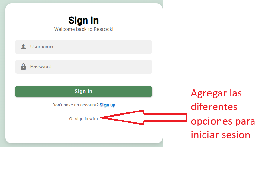

**Recomendaciones:**

- Eliminar el texto si no existen métodos alternativos de autenticación.
- Agregar los botones correspondientes si la funcionalidad está prevista.

---

### Problema 02

**Heurística violada:** Es Comunicativo
**Severidad:** 2/4 — Problema menor

**Problema:**
Cuando el usuario no tiene notificaciones disponibles, la sección permanece vacía sin mostrar ningún mensaje informativo. Esto puede hacer que el usuario dude si realmente no existen notificaciones o si ocurrió un error al cargar la información.

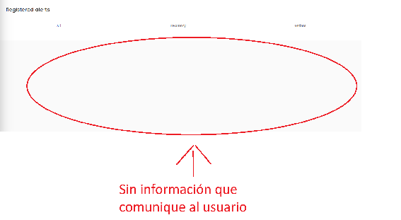

**Recomendación:**

- Mostrar un mensaje como: "No tienes notificaciones pendientes".
- Incorporar un ícono o ilustración que refuerce visualmente el estado vacío.

---

### Problema 03

**Heurística violada:** Diseño estético y minimalista
**Severidad:** 3/4 — Problema grave

**Problema:**
La imagen ubicada en la parte superior de las pantallas consume una cantidad considerable del espacio visible. Como consecuencia, la información y las acciones más relevantes del sistema quedan desplazadas hacia abajo, obligando al usuario a desplazarse para acceder a ellas.

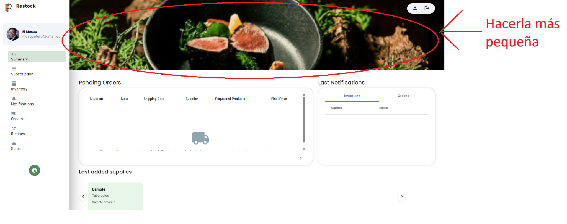

**Recomendación:**

- Reducir la altura de la imagen para priorizar el contenido funcional.
- Reemplazar la imagen por información relevante del negocio o indicadores clave.

---

### Problema 04

**Heurística violada:** Es Claro
**Severidad:** 3/4 — Problema grave

**Problema:**
En la sección de ventas se muestra el texto "REGISTERED SALES NOT DISCOUNTED IN INVENTORY" para identificar un conjunto de registros. Sin embargo, la redacción resulta poco clara y puede generar confusión sobre su significado, ya que el término *discounted* suele asociarse a descuentos de precio y no a la deducción de insumos del inventario. Esto obliga al usuario a interpretar el mensaje antes de comprender la función de la sección.

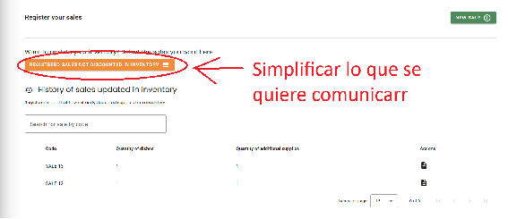

**Recomendación:**

- Utilizar una redacción más simple y descriptiva, por ejemplo: "Sales Pending Inventory Update" o "Sales Awaiting Stock Deduction".
- Incluir una breve descripción o ayuda contextual que explique el estado de estas ventas y su relación con el inventario.

---

### Problema 05

**Heurística violada:** Relación entre el sistema y mundo real
**Severidad:** 3/4 — Problema mayor

**Problema:**
La pantalla presenta dos acciones principales: Supply y New batch. Sin embargo, la diferencia entre ambas no resulta evidente para usuarios nuevos, ya que los términos no explican claramente qué elemento se está creando ni cómo se relacionan entre sí dentro del inventario.

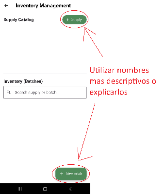

**Recomendación:**

- Incorporar una breve explicación contextual de cada acción.
- Utilizar nombres más descriptivos, por ejemplo *"Create Supply"* y *"Register Batch"*.

---

### Problema 06

**Heurística violada:** Es Útil
**Severidad:** 2/4 — Problema superficial

**Problema:**
La pantalla presenta grandes áreas vacías entre las secciones Supply Catalog e Inventory (Batches). Cuando no existen registros, el espacio disponible no se aprovecha para informar al usuario sobre el estado actual del inventario ni para orientarlo sobre las acciones que puede realizar. Esto genera una sensación de aplicación incompleta y dificulta comprender qué debe hacerse a continuación.

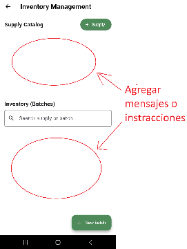

**Recomendación:**

- Mostrar mensajes de estado vacío como *"No supplies registered"* o *"No inventory batches available"*.
- Utilizar parte del espacio para proporcionar instrucciones o accesos directos a las acciones principales.

---

### Problema 07

**Heurística violada:** Diseño estético y minimalista
**Severidad:** 1/4 — Problema superficial

**Problema:**
Los filtros de estado y precio permanecen visibles incluso cuando no existen pedidos registrados. Esto puede generar una experiencia poco eficiente, ya que el usuario puede interpretar que existen datos para filtrar cuando la lista se encuentra vacía.

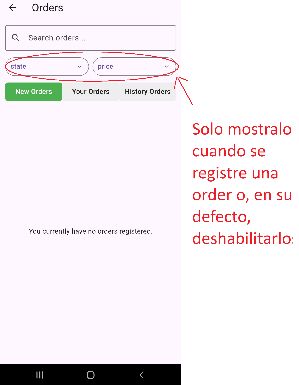

**Recomendación:**

- Mostrar los filtros únicamente cuando haya registros disponibles.
- Ocultar o deshabilitar los filtros cuando no existan pedidos.

---

#### 6.4.2.4. Resumen de modificaciones para subsanar hallazgos

| # | Problema identificado | Severidad | Acción a tomar | Prioridad |
|:---:|---|:---:|---|:---:|
| 1 | Texto ambiguo "Or sign in with" sin opciones alternativas | 1 | Eliminar el texto o implementar opciones de autenticación social | Baja |
| 2 | Sección de notificaciones vacía sin mensaje informativo | 2 | Agregar estado vacío con mensaje "No tienes notificaciones pendientes" | Media |
| 3 | Imagen superior ocupa demasiado espacio en pantalla | 3 | Reducir altura de la imagen o reemplazarla por contenido funcional relevante | Alta |
| 4 | Texto de ventas "REGISTERED SALES NOT DISCOUNTED IN INVENTORY" confuso | 3 | Reemplazar por redacción más clara: "Sales Pending Inventory Update" | Alta |
| 5 | Diferencia entre "Supply" y "New batch" no es evidente para nuevos usuarios | 3 | Agregar descripciones contextuales o renombrar acciones de forma más descriptiva | Alta |
| 6 | Áreas vacías entre secciones del inventario sin contenido de orientación | 2 | Implementar mensajes de estado vacío con indicaciones de acciones disponibles | Media |
| 7 | Filtros visibles en sección de órdenes cuando no hay pedidos registrados | 1 | Ocultar o deshabilitar filtros cuando la lista de pedidos esté vacía | Baja |
