# Capítulo VII: DevOps Practices

## 7.1. Continuous Integration

### 7.1.1. Tools and Practices

Para la etapa de Continuous Integration (CI) del proyecto Restock, se han definido herramientas y prácticas que garantizan la calidad y estabilidad del código de las tres plataformas (Backend, Frontend y Móvil) antes de llegar a la fase de despliegue continuo.

GitHub Actions
Se utiliza como orquestador nativo de integración continua. Evalúa automáticamente el código fuente compilándolo y ejecutando la suite de pruebas cada vez que se detectan cambios, bloqueando cualquier integración defectuosa.

SonarCloud
Herramienta integrada en el flujo de CI para realizar análisis estático de código. Permite evaluar la calidad estructural del backend desarrollado en Spring Boot y del frontend en Angular, detectando vulnerabilidades de seguridad, code smells y midiendo la cobertura de las pruebas.

JUnit 5 y Mockito
Son los frameworks elegidos para la automatización de pruebas en el backend Java. JUnit 5 estructura el ciclo de vida de los tests, mientras que Mockito aísla los componentes de negocio (como el procesamiento de datos del ESP32) simulando el comportamiento de las dependencias externas.

Práctica: Single Branch Architecture y Validación Estricta
Para mantener la máxima coherencia del sistema Restock, la arquitectura del proyecto se enfoca en el uso de una única rama principal (main) por cada sistema, evitando la complejidad de múltiples ramas divergentes. La regla fundamental del equipo dicta que ningún cambio puede permanecer en la rama principal si no ha superado con éxito el 100% de las pruebas automatizadas del pipeline. Además, se exigen Conventional Commits para mantener la trazabilidad del historial.

### 7.1.2. Build & Test Suite Pipeline Components

El flujo de Integración Continua para el backend REST de Restock se compone de etapas secuenciales que el orquestador (GitHub Actions) ejecuta de forma automatizada para validar la integridad del software. A continuación, se detalla el proceso de implementación y configuración de los componentes del pipeline:

#### 1. Gestión de Ramas y Entorno (Source & Environment Setup)

Para mantener la coherencia con el flujo de trabajo establecido (GitFlow), se creó una rama específica para la configuración de la integración continua denominada `feature/ci-pipeline-setup` a partir de la rama `develop`.

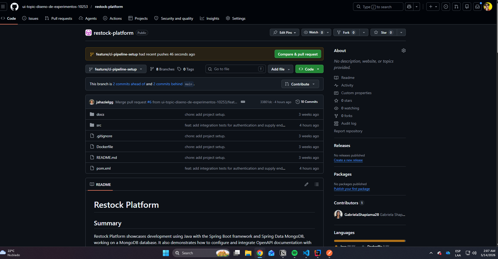

#### 2. Verificación de Versiones y Creación del Orquestador

Previo a la configuración del pipeline en la nube, se verificó la versión del Java Development Kit (JDK) utilizada localmente en el archivo `pom.xml`, confirmando el uso de Java 21. Con esta información, se procedió a crear el archivo orquestador `.github/workflows/ci-backend.yml` en la raíz del proyecto.

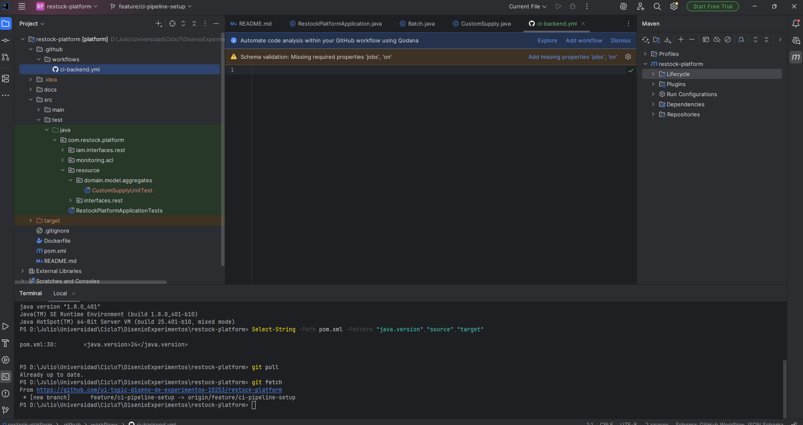

Este archivo define los *triggers* (disparadores) para que el pipeline se ejecute automáticamente ante eventos de tipo `push` o `pull_request` dirigidos a las ramas principales, y declara los pasos de *Checkout* del código.

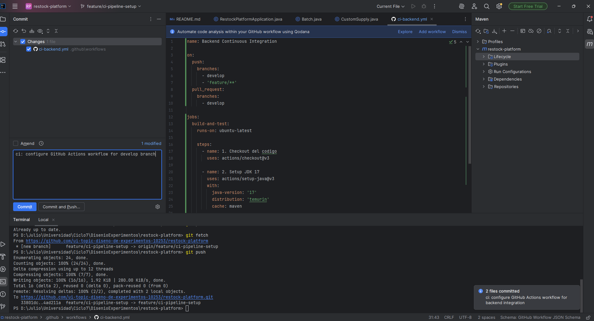

#### 3. Configuración del Componente de Compilación (Build Component)

Para evitar discrepancias entre el entorno local y el servidor de CI, se actualizó el paso de configuración del entorno (`setup-java`) en el archivo YAML, forzando al *runner* a descargar e instalar explícitamente el JDK 21 (`java-version: '21'`). Esto garantiza que el `maven-compiler-plugin` compile el código fuente sin arrojar errores de versión no soportada.

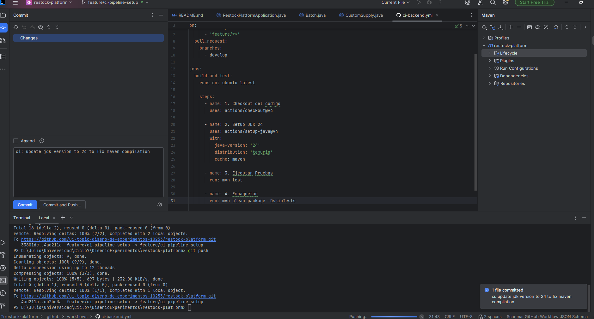

#### 4. Configuración del Entorno de Pruebas de Integración (Test Suite Component)

Dado que los *Core Integration Tests* dependen de una base de datos embebida utilizando **Flapdoodle**, se identificó la necesidad de definir explícitamente la versión de MongoDB a descargar en el entorno de pruebas automatizado para evitar fallos de carga en el `ApplicationContext` de Spring Boot.

Se implementó la solución creando el archivo de configuración `application-test.properties` dentro del directorio `src/test/resources/`, asignando la propiedad `de.flapdoodle.mongodb.embedded.version=7.0.2`. Esta acción estabilizó el entorno de ejecución en el servidor Linux de GitHub Actions.

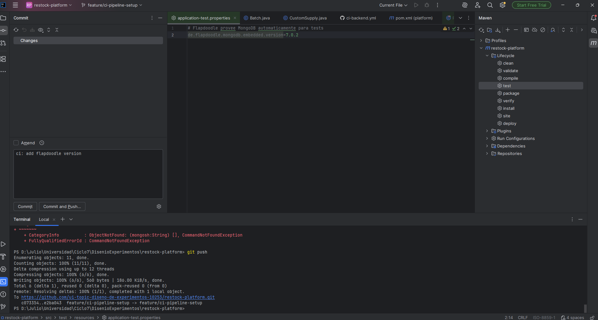

#### 5. Ejecución y Validación del Pipeline

Una vez consolidados los componentes de construcción, resolución de dependencias (Maven) y el entorno de pruebas, los *commits* fueron integrados al repositorio. El orquestador de GitHub Actions ejecutó el flujo completo exitosamente (`exit code 0`), validando tanto los *Unit Tests* como los *Integration Tests*, y finalizando con el empaquetado del artefacto `.jar` listo para el despliegue continuo

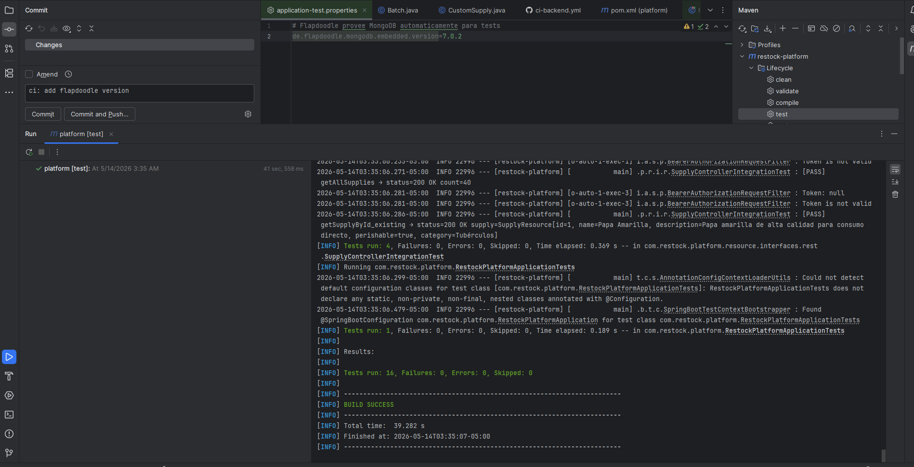

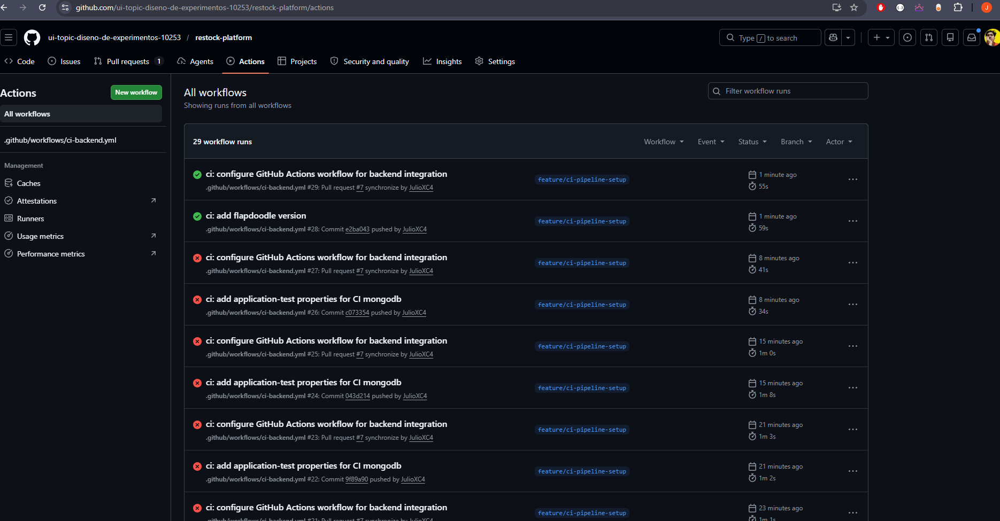

## 7.2. Continuous Delivery

### 7.2.1. Tools and Practices

Para la etapa de *Continuous Delivery* (Entrega Continua) del proyecto Restock, el objetivo es garantizar que cualquier versión del código del Backend que haya superado la Integración Continua esté empaquetada y lista para ser desplegada en un entorno de pruebas (Staging), exigiendo una validación humana antes de su pase a Producción.

#### Herramientas (Tools)

* **GitHub Actions:** Actúa como el orquestador principal. Tras un *push* o *merge* en la rama `develop`, desencadena los flujos para construir el artefacto candidato a *release* (Release Candidate).
* **Docker:** Se utiliza para contenerizar el backend (Spring Boot). Se ha implementado un `Dockerfile` con arquitectura *multi-stage build* usando OpenJDK 21, lo que garantiza que el artefacto del entorno de Staging sea idéntico al que se desplegará en Producción, eliminando discrepancias entre entornos.
* **Render (Staging Environment):** Plataforma Cloud utilizada para alojar el entorno de pruebas. Mediante integraciones de *Deploy Hooks* (Webhooks) gestionados como *Secrets*, el orquestador notifica a Render para que descargue y levante el contenedor del API REST.
* **GitHub Environments:** Herramienta de seguridad y control de despliegues utilizada para gestionar reglas de protección y aislar lógicamente los entornos del servidor.

#### Prácticas (Practices)

* **Separación de Entornos (Environment Promotion):** Se mantiene una estricta separación lógica entre el entorno de Staging y Producción. Ningún artefacto pasa a producción sin haber sido probado primero en el entorno de entrega.
* **Aprobación Manual (Manual Release Gates):** Es la práctica central del *Continuous Delivery*. El pipeline se detiene en seco antes de tocar el servidor de Staging hasta que el equipo de QA o el Product Owner valide el estado del repositorio y apruebe manualmente la ejecución. Este pipeline cubre exclusivamente el ciclo del **Backend**; el frontend web no requiere entorno de Staging porque su artefacto estático se despliega directamente a producción mediante el pipeline de *Continuous Deployment* documentado en 7.3.

### 7.2.2. Stages Deployment Pipeline Components

El pipeline de Entrega Continua de Restock está diseñado exclusivamente para el ciclo de vida del **Backend (API REST)**. A continuación, se detalla la configuración secuencial automatizada:

#### 1. Pipeline Definition & Branching

Para mantener la trazabilidad de GitFlow, se implementó el archivo orquestador `cd-staging.yml` dentro de una rama específica (`feature/cd-staging-pipeline`). Este archivo define los pasos de preparación del JDK 21, empaquetado de Maven, construcción de Docker y notificación a Render.

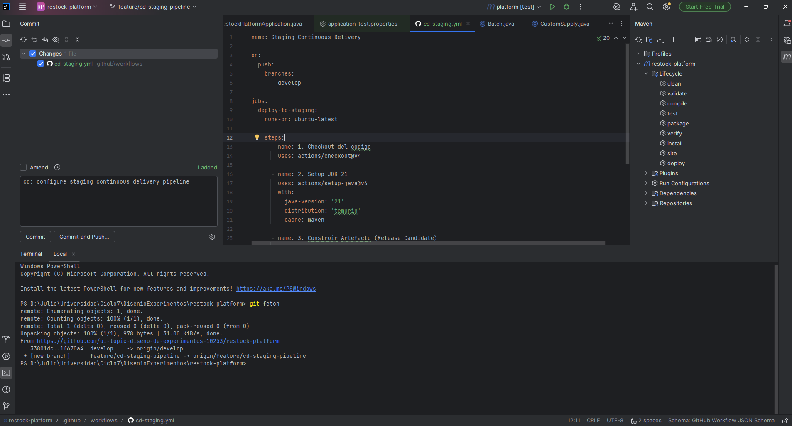

#### 2. Verification & Manual Approval Gate (Entorno Protegido)

Para garantizar la intervención humana, se configuró un entorno lógico denominado **"Staging"** utilizando las reglas de protección de *GitHub Environments*. Se designaron revisores obligatorios del equipo central para evitar despliegues no autorizados.

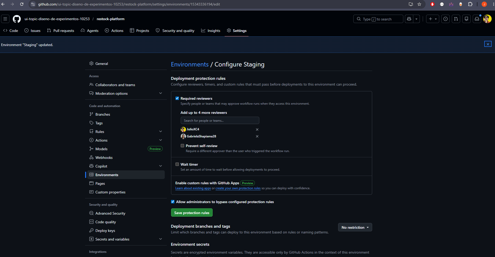

Al dispararse el pipeline, el flujo reconoce la dependencia del entorno y entra en un estado de pausa (`Waiting`). Queda a la espera de que los revisores evalúen la estabilidad del código.

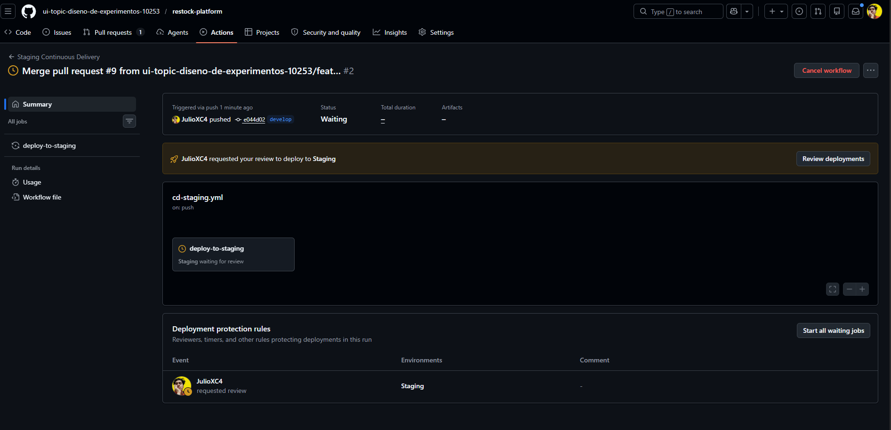

Una vez confirmada la integridad del repositorio, el revisor asignado autoriza el despliegue dejando un comentario de conformidad y ejecutando la acción **"Approve and deploy"**.

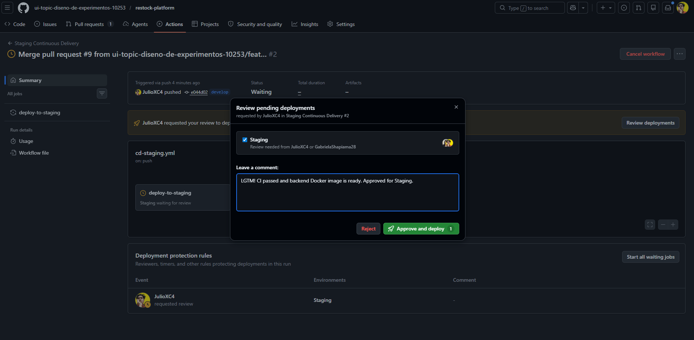

#### 3. Trigger & Artifact Generation Stage

Tras la aprobación manual, el servidor virtual retoma la ejecución. Procede con el empaquetado del `.jar` de Spring Boot y ejecuta la directiva `docker build`. Como se evidencia en los *logs* del orquestador, el proceso *multi-stage* descarga las dependencias de Java 21, empaqueta el sistema y genera la imagen candidata (`restock-backend-staging:latest`) de forma exitosa.

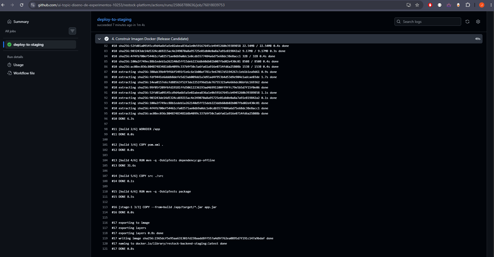

#### 4. Staging Deployment Stage

Finalmente, mediante el uso de credenciales encriptadas (*GitHub Secrets*), el orquestador dispara un webhook (`curl -X POST`) hacia Render. Render detecta la petición, extrae la imagen generada y la publica en su infraestructura de nube gratuita, finalizando el pipeline de Entrega Continua con éxito.

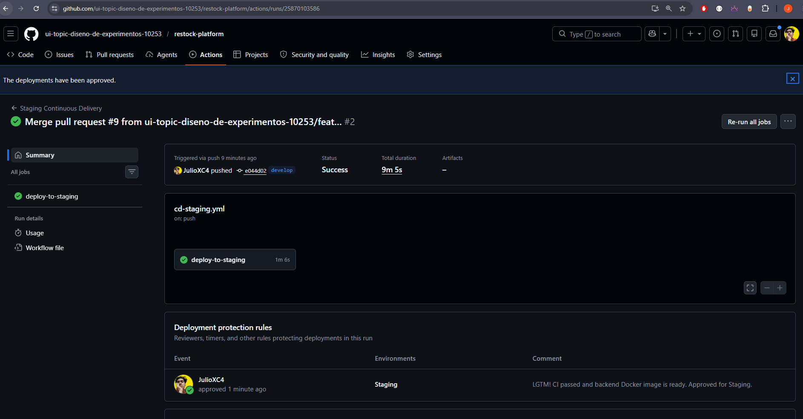

El artefacto Docker aprobado en esta etapa es funcionalmente idéntico al que se despliega en el entorno de producción de Render; la paridad entre entornos se garantiza porque ambos pipelines comparten el mismo `Dockerfile` multi-stage con OpenJDK 21. El proceso de promoción al entorno productivo se documenta en el pipeline de *Continuous Deployment* de la sección 7.3.

## 7.3. Continuous deployment

### 7.3.1. Tools and Practices

El pipeline de *Continuous Deployment* (Despliegue Continuo) de Restock automatiza completamente la publicación de versiones aprobadas hacia los entornos de producción. A diferencia del pipeline de *Continuous Delivery* documentado en 7.2, que detiene la ejecución para requerir aprobación humana antes de actuar sobre el entorno de *Staging*, el *Continuous Deployment* elimina dicha intervención: cualquier cambio integrado exitosamente en `main` desencadena el despliegue simultáneo de todos los componentes de la plataforma sin pasos manuales adicionales.

#### Herramientas (Tools)

**GitHub Actions**
Actúa como orquestador central del pipeline multi-plataforma de producción. Define *jobs* paralelos para construir y publicar cada componente (frontend, backend y móvil) a partir de un único evento de `push` en `main` o de una ejecución manual (*workflow_dispatch*).

**GitHub Pages**
Plataforma de hosting estático utilizada para publicar la *Landing Page* y la *Web Application*. Tras la compilación de Angular CLI en modo producción (`ng build --configuration production`), los artefactos se despliegan automáticamente mediante la acción `JamesIves/github-pages-deploy-action`, sin intervención manual.

**Render**
Servicio de hosting en la nube para el *Backend REST API* en producción. El pipeline activa la reconstrucción del servicio mediante un *Deploy Hook* (webhook) gestionado como *Secret*. Render descarga la imagen Docker y actualiza la API en la URL pública de producción.

**Docker**
Encapsula el backend (Spring Boot / Java 21) en una imagen reproducible mediante arquitectura *multi-stage build*. El mismo `Dockerfile` definido para el entorno de *Staging* en 7.2 se reutiliza en producción, garantizando paridad de artefactos entre entornos.

**Firebase App Distribution**
Gestiona la distribución de versiones de prueba de las aplicaciones móviles (Flutter y Kotlin) hacia testers internos. Su integración en el pipeline de producción permite validar cada *release* antes de una publicación formal en tiendas, completando el ciclo de entrega multi-plataforma.

#### Prácticas (Practices)

* **Despliegue Automático a Producción:** La rama `main` representa directamente el estado de producción. Toda integración proveniente de `develop` —tras pasar CI en 7.1 y CD de *Staging* en 7.2— se despliega de forma automática, sin pasos manuales adicionales.
* **Estrategia de *Release* Multi-Plataforma:** Un único evento de integración en `main` activa despliegues coordinados del frontend estático (GitHub Pages), el backend (Render) y la distribución móvil (Firebase App Distribution), garantizando que todas las superficies de la plataforma se actualicen de forma coherente y versionada.
* **Gestión de Secretos (*Secret Management*):** Las credenciales, webhooks de Render y URLs de producción se administran como *GitHub Secrets*. Ningún valor sensible se incluye en el código del *workflow* ni en el repositorio.
* **Verificación Posterior al Despliegue:** Tras completar el despliegue, el pipeline ejecuta verificaciones HTTP automáticas sobre las URLs de producción del frontend y el endpoint `/health` del backend, integrando *Continuous Deployment* con el *Continuous Monitoring* documentado en 7.4.

---

### 7.3.2. Production Deployment Pipeline Components

El pipeline de despliegue a producción de Restock cubre los tres componentes principales de la plataforma: frontend web (Landing Page y Web Application), backend REST y distribución móvil. A continuación, se detalla cada etapa con su evidencia correspondiente.

#### 1. Pipeline Definition & Branching

Para mantener la trazabilidad de GitFlow, el pipeline de producción se configuró en la rama `feature/cd-production-pipeline`. El archivo orquestador `cd-production.yml` se ubica en `.github/workflows/` y define los disparadores del pipeline: `push` a `main` y `workflow_dispatch` para despliegues controlados. Los *jobs* se organizan de forma que el frontend y el backend se puedan desplegar en paralelo tras superar la etapa de build.

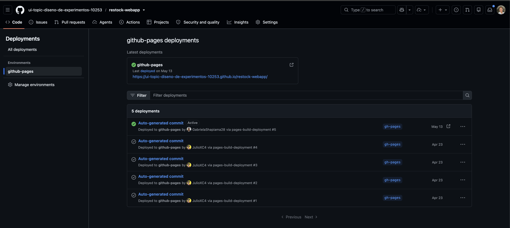  

#### 2. Frontend Build Stage

El *runner* de GitHub Actions instala las dependencias del proyecto Angular y ejecuta la compilación en modo producción (`ng build --configuration production`). Esta etapa aplica *tree-shaking*, minificación de bundles y *AOT compilation*, generando los artefactos estáticos optimizados en el directorio `dist/`.

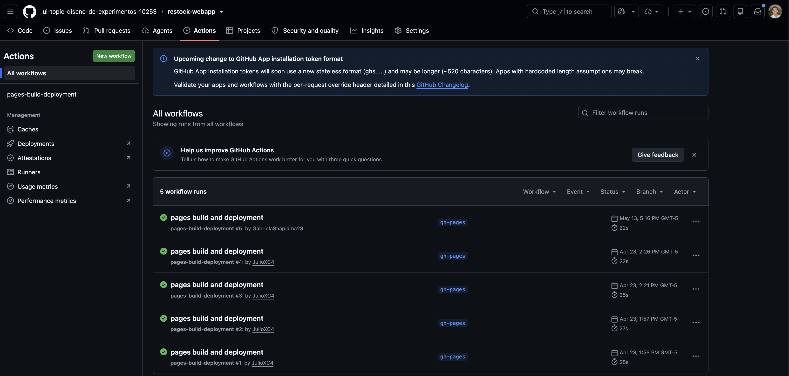

#### 3. Frontend Deployment to GitHub Pages

Los artefactos compilados son publicados mediante `JamesIves/github-pages-deploy-action`, que empuja el contenido del directorio `dist/` a la rama `gh-pages` del repositorio correspondiente. El *workflow* actualiza tanto la *Landing Page* como la *Web Application*, dejando ambas interfaces disponibles en sus URLs de producción al finalizar el *job*.

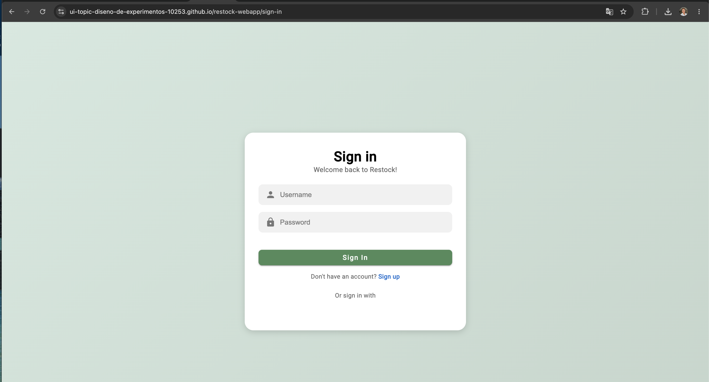

#### 4. Backend Build & Production Deployment Stage

El backend es empaquetado por Maven (`mvn package -DskipTests`) y construido como imagen Docker utilizando el mismo `Dockerfile` multi-stage de OpenJDK 21 descrito en 7.2. Una vez generada la imagen candidata, el orquestador dispara el *Deploy Hook* de producción en Render mediante `curl -X POST`, utilizando el webhook almacenado en *GitHub Secrets*. Render reconstruye el servicio con la nueva imagen y actualiza la API en la URL pública de producción.

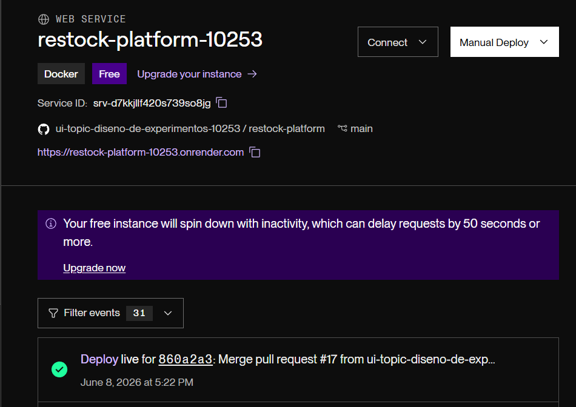

#### 5. Mobile Release Distribution Stage

Como etapa final del pipeline, el *runner* genera el APK firmado de la aplicación móvil y lo carga en Firebase App Distribution mediante la acción oficial de Firebase. Los testers registrados reciben una notificación automática con el enlace de descarga de la nueva versión, completando el ciclo de entrega multi-plataforma de Restock.


#### 6. Post-Deployment Verification Stage

Tras completar los *jobs* de despliegue, el pipeline ejecuta verificaciones HTTP automáticas: una consulta al frontend para confirmar que GitHub Pages responde con `HTTP 200`, y una consulta al endpoint `/health` del backend para validar que la API esté activa en producción. Si alguna verificación falla, el *workflow* termina con estado `failed`, activando el mecanismo de alerta del pipeline de monitoreo descrito en 7.4.


#### Flujo Resumido del Pipeline de Producción

1. Un Pull Request de `develop` hacia `main` es aprobado y fusionado.
2. GitHub Actions detecta el `push` en `main` e inicia el pipeline `cd-production.yml`.
3. El frontend Angular se compila en modo producción y se publica en GitHub Pages.
4. La imagen Docker del backend se construye y se despliega en el servicio productivo de Render.
5. El APK móvil se genera y se distribuye a testers mediante Firebase App Distribution.
6. El pipeline ejecuta verificaciones automáticas de disponibilidad del frontend y del backend.
7. Si todas las verificaciones pasan, el *workflow* finaliza exitosamente y la versión queda publicada en producción.

## 7.4. Continuous Monitoring

### 7.4.1. Tools and Practices

Para la etapa de Continuous Monitoring del proyecto Restock, se definen herramientas y prácticas orientadas a observar el comportamiento del sistema después de cada despliegue. Esta sección complementa las prácticas de Continuous Integration, Continuous Delivery y Continuous Deployment documentadas previamente, ya que permite verificar que las versiones publicadas se mantengan disponibles, estables y alineadas con los niveles de servicio esperados para la plataforma.

#### Tools

**GitHub Actions**

GitHub Actions se utiliza como herramienta principal para automatizar verificaciones posteriores al despliegue. Además de ejecutar los pipelines de build, pruebas y despliegue, permite revisar el estado de cada workflow, identificar ejecuciones fallidas y mantener trazabilidad entre commits, despliegues y validaciones.

En el contexto de monitoreo, GitHub Actions ejecuta verificaciones automáticas sobre los servicios publicados, como validar que la URL del frontend esté disponible o que el backend responda correctamente mediante un endpoint de salud.

**Render**

Render se utiliza como plataforma de despliegue del backend RESTful de Restock. Para el monitoreo, proporciona información sobre el estado del servicio, historial de despliegues, logs de ejecución y posibles fallos durante el arranque de la aplicación.

Esta herramienta permite revisar si el backend se encuentra activo, si ocurrió un error de ejecución o si existen problemas relacionados con variables de entorno, conexión con base de datos o configuración del servicio.

**GitHub Pages**

GitHub Pages se utiliza para alojar la Landing Page y la aplicación web frontend de Restock. En el monitoreo, permite verificar la disponibilidad pública de las interfaces web y confirmar que los usuarios puedan acceder correctamente a las páginas desplegadas.

**Firebase App Distribution**

Firebase App Distribution se utiliza para distribuir versiones preliminares de la aplicación móvil a testers. En el proceso de monitoreo, esta herramienta permite recopilar retroalimentación sobre errores, fallos visuales o comportamientos inesperados detectados durante las pruebas móviles.

Su uso es relevante porque permite validar la estabilidad de la aplicación móvil antes de una liberación formal, reduciendo el riesgo de entregar versiones defectuosas a usuarios finales.

**Backend Health Check**

El backend de Restock cuenta un endpoint de verificación de salud, `/health`, que permite comprobar si la API REST se encuentra disponible. Este endpoint puede ser consultado manualmente o desde un workflow automatizado.

El health check permite validar:

- Disponibilidad de la API.
- Correcto arranque del backend.
- Respuesta básica del servicio.
- Conectividad mínima entre frontend y backend.
- Estado general posterior al despliegue.

**Logs de ejecución**

Los logs son una fuente importante de monitoreo porque permiten revisar qué ocurrió durante la ejecución del sistema. En Restock, los logs técnicos se revisan principalmente desde Render para el backend y desde GitHub Actions para los workflows.

Los logs permiten identificar errores de despliegue, fallos en pruebas, problemas de configuración, excepciones del backend y eventos asociados a una versión publicada.

#### Practices

**Verificación posterior al despliegue**

Después de cada despliegue, el equipo verifica que los principales componentes del sistema se encuentren disponibles. Esto incluye revisar la Landing Page, la aplicación web frontend, el backend desplegado en Render y, cuando corresponda, la versión móvil distribuida para pruebas.

Esta práctica permite detectar fallos tempranos y evitar que una versión aparentemente desplegada sea considerada estable sin validación.

**Monitoreo basado en health checks**

El equipo utiliza verificaciones de salud para confirmar que la API backend responde correctamente. Para estas verificaciones se usa el endpoint de salud del backend.

Esta práctica permite validar rápidamente si el servicio está activo y si el despliegue fue exitoso.

**Revisión de logs**

Después de cada despliegue o fallo reportado, el equipo revisa los logs correspondientes en Render y GitHub Actions. Esta práctica permite identificar la causa del problema y relacionarla con un commit, workflow o despliegue específico.

La revisión de logs es clave para mantener trazabilidad y facilitar la corrección de errores.

**Seguimiento de métricas básicas**

El equipo revisa métricas básicas asociadas a disponibilidad, respuesta del backend y estado de los despliegues. Estas métricas permiten evaluar si el sistema cumple con los niveles de servicio esperados para Restock.

Las métricas consideradas son:

- Disponibilidad del backend.
- Disponibilidad del frontend.
- Tiempo de respuesta básico de la API.
- Cantidad de workflows exitosos o fallidos.
- Errores detectados en logs.
- Retroalimentación de testers móviles.
- Cantidad de alertas funcionales registradas o mostradas en la aplicación.

**Gestión de alertas**

Cuando se detecta una falla relevante, esta debe convertirse en una alerta para el equipo. Las alertas se origina por workflows fallidos, errores en Render, falta de disponibilidad del backend o problemas en la aplicación móvil.

Esta práctica permite que el equipo priorice incidentes y aplique acciones correctivas de forma ordenada.

**Notificación a responsables**

Cada alerta o incidente debe comunicarse al responsable correspondiente. Las fallas técnicas son revisadas por el equipo de desarrollo, mientras que las alertas funcionales relacionadas con inventario o pedidos se visualizan para el usuario.

Esta práctica asegura que la información llegue al destinatario adecuado y pueda convertirse en una acción concreta.

**Trazabilidad de incidentes**

Cuando se detecta un error, el equipo registra la incidencia, identifica el componente afectado y relaciona el problema con el despliegue, commit o workflow correspondiente.

Esta práctica permite mantener control sobre los problemas detectados y facilita la mejora continua del sistema.

**Mejora continua**

Los hallazgos del monitoreo se utilizan para mejorar el producto. Si un error se repite, si una alerta no se muestra correctamente o si un despliegue falla, el equipo ajusta el pipeline, mejora las validaciones y/o corrige la configuración del sistema.

De esta manera, el monitoreo no solo permite observar el sistema, sino también retroalimentar el ciclo DevOps de Restock.

### 7.4.2. Monitoring Pipeline Components

El pipeline de monitoreo de Restock está compuesto por los componentes encargados de observar el estado del sistema después de cada despliegue. Su objetivo es comprobar que los servicios publicados se encuentren disponibles, que los workflows se ejecuten correctamente y que los errores puedan ser detectados de forma temprana.

Este pipeline no reemplaza las etapas de CI/CD, sino que las complementa. Mientras CI/CD permite construir, validar y desplegar el producto, Continuous Monitoring permite revisar si la versión desplegada sigue funcionando correctamente después de su publicación.

#### 1. Monitoring Sources

El monitoreo inicia con la recopilación de información desde los principales componentes desplegados de Restock:

- **Frontend Web Application:** desplegada mediante GitHub Pages, monitoreada a través de la verificación de disponibilidad pública, carga correcta de la interfaz y conexión con el backend.
- **Backend REST API:** desplegada en Render, monitoreada mediante estado del servicio, logs, tiempos de respuesta y health checks.
- **Mobile Application:** distribuida mediante Firebase App Distribution, permitiendo recibir retroalimentación de testers sobre errores o comportamientos inesperados.
- **CI/CD Workflows:** ejecutados mediante GitHub Actions, monitoreados a través de sus resultados de build, pruebas, despliegue y verificaciones posteriores.

#### 2. Health Check Component

El componente de health check permite verificar que el backend se encuentre activo después del despliegue. Para ello, el backend expone un endpoint de salud, `/health`, que devuelve una respuesta simple cuando el servicio esté disponible.

El health check permite validar:

- Disponibilidad de la API REST.
- Correcto inicio del backend.
- Respuesta básica de los endpoints productivos.
- Carga correcta de variables de entorno.
- Conectividad mínima entre frontend y backend.

**Respuesta exitosa del endpoint health**

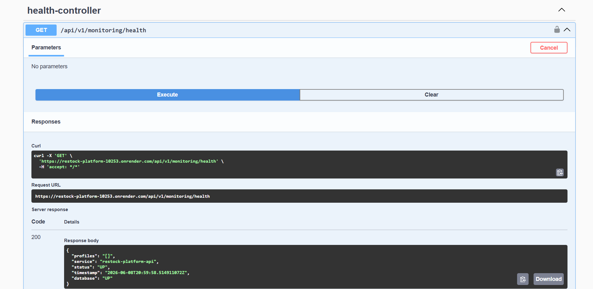

#### 3. Frontend Availability Check Component

El componente de verificación del frontend permite confirmar que la aplicación web publicada en GitHub Pages se encuentre disponible para los usuarios.

Esta verificación considera:

- Acceso correcto a la URL pública.
- Carga inicial de la aplicación.
- Disponibilidad de la Landing Page.
- Disponibilidad de la aplicación web frontend.
- Ausencia de errores visibles de publicación.

**Frontend Web Application publicado en GitHub Pages**

La figura muestra la aplicación web de Restock publicada mediante GitHub Pages. Esta URL es utilizada por el workflow de monitoreo para validar la disponibilidad del frontend después de cada despliegue.

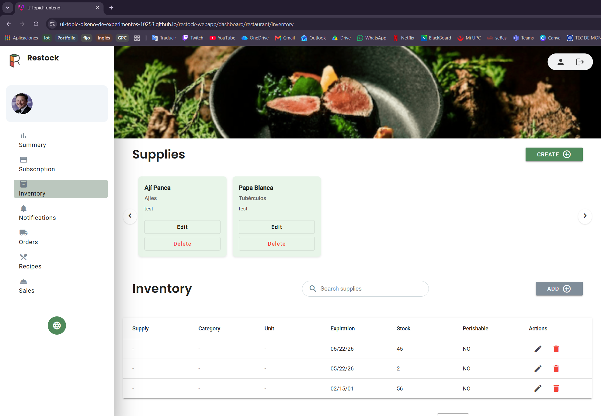

#### 4. Log Review Component

El componente de revisión de logs permite analizar los eventos generados durante la ejecución del sistema y los workflows.

En Restock, los logs se revisan principalmente desde:

- **Render:** para errores del backend, fallos de arranque, problemas de configuración y eventos de ejecución.
- **GitHub Actions:** para fallos en build, pruebas, despliegue o verificaciones automáticas.
- **Firebase App Distribution:** para revisar comentarios o reportes de testers sobre la aplicación móvil.

Los logs permiten identificar:

- Fallos durante el despliegue.
- Errores en solicitudes a la API.
- Excepciones del backend.
- Problemas de configuración de variables de entorno.
- Fallos en la ejecución de builds o pruebas.
- Errores detectados en versiones móviles de prueba.

Este componente aporta trazabilidad porque cada error puede relacionarse con un commit, workflow, despliegue o versión distribuida.

**Logs del backend en Render**

La figura muestra los logs del backend REST API desplegado en Render. Esta evidencia permite revisar el estado del servicio, eventos de ejecución y posibles errores posteriores al despliegue.

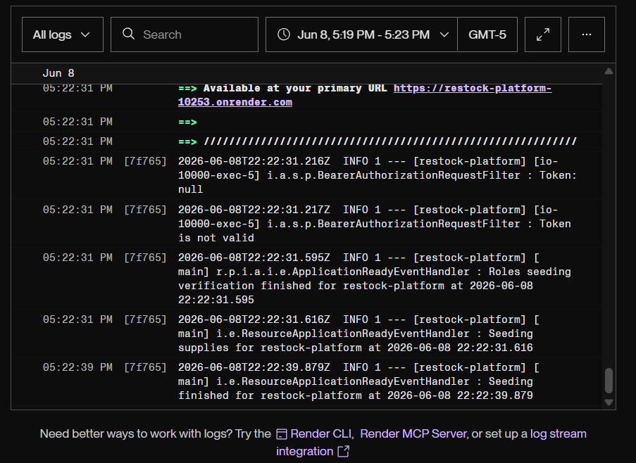

**Estado del servicio backend en Render**

La figura muestra el estado activo del servicio backend en Render, confirmando que la API REST de Restock se encuentra desplegada y disponible mediante una URL pública.


#### 5. Basic Metrics Component

El componente de métricas básicas permite revisar indicadores simples sobre disponibilidad y estabilidad del sistema.

| Métrica                    | Fuente                    | Propósito                                |
| --------------------------- | ------------------------- | ----------------------------------------- |
| Disponibilidad del backend  | Render / Health Check     | Confirmar que la API está activa         |
| Disponibilidad del frontend | GitHub Pages              | Confirmar que la web está publicada      |
| Resultado de workflows      | GitHub Actions            | Identificar builds o despliegues fallidos |
| Tiempo de respuesta básico | Health Check              | Detectar lentitud del backend             |
| Errores de ejecución       | Render Logs               | Identificar fallos técnicos              |
| Feedback móvil             | Firebase App Distribution | Detectar errores reportados por testers   |

Estas métricas permiten detectar problemas sin requerir una herramienta avanzada de monitoreo, manteniendo coherencia con el alcance académico del proyecto.

#### 6. Post-Deployment Verification Component

Después de cada despliegue, el equipo ejecuta una verificación posterior para confirmar que la versión publicada funciona correctamente.

La verificación posterior al despliegue incluye:

1. Confirmar que el frontend responde desde GitHub Pages.
2. Confirmar que el backend responde desde Render.
3. Consultar el endpoint de health check.
4. Revisar logs del backend en Render.
5. Revisar el resultado del workflow en GitHub Actions.
6. Validar la conectividad entre frontend y backend.
7. Verificar que las alertas internas se muestren correctamente en la aplicación.
8. Revisar feedback de testers móviles si hubo distribución por Firebase App Distribution.

Este componente es importante porque evita considerar exitoso un despliegue únicamente porque el pipeline terminó, sin verificar el comportamiento real del sistema publicado.

#### 7. Monitoring Workflow Component

Para reforzar el monitoreo a nivel de repositorio, se implementa un workflow de GitHub Actions que verifica periódicamente la disponibilidad del backend y frontend.

Su propósito es consultar las URLs productivas del frontend y backend. Si alguna URL no responde correctamente, el workflow falla y queda registrado como evidencia de alerta técnica dentro de GitHub Actions.

**Implementación en backend del workflow Continuous Monitoring**

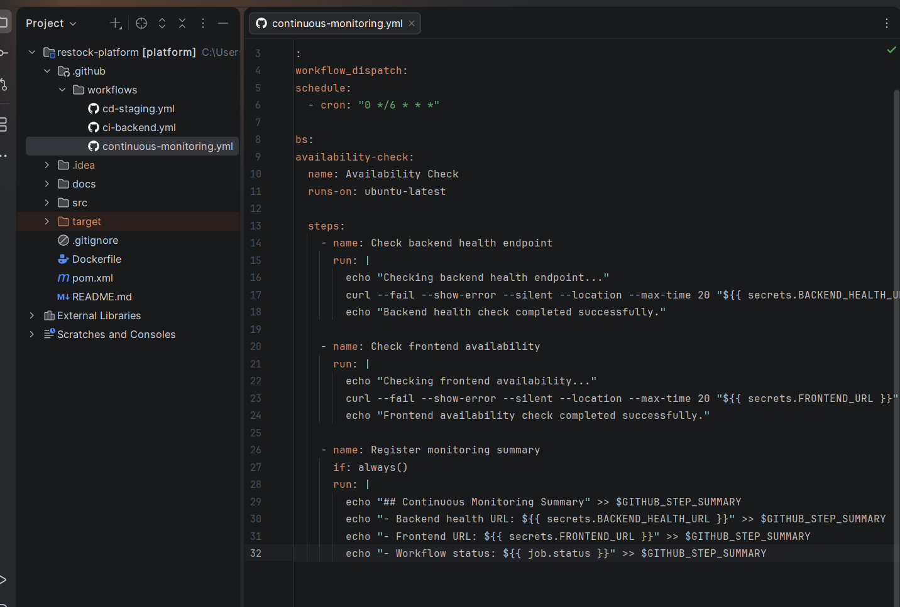

**Secrets configurados para monitoreo en GitHub Actions**

La figura muestra los secrets BACKEND_HEALTH_URL y FRONTEND_URL configurados en GitHub Actions, utilizados por el workflow de monitoreo para validar las URLs productivas sin exponer valores sensibles directamente en el repositorio.

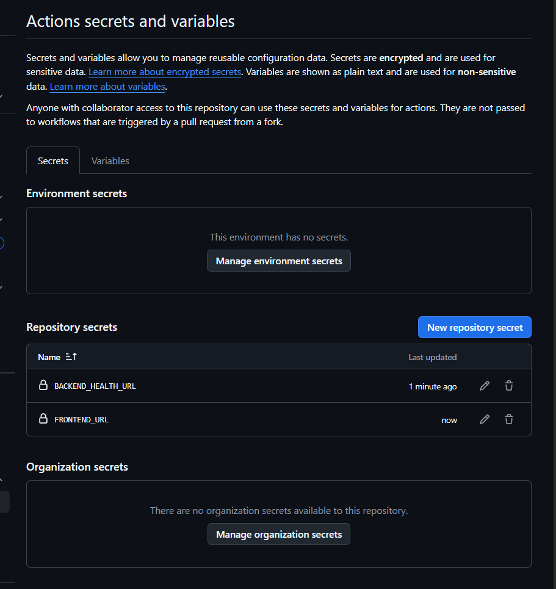

**Ejecución exitosa del workflow Continuous Monitoring**

La figura muestra la ejecución exitosa del workflow Continuous Monitoring en GitHub Actions. El resultado evidencia que el backend responde correctamente mediante el endpoint de health check y que el frontend se encuentra disponible desde su URL pública.

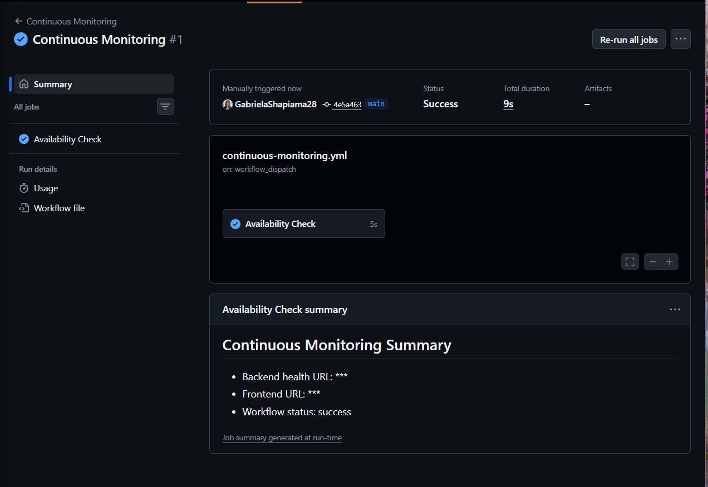

**Detalle del job Availability Check**

La figura muestra el detalle del job Availability Check, donde se ejecutan las verificaciones automáticas sobre el backend desplegado en Render y el frontend publicado en GitHub Pages.

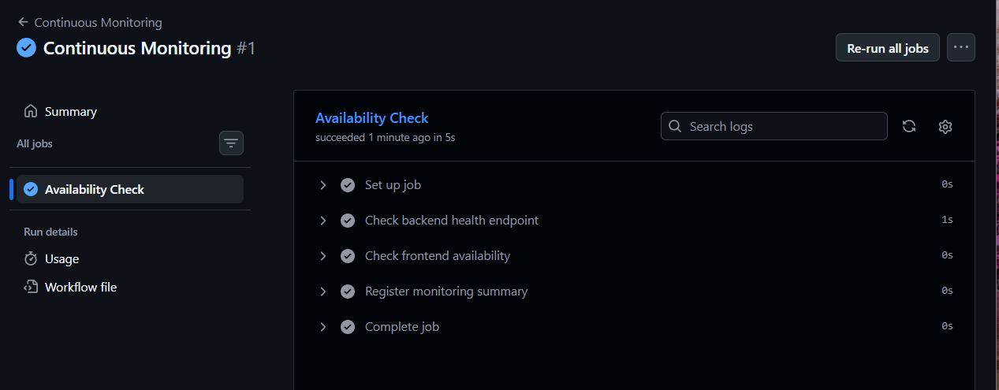

#### 8. Incident Review Component

Cuando el monitoreo detecta un error, el equipo revisa el incidente y aplica una corrección controlada.

El flujo de revisión es:

1. Detectar el problema mediante health check, logs, workflow fallido, alerta interna o feedback de testers.
2. Identificar el componente afectado: frontend, backend, aplicación móvil, módulo de inventario, módulo de pedidos o workflow.
3. Revisar el commit, pull request o despliegue relacionado.
4. Registrar la incidencia en el tablero del proyecto.
5. Aplicar la corrección en una rama dedicada.
6. Ejecutar nuevamente las validaciones de CI/CD.
7. Desplegar la versión corregida.
8. Verificar nuevamente el servicio mediante health check, revisión de logs y validación funcional.

Este proceso permite que el monitoreo sirva como mecanismo de mejora continua y no solo como observación pasiva del sistema.

#### 9. Monitoring Pipeline Summary

El pipeline de monitoreo se resume de la siguiente manera:

1. Se despliega una nueva versión en producción.
2. GitHub Actions registra el resultado del workflow.
3. El equipo verifica disponibilidad del frontend en GitHub Pages.
4. El equipo verifica disponibilidad del backend en Render.
5. Se consulta el endpoint de health check.
6. Se revisan logs técnicos en Render y GitHub Actions.
7. Se revisan alertas internas en la aplicación.
8. Se revisa feedback móvil si hubo distribución en Firebase App Distribution.
9. Si se detecta un error, se registra una incidencia y se aplica una corrección.
10. La versión corregida se vuelve a desplegar y monitorear.

De esta manera, los componentes del Monitoring Pipeline permiten que Restock mantenga visibilidad sobre el estado de sus servicios desplegados, detecte fallos después de cada release y responda de forma ordenada ante problemas técnicos o funcionales.

### 7.4.3. Alerting Pipeline Components

El pipeline de alertas de Restock está compuesto por los componentes encargados de convertir eventos de monitoreo en incidencias accionables.

Para el alcance del proyecto, las alertas de Restock se plantean utilizando los resultados de GitHub Actions, Render, GitHub Pages, Firebase App Distribution y los eventos funcionales del backend relacionados con inventario y pedidos.

#### 1. Alert Sources

Las alertas se originan desde los principales servicios y herramientas utilizadas en el ecosistema de Restock:

- **GitHub Actions:** genera alertas cuando falla un workflow de build, pruebas, despliegue o verificación posterior.
- **Render:** permite identificar fallos en el despliegue del backend, caídas del servicio o errores de ejecución.
- **GitHub Pages:** permite detectar problemas de disponibilidad en la aplicación web publicada.
- **Firebase App Distribution:** permite recibir reportes de errores o comportamientos inesperados por parte de testers de la aplicación móvil.
- **Backend REST API:** genera condiciones de alerta cuando los endpoints presentan errores, tiempos de respuesta elevados o falta de disponibilidad.

#### 2. Alert Rules Component

El componente de reglas de alerta define las condiciones bajo las cuales un evento monitoreado debe convertirse en una alerta. Esto evita que cualquier mensaje menor sea tratado como una incidencia crítica.

| Regla                   | Condición                                                   | Tipo de alerta       |
| ----------------------- | ------------------------------------------------------------ | -------------------- |
| Fallo de workflow       | GitHub Actions termina con estado failed                     | Técnica             |
| Backend no disponible   | Render no responde o el health check falla                   | Técnica             |
| Frontend no disponible  | La URL de GitHub Pages no responde                           | Técnica             |
| Error de API            | La API responde repetidamente con errores 5xx                | Técnica             |
| Error de configuración | Variables de entorno faltantes o inválidas                  | Técnica             |
| Error móvil reportado  | Tester reporta fallo bloqueante en Firebase App Distribution | Técnica / funcional |

Estas reglas permiten identificar fallos que pueden afectar la disponibilidad, estabilidad o funcionamiento correcto de Restock.

#### 3. Severity Classification Component

Cada alerta se clasifica según el nivel de impacto que puede generar sobre el sistema o los usuarios. Esta clasificación permite priorizar la respuesta del equipo.

| Nivel de severidad | Descripción                                                   | Ejemplo                                                       |
| ------------------ | -------------------------------------------------------------- | ------------------------------------------------------------- |
| Crítica           | El sistema o un servicio principal deja de estar disponible.   | La API backend no responde en Render.                         |
| Alta               | Un flujo principal del negocio se ve afectado.                 | Los usuarios no pueden crear pedidos o actualizar inventario. |
| Media              | Una funcionalidad secundaria presenta errores.                 | Una alerta de inventario no se visualiza correctamente.       |
| Baja               | Existe un problema menor sin impacto directo en la operación. | Un mensaje visual o warning no bloqueante.                    |

Esta clasificación ayuda a determinar qué incidencias requieren atención inmediata y cuáles pueden corregirse en un ciclo posterior de mantenimiento.

#### 4. Alert Processing Component

Cuando se genera una alerta, esta debe ser revisada antes de aplicar una corrección. El objetivo de este componente es identificar el origen, alcance e impacto del problema.

El procesamiento de alertas de Restock sigue este flujo:

1. Se recibe la alerta desde GitHub Actions, Render, Firebase App Distribution, la interfaz web o la revisión manual del sistema.
2. Se identifica el componente afectado: frontend, backend, aplicación móvil, módulo de inventario, módulo de pedidos o workflow CI/CD.
3. Se revisan logs, historial de despliegues, resultados del workflow, comportamiento en la interfaz o feedback de testers.
4. Se determina el nivel de severidad de la alerta.
5. Se asigna la corrección al integrante responsable.
6. Se registra la incidencia o tarea de corrección en el tablero del proyecto.
7. Se valida la corrección mediante el pipeline de CI/CD.
8. Se confirma que la alerta fue resuelta mediante una nueva verificación.

Este flujo permite que las alertas sean atendidas de manera ordenada y trazable.

#### 5. Escalation Component

El componente de escalamiento define qué acciones se toman cuando una alerta no puede resolverse de forma inmediata o cuando afecta una parte crítica del sistema.

Una alerta debe escalarse cuando:

- El backend continúa caído después de un nuevo despliegue.
- Un endpoint crítico falla de manera repetida.
- Es necesario revertir un despliegue reciente.
- Un error móvil bloquea un flujo principal del usuario.
- El mismo error aparece en más de una versión desplegada.
- El problema afecta directamente la operación de restaurantes o proveedores.

Cuando una alerta es escalada, el equipo revisa los últimos commits, identifica la causa raíz, crea una rama de corrección, valida el cambio mediante el pipeline de CI/CD y despliega nuevamente la versión corregida.

#### 6. Technical Alert Examples

Algunos ejemplos de alertas técnicas en Restock son:

| Evento                            | Alerta generada                  | Acción                                               |
| --------------------------------- | -------------------------------- | ----------------------------------------------------- |
| Falla el workflow de monitoreo    | Backend o frontend no disponible | Revisar logs y estado del despliegue                  |
| Render no inicia el backend       | API fuera de servicio            | Revisar configuración y variables de entorno         |
| GitHub Pages no responde          | Frontend no disponible           | Revisar publicación y configuración del repositorio |
| Error reportado por tester móvil | Fallo en versión distribuida    | Revisar build móvil y corregir funcionalidad         |

#### 7. Alerting Pipeline Summary

El pipeline de alertas puede resumirse de la siguiente manera:

1. El sistema o una herramienta de monitoreo detecta un evento.
2. Las reglas de alerta determinan si el evento requiere atención.
3. La alerta se clasifica según su severidad.
4. El equipo revisa logs, workflows, interfaz o feedback asociado.
5. Se identifica el componente afectado.
6. Se crea y asigna una tarea de corrección.
7. La corrección se valida mediante el pipeline de CI/CD.
8. La alerta se cierra cuando se confirma que el sistema volvió a un estado estable.

**Alerta técnica registrada en GitHub Actions**

La figura muestra el mecanismo de alerta técnica del workflow de monitoreo. Para ello, se configuró una URL incorrecta de manera intencional. Cuando una URL monitoreada no responde correctamente, GitHub Actions marca la ejecución como fallida y registra un resumen indicando que debe revisarse el servicio afectado.

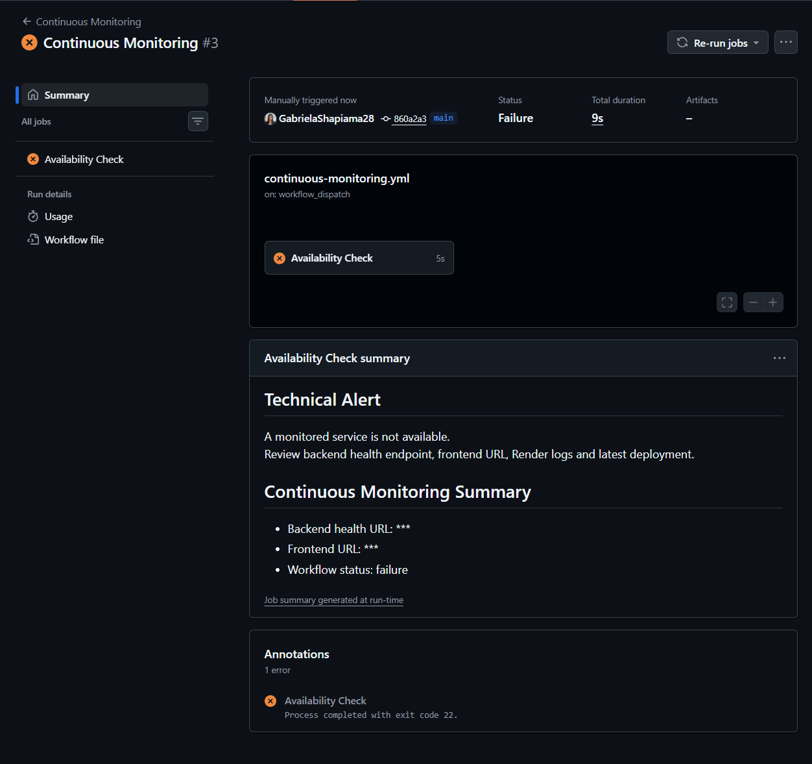

En conclusión, los componentes del Alerting Pipeline permiten que Restock transforme eventos de monitoreo en incidencias accionables, facilitando una respuesta rápida ante fallos técnicos y eventos funcionales importantes.

### 7.4.4. Notification Pipeline Components

El pipeline de notificaciones de Restock está compuesto por los componentes encargados de comunicar alertas, eventos del sistema y actualizaciones relevantes a los destinatarios correspondientes. Este pipeline complementa al pipeline de alertas porque no solo identifica un evento importante, sino que asegura que la información llegue al equipo de desarrollo, testers o usuarios finales de manera clara y oportuna.

En el alcance del proyecto, las notificaciones se dividen en dos grupos: notificaciones técnicas, dirigidas al equipo de desarrollo, y notificaciones funcionales internas, dirigidas a los usuarios de la plataforma, como administradores de restaurantes y proveedores.

#### 1. Notification Sources

Las notificaciones se originan desde distintos componentes del ecosistema de Restock:

- **GitHub Actions:** notifica al equipo cuando falla o finaliza un workflow de build, pruebas, despliegue o monitoreo.
- **Render:** permite revisar eventos relacionados con el despliegue del backend, estado del servicio o errores de ejecución.
- **Firebase App Distribution:** notifica a los testers cuando existe una nueva versión móvil disponible para pruebas.
- **Backend REST API:** genera eventos funcionales a partir de reglas de negocio, como cambios de estado de pedidos o alertas de stock.
- **Frontend Web Application:** muestra alertas visuales, mensajes o indicadores dentro de la interfaz para informar al usuario sobre eventos importantes.

**Versión móvil distribuida en Firebase App Distribution**

La figura muestra una versión preliminar de la aplicación móvil de Restock distribuida mediante Firebase App Distribution. Esta herramienta permite compartir builds con testers y recopilar retroalimentación antes de una liberación formal.

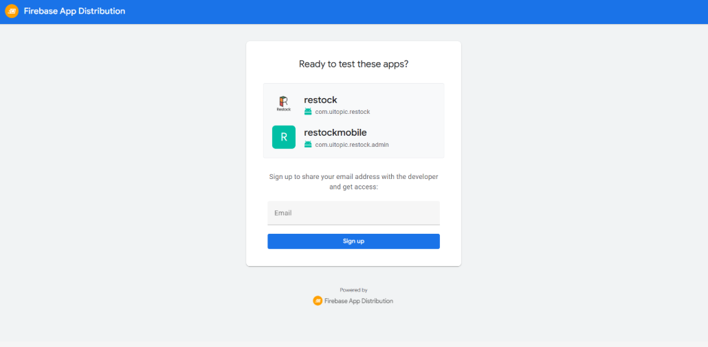

**Testers registrados en Firebase App Distribution**

La figura muestra los testers o grupos configurados para validar la aplicación móvil. Esta evidencia respalda el uso de Firebase App Distribution como canal de retroalimentación para detectar errores en versiones móviles de prueba.

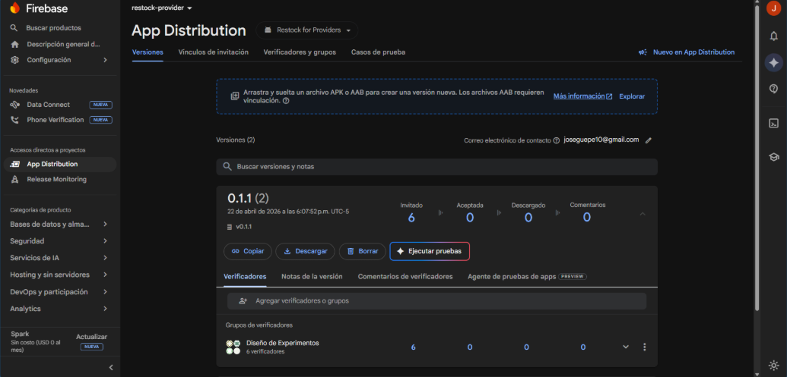

#### 2. Notification Trigger Component

El componente de activadores define qué eventos generan una notificación. En Restock, estos eventos pueden ser técnicos u operativos.

| Activador                        | Tipo                   | Destinatario         |
| -------------------------------- | ---------------------- | -------------------- |
| Fallo de workflow de CI/CD       | Técnico               | Equipo de desarrollo |
| Fallo del workflow de monitoreo  | Técnico               | Equipo de desarrollo |
| Despliegue exitoso               | Técnico               | Equipo de desarrollo |
| Backend no disponible            | Técnico               | Equipo de desarrollo |
| Reporte de error móvil          | Técnico               | Equipo de desarrollo |
| Nueva versión móvil disponible | Técnico / validación | Testers              |

Estos activadores permiten que la información relevante sea comunicada en el momento adecuado y al destinatario correcto.

#### 3. Notification Channel Component

El componente de canales define por qué medio se entrega cada notificación, según el tipo de evento y el destinatario.

| Tipo de notificación            | Destinatario         | Canal                                 |
| -------------------------------- | -------------------- | ------------------------------------- |
| Fallo de workflow                | Equipo de desarrollo | GitHub Actions                        |
| Fallo de despliegue backend      | Equipo de desarrollo | Render                                |
| Backend no disponible            | Equipo de desarrollo | GitHub Actions / Render               |
| Nueva versión móvil disponible | Testers              | Firebase App Distribution             |
| Error reportado en app móvil    | Equipo de desarrollo | Feedback de Firebase App Distribution |

Esta separación evita que todas las notificaciones se envíen por un mismo canal y permite mantener una comunicación más clara y accionable.

#### 4. Notification Message Component

Cada notificación debe contener información suficiente para que el destinatario comprenda el evento y pueda tomar acción. Por ello, las notificaciones deben ser claras, breves y orientadas a la acción.

Una notificación técnica debe incluir:

- Tipo de evento.
- Componente afectado.
- Fecha y hora.
- Resumen del error.
- Commit, workflow o despliegue relacionado.
- Acción sugerida.

Ejemplo de notificación técnica:

```txt
Alerta técnica: el health check del backend falló.
Componente afectado: Backend REST API en Render.
Acción sugerida: revisar logs del servicio y último despliegue ejecutado.
```

#### 5. Team-Facing Notification Component

Las notificaciones dirigidas al equipo de desarrollo tienen como objetivo mantener la estabilidad técnica del sistema. Estas permiten detectar problemas durante o después de un despliegue.

Las principales notificaciones para el equipo son:

- Build fallido.
- Pruebas fallidas.
- Despliegue fallido.
- Health check fallido.
- Error de ejecución en backend.
- Feedback de testers móviles.
- Problema de disponibilidad del servicio.
- Despliegue exitoso después de una corrección.

Estas notificaciones apoyan la mejora continua porque permiten responder rápidamente ante errores y validar que las correcciones funcionen correctamente.

#### 6. Notification Validation Component

Después de enviar o mostrar una notificación, el equipo debe verificar que esta haya sido generada correctamente y que el destinatario pueda entenderla.

El proceso de validación incluye:

1. Confirmar que la notificación fue activada por el evento correcto.
2. Verificar que el mensaje contiene la información necesaria.
3. Confirmar que se muestra o comunica al destinatario adecuado.
4. Revisar si el usuario o integrante del equipo puede tomar acción a partir del mensaje.
5. Ajustar la regla o el contenido de la notificación si resulta confusa o incompleta.

Este componente es importante porque una notificación solo genera valor si llega a tiempo, es entendible y permite tomar una decisión.

#### 8. Notification Pipeline Summary

El pipeline de notificaciones puede resumirse de la siguiente manera:

1. Ocurre un evento técnico u operativo.
2. El sistema o herramienta detecta el evento.
3. El activador genera una notificación.
4. Se construye el mensaje con información relevante.
5. La notificación se envía o muestra por el canal correspondiente.
6. El destinatario recibe o visualiza la notificación.
7. El usuario o equipo realiza la acción necesaria.
8. El proceso se valida y mejora si es necesario.

En conclusión, los componentes del Notification Pipeline permiten que Restock comunique eventos importantes de forma efectiva tanto al equipo de desarrollo como a los usuarios finales. Esto fortalece la confiabilidad técnica del sistema, mejora la capacidad de respuesta ante incidentes y contribuye a una operación más ordenada dentro de la plataforma.
