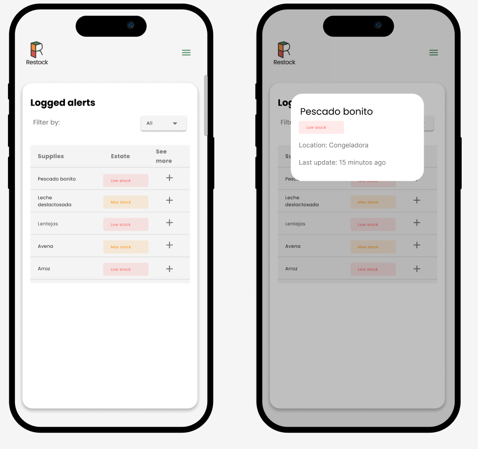
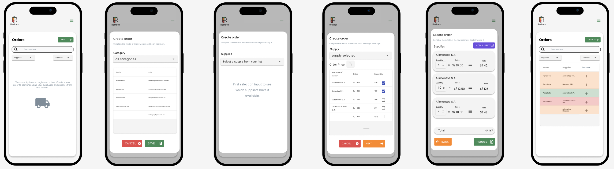
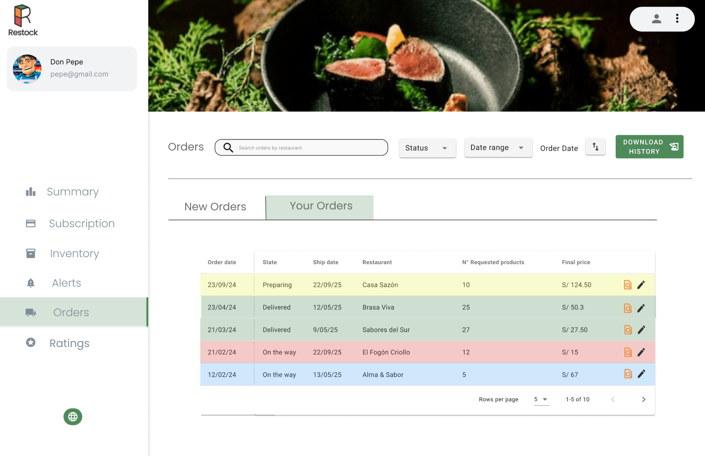
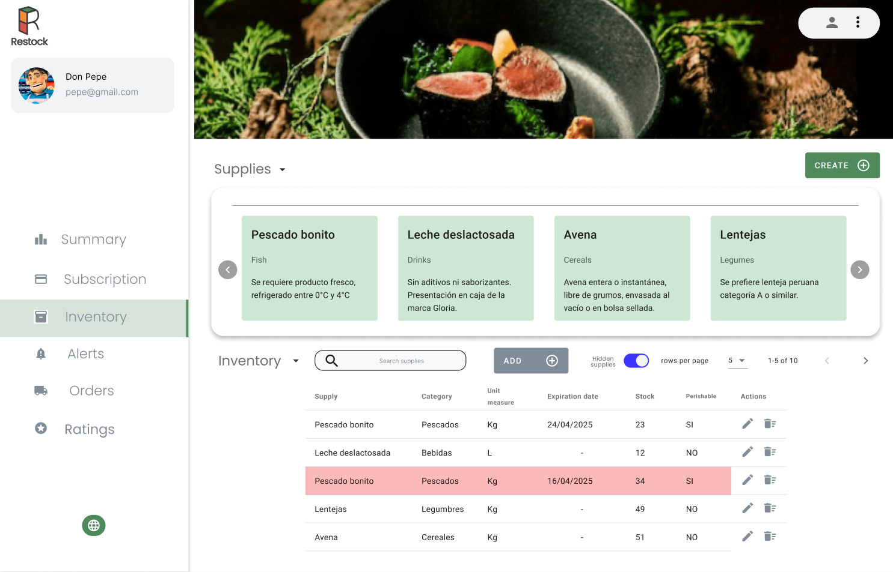
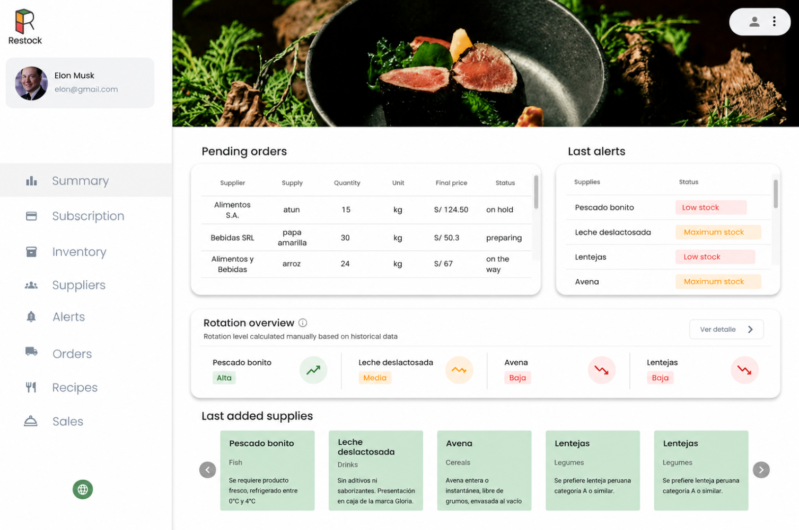
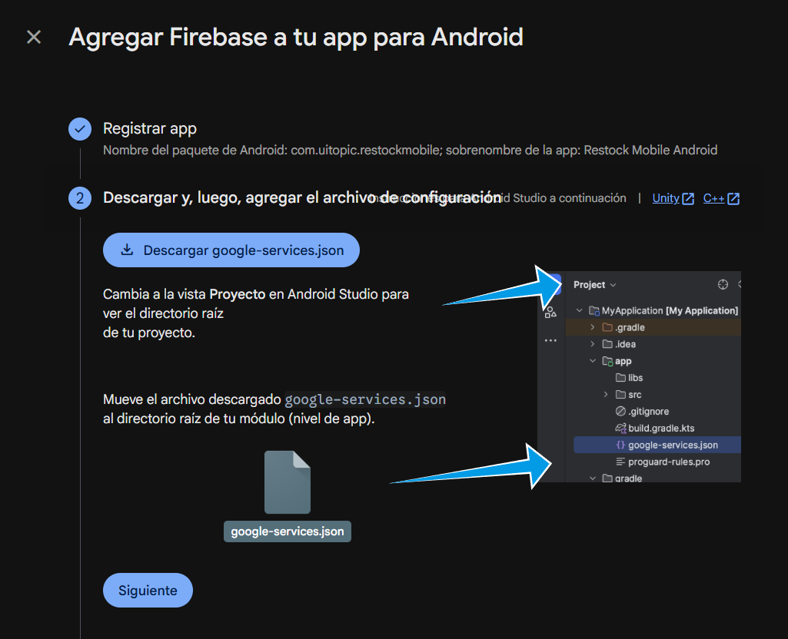
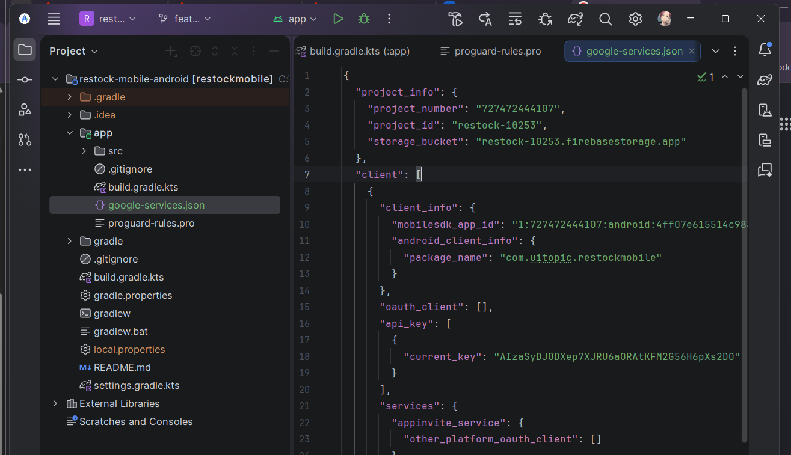
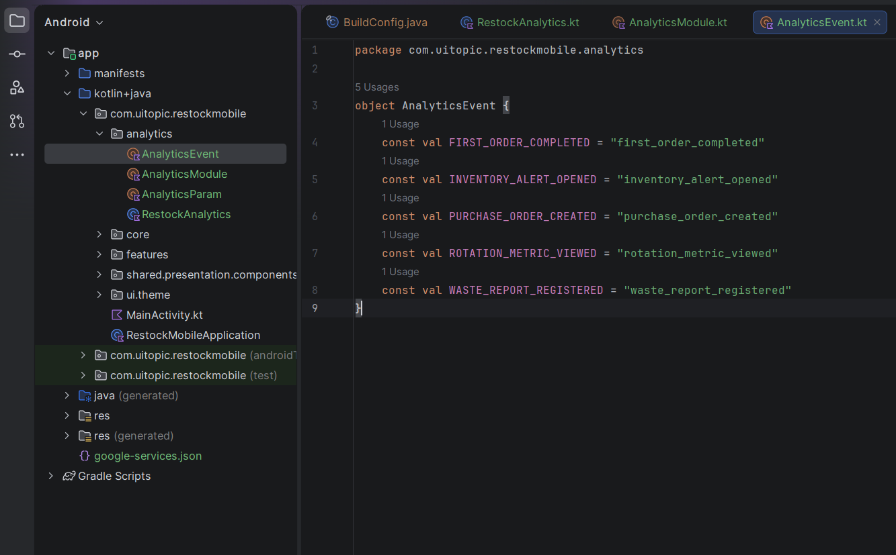
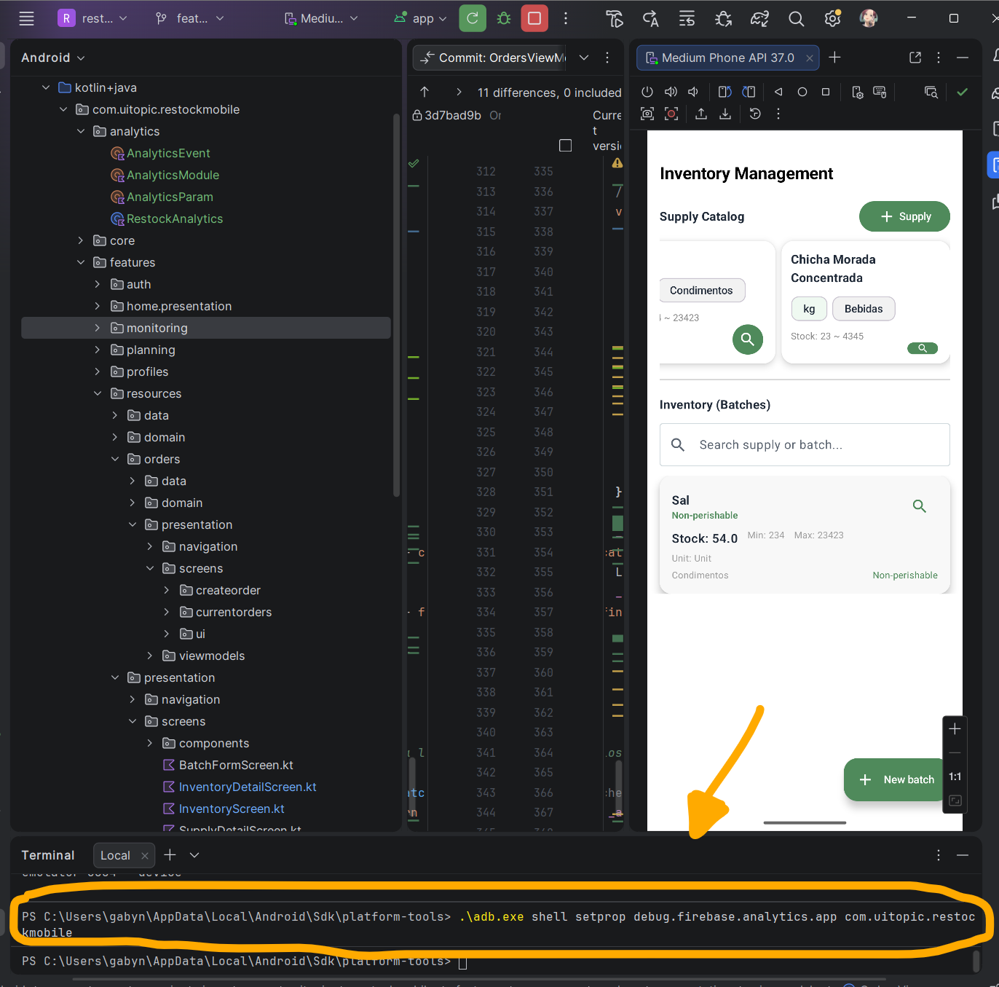
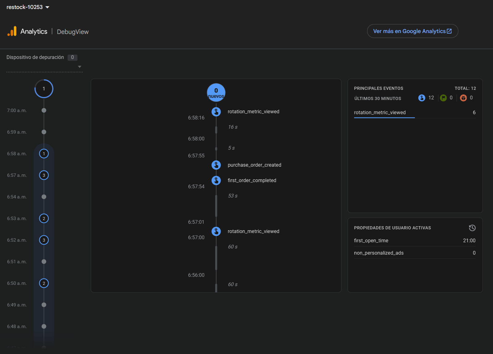

# Part III: Experiment-Driven Lifecycle

# Capítulo VIII: Experiment-Driven Development

## 8.1. Experiment Planning

En esta sección se define la planificación de experimentos como punto de partida del enfoque  Experiment-Driven Development . Su objetivo es identificar qué se conoce actualmente, qué dudas existen y qué supuestos deben validarse antes de tomar decisiones sobre el producto. Para ello, se organiza la información en preguntas, brechas de conocimiento, ideas y tarjetas de experimento, permitiendo priorizar aprendizajes clave y reducir riesgos durante el desarrollo.

### 8.1.1. As-Is Summary

Hasta este punto, el proyecto Restock ha culminado la fase de diseño e implementación técnica, consolidando un ecosistema digital funcional que comprende una Landing Page, una aplicación web de gestión administrativa, aplicaciones móviles (Nativa y Flutter) y una arquitectura de servicios basada en una API RESTful con persistencia en MongoDB.

A pesar de contar con una solución "To-Be" ya construida, el estado actual de nuestro conocimiento se caracteriza por una **incertidumbre operativa**. Actualmente, el éxito de la plataforma depende de premisas críticas (como la capacidad de las alertas automáticas para reducir la merma en un 35%) que hasta el momento son suposiciones basadas en la sabiduría de la industria y no en datos quirúrgicos recolectados del comportamiento real de los usuarios.

Este resumen establece que el punto de partida de la fase actual no es la generación de nuevas soluciones técnicas, sino la recolección de material bruto (suposiciones, vacíos de conocimiento, ideas y afirmaciones) para transformar nuestras creencias en preguntas de investigación. El objetivo primordial es validar si las funcionalidades ya implementadas realmente generan el impacto social y económico previsto para los administradores y proveedores de restaurantes en Lima, antes de proceder con el lanzamiento final.

### 8.1.3. Experiment-Ready Questions

### 8.1.4. Question Backlog

Siguiendo la metodología XDPD, se transformaron las premisas e incertidumbres en un backlog de preguntas de investigación en lugar de una lista de funcionalidades. Este enfoque permite priorizar el aprendizaje y mitigar los riesgos más altos del proyecto Restock antes de consolidar la solución técnica final.

**Estructura del Backlog**

Se opta por un backlog amplio (broad) para esta fase inicial, con el objetivo de sondear diferentes áreas críticas: la adopción del usuario, la viabilidad del ecosistema de proveedores y la efectividad real de la automatización en la reducción de mermas.

**Sistema de Puntuación y Priorización**

Cada pregunta ha sido evaluada bajo cuatro criterios en una escala del 1 al 5 (donde 5 es el valor máximo): **Confianza (C)**, **Riesgo (R)**, **Impacto (I)** e **Interés (Int)**. En cumplimiento con el marco de trabajo, en caso de empate en el puntaje total, se ha priorizado la pregunta con mayor índice de Riesgo.

| ID | Pregunta de Investigación (Question)                                                                      | Motivación (The "Why")                                                                                                                | C | R | I | Int | Total |
| -- | ---------------------------------------------------------------------------------------------------------- | -------------------------------------------------------------------------------------------------------------------------------------- | - | - | - | --- | ----- |
| Q1 | ¿Reducen las alertas en tiempo real el desperdicio de insumos en un 35% como se ha previsto?              | Validar la propuesta de valor core. Si la automatización no impacta la merma, el beneficio económico para el restaurante desaparece. | 2 | 5 | 5 | 5   | 17    |
| Q2 | ¿Son capaces los administradores con baja afinidad digital de completar un pedido sin asistencia externa? | Mitigar el riesgo de adopción. El mayor riesgo identificado es que la complejidad de la UI aleje al usuario tradicional.             | 3 | 5 | 4 | 4   | 16    |
| Q3 | ¿Están los proveedores tradicionales dispuestos a digitalizar sus catálogos para integrarse a Restock?  | Asegurar la viabilidad del ecosistema. El sistema depende de que el proveedor alimente los datos de stock y precios.                   | 2 | 4 | 4 | 5   | 15    |
| Q4 | ¿Influye la visualización de métricas de rotación en la decisión de compra de nuevos insumos?         | Validar el cambio de comportamiento. Queremos saber si el usuario toma decisiones basadas en datos o sigue usando su intuición.       | 4 | 2 | 3 | 4   | 13    |

### 8.1.5. Experiment Cards

La Tarjeta de Experimento es el artefacto clave que sustenta el proceso XDPD y sirve como contrato de aprendizaje para el equipo. Estas tarjetas permiten capturar la información esencial antes de la ejecución, asegurando que cada intervención en el producto Restock tenga un propósito claro y una forma objetiva de medir el éxito o fracaso.

##### **Tarjeta de Experimento 01: Validación de Impacto en Mermas**

Esta tarjeta aborda la premisa principal de negocio: la capacidad de la automatización para generar ahorros reales.

| LADO FRONTAL: Concepto y Motivación                                                                                                                                                                                                                                                                               |
| ------------------------------------------------------------------------------------------------------------------------------------------------------------------------------------------------------------------------------------------------------------------------------------------------------------------ |
| **Pregunta:** ¿Reducen las alertas automáticas de "stock bajo" y "vencimiento" el desperdicio de insumos perecibles en un 35%?                                                                                                                                                                            |
| **Por qué:** Si la automatización no genera una reducción tangible en la merma, la propuesta de valor económica de Restock para el dueño del restaurante desaparece.                                                                                                                                    |
| **Hipótesis:** Creemos que al ofrecer notificaciones push automáticas, los administradores realizarán pedidos preventivos, cuya evidencia se reflejará en una disminución del 35% en los reportes de mermas, bajo la circunstancia de uso diario por dueños de restaurantes medianos.                  |
| **Qué (Simplest Useful Thing):** Ejecución de un piloto operativo utilizando la aplicación móvil nativa (Kotlin) ya implementada, activando el módulo de notificaciones automáticas mediante OneSignal para enviar alertas reales de inventario a los dispositivos de 5 administradores seleccionados. |

| LADO POSTERIOR: Configuración Técnica                                                                                                                                                                                                                                                        |
| ---------------------------------------------------------------------------------------------------------------------------------------------------------------------------------------------------------------------------------------------------------------------------------------------- |
| **Medidas:** • Métrica Principal: Reducción porcentual de mermas registradas por semana. • Métrica Secundaria: Tasa de conversión de alerta (clic en notificación) a creación de orden de compra.                                                                      |
| **Condiciones:** • Experimental: 5 administradores usando el sistema de alertas activas. • Control: 5 administradores usando su método manual actual (Excel/WhatsApp).                                                                                                      |
| **Escala:** • Certeza: Nivel de significancia del 5% y potencia estadística del 80%. • MDE (Efecto Mínimo): Se busca detectar una diferencia mínima del 10% en el volumen de desperdicio. • Tiempo: El experimento durará 14 días (dos ciclos de abastecimiento). |

**Artefacto que se usará como Simplest Useful Thing: Notificaciones en mobile**

##### **Tarjeta de Experimento 02: Validación de Adopción Digital**

Esta tarjeta mitiga el riesgo técnico y de usuario identificado en el segmento de administradores tradicionales.

| LADO FRONTAL: Concepto y Motivación                                                                                                                                                                                                                                |
| ------------------------------------------------------------------------------------------------------------------------------------------------------------------------------------------------------------------------------------------------------------------- |
| **Pregunta:** ¿Son capaces los administradores con baja afinidad digital de completar su primer pedido de insumos de forma autónoma?                                                                                                                       |
| **Por qué:** El mayor riesgo de abandono de la plataforma es la fricción inicial; si el proceso es complejo, el usuario no regresará.                                                                                                                      |
| **Hipótesis:** Creemos que con un onboarding guiado simplificado, los usuarios nuevos completarán su pedido en menos de 5 minutos, cuya evidencia se verá en el éxito de la tarea, bajo la circunstancia de uso por primera vez sin capacitación previa. |
| **Qué (Simplest Useful Thing):** Una sesión de prueba de usuario remota utilizando el flujo de "Primer Pedido" implementado actualmente en la aplicación móvil.                                                                                           |

| LADO POSTERIOR: Configuración Técnica                                                                                                                                                                                          |
| -------------------------------------------------------------------------------------------------------------------------------------------------------------------------------------------------------------------------------- |
| **Medidas:** • Métrica Principal: Tasa de éxito de la tarea (Task Success Rate). • Métrica Secundaria: Tiempo promedio en tarea (Time on Task) y número de errores críticos durante el flujo.             |
| **Condiciones:** • Segmento: Usuarios que declaran usar menos de 2 aplicaciones de gestión en su día a día.                                                                                                       |
| **Escala:** • Certeza: Basado en el estándar de Nielsen, una muestra de 5 usuarios para detectar hasta el 85% de los problemas de usabilidad. • Tiempo: Una sesión única por usuario de máximo 30 minutos. |

**Artefacto que se usará como Simplest Useful Thing: Flujo de Primer pedido implementado en la aplicación móvil**

##### **Tarjeta de Experimento 03: Viabilidad del Ecosistema de Proveedores**

Esta tarjeta mitiga el riesgo de que el sistema no sea útil si los proveedores no están dispuestos a abandonar sus métodos tradicionales (WhatsApp/Excel).

| LADO FRONTAL: Concepto y Motivación                                                                                                                                                                                                                                                                    |
| ------------------------------------------------------------------------------------------------------------------------------------------------------------------------------------------------------------------------------------------------------------------------------------------------------- |
| **Pregunta:** ¿Están los proveedores tradicionales dispuestos a digitalizar sus catálogos para integrarse a Restock a cambio de una gestión de pedidos centralizada?                                                                                                                          |
| **Por qué:** Validar si el valor percibido de tener todos los pedidos en un solo panel compensa el esfuerzo de mantener el catálogo digitalizado. Sin proveedores activos, el restaurante no puede reabastecerse automáticamente                                                               |
| **Hipótesis:** Creemos que al ofrecer una herramienta de visualización de pedidos en tiempo real y gestión de productos, el 60% de los proveedores aceptará la migración digital, cuya evidencia se verá en firmas de intención de uso, bajo la circunstancia de proveedores tradicionales |
| **Qué (Simplest Useful Thing):** Realizar una Prueba de Conserje (*Concierge Test* ) donde el equipo carga manualmente el catálogo de 3 proveedores reales y les muestra el funcionamiento de los módulos Gestión de pedidos y Gestión de Insumos para medir su intención de adopción.   |

| LADO POSTERIOR: Configuración Técnica                                                                                                                                                                                                                                                                 |
| ------------------------------------------------------------------------------------------------------------------------------------------------------------------------------------------------------------------------------------------------------------------------------------------------------- |
| **Medidas:** • Métrica Principal: Tasa de conversión de interés (número de proveedores que firman la carta de intención de uso). • Métrica Secundaria: Número de "puntos de fricción" identificados durante la navegación del módulo de gestión de insumos.                |
| **Condiciones:** • Segmento: Proveedores con más de 10 años en el rubro que actualmente gestionan pedidos solo por canales informales.                                                                                                                                                    |
| **Escala:** • Certeza: Nivel de confianza del 90% para validar un mercado B2B pequeño. • MDE (Efecto Mínimo): Interés positivo de al menos el 50% de la muestra para considerar el feature como viable. • Tiempo: Sesiones de validación individuales con 3-5 proveedores. |

**Artefacto que se usará como Simplest Useful Thing:**

- Módulo de Gestión de pedidos

- Módulo de Gestión de insumos

##### **Tarjeta de Experimento 04: Comportamiento basado en Datos**

Esta tarjeta investiga si añadir indicadores de rotación directamente en la lista de inventario impacta la toma de decisiones.

| LADO FRONTAL: Concepto y Motivación                                                                                                                                                                                                                                                                 |
| ---------------------------------------------------------------------------------------------------------------------------------------------------------------------------------------------------------------------------------------------------------------------------------------------------- |
| **Pregunta:** ¿Influye la visualización de métricas de rotación en la decisión de compra de nuevos insumos?                                                                                                                                                                              |
| **Por qué:** Validar si el usuario confía en datos analíticos para gestionar su capital. Si ver que un producto "no se mueve" no cambia su conducta de compra, no vale la pena desarrollar el módulo de reportes avanzado.                                                                |
| **Hipótesis:** Creemos que al mostrar un indicador de rotación en el inventario, los administradores reducirán los errores de sobrestock en un 25%, cuya evidencia se verá en la disminución de cantidades en las órdenes de compra, bajo la circunstancia de reabastecimiento semanal. |
| **Qué (Simplest Useful Thing):** Modificar la tabla del módulo Overview en la aplicación web Angular para incluir una columna extra llamada "Rotation" (con etiquetas: Alta, Media, Baja) calculada manualmente con datos históricos para 3 administradores de prueba.                    |

| LADO POSTERIOR: Configuración Técnica                                                                                                                                                                                                                                                       |
| --------------------------------------------------------------------------------------------------------------------------------------------------------------------------------------------------------------------------------------------------------------------------------------------- |
| **Medidas:** • Métrica Principal: Porcentajede reducción en el volumen de pedidos para insumos marcados con "Baja Rotación". • Métrica Secundaria: Tiempo de permanencia del usuario en la vista de métricas de rotación.                                             |
| **Condiciones:** • Experimental: Administradores con acceso al dashboard principal con métricas de rotación. • Control: Administradores realizando su pedido basándose únicamente en su revisión manual de inventario física.                                         |
| **Escala:** • Certeza: Nivel de significancia del 5% y potencia estadística del 80%. • MDE (Efecto Mínimo): Se busca detectar una mejora mínima del 10% en la precisión del pedido. • Tiempo: Una sesión de observación por usuario durante un ciclo de compra. |

**Artefacto que se usará como Simplest Useful Thing: Módulo Overview con métricas de rotación**

## 8.2. Experiment Design

En esta sección se diseña la estructura de los experimentos que permitirán validar las hipótesis del producto de manera ordenada y medible. Para ello, se definen las métricas de negocio, las medidas específicas, las condiciones de evaluación, el tamaño o escala del experimento y los métodos más adecuados para recolectar evidencia. Además, se establecen los objetivos de analítica, KPIs y el plan de seguimiento web y móvil, asegurando que cada experimento genere datos útiles para la toma de decisiones.

### 8.2.1. Hypotheses

En esta fase de diseño, se transforman las premisas en declaraciones de creencia específicas, falsables y medibles. Siguiendo el rigor del método científico aplicado al software, cada hipótesis de trabajo (H1) se presenta junto a su hipótesis nula (H0), la cual actúa como un espejo que atribuye cualquier cambio observado al azar o a la falta de relación entre las variables.

**Experimento 01: Impacto de Alertas en la Reducción de Mermas**

* **Hipótesis de Trabajo (H1):** Creemos que la respuesta a nuestra incertidumbre sobre el ahorro de insumos es que  **al ofrecer notificaciones push automáticas de stock bajo y vencimiento, los administradores realizarán pedidos preventivos**, cuya evidencia se reflejará en **una disminución del 35% en los reportes de mermas semanales**, bajo las circunstancias de **uso diario por parte de dueños de restaurantes medianos en Lima**.
* **Hipótesis Nula (H0):** Las alertas automáticas no causarán una reducción significativa del 35% en las mermas; cualquier fluctuación observada en el desperdicio de insumos será producto del azar o factores externos ajenos a la intervención del sistema.

**Experimento 02: Eficacia del Onboarding en Usuarios no Digitales**

* **Hipótesis de Trabajo (H1):** Creemos que la respuesta sobre la barrera de adopción es que  **un flujo de onboarding guiado y simplificado permite la autonomía del usuario**, cuya evidencia se reflejará en **una Tasa de Éxito de la Tarea (Task Success Rate) del 100% y un tiempo menor a 5 minutos en el primer pedido**, bajo las circunstancias de **uso por primera vez por sujetos con baja afinidad digital (que usan < 2 apps de gestión)**.
* **Hipótesis Nula (H0):** El onboarding guiado no tendrá un efecto medible en el éxito o la velocidad de la tarea; los usuarios no digitales seguirán requiriendo asistencia externa o tardarán más de 5 minutos independientemente de la interfaz.

**Experimento 03: Disposición de Proveedores a la Integración Digital**

* **Hipótesis de Trabajo (H1):** Creemos que la respuesta sobre la viabilidad del ecosistema es que  **proporcionar herramientas de carga de catálogos y gestión centralizada de pedidos entrantes incentiva la migración digital del proveedor**, cuya evidencia se reflejará en **un 60% de conversión de interés (firmas de intención de uso o aceptación de capacitación)**, bajo las circunstancias de **proveedores tradicionales con más de 10 años en el rubro que actualmente usan canales informales.**
* **Hipótesis Nula (H0):** No existe una relación entre las herramientas de gestión de pedidos y la disposición del proveedor a digitalizarse; la tasa de interés se mantendrá por debajo del umbral del 60% debido a la persistencia y preferencia por métodos tradicionales como WhatsApp o Excel.

**Experimento 04: Influencia de Indicadores de Rotación en el Inventario**

* **Hipótesis de Trabajo (H1):** Creemos que la respuesta a nuestra incertidumbre es que **al incluir una columna de nivel de rotación en el módulo de Inventario, los administradores tomarán decisiones de compra más precisas**, cuya evidencia se reflejará en **una reducción del 25% en el volumen de pedidos de insumos de baja rotación**, bajo las circunstancias de **uso durante el cierre de inventario semanal por dueños de restaurantes.**
* **Hipótesis Nula (H0):** La visualización de la rotación en el inventario no tendrá un efecto medible; los administradores seguirán pidiendo las mismas cantidades basándose en su intuición o hábitos previos, independientemente del dato mostrado por Restock.

### 8.2.2. Domain Business Metrics

El objetivo fundamental de esta sección es alinear estratégicamente la medición de los experimentos con los objetivos comerciales core de la plataforma Restock. Al definir métricas de negocio concretas, estandarizadas y predefinidas, el equipo mitiga el riesgo de evaluar el éxito de las intervenciones basándose en *vanity metrics* (métricas de vanidad) o datos aislados que no aportan valor real a la toma de decisiones.

Cada una de las métricas detalladas a continuación se vincula directamente con las hipótesis planteadas en la fase de diseño (sección 8.2.1), asegurando que no se utilicen métricas *ad-hoc* durante la ejecución del experimento.

#### 1. Tasa de Reducción de Mermas (Waste Reduction Rate - WRR)
* **Descripción:** Mide la disminución porcentual en el volumen o costo de los insumos perecibles que se reportan como desperdicio dentro del restaurante, validando la eficacia de las alertas automáticas.
* **Fórmula de cálculo:** $$\text{WRR} = \left( \frac{\text{Mermas en Período de Control} - \text{Mermas en Período Experimental}}{\text{Mermas en Período de Control}} \right) \times 100$$
* **Técnica de recolección:** Extracción automatizada de los reportes semanales de mermas registrados en la base de datos de la plataforma por los usuarios del grupo experimental.
* **Meta deseada:** Una reducción mínima del 35% en el desperdicio de insumos perecibles.

#### 2. Tasa de Éxito de la Tarea (Task Success Rate - TSR)
* **Descripción:** Evalúa la eficacia del flujo de *onboarding* guiado midiendo el porcentaje de administradores (con baja afinidad digital) que logran enviar su primer pedido de forma completamente autónoma en menos de 5 minutos.
* **Fórmula de cálculo:** $$\text{TSR} = \left( \frac{\text{Usuarios que completan el pedido sin asistencia en < 5 min}}{\text{Total de usuarios evaluados en la muestra}} \right) \times 100$$
* **Técnica de recolección:** Pruebas de usabilidad remotas y registro de eventos (Event Tracking) en la herramienta de analítica integrada en la aplicación móvil (Firebase Analytics).
* **Meta deseada:** 100% de éxito autónomo en la muestra de usuarios evaluada.

#### 3. Tasa de Conversión de Interés del Proveedor (Supplier Conversion Rate - SCR)
* **Descripción:** Determina la viabilidad comercial de digitalizar a los proveedores midiendo la proporción de negocios tradicionales que muestran una intención firme de integrarse a Restock tras interactuar con la gestión de pedidos centralizada.
* **Fórmula de cálculo:** $$\text{SCR} = \left( \frac{\text{Número de proveedores que firman la intención de uso}}{\text{Total de proveedores expuestos al experimento}} \right) \times 100$$
* **Técnica de recolección:** Registro cualitativo y cuantitativo al finalizar las sesiones individuales de capacitación o demostración.
* **Meta deseada:** Un mínimo de 60% de conversión de interés sobre la muestra evaluada.

#### 4. Índice de Precisión de Compra (Purchase Precision Index - PPI)
* **Descripción:** Evalúa el impacto de la visualización de métricas de rotación en el comportamiento de compra del administrador, midiendo la disminución en el volumen de pedidos excesivos para insumos catalogados con "Baja Rotación".
* **Fórmula de cálculo:** $$\text{PPI} = \left( \frac{\text{Volumen de pedido histórico As-Is} - \text{Volumen de pedido con métrica visible To-Be}}{\text{Volumen de pedido histórico As-Is}} \right) \times 100$$
* **Técnica de recolección:** Comparación de los datos históricos de órdenes previas contra las nuevas órdenes de compra generadas a través del módulo de inventario.
* **Meta deseada:** Una reducción del 25% en el volumen de pedidos de insumos de baja rotación en un ciclo de cierre semanal.

### 8.2.3. Measures

### 8.2.4. Conditions

Esta sección describe las condiciones definidas para cada experimento planificado en la plataforma Restock, en función de los factores que permiten identificar el motivo subyacente detrás de cada respuesta esperada. Para cada experimento derivado de las hipótesis de negocio (sección 8.2.1), se establece la **condición experimental** —orientada a obtener evidencia a favor de la hipótesis alternativa— y la **condición de control** —que representa el estado base bajo la suposición de que la hipótesis nula es correcta—.

---

### Experimento 1 — Módulo de inventario automatizado con alertas en tiempo real

**Pregunta:** ¿La activación del módulo de inventario automatizado con alertas reduce las mermas de insumos en los restaurantes?

| | Descripción |
|---|---|
| **Condición Experimental (A)** | Los administradores de restaurante acceden a la plataforma Restock con el módulo de inventario activo. Reciben alertas automáticas clasificadas por tipo (stock bajo, exceso de stock, vencimiento próximo) y visualizan el nivel de stock actualizado en tiempo real desde el dashboard. El sistema descuenta insumos automáticamente al registrar ventas. |
| **Condición de Control (B)** | Los administradores gestionan su inventario mediante métodos manuales convencionales: hojas de cálculo (Excel o Google Sheets), cuadernos físicos o mensajería (WhatsApp). No tienen acceso al módulo automatizado de Restock durante el período de medición. |

**Variable independiente:** Activación del módulo de inventario automatizado con alertas en tiempo real.  
**Variable dependiente:** Porcentaje de reducción en mermas de insumos por período de medición.  
**H₀:** El módulo de inventario automatizado no produce una reducción significativa de mermas respecto al método manual.  
**H₁:** El módulo reduce las mermas en al menos un **35 %** respecto al método manual.

**Criterio de asignación:** Asignación aleatoria por restaurante participante. Cada restaurante opera exclusivamente bajo una de las dos condiciones durante el período del experimento para evitar contaminación cruzada.

---

### Experimento 2 — Onboarding guiado e interfaz móvil-first

**Pregunta:** ¿Un onboarding guiado combinado con acceso móvil como canal principal incrementa la retención temprana de usuarios?

| | Descripción |
|---|---|
| **Condición Experimental (A)** | Los nuevos usuarios (administradores y proveedores) reciben un flujo de onboarding guiado paso a paso al registrarse: tour interactivo, tooltips contextuales en los módulos principales y configuración asistida del primer insumo y primera orden. El canal de acceso recomendado es el dispositivo móvil. |
| **Condición de Control (B)** | Los nuevos usuarios acceden a la plataforma sin guía de onboarding: navegan libremente desde la pantalla de inicio sin asistencia contextual. No se sugiere ningún canal preferente de acceso. |

**Variable independiente:** Presencia de onboarding guiado y disponibilidad de acceso móvil-first.  
**Variable dependiente:** Número de usuarios que inician sesión 3 o más veces durante sus primeros 7 días tras el registro (retención temprana).  
**H₀:** El onboarding guiado y el acceso móvil no incrementan significativamente la retención temprana de usuarios.  
**H₁:** El onboarding guiado permite que al menos **500 usuarios activos** registren 3 o más sesiones en sus primeros 7 días dentro de los primeros 6 meses de operación.

**Criterio de asignación:** Asignación por cohorte de registro. Los usuarios registrados durante las primeras 4 semanas corresponden a la condición de control; los registrados durante las siguientes 4 semanas corresponden a la condición experimental, en un esquema de despliegue progresivo (feature flag).

---

### Experimento 3 — Reportes automáticos con métricas de rotación y márgenes

**Pregunta:** ¿El acceso a reportes automáticos reduce los errores al generar órdenes de compra?

| | Descripción |
|---|---|
| **Condición Experimental (A)** | Los administradores de restaurante tienen acceso al módulo de reportes de Restock, el cual genera automáticamente informes con métricas de rotación de insumos, nivel promedio de stock por período y sugerencias de cantidad de pedido basadas en el historial de consumo. Los reportes están disponibles previo a la generación de cada orden. |
| **Condición de Control (B)** | Los administradores generan órdenes de compra sin acceso a reportes automatizados. Toman decisiones de abastecimiento basadas en la observación directa del inventario, criterio propio o registros históricos elaborados manualmente fuera de la plataforma. |

**Variable independiente:** Disponibilidad de reportes automáticos con métricas de rotación y márgenes previo a la generación de órdenes.  
**Variable dependiente:** Porcentaje de líneas de pedido que requieren corrección (edición o eliminación) antes de ser enviadas al proveedor.  
**H₀:** El acceso a reportes automáticos no reduce significativamente los errores en la generación de órdenes de compra.  
**H₁:** Los reportes automáticos reducen en al menos un **25 %** las líneas de pedido que necesitan corrección.

**Criterio de asignación:** Asignación aleatoria por restaurante. Se controla que el restaurante no haya utilizado el módulo de reportes previamente (no contaminación de cohorte).

---

### Experimento 4 — Canal centralizado proveedor–restaurante (catálogo, pedidos y comunicación)

**Pregunta:** ¿La centralización del catálogo, pedidos y comunicación dentro de la plataforma incrementa el volumen de pedidos gestionados y reduce los errores de pedido?

| | Descripción |
|---|---|
| **Condición Experimental (A)** | Los administradores de restaurante y sus proveedores asociados gestionan catálogos de productos, creación y seguimiento de pedidos, y comunicación exclusivamente dentro de Restock (módulo de órdenes + catálogo del proveedor + sistema de notificaciones de estado). No se permite el uso de canales externos para estas interacciones durante el período del experimento. |
| **Condición de Control (B)** | La gestión de pedidos y comunicación se realiza a través de los canales fragmentados habituales: WhatsApp, llamadas telefónicas, correo electrónico o visitas presenciales. La plataforma Restock no se utiliza para estas interacciones. |

**Variable independiente:** Uso exclusivo del canal centralizado de Restock para gestión de catálogos, pedidos y comunicación entre restaurante y proveedor.  
**Variable dependiente (primaria):** Número de pedidos creados dentro de la plataforma por restaurante por mes.  
**Variable dependiente (secundaria):** Porcentaje de órdenes con devoluciones, ajustes o errores de pedido sobre el total de órdenes creadas.  
**H₀:** La centralización del canal no produce un incremento significativo en pedidos gestionados dentro de la plataforma ni reduce los errores de pedido.  
**H₁:** La centralización incrementa en al menos un **40 %** los pedidos gestionados en la plataforma y reduce en al menos un **25 %** las devoluciones o ajustes.

**Criterio de asignación:** Asignación por par restaurante–proveedor. Ambos actores del par deben pertenecer a la misma condición para garantizar que la interacción sea consistente con el canal asignado.

---

### 8.2.5. Scale Calculations and Decisions

### 8.2.6. Methods Selection

### 8.2.7. Data Analytics: Goals, KPIs and Metrics Selection

En esta sección se define la estrategia de recolección de datos necesaria para responder a las preguntas de investigación. Siguiendo la filosofía XDPD, se seleccionaron un conjunto mínimo de medidas para garantizar la eficiencia operativa y la precisión en la detección de cambios significativos, evitando la acumulación de datos irrelevantes o "vanity metrics".

**1. Metas de Análisis (Goals)**

El objetivo principal de la analítica es transformar las interacciones de los usuarios en el ecosistema Restock en conocimiento validado sobre:

* La efectividad de la automatización en la gestión de inventarios.
* La autonomía del usuario tradicional en flujos digitales críticos.
* La intención de migración digital por parte de proveedores tradicionales.
* La influencia de los analíticos en la precisión de la toma de decisiones.

**2. Selección de KPIs y Métricas**

Para asegurar que las métricas permitan detectar cambios precisos, se estructura la selección en los siguientes niveles:

| Nivel             | Nombre del Indicador               | Métrica Atómica (Data Point)                                                 | Justificación de Selección (Economy of Tracking)                                      |
| ----------------- | ---------------------------------- | ------------------------------------------------------------------------------ | --------------------------------------------------------------------------------------- |
| KPI de Negocio    | Tasa de Reducción de Mermas       | Peso (kg/l) de insumos desechados por semana.                                  | Directamente vinculado a la propuesta de valor core de ahorro del 35%.                  |
| KPI de Adopción  | Task Success Rate (TSR)            | Booleano (éxito/fallo) en el primer pedido.                                   | Métrica binaria simple que elimina la ambigüedad sobre la usabilidad del onboarding.  |
| KPI de Ecosistema | Tasa de Conversión de Proveedores | Número de firmas de intención vs. total contactados.                         | Permite validar la viabilidad del mercado B2B con el menor esfuerzo de rastreo posible. |
| KPI Estratégico  | Precisión de Compra               | % de líneas de pedido corregidas tras ver reportes.                           | Mide si los datos realmente influyen en el usuario.                                     |
| Métrica de Salud | Latencia de Alerta Push            | Tiempo (ms) desde el evento de stock bajo hasta el envío de la notificación. | Asegura que la tecnología no sea un obstáculo para la experiencia del usuario.        |

**3. Estrategia de Economía de Datos**

En cumplimiento con el requisito de economía en el rastreo, se decide:

* Rastreo Temporal: Las métricas de comportamiento (onboarding) solo se capturarán durante la sesión inicial de los sujetos de prueba.
* Focalización: No se rastrearán eventos de navegación general (clics en "Acerca de nosotros") para evitar el ruido en el análisis de las hipótesis críticas.
* Herramientas Seleccionadas: Se usará Firebase Analytics para la consolidación de reportes, permitiendo una visualización limpia sin necesidad de procesar datos crudos masivos.

**4. Evidencias de preparación analítica**

Habilitación de Google Analytics en Firebase:

Integración del archivo google-services.json en Android Studio:

Definición de eventos analíticos en Kotlin:

Ejecución de la app y activación de DebugView:

Validación de eventos en Firebase DebugView:

### 8.2.8. Web and Mobile Tracking Plan

## 8.3. Experimentation

### 8.3.1. To-Be User Stories

### 8.3.2. To-Be Product Backlog

### 8.3.3. Pipeline-supported, Experiment-Driven To-Be Software Platform  Lifecycle

#### 8.3.3.1. To-Be Sprint Backlogs

#### 8.3.3.2. Implemented To-Be Landing Page Evidence

#### 8.3.3.3. Implemented To-Be Frontend-Web Application Evidence

#### 8.3.3.4. Implemented To-Be Native-Mobile Application Evidence

#### 8.3.3.5. Implemented To-Be RESTful API and/or Serverless Backend Evidence

#### 8.3.3.6. Team Collaboration Insights

### 8.3.4. To-Be Validation Interviews

#### 8.3.4.1. Diseño de Entrevistas

#### 8.3.4.2. Registro de Entrevistas

## 8.4. Experiment Aftermath & Analysis

### 8.4.1. Analysis and Interpretation of Results

### 8.4.2. Re-scored and Re-prioritized Question Backlog

## 8.5. Continuous Learning

### 8.5.1. Shareback Session Artifacts: Learning Workflow

## 8.6. To-Be Software Platform Pre-launch

### 8.6.1. About-the-Product Intro Video
