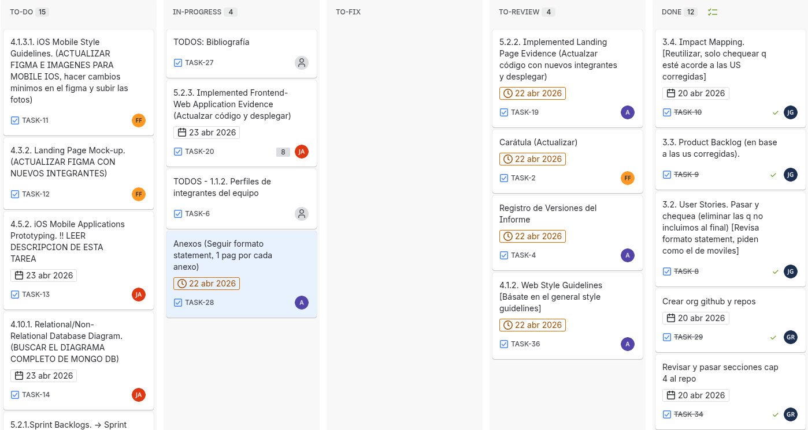
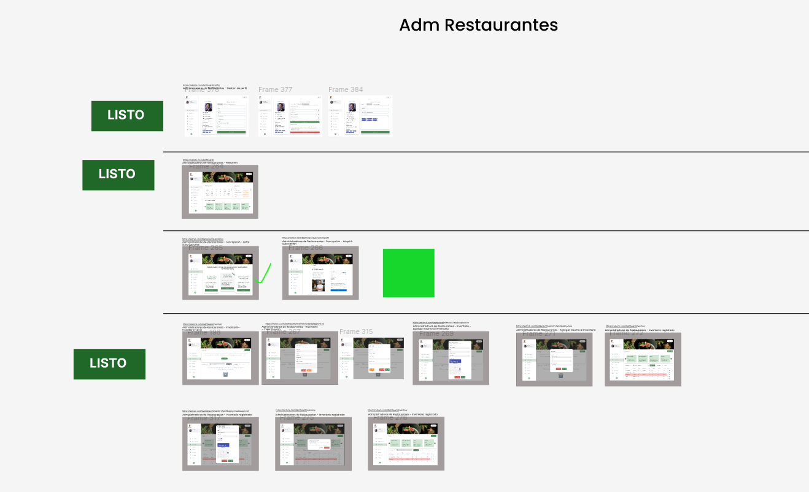
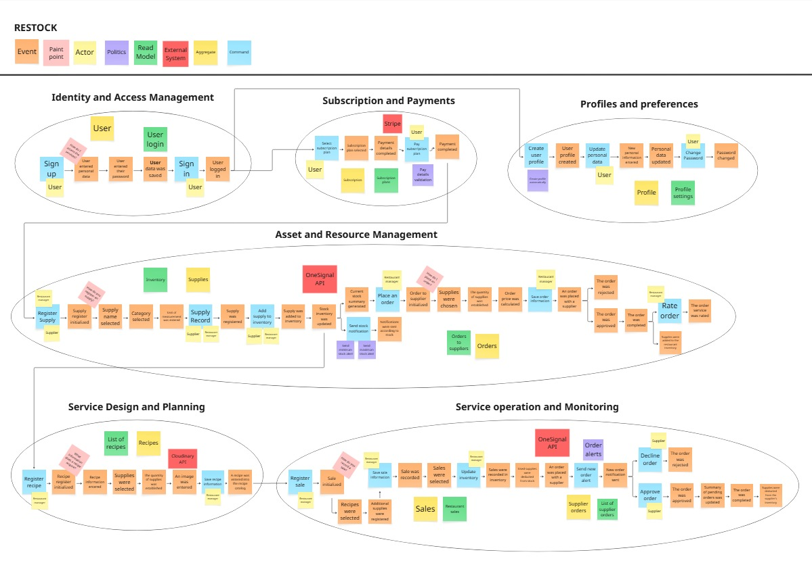
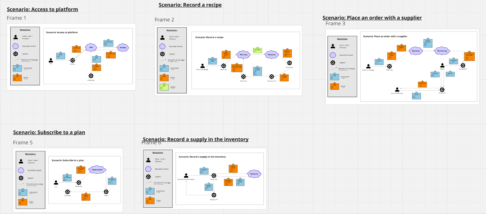
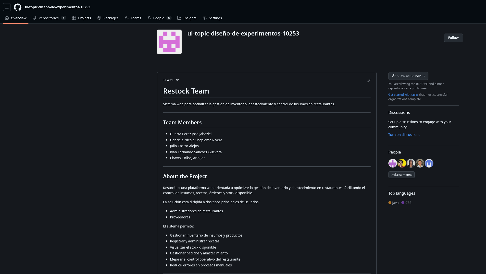
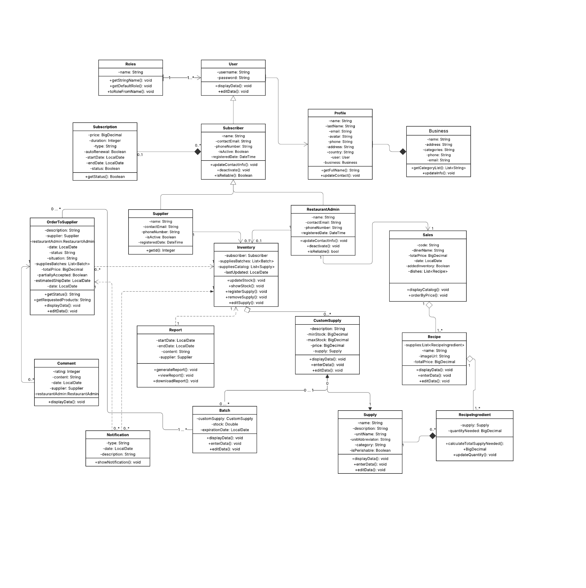

# Anexos

 

## Anexo A: Product Backlog

En este apartado se presenta el Product Backlog del proyecto, gestionado a través de la herramienta Jira, donde se detallan las User Stories, tareas y el estado actual del desarrollo.

**Enlace al Tablero de Jira:**
[Jira Product Backlog - Restock](https://gabrielashapiama285.atlassian.net/jira/software/projects/TASK/boards/67)

 

## Anexo B: Wireframes y Mockups

Se incluye el acceso al diseño visual de la plataforma, contemplando tanto los wireframes de baja fidelidad como los mockups de alta fidelidad desarrollados en Figma.

**Enlace al Diseño en Figma:**
[Figma Design - Restock](https://www.figma.com/design/HqVEDf8H2ShiHNgV4btki7/Dise%C3%B1o-Exp-Software---Wireframes-Mockups-Restock?node-id=2-1094&p=f)

 

## Anexo C: Videos de Exposiciones

En esta sección se incluyen de forma progresiva los títulos e hipervínculos a los videos de las exposiciones de cada entrega del proyecto, alojados en Microsoft Stream.

 

## Anexo D: Event Storming

En esta sección se adjunta el diagrama de Event Storming realizado para el modelado del dominio del negocio, el cual permite visualizar los eventos, comandos y actores del sistema.

 

## Anexo E: Strategic Domain Driven Design

Aquí se presenta la organización del dominio mediante subdominios y contextos acotados (Bounded Contexts). Se incluye el enlace al tablero de Miro donde se desarrolló el diseño estratégico.

**Enlace al Tablero de Miro:**
[Strategic DDD - Restock](https://miro.com/app/board/uXjVJObik40=/)

 

## Anexo F: Organización de GitHub

Se detalla la estructura y organización de la organización en GitHub, donde se gestionan los repositorios del informe, la landing page, la aplicación web y la aplicación móvil.

**Enlace a la Organización de GitHub:**
[https://shortlink.uk/1pCFd](https://shortlink.uk/1pCFd)

 

## Anexo G: Diagrama de Clases

Se adjunta el diagrama de clases del sistema, detallando las entidades principales (User, Subscriber, Subscription, RestaurantAdmin, Supplier, Inventory, Supply, etc.) y sus relaciones de herencia y asociación.

