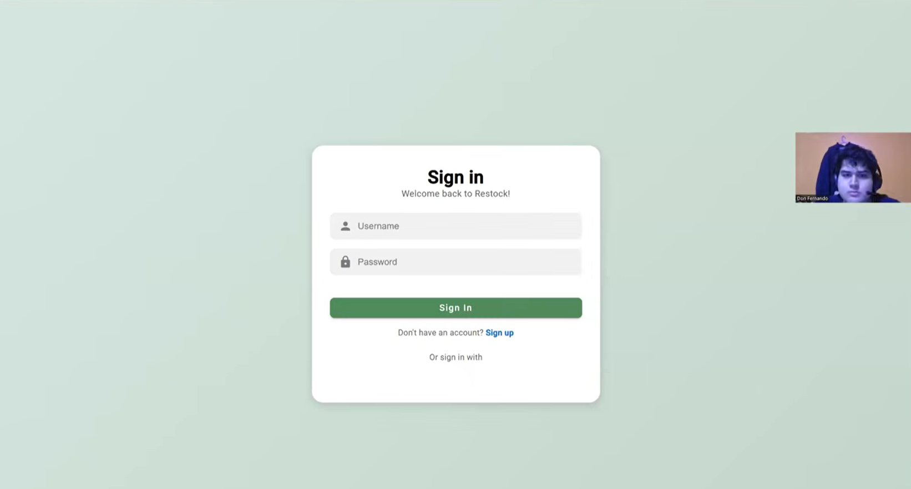
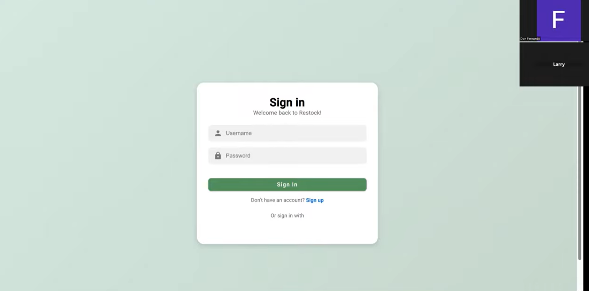

# Anexos

 

## Anexo A: Product Backlog

En este apartado se presenta el Product Backlog del proyecto, gestionado a través de la herramienta Jira, donde se detallan las User Stories, tareas y el estado actual del desarrollo.

**Enlace al Tablero de Jira:**
[Jira Product Backlog - Restock](https://gabrielashapiama285.atlassian.net/jira/software/projects/TASK/boards/67)

 

## Anexo B: Wireframes y Mockups

Se incluye el acceso al diseño visual de la plataforma, contemplando tanto los wireframes de baja fidelidad como los mockups de alta fidelidad desarrollados en Figma.

**Enlace al Diseño en Figma:**
[Figma Design - Restock](https://www.figma.com/design/HqVEDf8H2ShiHNgV4btki7/Dise%C3%B1o-Exp-Software---Wireframes-Mockups-Restock?node-id=2-1094&p=f)

 

## Anexo C: Videos de Exposiciones

En esta sección se incluyen de forma progresiva los títulos e hipervínculos a los videos de las exposiciones de cada entrega del proyecto, alojados en SharePoint / Microsoft Stream:

| Entrega | Enlace al Video (SharePoint) |
| :--- | :--- |
| **AV1 (Semana 4 — Sprint 1)** | [Video de Exposición AV1](https://upcedupe-my.sharepoint.com/:v:/g/personal/gabriela_shapiama_upc_edu_pe/IQBkmqCUTyXcS4X-iADPc8-LATO0HC_NBFzdnhG8wxW0qWA?e=lkpvv7) |
| **TB1 (Semana 7 — Exposición Parcial)** | [Video de Exposición TB1](https://upcedupe-my.sharepoint.com/:v:/g/personal/gabriela_shapiama_upc_edu_pe/IQD55lUtLo2VQqzYCuLBVKqOAZxKUak2gWKuu5dzcZhFaxY?e=FDirAj) |
| **AV2 (Semana 12 — Sprint 3)** | [Video de Exposición AV2](https://upcedupe-my.sharepoint.com/:v:/g/personal/gabriela_shapiama_upc_edu_pe/IQChvyotWY-aSbkhoIiKcl_lAV1ekJ8BugC2T-bd9HY9_5g?e=df90eE) |

 

## Anexo D: Event Storming

En esta sección se adjunta el diagrama de Event Storming realizado para el modelado del dominio del negocio, el cual permite visualizar los eventos, comandos y actores del sistema.

 

## Anexo E: Strategic Domain Driven Design

Aquí se presenta la organización del dominio mediante subdominios y contextos acotados (Bounded Contexts). Se incluye el enlace al tablero de Miro donde se desarrolló el diseño estratégico.

**Enlace al Tablero de Miro:**
[Strategic DDD - Restock](https://miro.com/app/board/uXjVJObik40=/)

 

## Anexo F: Organización de GitHub

Se detalla la estructura de la organización en GitHub de UI-Topic. Para cumplir con las buenas prácticas de control de versiones, el código fuente no está centralizado, sino que se gestiona mediante repositorios individuales para cada producto de software.

**Enlace a la Organización de GitHub:**
[https://shortlink.uk/1pCFd](https://shortlink.uk/1pCFd)

* **Informe del Proyecto:** [https://shortlink.uk/1tQjs](https://shortlink.uk/1tQjs)
* **Landing Page:** [https://shortlink.uk/1uY4v](https://shortlink.uk/1uY4v)
* **Aplicación Web (Frontend):** [https://shortlink.uk/1uY4J](https://shortlink.uk/1uY4J)
* **Backend (API RESTful):** [https://shortlink.uk/1pCy0](https://shortlink.uk/1pCy0)
* **Aplicación Móvil Flutter:** [https://shortlink.uk/1uY4S](https://shortlink.uk/1uY4S)
* **Aplicación Móvil Nativa:** [https://shortlink.uk/1pCyC](https://shortlink.uk/1pCyC)

 

## Anexo G: Diagrama de Clases

Se adjunta el diagrama de clases del sistema, detallando las entidades principales (User, Subscriber, Subscription, RestaurantAdmin, Supplier, Inventory, Supply, etc.) y sus relaciones de herencia y asociación.

## Anexo H: About the Product

Se detalla la funcionalidad del ecosistema de productos de Restock, contemplando tanto la plataforma web de administración como la aplicación móvil y el panel de proveedores:

* **Enlace (YouTube):** [Video About-the-Product](https://youtu.be/hb5CnSDc2PI?si=mi9CKlrrRgStRkQ3)
* **Enlace (Microsoft Stream):** [Video About-the-Product (Stream)](https://shortlink.uk/1ox4T)

## Anexo I: Validation

Se adjunta el video de validacion del proyecto que se realizo con los 2 apartados, administrado y proovedor para validar el funcionamiento en distintos aparatos.

https://www.youtube.com/watch?v=FGF7uwXhxbc