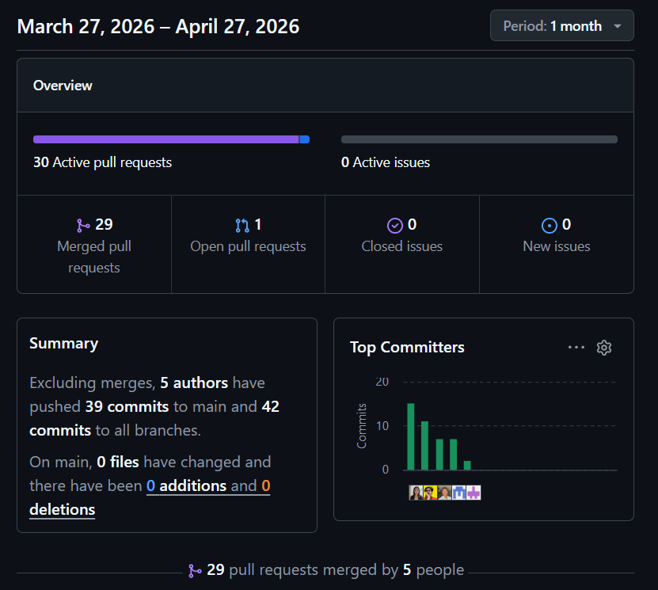
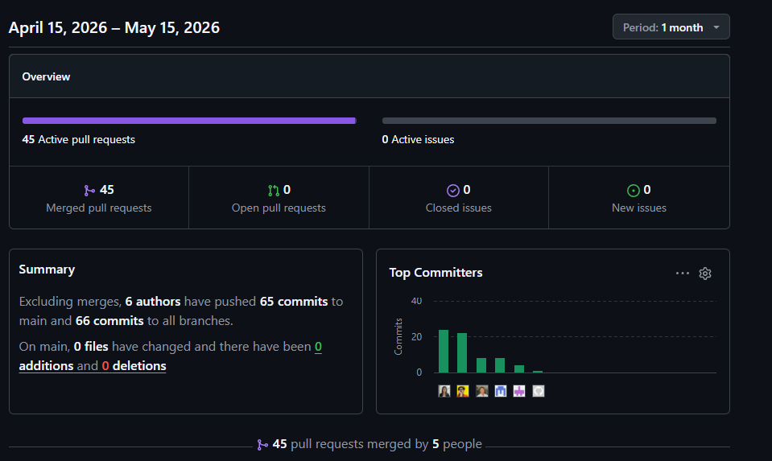

<div id="cover-page" align="center">


&nbsp;

# UNIVERSIDAD PERUANA DE CIENCIAS APLICADAS

## Ingeniería de Software

### Ciclo: 202610

### Curso: Diseño de Experimentos de Ingeniería de Software - 1ASI0732

### NRC: 10253

### Docente: Juan Carlos Tinoco Licas

&nbsp;
&nbsp;

## Informe de Trabajo Final

### Startup: UI-Topic

### Producto: Restock

&nbsp;

### u202021885 - Castro Alejos, Julio Daniel

### u202213468 - Chavez Uribe, Ario

### u202319831 - Guerra Perez, José Jahaziel

### u202218181 - Sanchez Guevara, Ivan Fernando

### u202319448 - Shapiama Rivera, Gabriela Nicole

### Abril 2026

</div>

&nbsp;

<div class="page"></div>

# Registro de Versiones del Informe

| Versión |    Fecha    | Autor                            | Descripción de modificación                                                                                                                                                                                                                                                                                                                                                                                                                                                                                                                                                   |
| :------: | :---------: | :------------------------------- | :------------------------------------------------------------------------------------------------------------------------------------------------------------------------------------------------------------------------------------------------------------------------------------------------------------------------------------------------------------------------------------------------------------------------------------------------------------------------------------------------------------------------------------------------------------------------------ |
|   1.0   | 02/04/2026 | Sanchez Guevara, Ivan Fernando   | Se redacta la**Carátula** del informe incluyendo nombre del producto, startup, integrantes del equipo y datos del curso.                                                                                                                                                                                                                                                                                                                                                                                                                                                 |
|   1.1   | 03/04/2026 | Sanchez Guevara, Ivan Fernando   | Se documentan los**iOS Mobile Style Guidelines (4.1.3.1)** y **Android Mobile Style Guidelines (4.1.3.2)**, estableciendo tipografía, paleta de colores, iconografía y principios de diseño para ambas plataformas móviles.                                                                                                                                                                                                                                                                                                                                     |
|   1.2   | 04/04/2026 | Sanchez Guevara, Ivan Fernando   | Se elabora el**Landing Page Mock-up (4.3.2)** con el diseño visual completo de la página de aterrizaje. Se redactan las **Conclusiones** del informe, sintetizando los logros y aprendizajes del equipo durante la entrega.                                                                                                                                                                                                                                                                                                                                       |
|   1.3   | 04/04/2026 | Chavez Uribe, Ario               | Se crea el**Registro de Versiones del Informe** para el seguimiento de cambios del documento. Se establecen los **Web Style Guidelines (4.1.2)** con lineamientos de diseño, tipografía, paleta de colores y componentes visuales para la aplicación web.                                                                                                                                                                                                                                                                                                        |
|   1.4   | 05/04/2026 | Chavez Uribe, Ario               | Se documenta la evidencia de implementación de la**Landing Page (5.2.2)** con capturas de pantalla y descripción del despliegue. Se integran los **Anexos** del informe con material de referencia y soporte.                                                                                                                                                                                                                                                                                                                                                     |
|   1.5   | 06/04/2026 | Guerra Perez, José Jahaziel     | Se documentan las**User Stories (3.2)** con criterios de aceptación definidos, el **Product Backlog (3.3)** con la priorización de funcionalidades del sistema, y el **Impact Mapping (3.4)** vinculando objetivos de negocio con las funcionalidades del producto.                                                                                                                                                                                                                                                                                         |
|   1.6   | 07/04/2026 | Guerra Perez, José Jahaziel     | Se diseñan los**diagramas de arquitectura de contenedores (4.8.2)**. Se elaboran los **Sprint Backlogs (5.2.1)** con las tareas planificadas por iteración. Se documenta la evidencia de la **aplicación móvil nativa implementada (5.2.4)** y la **documentación de la API RESTful (5.2.6)** con endpoints, parámetros y respuestas.                                                                                                                                                                                                             |
|   1.7   | 08/04/2026 | Castro Alejos, Julio Daniel      | Se desarrollan los prototipos interactivos de la**aplicación iOS (4.5.2)** y **Android (4.5.1)** con flujos de navegación completos. Se elabora el **Web Applications Prototyping (4.7)** con pantallas y flujos de usuario de la aplicación web.                                                                                                                                                                                                                                                                                                          |
|   1.8   | 09/04/2026 | Castro Alejos, Julio Daniel      | Se diseñan los**diagramas de base de datos relacionales y no relacionales (4.10.1)**. Se documenta la evidencia del **Frontend Web Application implementado (5.2.3)**. Se redactan los **Team Collaboration Insights (5.2.7)** documentando las dinámicas y aportes del equipo. Se produce el **Video About-the-Product (5.3)**.                                                                                                                                                                                                                      |
|   1.9   | 11/04/2026 | Shapiama Rivera, Gabriela Nicole | Se crea la**organización en GitHub** y se migran todos los repositorios del equipo a la nueva organización. Se realiza la **distribución de tareas en Jira** de forma equitativa entre integrantes. Se elabora la **tabla de contenidos** del informe. Se implementa y documenta la evidencia del **backend RESTful API y Serverless (5.2.5)**. Se realizan correcciones generales al backend y se ejecuta la **revisión final del informe** completo antes de la entrega.                                                                    |
|   2.0   | 02/05/2026 | Sanchez Guevara, Ivan Fernando   | Se documenta el**Acuerdo de Servicio SaaS (5.2.4)** con términos, condiciones y niveles de servicio del producto. Se implementan los **Core Behavior-Driven Development tests (6.1.3)** definiendo escenarios de comportamiento esperado del sistema mediante Gherkin.                                                                                                                                                                                                                                                                                             |
|   2.1   | 03/05/2026 | Chavez Uribe, Ario               | Se implementan los**Core Entities Unit Tests (6.1.1)** para validar el comportamiento individual de las entidades centrales del dominio. Se actualizan las secciones de **Conclusiones, Bibliografía y Anexos** incorporando los avances y resultados del TB1.                                                                                                                                                                                                                                                                                                     |
|   2.2   | 05/05/2026 | Guerra Perez, José Jahaziel     | Se implementan los**Core Integration Tests (6.1.2)** para verificar la correcta comunicación entre módulos del sistema. Se documenta la estrategia de **Continuous Deployment** incluyendo herramientas y prácticas **(7.3.1)** y los componentes del **Production Deployment Pipeline (7.3.2)**. Se corrige la **documentación del RESTful API**, asegurando que todos los endpoints incluyan descripción, tipo de request y ejemplos de request/response.                                                                                  |
|   2.3   | 08/054/2026 | Shapiama Rivera, Gabriela Nicole | Se implementan los**Core System Tests (6.1.4)** para la validación integral del sistema de extremo a extremo. Se corrigen los **índices del informe** (secciones con numeración incorrecta) y se actualiza la **carátula** agregando el nombre del curso faltante. Se **reestructuran los índices del capítulo 5** para mantener coherencia con el contenido actualizado. Se corrige el módulo de **Ventas en el backend**. Se realiza la **revisión final del informe** verificando consistencia y calidad del documento completo. |
|   2.4   | 10/05/2026 | Castro Alejos, Julio Daniel      | Se documentan las herramientas y prácticas de**Continuous Integration (7.1.1)** y los componentes del **Build & Test Suite Pipeline (7.1.2)**. Se documentan las herramientas del **Continuous Delivery (7.2.1)** y las etapas del **Stages Deployment Pipeline (7.2.2)**. Se agregan los **links de repositorios individuales de control de versiones con Git** para todos los productos de software del equipo. Se actualiza el **Student Outcome** y el **Registro de Versiones del Informe** con los aportes del TB1.            |

# Project Report Collaboration Insights

Para el desarrollo del **Project Report**, el equipo utiliza un repositorio dentro de la organización en GitHub. A continuación, se presenta la evidencia de colaboración correspondiente y en coherencia con el registro de versiones del informe.

**Repositorio del informe del proyecto:** [https://shortlink.uk/1tQjs](https://shortlink.uk/1tQjs)

**Total de commits:** 69

**Autores contribuyentes:**

| Integrante                      | Usuario de GitHub      |
| ------------------------------- | ---------------------- |
| Julio Castro Alejos             | `JulioXC4`           |
| José Jahaziel Guerra Perez     | `jahazielgg`         |
| Ario Chavez Uribe               | `feg06`              |
| Ivan Fernando Sanchez Guevara   | `DonFernando1`       |
| Gabriela Nicole Shapiama Rivera | `GabrielaShapiama28` |

El equipo adoptó una estrategia de ramas basada en **feature branches** (`feature/<sección>`), donde cada integrante trabajó de forma aislada sobre la sección asignada y luego integró sus cambios a `main` mediante *pull requests* con revisión cruzada. Los mensajes de commit siguen la convención **Conventional Commits**, usando prefijos como `feat:`, `fix:` y `chore:` para mantener un historial claro y trazable.

## AV1 – Sprint Review – Semana 4

Durante esta fase, el equipo elaboró el **informe inicial**, abarcando los siguientes entregables:

- **Informe del proyecto** con carátula, registro de versiones y tabla de contenidos.
- **Capítulos I al IV**, cubriendo introducción, elicitación de requisitos, especificación de requisitos y diseño de la solución de software.
- **Student Outcomes**, conclusiones preliminares, bibliografía y anexos.
- **Keynote de exposición** y video de sustentación del avance.

Cada sección fue desarrollada en su propia rama `feature/<sección>` (por ejemplo, `feature/chapter-01`, `feature/chapter-02`) y los commits siguieron la convención establecida, como se muestra a continuación:

```text
feat(chapter-01): add startup profile and problem statement
chore(annexes): add supplementary files and bibliography
fix(chapter-02): correct user persona descriptions
```

**Analíticos de colaboración – GitHub Insights:**


Figura: Contribuciones por integrante durante el AV1


## TB1 – Stage Review – Semana 7

Durante esta fase, el equipo se enfocó en la especificación del estado *To-Be*, la implementación y despliegue de los productos de software, las pruebas de verificación y la configuración de las prácticas DevOps. Los entregables principales abarcaron:

- **Capítulo V:** Implementación y despliegue del Landing Page, Frontend-Web y RESTful API, incluyendo la definición del Acuerdo de Servicio (SaaS).
- **Capítulo VI:** Verificación y validación del producto de software, abarcando Unit Tests, Integration Tests, Behavior-Driven Development (BDD) y System Tests.
- **Capítulo VII:** Implementación de prácticas DevOps, detallando las herramientas y componentes de los pipelines para Continuous Integration, Continuous Delivery y Continuous Deployment.
- **Actualizaciones transversales:** Correcciones del informe anterior, actualización de índices, Student Outcome, Registro de Versiones, conclusiones y bibliografía.

Los commits reflejaron este trabajo colaborativo enfocado en pruebas, integración y correcciones, siguiendo la convención establecida:

``` text
ci(pipeline): add tools and components for continuous integration and delivery
test(core): implement core integration, unit, bdd, and system tests
docs(report): update SaaS agreement, API docs, and restructure chapter 5
fix(backend): correct sales logic and update documentation indexes
```

**Analíticos de colaboración – GitHub Insights:**


Figura: Contribuciones por integrante durante el TB1


# Contenido

## Tabla de contenidos

- [Student Outcome](README.md#student-outcome)
- [Capítulo I: Introducción](01-chap1-introduction.md)

  - [1.1. Startup Profile](01-chap1-introduction.md#11-startup-profile)
    - [1.1.1. Descripción de la Startup](01-chap1-introduction.md#111-descripcion-de-la-startup)
    - [1.1.2. Perfiles de integrantes del equipo](01-chap1-introduction.md#112-perfiles-de-integrantes-del-equipo)
  - [1.2. Solution Profile](01-chap1-introduction.md#12-solution-profile)
    - [1.2.1. Antecedentes y problemática](01-chap1-introduction.md#121-antecedentes-y-problematica)
    - [1.2.2. Lean UX Process](01-chap1-introduction.md#122-lean-ux-process)
      - [1.2.2.1. Lean UX Problem Statements](01-chap1-introduction.md#1221-lean-ux-problem-statements)
      - [1.2.2.2. Lean UX Assumptions](01-chap1-introduction.md#1222-lean-ux-assumptions)
      - [1.2.2.3. Lean UX Hypothesis Statements](01-chap1-introduction.md#1223-lean-ux-hypothesis-statements)
      - [1.2.2.4. Lean UX Canvas](01-chap1-introduction.md#1224-lean-ux-canvas)
  - [1.3. Segmentos objetivo](01-chap1-introduction.md#13-segmentos-objetivo)
- [Capítulo II: Requirements Elicitation &amp; Analysis](02-chap2-requirements-elicitation-and-analysis.md)

  - [2.1. Competidores](02-chap2-requirements-elicitation-and-analysis.md#21-competidores)
    - [2.1.1. Análisis competitivo](02-chap2-requirements-elicitation-and-analysis.md#211-analisis-competitivo)
    - [2.1.2. Estrategias y tácticas](02-chap2-requirements-elicitation-and-analysis.md#212-estrategias-y-tacticas)
  - [2.2. Entrevistas](02-chap2-requirements-elicitation-and-analysis.md#22-entrevistas)
    - [2.2.1. Diseño de entrevistas](02-chap2-requirements-elicitation-and-analysis.md#221-diseno-de-entrevistas)
    - [2.2.2. Registro de entrevistas](02-chap2-requirements-elicitation-and-analysis.md#222-registro-de-entrevistas)
    - [2.2.3. Análisis de entrevistas](02-chap2-requirements-elicitation-and-analysis.md#223-analisis-de-entrevistas)
  - [2.3. Needfinding](02-chap2-requirements-elicitation-and-analysis.md#23-needfinding)
    - [2.3.1. User Personas](02-chap2-requirements-elicitation-and-analysis.md#231-user-personas)
    - [2.3.2. User Task Matrix](02-chap2-requirements-elicitation-and-analysis.md#232-user-task-matrix)
    - [2.3.3. User Journey Mapping](02-chap2-requirements-elicitation-and-analysis.md#233-user-journey-mapping)
    - [2.3.4. Empathy Mapping](02-chap2-requirements-elicitation-and-analysis.md#234-empathy-mapping)
    - [2.3.5. As-is Scenario Mapping](02-chap2-requirements-elicitation-and-analysis.md#235-as-is-scenario-mapping)
  - [2.4. Ubiquitous Language](02-chap2-requirements-elicitation-and-analysis.md#24-ubiquitous-language)
- [Capítulo III: Requirements Specification](03-chap3-requirements-specification.md)

  - [3.1. To-Be Scenario Mapping](03-chap3-requirements-specification.md#31-to-be-scenario-mapping)
  - [3.2. User Stories](03-chap3-requirements-specification.md#32-user-stories)
  - [3.3. Product Backlog](03-chap3-requirements-specification.md#33-product-backlog)
  - [3.4. Impact Mapping](03-chap3-requirements-specification.md#34-impact-mapping)
- [Capítulo IV: Product Design](04-chap4-product-design.md)

  - [4.1. Style Guidelines](04-chap4-product-design.md#41-style-guidelines)
    - [4.1.1. General Style Guidelines](04-chap4-product-design.md#411-general-style-guidelines)
    - [4.1.2. Web Style Guidelines](04-chap4-product-design.md#412-web-style-guidelines)
    - [4.1.3. Mobile Style Guidelines](04-chap4-product-design.md#413-mobile-style-guidelines)
      - [4.1.3.1. iOS Mobile Style Guidelines](04-chap4-product-design.md#4131-ios-mobile-style-guidelines)
      - [4.1.3.2. Android Mobile Style Guidelines](04-chap4-product-design.md#4132-android-mobile-style-guidelines)
  - [4.2. Information Architecture](04-chap4-product-design.md#42-information-architecture)
    - [4.2.1. Organization Systems](04-chap4-product-design.md#421-organization-systems)
    - [4.2.2. Labeling Systems](04-chap4-product-design.md#422-labeling-systems)
    - [4.2.3. SEO Tags and Meta Tags](04-chap4-product-design.md#423-seo-tags-and-meta-tags)
    - [4.2.4. Searching Systems](04-chap4-product-design.md#424-searching-systems)
    - [4.2.5. Navigation Systems](04-chap4-product-design.md#425-navigation-systems)
  - [4.3. Landing Page UI Design](04-chap4-product-design.md#43-landing-page-ui-design)
    - [4.3.1. Landing Page Wireframe](04-chap4-product-design.md#431-landing-page-wireframe)
    - [4.3.2. Landing Page Mock-up](04-chap4-product-design.md#432-landing-page-mock-up)
  - [4.4. Mobile Applications UX/UI Design](04-chap4-product-design.md#44-mobile-applications-uxui-design)
    - [4.4.1. Mobile Applications Wireframes](04-chap4-product-design.md#441-mobile-applications-wireframes)
    - [4.4.2. Mobile Applications Wireflow Diagrams](04-chap4-product-design.md#442-mobile-applications-wireflow-diagrams)
    - [4.4.3. Mobile Applications Mock-ups](04-chap4-product-design.md#443-mobile-applications-mock-ups)
    - [4.4.4. Mobile Applications User Flow Diagrams](04-chap4-product-design.md#444-mobile-applications-user-flow-diagrams)
  - [4.5. Mobile Applications Prototyping](04-chap4-product-design.md#45-mobile-applications-prototyping)
    - [4.5.1. Android Mobile Applications Prototyping](04-chap4-product-design.md#451-android-mobile-applications-prototyping)
    - [4.5.2. iOS Mobile Applications Prototyping](04-chap4-product-design.md#452-ios-mobile-applications-prototyping)
  - [4.6. Web Applications UX/UI Design](04-chap4-product-design.md#46-web-applications-uxui-design)
    - [4.6.1. Web Applications Wireframes](04-chap4-product-design.md#461-web-applications-wireframes)
    - [4.6.2. Web Applications Wireflow Diagrams](04-chap4-product-design.md#462-web-applications-wireflow-diagrams)
    - [4.6.3. Web Applications Mock-ups](04-chap4-product-design.md#463-web-applications-mock-ups)
    - [4.6.4. Web Applications User Flow Diagrams](04-chap4-product-design.md#464-web-applications-user-flow-diagrams)
  - [4.7. Web Applications Prototyping](04-chap4-product-design.md#47-web-applications-prototyping)
  - [4.8. Domain-Driven Software Architecture](04-chap4-product-design.md#48-domain-driven-software-architecture)
    - [4.8.1. Software Architecture Context Diagram](04-chap4-product-design.md#481-software-architecture-context-diagram)
    - [4.8.2. Software Architecture Container Diagrams](04-chap4-product-design.md#482-software-architecture-container-diagrams)
    - [4.8.3. Software Architecture Components Diagrams](04-chap4-product-design.md#483-software-architecture-components-diagrams)
  - [4.9. Software Object-Oriented Design](04-chap4-product-design.md#49-software-object-oriented-design)
    - [4.9.1. Class Diagrams](04-chap4-product-design.md#491-class-diagrams)
    - [4.9.2. Class Dictionary](04-chap4-product-design.md#492-class-dictionary)
  - [4.10. Database Design](04-chap4-product-design.md#410-database-design)
    - [4.10.1. Relational/Non-Relational Database Diagram](04-chap4-product-design.md#4101-relationalnon-relational-database-diagram)
- [Capítulo V: Product Implementation](05-chap5-product-implementation.md)

  - [5.1. Software Configuration Management](05-chap5-product-implementation.md#51-software-configuration-management)
    - [5.1.1. Software Development Environment Configuration](05-chap5-product-implementation.md#511-software-development-environment-configuration)
    - [5.1.2. Source Code Management](05-chap5-product-implementation.md#512-source-code-management)
    - [5.1.3. Source Code Style Guide &amp; Conventions](05-chap5-product-implementation.md#513-source-code-style-guide--conventions)
    - [5.1.4. Software Deployment Configuration](05-chap5-product-implementation.md#514-software-deployment-configuration)
  - [5.2. Product Implementation &amp; Deployment](05-chap5-product-implementation.md#52-product-implementation--deployment)
    - [5.2.1. Sprint Backlogs](05-chap5-product-implementation.md#521-sprint-backlogs)
    - [5.2.2. Implemented Landing Page Evidence](05-chap5-product-implementation.md#522-implemented-landing-page-evidence)
    - [5.2.3. Implemented Frontend-Web Application Evidence](05-chap5-product-implementation.md#523-implemented-frontend-web-application-evidence)
    - [5.2.4. Acuerdo de Servicio - SaaS](05-chap5-product-implementation.md#524-acuerdo-de-servicio---saas)
    - [5.2.5. Implemented Native-Mobile Application Evidence](05-chap5-product-implementation.md#525-implemented-native-mobile-application-evidence)
    - [5.2.6. Implemented RESTful API and/or Serverless Backend Evidence](05-chap5-product-implementation.md#526-implemented-restful-api-andor-serverless-backend-evidence)
    - [5.2.7. RESTful API documentation](05-chap5-product-implementation.md#527-restful-api-documentation)
    - [5.2.8. Team Collaboration Insights](05-chap5-product-implementation.md#528-team-collaboration-insights)
  - [5.3. Video About-the-Product](05-chap5-product-implementation.md#53-video-about-the-product)
- [Capítulo VI: Product Verification &amp; Validation](06-chap6-product-verification-and-validation.md)

  - [6.1. Testing Suites &amp; Validation](06-chap6-product-verification-and-validation.md#61-testing-suites--validation)
    - [6.1.1. Core Entities Unit Tests](06-chap6-product-verification-and-validation.md#611-core-entities-unit-tests)
    - [6.1.2. Core Integration Tests](06-chap6-product-verification-and-validation.md#612-core-integration-tests)
    - [6.1.3. Core Behavior-Driven Development](06-chap6-product-verification-and-validation.md#613-core-behavior-driven-development)
    - [6.1.4. Core System Tests](06-chap6-product-verification-and-validation.md#614-core-system-tests)
  - [6.2. Static testing &amp; Verification](06-chap6-product-verification-and-validation.md#62-static-testing--verification)
    - [6.2.1. Static Code Analysis](06-chap6-product-verification-and-validation.md#621-static-code-analysis)
      - [6.2.1.1. Coding standard &amp; Code conventions](06-chap6-product-verification-and-validation.md#6211-coding-standard--code-conventions)
      - [6.2.1.2. Code Quality &amp; Code Security](06-chap6-product-verification-and-validation.md#6212-code-quality--code-security)
    - [6.2.2. Reviews](06-chap6-product-verification-and-validation.md#622-reviews)
  - [6.3. Validation Interviews](06-chap6-product-verification-and-validation.md#63-validation-interviews)
    - [6.3.1. Diseño de Entrevistas](06-chap6-product-verification-and-validation.md#631-diseno-de-entrevistas)
    - [6.3.2. Registro de Entrevistas](06-chap6-product-verification-and-validation.md#632-registro-de-entrevistas)
    - [6.3.3. Evaluaciones según heurísticas](06-chap6-product-verification-and-validation.md#633-evaluaciones-segun-heuristicas)
  - [6.4. Auditoría de Experiencias de Usuario](06-chap6-product-verification-and-validation.md#64-auditoria-de-experiencias-de-usuario)
    - [6.4.1. Auditoría realizada](06-chap6-product-verification-and-validation.md#641-auditoria-realizada)
      - [6.4.1.1. Información del grupo auditado](06-chap6-product-verification-and-validation.md#6411-informacion-del-grupo-auditado)
      - [6.4.1.2. Cronograma de auditoría realizada](06-chap6-product-verification-and-validation.md#6412-cronograma-de-auditoria-realizada)
      - [6.4.1.3. Contenido de auditoría realizada](06-chap6-product-verification-and-validation.md#6413-contenido-de-auditoria-realizada)
    - [6.4.2. Auditoría recibida](06-chap6-product-verification-and-validation.md#642-auditoria-recibida)
      - [6.4.2.1. Información del grupo auditor](06-chap6-product-verification-and-validation.md#6421-informacion-del-grupo-auditor)
      - [6.4.2.2. Cronograma de auditoría recibida](06-chap6-product-verification-and-validation.md#6422-cronograma-de-auditoria-recibida)
      - [6.4.2.3. Contenido de auditoría recibida](06-chap6-product-verification-and-validation.md#6423-contenido-de-auditoria-recibida)
      - [6.4.2.4. Resumen de modificaciones](06-chap6-product-verification-and-validation.md#6424-resumen-de-modificaciones)
- [Capítulo VII: DevOps Practices](07-chap7-devops-practices.md)

  - [7.1. Continuous Integration](07-chap7-devops-practices.md#71-continuous-integration)
    - [7.1.1. Tools and Practices](07-chap7-devops-practices.md#711-tools-and-practices)
    - [7.1.2. Build &amp; Test Suite Pipeline Components](07-chap7-devops-practices.md#712-build--test-suite-pipeline-components)
  - [7.2. Continuous Delivery](07-chap7-devops-practices.md#72-continuous-delivery)
    - [7.2.1. Tools and Practices](07-chap7-devops-practices.md#721-tools-and-practices)
    - [7.2.2. Stages Deployment Pipeline Components](07-chap7-devops-practices.md#722-stages-deployment-pipeline-components)
  - [7.3. Continuous Deployment](07-chap7-devops-practices.md#73-continuous-deployment)
    - [7.3.1. Tools and Practices](07-chap7-devops-practices.md#731-tools-and-practices)
    - [7.3.2. Production Deployment Pipeline Components](07-chap7-devops-practices.md#732-production-deployment-pipeline-components)
  - [7.4. Continuous Monitoring](07-chap7-devops-practices.md#74-continuous-monitoring)
    - [7.4.1. Tools and Practices](07-chap7-devops-practices.md#741-tools-and-practices)
    - [7.4.2. Monitoring Pipeline Components](07-chap7-devops-practices.md#742-monitoring-pipeline-components)
    - [7.4.3. Alerting Pipeline Components](07-chap7-devops-practices.md#743-alerting-pipeline-components)
    - [7.4.4. Notification Pipeline Components](07-chap7-devops-practices.md#744-notification-pipeline-components)
- [Capítulo VIII: Experiment-Driven Development](08-chap8-experiment-driven-development.md)

  - [8.1. Experiment Planning](08-chap8-experiment-driven-development.md#81-experiment-planning)
    - [8.1.1. As-Is Summary](08-chap8-experiment-driven-development.md#811-as-is-summary)
    - [8.1.2. Raw Material: Assumptions, Knowledge Gaps, Ideas, Claims](08-chap8-experiment-driven-development.md#812-raw-material-assumptions-knowledge-gaps-ideas-claims)
    - [8.1.3. Experiment-Ready Questions](08-chap8-experiment-driven-development.md#813-experiment-ready-questions)
    - [8.1.4. Question Backlog](08-chap8-experiment-driven-development.md#814-question-backlog)
    - [8.1.5. Experiment Cards](08-chap8-experiment-driven-development.md#815-experiment-cards)
  - [8.2. Experiment Design](08-chap8-experiment-driven-development.md#82-experiment-design)
    - [8.2.1. Hypotheses](08-chap8-experiment-driven-development.md#821-hypotheses)
    - [8.2.2. Domain Business Metrics](08-chap8-experiment-driven-development.md#822-domain-business-metrics)
    - [8.2.3. Measures](08-chap8-experiment-driven-development.md#823-measures)
    - [8.2.4. Conditions](08-chap8-experiment-driven-development.md#824-conditions)
    - [8.2.5. Scale Calculations and Decisions](08-chap8-experiment-driven-development.md#825-scale-calculations-and-decisions)
    - [8.2.6. Methods Selection](08-chap8-experiment-driven-development.md#826-methods-selection)
    - [8.2.7. Data Analytics: Goals, KPIs and Metrics Selection](08-chap8-experiment-driven-development.md#827-data-analytics-goals-kpis-and-metrics-selection)
    - [8.2.8. Web and Mobile Tracking Plan](08-chap8-experiment-driven-development.md#828-web-and-mobile-tracking-plan)
  - [8.3. Experimentation](08-chap8-experiment-driven-development.md#83-experimentation)
    - [8.3.1. To-Be User Stories](08-chap8-experiment-driven-development.md#831-to-be-user-stories)
    - [8.3.2. To-Be Product Backlog](08-chap8-experiment-driven-development.md#832-to-be-product-backlog)
    - [8.3.3. Pipeline-supported, Experiment-Driven To-Be Software Platform Lifecycle](08-chap8-experiment-driven-development.md#833-pipeline-supported-experiment-driven-to-be-software-platform-lifecycle)
      - [8.3.3.1. To-Be Sprint Backlogs](08-chap8-experiment-driven-development.md#8331-to-be-sprint-backlogs)
      - [8.3.3.2. Implemented To-Be Landing Page Evidence](08-chap8-experiment-driven-development.md#8332-implemented-to-be-landing-page-evidence)
      - [8.3.3.3. Implemented To-Be Frontend-Web Application Evidence](08-chap8-experiment-driven-development.md#8333-implemented-to-be-frontend-web-application-evidence)
      - [8.3.3.4. Implemented To-Be Native-Mobile Application Evidence](08-chap8-experiment-driven-development.md#8334-implemented-to-be-native-mobile-application-evidence)
      - [8.3.3.5. Implemented To-Be RESTful API and/or Serverless Backend Evidence](08-chap8-experiment-driven-development.md#8335-implemented-to-be-restful-api-andor-serverless-backend-evidence)
      - [8.3.3.6. Team Collaboration Insights](08-chap8-experiment-driven-development.md#8336-team-collaboration-insights)
    - [8.3.4. To-Be Validation Interviews](08-chap8-experiment-driven-development.md#834-to-be-validation-interviews)
      - [8.3.4.1. Diseño de Entrevistas](08-chap8-experiment-driven-development.md#8341-diseno-de-entrevistas)
      - [8.3.4.2. Registro de Entrevistas](08-chap8-experiment-driven-development.md#8342-registro-de-entrevistas)
  - [8.4. Experiment Aftermath &amp; Analysis](08-chap8-experiment-driven-development.md#84-experiment-aftermath--analysis)
    - [8.4.1. Analysis and Interpretation of Results](08-chap8-experiment-driven-development.md#841-analysis-and-interpretation-of-results)
    - [8.4.2. Re-scored and Re-prioritized Question Backlog](08-chap8-experiment-driven-development.md#842-re-scored-and-re-prioritized-question-backlog)
  - [8.5. Continuous Learning](08-chap8-experiment-driven-development.md#85-continuous-learning)
    - [8.5.1. Shareback Session Artifacts: Learning Workflow](08-chap8-experiment-driven-development.md#851-shareback-session-artifacts-learning-workflow)
  - [8.6. To-Be Software Platform Pre-launch](08-chap8-experiment-driven-development.md#86-to-be-software-platform-pre-launch)
    - [8.6.1. About-the-Product Intro Video](08-chap8-experiment-driven-development.md#861-about-the-product-intro-video)
- [Conclusiones](10-conclusions.md)
- [Bibliografía](09-bibliography.md)
- [Anexos](11-annexes.md)

# Student Outcome

**ABET – EAC - Student Outcome 4**

**Criterio:** La capacidad de reconocer responsabilidades éticas y profesionales en situaciones de ingeniería y hacer juicios informados, que deben considerar el impacto de las soluciones de ingeniería en contextos globales, económicos, ambientales y sociales.

En el siguiente cuadro se describe las acciones realizadas y enunciados de conclusiones por parte del grupo, que permiten sustentar el haber alcanzado el logro del ABET – EAC - Student Outcome 4.

| Criterio específico | Acciones realizadas | Conclusiones |
| :--- | :--- | :--- |
| **4.c.1 Reconoce responsabilidad ética y profesional en situaciones de ingeniería de software** | **Julio Castro Alejos**<br>*AV1*<br>Ejerció responsabilidad profesional al documentar las dinámicas del equipo (*Team Collaboration Insights*) y asegurar la integridad de la información mediante el diseño de diagramas de bases de datos relacionales/no relacionales.<br>*TB1*<br>Ejerció responsabilidad profesional al documentar y configurar los procesos de integración continua, definiendo herramientas y prácticas del equipo. Asimismo, garantizó la transparencia del proyecto al agregar los links de repositorios individuales de control de versiones con Git para todos los productos de software del equipo.<br><br>**Ario Chavez Uribe**<br>*AV1*<br>Garantizó la transparencia y trazabilidad del proyecto manteniendo el *Registro de Versiones del Informe* y estableciendo los *Web Style Guidelines* para asegurar estándares profesionales de desarrollo.<br>*TB1*<br>Reforzó la trazabilidad y completitud del informe al actualizar el avance de *Conclusiones*, *Bibliografía* y *Anexos*, asegurando que el documento refleje con rigor y honestidad el estado real del proyecto.<br><br>**Fernando Sanchez Guevara**<br>*AV1*<br>Promovió la consistencia técnica y las buenas prácticas profesionales al estandarizar los lineamientos visuales (*iOS & Android Mobile Style Guidelines*) y formalizar la presentación del proyecto (*Carátula*).<br>*TB1*<br>Ejerció responsabilidad profesional al formalizar el modelo de negocio del producto mediante la documentación del *Acuerdo de Servicio SaaS*, estableciendo compromisos claros con los usuarios y considerando las implicancias legales y éticas del modelo de distribución de software.<br><br>**Jahaziel Guerra**<br>*AV1*<br>Evidenció ética profesional al documentar rigurosamente la API RESTful y elaborar los diagramas de arquitectura de contenedores, garantizando la mantenibilidad y transparencia del sistema para futuros desarrolladores.<br>*TB1*<br>Reforzó la ética profesional al corregir la documentación del *RESTful API*, asegurando que cada endpoint incluya descripción y ejemplos completos para todos los tipos de request, garantizando transparencia técnica y facilidad de integración para otros desarrolladores.<br><br>**Gabriela Shapiama**<br>*AV1*<br>Demostró liderazgo ético y profesional al gestionar la propiedad intelectual en GitHub (migración y creación de la organización), distribuir tareas de manera equitativa en Jira y asegurar la calidad del entregable final mediante la revisión del informe y la corrección del backend.<br>*TB1*<br>Demostró responsabilidad profesional al corregir errores en el módulo de *Ventas* del backend, subsanar inconsistencias en el índice del informe, agregar el nombre del curso faltante en la carátula y velar por la correcta nomenclatura de los entregables, asegurando el cumplimiento de los estándares definidos por el equipo. | *AV1*<br>El equipo evidenció un alto grado de profesionalismo al establecer y respetar estándares claros de diseño arquitectónico y de interfaz. Se adoptaron herramientas estándar de la industria (como Jira y GitHub) para garantizar un trabajo colaborativo ético, donde la distribución de tareas fue transparente. Asimismo, la rigurosa documentación de APIs, bases de datos y registros de versiones demuestra un compromiso con la mantenibilidad, la trazabilidad y la responsabilidad técnica inherente a la ingeniería de software.<br><br>*TB1*<br>El equipo reforzó su compromiso ético y profesional al corregir y completar aspectos críticos del informe y los productos de software, asegurando la integridad documental y técnica del entregable. La corrección de módulos del backend, la actualización de registros bibliográficos y la mejora de la documentación del API demuestran una actitud responsable frente a los errores detectados y un compromiso genuino con la calidad del trabajo entregado. |
| **4.c.2 Emite juicios informados considerando el impacto de las soluciones de ingeniería de software en contextos globales, económicos, ambientales y sociales** | **Julio Castro Alejos**<br>*AV1*<br>Emitió juicios informados orientados a la experiencia del usuario final mediante el prototipado e implementación de aplicaciones (iOS, Android, Web Frontend) y evaluó el impacto comunicacional del producto mediante la creación del *Video About-the-Product*.<br>*TB1*<br>Tomó decisiones informadas sobre la estrategia de entrega continua al documentar los componentes del pipeline de *Build & Test Suite*, así como las herramientas y etapas del proceso de *Continuous Delivery*, evaluando su impacto en la eficiencia del ciclo de entrega y en la calidad del producto para los usuarios finales.<br><br>**Ario Chavez Uribe**<br>*AV1*<br>Implementó la *Landing Page* e integró los anexos considerando el impacto económico y de mercado, garantizando que el valor de la solución sea comunicado de manera efectiva al público objetivo global.<br>*TB1*<br>Emitió juicios técnicos informados al desarrollar los *Core Entities Unit Tests*, evaluando la solidez de las entidades centrales del sistema y asegurando que el comportamiento del software sea predecible y confiable en todos los contextos de uso.<br><br>**Fernando Sanchez Guevara**<br>*AV1*<br>Consolidó el impacto del proyecto mediante la redacción de las *Conclusiones* y el diseño inicial (*Landing Page Mock-up*), evaluando cómo la solución final resuelve el problema social/económico planteado.<br>*TB1*<br>Emitió juicios fundamentados sobre el comportamiento esperado del sistema al implementar los *Core Behavior-Driven Development* tests, asegurando que las funcionalidades respondan efectivamente a los escenarios reales de los usuarios y generen el impacto social previsto.<br><br>**Jahaziel Guerra**<br>*AV1*<br>Tomó decisiones estratégicas utilizando el *Impact Mapping* y el levantamiento de *User Stories* para asegurar que las funcionalidades del *Sprint/Product Backlog* generen un impacto real y positivo en el flujo de negocio y en los usuarios finales.<br>*TB1*<br>Evaluó el impacto de la integración entre módulos del sistema mediante los *Core Integration Tests* y tomó decisiones informadas sobre la estrategia de despliegue en producción al definir las herramientas y componentes del pipeline de *Continuous Deployment*, considerando la confiabilidad y disponibilidad global del sistema.<br><br>**Gabriela Shapiama**<br>*AV1*<br>Realizó juicios técnicos informados al implementar el backend utilizando arquitecturas *Serverless* y *RESTful API*, considerando factores económicos (reducción de costos de infraestructura) y de impacto global (alta disponibilidad y escalabilidad).<br>*TB1*<br>Emitió juicios informados sobre la calidad integral del sistema al desarrollar los *Core System Tests* y reestructurar los índices del capítulo de arquitectura, asegurando coherencia documental y que la solución implementada responda a criterios de calidad, escalabilidad y sostenibilidad definidos para el proyecto. | *AV1*<br>El equipo demostró capacidad para emitir juicios informados al alinear continuamente las decisiones tecnológicas con las necesidades del mercado y del usuario. La aplicación de metodologías como *Impact Mapping* permitió priorizar características de alto valor social y de negocio. Además, la elección de servicios en la nube (*Serverless*) y el desarrollo multiplataforma (Web y Móvil) evidencian una consideración directa sobre la escalabilidad económica, la eficiencia de recursos y el impacto global de la solución implementada.<br><br>*TB1*<br>El equipo consolidó su capacidad de juicio técnico e informado al implementar pruebas de distintos niveles (unitarias, de integración, de comportamiento y de sistema) y al definir pipelines de integración y despliegue continuo. Estas decisiones reflejan una evaluación consciente del impacto que la calidad del software tiene sobre los usuarios finales y sobre la sostenibilidad operativa del producto a escala global. |
